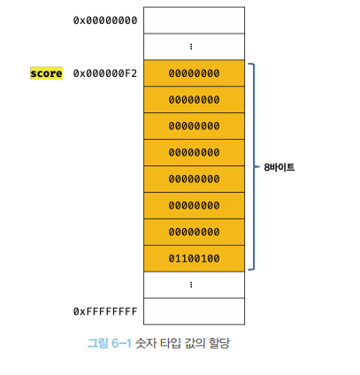
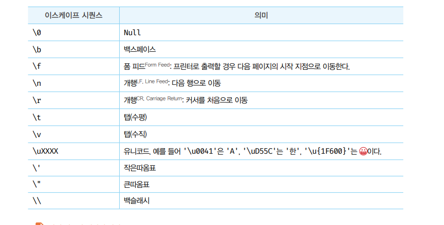
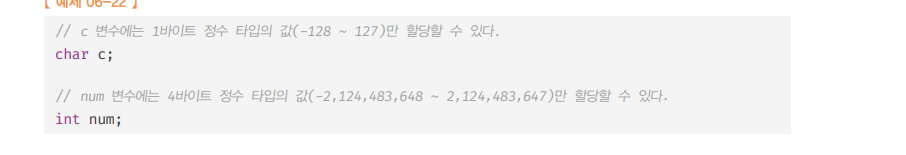

## 데이터 타입

```shell
데이터 타입이 필요한 이유
1️⃣ 값을 저장할 때 확보해야 하는 "메모리 공간의 크기"를 결정하기 위해서
2️⃣ 값을 참조할 때 한 번에 읽어 들여야 할 "메모리 공간의 크기"를 결정하기 위해서
3️⃣ 메모리에서 읽어 들인 "2진수를 어떻게 해석"할지 결정하기 위해서
```

> 💡 이스케이프 시퀀스 <br /> <br /> `숫자 타입` : 8byte단위로 저장

- 자바스크립트 엔진은 데이터 타입, 즉 값의 종류 에 따라 정해진 크기의 메모리 공간을 확보한다.
- 즉, 변수에 할당되는 값의 데이터 타입에 따라 확보해야 할 메모리 공간의 크기가 결정된다.
- 참조 시, 메모리 셀의 개수(바이트 수)를 알아야 한다.

<br />

---

- 자바스크립트에서 7개의 데이터 타입을 제공한다.
  > 7가지 타입

| 원시 타입 | 데이터 타입 | 설명                                               |
| --------- | ----------- | -------------------------------------------------- |
| 원시 타입 | 숫자 타입   | 숫자, 정수 , 실수구분 없이 하나의 숫자 타입만 존재 |
| 원시 타입 | 문자열 타입 | 문자열                                             |
| 원시 타입 | 불리언 타입 | true of false                                      |
| 원시 타입 | undefined   | var, let 키워드로 선언된 변수에 할당되는 값        |
| 원시 타입 | null        | 값이 없다는 것을 의도적으로 명시 할 때 사용        |
| 원시 타입 | symbol      | es6에 추가된 7번째 타입                            |
| --------- | ----------- | -------                                            |
| 객체 타입 | 객체 타입   | 객체 ,함수, 배열                                   |

## Javascript의 숫자 타입

- 숫자 타입은 배정밀도 64비트 `부동소수점` 형식을 따른다.
- 모든 수를 실수로 처리한다.(`int[정수]` 만 표현 하기 위한 데이터 타입은 없다.)
- 정수만을 위한 타입은 없기 때문에 `정수`로 표시해도 사실은 `실수`이다.

```js
console.log(1 === 1.0)
-> true
```

- 숫자타입은 추가적으로 세가지 특별한 값 표현 가능
  - `Infinity` : 양의 무한대
  - `Infinity` : 음의 무한대
  - `NaN` : Not-a-Number, 산술 연산 불가

---

 <br />
<br />
 <br />
 
> 💡 이스케이프 시퀀스 <br />
> 

## Javascript의 문자 타입

> 자바스크립트에서 문자열은 원시타입 이며, 변경 불가능한 값(immutable value) 이다. 즉, 문자열이 한번 생성되면 그 문자열은 변경할 수 없다는 것을 의미한다.

- `""` , `''` 으로 텍스트를 감싸서 사용

## 템플릿 리터럴

- 템플릿 리터럴은 ``을 사용해서 표현한다.

  <br />

- 멀티라인 문자열<br />

> 일반적인 문자열 방식 --> 이스케이프 시퀀스(escape sequence) 사용해야함

```js
var template = '<ul>\n\t<li><a href="#">Home</a></li>\n</ul>';
console.log(template);

<!--결과 -->

<ul>
  <li><a href="#">Home</a></li>
</ul>
```

> 멀티라인 문자열 `` 사용시 --> 이스케이프 시퀀스(escape sequence) 사용 안해도 됨

```js
var template = `<ul>
	<li><a href="#">Home</a></li>
</ul>`;

<!--결과 -->

<ul>
  <li><a href="#">Home</a></li>
</ul>
```

---

<br />

## boolean type

> 불리언 타입의 값은 논리적 참, 거짓을 나타내는 true 와 false 뿐이다.

---

<br />

## undefined type

> undefined type은 undefined가 유일 하다.

```
💡 변수를 참조했을 때 undefined가 반환된다. -> 참조한 변수가 선언 이후 값이 할당된 적이 없는, 즉 초기화되지 않은 변수라는 의미
```

- 메모리 공간을 처음 할당 할 때 `메모리값`을 `undefined` 로 초기화 한다.
- 변수에 값이 없다는 것을 명시 하고 싶을 땐 `null`를 사용한다.

---

<br />

## null type

- 자바스크립트에서 null은 변수에 값이 없다는 것을 의도적으로 명시할 때 사용
- 변수에 null를 할당하는 것은 변수가 `이전에 참조하던 값`을 더 이상 `참조하지 않겠다`
  라는 의미
- `null` : 이전에 할당되었던 값을 명시적으로 제거하는 것을 의미한다.

> querySelector HTML요소 중 myObj 없으면 NULL를 반환한다.

```JS
<!DOCTYPE html>
<html>
  <body>
    <script>
        //함수가 유효한 값을 반환 할 수 없을 때 NULL를 반환하기도 함
      var element = document.querySelector(".myObj");

      console.log(element); // null
    </script>
  </body>
</html>
```

<br />
<br />

---

## 심벌 타입

> 다른 값과 중복되지 않는 유일 무의한 값이다.

- ES6에 추간된 데이터 타입 , `변경 불가능한` `원시 타입의 값`이다.
- 따라서, 주로 이름이 충돌할 위험이 없는 `객체의 유일한 프로퍼티 키를 만들기 위해 사용`
- 다른 값과 `절대` `중복` 되지 않는 `유일무이한 값`

```JS
//  Symbol 타입은 Symbol함수를 이용해서 생성
var key = Symbol('key');
console.log(typeof key);  // symbol

// 객체 생성
var obj = {};

// 이름이 충돌할 위험이 없는 유일무이한 값인 심벌을 "프로퍼티 키"로 사용
obj[key] = 'value';
console.log(obj[key]);  // value
```

<br />
<br />

---

## 동적 타이핑

- 자바스크립트 변수는 선언이 아닌` 할당에 의해 타입이 결정`(= `타입 추론`(type inference))된다. 그리고 재할당에 의해 `변수의 타입은 언제든지 동적으로 변할 수 있다` 이러한 특징을 `동적 타이핑`(dynamic typing) 이라고 한다.

> 💡 이스케이프 시퀀스 <br /> <br />
> 정적 타입 언어에서는 변수의 타입 변경 X , 선언한 타입의 맞는 값만 사용가능

<br />

## 자바스크립트의 동적 타이핑

- 자바스크립트의 변수은 타입 가지지 X , 하지만 값은 타입을 가진다.
- 자바스크립트는 값을 `할당하는 시점`에 변수의 타입이 `동적으로 결정`
- 재할당에 의해 `변수의 타입`은 언제든지 `동적`으로 변할 수 있다.
- 실질적인 값의 타입은 런타임(runtime)시 할당되는 값에 의해 결정된다.

<br />

## 자바스크립트의 동적 타이핑의 단점

> 동적 타입 언어는 유연성(flexibility) 은 높지만 신뢰성(reliability) 은 떨어진다.

```
[ 💡 NOTE - 변수를 사용할 때 주의할 사항 ]

1️⃣ 변수는 꼭 필요할 경우에 한해 제한적으로 사용해라. -> 변수의 개수가 많으면 많을수록 오류가 발생할 확률도 높아진다..

2️⃣ 변수의 유효범위(스코프, scope)는 최대한 좁게 만들어 변수의 부작용을 억제해라. -> 스코프가 넓으면 넓을수록 변수로 인해 오류가 발생할 확률이 높아진다.

3️⃣ 전역 변수는 최대한 사용을 피해라. -> 전역 변수는 프로그램의 복잡성을 증가시키고, 처리 흐름을 추적하기 어렵게 만들고, 오류가 발생할 경우 원인을 특정하기 어렵게 만든다.

4️⃣ 변수보다 상수를 사용해 값의 변경을 억제해라.

5️⃣ 변수 이름은 변수의 목적이나 의미를 파악할 수 있도록 네이밍해라. -> 의도가 명확한 네이밍은 코드를 이해하기 쉽게 만들고, 이는 협업과 생산성 향상에 도움을 준다.

```

```
[ 💡 NOTE - 좋은 코드 ]

코드는 오해하지 않도록 작성해야 한다.
오해 -> 커뮤니케이션을 어렵게 한다. -> 생산성을 떨어뜨리고 팀의 사기까지 저하시킨다.
코드는 동작하는 것만이 존재 목적이 아니다.
코드는 개발자를 위한 문서 = 사람이 이해할 수 있는 코드, 즉 "가독성이 좋은 코드가 좋은 코드다."

```
