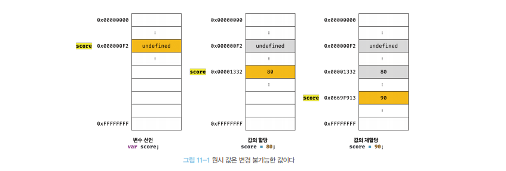
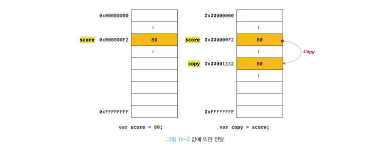
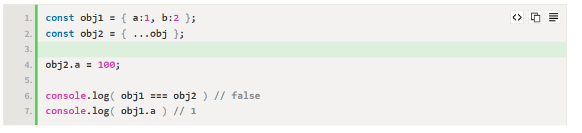
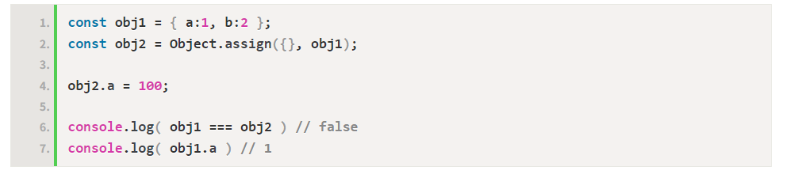

# 원시 값과 객체 타입의 비교

```
1️⃣ 원시 타입의 값 === 원시 값 은 변경 불가능한 값(immutable value) 이다. 객체 타입의 값 === 객체 는 변경 가능한 값(mutable value) 이다.

2️⃣ 원시 값을 변수에 할당하면 변수에는 실제 값이 저장된다. 객체를 변수에 할당하면 변수에는 참조 값이 저장돤다.

3️⃣ 원시 값을 갖는 변수를 다른 변수에 할당하면 원시 값이 복사되어 전달 → 값에 의한 전달(pass by value) 객체를 가리키는 변수를 다른 변수에 할당하면 원본의 참조 값이 복사되어 전달 → 참조에 의한 전달(pass by reference)
```

<br />
<br />

---

# 원시 값

- 원시 값은 `변경 불가능한 값` , `읽기전용값` 이다
- `변경이 불가능`하다의 의미
  - `변수` : 하나의 값을 저장하기 위해 확보한 메모리 공간, `메모리 공간`을 `식별`하기 위한 `이름`
  - `값` : 변수에 저장된 데이터
    - `원시값 자체`를 변경 할 수 없다 (O)
    - `변수의 값`을 변경할 수 없다(X)

<br />

```
💡 변수 vs 상수
변수(variable)
+ 변수는 언제든지 "재할당"을 통해 변수 값을 변경(= 정확히는 "교체")할 수 있다. 그래서 "변수"다.

상수(constant)
+ 상수도 값을 저장하기 위한 메모리 공간이 필요하므로 "변수"라고 할 수 있다.
+ 하지만, 상수는 단 한 번만 할당이 허용하므로 변수 값을 변경(= 정확히는 "교체")할 수 없다.
```

<br />
<br />

---

# 객체 (원시값에 접근 가능)

- 프로퍼티값 갱신 시 `다른 메모리`를 새롭게 `참조 하지 않아도 됨`
- `변경 가능`
  - 객체를 할당한 변수가 기억하는 메모리 주소를 통해 메모리 공간에 접근하면 원시 값이 아닌, 참조 값` 에 접근한다.
    - 참조 값 = 생성된 `객체가 저장된` `메모리 공간의 주소`, 그 자체
  - 객체는 재할당 없이 `객체를 직접 변경 가능`
  - 재할당 없이 프로퍼티를 `추가`, `갱신`, `삭제` 가능

```js
var person = {
  name: "WI",
};

// 프로퍼티 값 갱신
person.name = "Kim";

// 프로퍼티 값 동적 추가
person.address = "Seoul";

console.log(person); // { name: 'Kim', address: 'Seoul' }
```

> 💡 참조값을 직접 변경 가능 , 새로운 메모리를 참조 하지 않음<br />
> 💡 자바스크립트 객체가 변경가능한 값 이어야하는 이유는 메모리의 효율적 소비가 어렵고 성능이 나빠지는 것을 최소화 하기 위해서다.<br />


```
[ 🎯 단점 ]

+ 여러 개의 "식별자"가 하나의 객체를 "공유"할 수 있다는 점

```

<br />
<br />

---

# 불변성

> 불변성(immutability) = 변수 값을 변경하기 위해 원시 값을 재할당하면 새로운 메모리 공간을 확보하고 재할당한 값을 저장한 후, 변수가 참조하던 메모리 공간의 주소를 변경하는 것

> 변수의 값할당(불변성의 예제)<br />
> 원시값을 재할당 할 수 없기 때문에 메모리의 다른 주소를 참조한다. <br /> 

<br />
<br />

💡 유사 배열 객체 (string 문자열)

- 배열처럼 인덱스로 프로퍼티 값에 접근할 수 있으며, length 프로퍼티를 갖는 객체
- length 프로퍼티를 갖기 때문에 "유사 배열 개체" 이며, for 문으로 순회도 가능

```js
// 'string' 에서 첫 번째 's' 를 'S' 로 변경하려 하지만 str 변수는 "문자열, 즉 원시 값"
// 원시 값은 변경 불가능한 값(immutable value) -> 값이 업데이트 되지 않는다.
var str = "string";
str[0] = "S";

console.log(str); // "string"

// 재할당으로 값을 변경하는 것은 가능
var str = "Hello";
str = "World";

console.log(str); // "World"
```

# 값의 의한 전달(객체, 함수 제외 모두)

값에 의한 전달 : 변수에 `원시 값`을 갖는 변수를 `할당`하면 할당받은 변수에는 할당되는 `변수의 원시 값이 복사`되어 전달되는 것

```
var score = 80;
var copy = score;   //값의 의한 전달

score = 100;

console.log(score); // 100 (원본 값)
console.log(copy); // 80  (복사한 값)
```

> copy = score 로 값의 의한 전달을 했지만 메모리는 전혀 다른 공간을 가르킨다.<br /> 

```
[ 💡 값이 아닌 메모리 주소를 전달 ]

+ 변수에는 값이 전달되는 것이 아니라 "메모리 주소가 전달"되기 때문
+ 같은 말로, 변수와 같은 "식별자"는 값이 아닌 "메모리 주소를 기억"하고 있다.
```

> 한 변수에 원시 값을 갖는 변수를 할당하면, 두 변수의 원시 값은 서로 다른 메모리 공간에 저장된 별개의 값이 되어, 어느` 한쪽에서 재할당을 통해 값을 변경하더라도 서로 간섭할 수 없다는 것`

<br />
<br />

# 참조에 의한 전달

- 참조에 의한 전달 : `객체`를 가리키는 변수를 다른 변수에 할당하면` 원본의 참조 값`이 복사되어 전달되는 것
- 객체를 전달 할때는 `객체의 메모리 주소를 전달` , 객체를 `공유`

```js
var person = {
  name: "WI",
};

// "참조 값"을 복사, copy와 person이 동일한 객체를 참조한다.
var copy = person;
console.log(copy === person); // true

copy.name = "Kim";

person.address = "Seoul";

console.log(person); // { name: 'Kim', address: 'Seoul' }
console.log(copy); // { name: 'Kim', address: 'Seoul' }
```

> 💡 copy와 person은 객체의 같은 주소를 가리킴<br/>

<br />
<br />

```js
var person1 = {
  name: "lee",
};
var person2 = {
  name: "lee",
};
//두개의 변수가 가리키는 객체는 다른 메모리에 저장된 별개의 객체임
console.log(person1 === person2);
false;
//값으로 평가 될 수 있는 표현식이기 때문에 true
console.log(person1.name === person2.name);
true;
```

# 얕은 복사 & 깊은 복사

- 얕은 복사(`같은 데이터(주소)`) : `depth` 가 `1` 까지만 복사하는 것, 객체의 중첩된 객체는 참조 값을 복사 (`같은 데이터(주소)`)
- 깊은 복사(아예 `새로운 객체`안 `속성만` `복사`해서 `사용`하는 것) : `depth` 가 `2이상`도 전부 복사하는 것, 객체의 중첩된 객체까지 원시 값처럼 완전히 복사

```
[ 💡 "값의 의한 전달만 있다." ]

+ "값에 의한 전달"과 "참조에 의한 전달" 모두 식별자가 기억하는 "메모리 공간에 저장되어 있는 값을 복사해서 전달한다"는 공통점
+ 단지, 전달하는 값이 "원시 값" 이냐 "참조 값" 이냐의 차이일 뿐이다. (전자 -> 원시타입, 후자 -> 객체타입)
```

> 얕은 복사 예제<br />


> 깊은 복사 예제<br />



