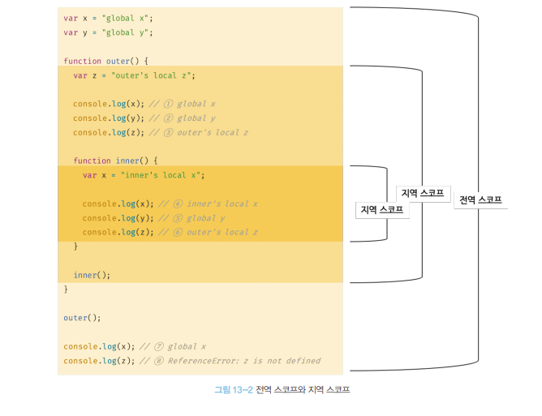
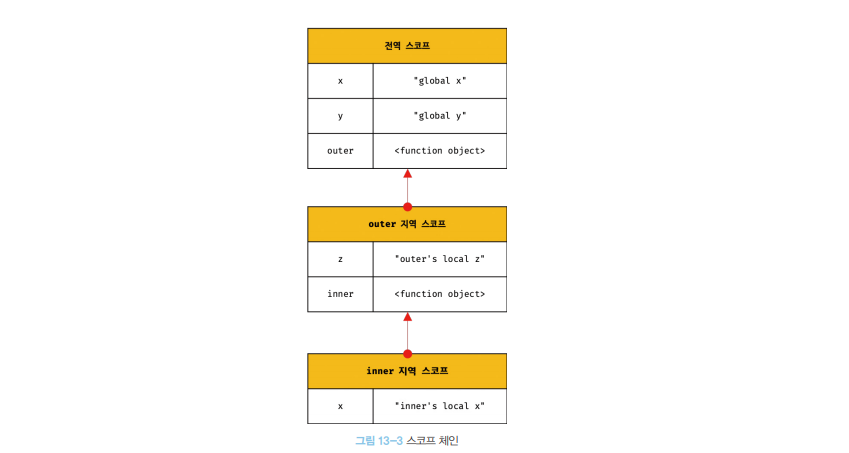

# 스코프🔥📌✅

- 모든 식별자는 자신이 `선언된 위`치에 의해 다른 코드가 식별자 자신을 참조할 수 있는 `유효범위`가 `결정`된다.
- `식별자`가 `유효한 범위`를 말한다.

> 스코프 범위 예제

```JS
 // 코드의 가장 바깥 영역에서 선언한 변수
var var1 = 1;

if (true) {
  var var2 = 2; // 코드 블록 내에서 선언한 변수
  if (true) {
    var var3 = 3; // 중첩된 코드 블록 내에서 선언한 변수
  }
}

function foo() {
  // 함수 내에서 선언한 변수
  var var4 = 4;
  function bar() {
    // 중첩된 함수 내에서 선언한 변수
    var var5 = 5;
  }
}

console.log(var1); // 1
console.log(var2); // 2
console.log(var3); // 3
console.log(var4); // ReferenceError: var4 is not defined
console.log(var5); // ReferenceError: var4 is not defined
```

<br />
<br />

# 식별자 결정

```
🔥 식별자 결정 = 자바스크립트 엔진이 이름이 같은 두 식별자 중에 `어떤 식별자`를 `참조`해야 할 것인지를 결정하는 것🔥
```

<br />
<br />

```js
var x = "global";

function foo() {
  var x = "local";
  console.log(x); // local
}

foo();
console.log(x); // global
```

<br />

> 위 예제 설명

<br />
<br />

# (let,const) vs (var)

```
✅ var 키워드로 선언된 변수는 같은 스코프 내 중복 선언 허용된다.
✅ let , const는 같은 스코프 내 중복 선언이 불가능 하다
```

```js
var
function(){
    var a = 1
    var a = 2
    console.log(a) // 2
}

let , const
function(){
    let a = 1
    let a = 2
    console.log(a) // Suntax Error
}
```

<br />
<br />

# 스코프 체인 (자신의 스코프영역 -> 상위 스코프영역 변수찾기)

```
💡
+ "중첩함수(nested function)" = 함수 몸체 내부에서 함수가 정의된 것
+ "외부함수(outer function)" = 중첩 함수를 포함하는 함수
```

📌 `전역 스코프`와 `지역 스코프`

- `전역 스코프` : 어디서든지 참조 가능
- `지역 스코프` : `자신의 지역 스코프` 와 `하위 지역 스코프`에서 유효함
  

  

  ```
  📌쉽게 말하면 자신의 스코프 부터 변수를 찾기 시작하면 상위 스코프에서 변수를 찾는다.

  📌 변수 참조 시, 자바스크립트 엔진은 스코프 체인을 통해 변수를 참조하는 코드의 스코프에서 시작하여 상위 스코프 방향으로 이동하며 선언된 변수(= 식별자)를 검색(= 결정)한다.

  📌 `상위 스코프`에서 `하위 스코프` 참조 가능
  ```

<br />
<br />
<br />

# 스코프 체인에 의한 함수 검색

```js
// 전역 함수
function foo() {
  console.log("global function foo");
}

function bar() {
  // 중첩 함수
  function foo() {
    console.log("local function foo");
  }

  foo(); // local function foo
}

bar();
```

```
💡 함수 선언문 으로 함수를 정의 → 런타임 이전에 함수 객체가 먼저 생성(함수 호이스팅)
```

- 함수도 `식별자`에 할당되기 때문에 , 스코프를 갖는다.
- 따라서 스코프를 `"식별자를 검색하는 규칙"` 이라고 표현하는 것이 적합한 표현이라는 것이다.

# 정적 스코프

`상위 스코프를 결정하는 방식`

- `동적 스코프`
  - `함수가 호출되는 시점`에 동적으로 상위 스코프를 결정
- `정적 스코프`
  - 함수를 어디서 정의했는지에 따라 상위 스코프를 결정
  - `Javascirpt` 를 비롯한 대부분의 프로그래밍 언어가 렉시컬 스코프를 따른다.
