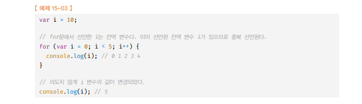
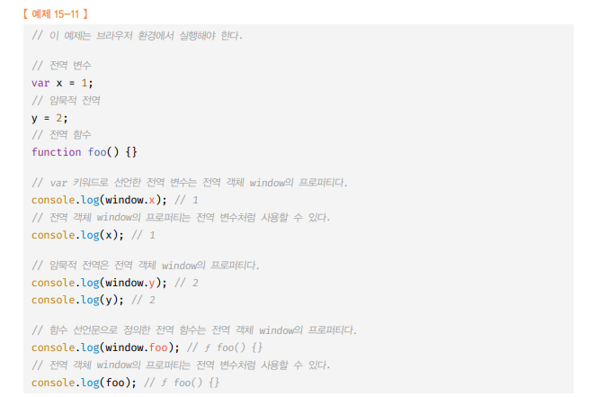

# Var 키워드로 선언한 변수의 문제점

🎯💡🔥📌✅

```
✅ var 키워드로 선언한 변수는 중복 선언이 가능하다.
```

## (1) `변수의 중복 선언 가능`

> var 변수의 문제점 예시

```js
var x = 1; // x변수 선언 & 초기화 동시에
var y = 1; // y변수 선언 & 초기화 동시에

var x = 100; // 선언 문 O, 초기화 문도 X
var y; // 선언 문은 O, 초기화 문이 X (암묵적 무시)

console.log(x); // 100
console.log(y); // 1
```

<br />
<br />

## (2) `함수 레벨 스코프`

- 함수 외부에서 var 키워드로 선언한 변수는 코드 블록 내에서 선언해도 모두 전역 변수가 된다. → `함수 레벨 스코프`
- 함수 레벨 스코프는 전역 변수를 남발할 가능성을 높인다. → `의도치 않게 전역 변수가 중복 선언되는 경우가 발생`

```js
var x = 1;

// 코드 블록(블록 레벨), 하지만 var 는 함수 레벨 스코프
//  블록 내 x변수는 전역 변수 처럼 스코프가 적용
if{
var x = 10;
}

console.log(x); // 10
```

<br />
<br />

## (3) `for문`의 변수 선언문에서의 문제

> 전역 변수 i 선언 후 for문에서 var i 선언 하면, 전역변수로 취급<br />

## (4) `변수 호이스팅`

```
✅ 변수 호이스팅이 에러를 발생시키지는 않지만 프로그램의 흐름상 맞지 않을뿐더러 가독성을 떨어뜨리고 오류를 발생시킬 여지를 남긴다.
```

```js
// undefined << foo 변수 암묵적 선언 & 초기화 (호이스팅)
console.log(foo);

// foo변수 값 할당
foo = 123;

console.log(foo); // 123

var foo;
```

<br />
<br />
<br />
<br />

---

# let 키워드

1. `변수 중복 선언 금지`

```
📌(1) var에서는 허용되던 , 변수 중복 선언을 하지 못하게 방지,  let 키워드로 이름이 같은 변수를 중복 선언하면 문법 에러(SyntaxError)가 발생
```

> (1) 예제 코드!

```js
// var 변수 = 중복 선언 허용 O
var foo = 123;
var foo = 456;
console.log(foo);

// let 변수 = 중복 선언 허용 X
let bar = 123;
let bar = 456; // SyntaxError: Identifier 'bar' has already been declared
console.log(bar);
```

<br />
<br />

2. `블록 레벨 스코프`

```
📌(2) var에서는 허용되던 , 변수 중복 선언을 하지 못하게 방지,  let 키워드로 이름이 같은 변수를 중복 선언하면 문법 에러(SyntaxError)가 발생
```

> (2) 예제 코드!

```js
let foo = 1;

{
  let foo = 2;
  let bar = 3;
}

console.log(foo); // 1
console.log(bar); // ReferenceError: bar is not defined

// 비록 블록 내에 let 키워드로 선언한 foo, bar 변수가 있지만
// 출력된 foo는 전역에 선언된 foo 변수가 되고
// 출력문이 있는 스코프내에는 bar 변수는 존재하지 않으므로 "참조에러(ReferenceError)" 발생
```

> 블록 레벨 스코프 -> 함수 레벨 스코프 -> 전역 스코프<br />

<br />
<br />

3. `변수 호이스팅 못하게 함`

- `선언 단계` : `실행 컨텍스트의 렉시컬 환경`에 변수 `식별자 등록`
- `초기화 단계` : undefined로 변수 초기화

```
📌(3) `let키워드`로 선언한 변수는 선언문이전에 호출하면 참조 에러가 발생한다.
📌(3)  `var 키워드`와 변수의 선언 & 초기화 시점에 차이가 있으므로 비교해야 한다.
```

> 변수 호이스팅 let변수 사용 예시

```js
// 일시적 사각지대(TDZ) - ReferenceError: Cannot access 'foo' before initialization
console.log(foo);

let foo; // 변수 선언문에서 초기화 단계가 실행
console.log(foo); // undefined

foo = 1; // 할당문에서 할당 단계가 실행
console.log(foo); // 1
```

> var 변수의 호이스팅 <br />
> let 변수의 호이스팅 <br />

- let변수는 초기화전 참조되면 참조에러가 발생 된다.

```
💡 `일시적 사각지대` : 스코프 시작지점 부터 ~ 초기화 시작 지점 까지 변수를 참조 할 수 없는 구간
```

---

<br />
<br />
<br />
<br />

```
[ 💡 전역 객체 ]

- var 키워드로 선언한 전역 변수와 전역 함수, 선언하지 않은 변수에 값을 할당한 암묵적 전역은 "전역 객체 window이 프로퍼티"가 된다.
- 전역 객체의 프로퍼티를 참조할 때 window를 생략 가능
- 단, 전역 객체는 "브라우저 환경 내에서 참조 가능"
```

> 전역 객체 <br />

- 전역 변수(var) `x ` == `window.x `
  - var 키워드로 선언한 전역 변수는 `전역 객체의 프로퍼티`이다.
- 전역 변수(let) `y ` != `window.y`
  - let 키워드로 선언한 전역 변수는 `전역 객체의 프로퍼티가 아님`
  - let 전역 변수는 전역 레시컬 환경의 `선언적 환경 레코드`에 `존재` 한다.

> 위 사진 예제 코드

```
let x = 1;

// let, const 키워드로 선언한 전역 변수는 전역 객체 window의 프로퍼티가 X
console.log(window.x); // undefinde
console.log(x); // 1
```

<br />
<br />
<br />
<br />

---

# const 변수

- 일반적으로 `let 키워드` 와 대부분 `성질이` 동일
- const 변수는 `선언`과 동시에 `초기화` 해야한다.

> const 변수는 `선언`과 동시에 `초기화` 해야한다.(예제 코드)

```js
// SyntaxError: Missing initializer in const declaration
const foo;
//Error XX
const foo = 123
```

- const 변수는 `재할당`이 `금지` 된다.

> 재할당 금지 예제 코드

```js
const foo = 1;
// TypeError: Assignment to constant variable. (재할당이 금지)
foo = 2;
```

<br />
<br />
<br />
<br />

# const 상수

- const 키워드 로 선언한 변수에 원시 값 을 할당한 경우 `변수 값`을 `변경할 수 없다`.
- 원시 값은 변경 불가능한 값이므로 `재할당 없이 값을 변경할 수 있는 방법이 없기 때문`

```
💡원시값은 무조건 재할당으로 값을 변경하는 방법밖에 없다💡
```

- `상수` : 재할당이 금지된 변수
  - 상수도 곧 변수이며, 즉 상수도 `메로리 공간`을 가지며 값을 `가진다.`
  - 상수는 `재할당이 금지`
  - 상수는 상태 유지와 가독성, 유지보수의 편의를 위해 적극적으로 사용을 권장
  - `상수이름` : `대문자` 사용하고, `_`로 구분해서 `스네이크 케이스`로 표현

> 상수 표현 예제 코드

```js
const TAX_RATE = 0.1;

let preTaxPrice = 100;
let afterTaxPrice = preTaxPrice + preTaxPrice * TAX_RATE;

console.log(afterTaxPrice); // 110
```

<br />
<br />

# const 객체 (보통 객체를 선언할 때 const선언해라 라는 뜻)

- const 키워드로 선언된 변수에 `객체`를 할당한 경우 `값 변경이 가능`
- 원시값은 재할당 없이 값을 변경할 수 없지만 `객체는 재할당 없이 값 변경이 가능 가기 때문이다!!`
- `const` 키워드 는 `재할당을 금지`할 뿐 불변 을 의미하지는 않는다.
  - 새로운 값을 `재할당`하는 것은 `불가능`
  - 프로퍼티 동적 생성, 삭제, 프로퍼티 값 변경을 통한 `객체의 변경은 가능`
  - 객체가 변경되더라도 변수에 `할당된 참조 값(주송)`은 변경되지 않음

> const 객체의 값 변경 예제

```js
const person = {
  name: "WI",
};

// 객체는 변경 가능한 값(mutable value) == 재할당 없이 변경 가능
person.name = "WIEEE";
console.log(person.name); // { name: "WIEEE" };
```
