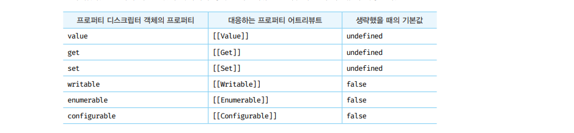
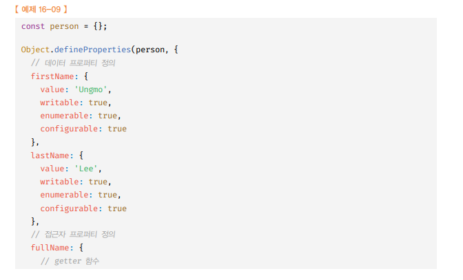

# 내부 슬롯 & 내부 메서드 🎯💡🔥📌✅

- `내부 슬롯` & `내부 메서드` 는 자바스크립트 엔진에서 실제로 동작은 하지만 개발자가 직접 접근할 수 있도록 `외부로 공개된 객체의 프로퍼티는 아니다`.
- 자바스크립트 엔진의 `내부 로직` 이므로 자바스크립트로 직접 접근하거나 호출할 수 있는 방법을 제공하진 않는다.
- `예외적으로` `[[Prototype]]` 내부 슬롯은 `__proto__` 를 통해 간접 접근 가능
  > [[Prototype]] 내부 슬롯 접근 **proto** 예시

```js
const o = {};
o.[[Prototype]] ==> 참조 에러
o.__proto__  ==> object.prototype ==> 에러X
```

<br />
<br />

# 프로퍼티 어트리뷰트(상태) & 디스크립터 객체

```
✅ 프로퍼티 상태 : 자바스크립트 엔진은 프로퍼티를 생성할 때 프로퍼티 상태 를 기본값으로 자동 정의한다.
```

- `프로퍼티 생성 시` : 4가지 값 자동 정의

  - `프로퍼티의 값`( value ): true
  - `값의 갱신 가능 여부`( writable ): true
  - `열거 가능 여부`( enumerable ): true
  - `정의 가능 여부`( configurable ): true

- `Object.getOwnPropertyDescriptors` 통해 위 4가지 값을 확인 가능

```js
const person = {
  name: "Lee",
};
console.log(Object.getOwnPropertyDescriptors(person, "name"));
//{value : "Lee" ,writable : true , enumerable : "true , configurable :true }
```

<br />
<br />

## 디스크립터 객체

```
✅ 디스크립터 객체 : 프로퍼티 어트리뷰트(상태) 정보를 제공하는 객체
```

```
📌 디스크립터 객체 예제 : {value : "Lee" ,writable : true , enumerable : "true , configurable :true }
```

- `Object.getOwnPropertyDescriptors` : 프로퍼티 상태를 제공하는 프로퍼티 `디스크립터 객체`를 `반환`한다.
- 존재하지 않는 프로퍼티나 상속받은 프로퍼티에 대한 프로퍼티 디스크립터를 요구하면 → `undefined 반환`
- 기본적으로 `하나의 프로퍼티`에 대해 `프로퍼티 디스크립터 객체`를 반환

  - es8에서 `모든 프로퍼티의 프로퍼티 어트리뷰트 정보`를 제공하는 프`로퍼티 디스크립터 객체를 반환`할 수 있게 되었다.

  ```js
  Object.getOwnPropertyDescriptors(객체);
  ```

<br />
<br /><br />
<br />

---

# 데이터 프로 퍼티

- `키,값`으로 구성된 `일반적인 프로퍼티`<br />
- 데이터 프로퍼티가 갖는 기본값

<br />

| 프로퍼티 어트리뷰트 | 프로퍼티 디스크립터 객체의 프로퍼티 | 설명                                                  |
| ------------------- | ----------------------------------- | ----------------------------------------------------- |
| [[value]]           | value                               | 프로퍼티 키를 통해 프로퍼티 값에 접근하면 반환되는 값 |
| [[writable]]        | writable                            | 프로퍼티 값의 변경 가능 여부를 나타내는 값            |
| [[enumerable]]      | enumerable                          | 프로퍼티의 열거 가능 여부를 나타내는 값               |
| [[configurable]]    | configurable                        | 프로퍼티의 재정의 가능 여부를 나타내는 값             |

<br />

---

# 접근자 프로 퍼티

- `접근자 프로퍼티` : 자체적으로 `값을 갖지 않고` 다른 데이터 프로퍼티의 `값을 읽거나` `저장`할 때 호출되는 `접근자 함수`로 구성된 프로퍼티
- (`getter` 함수와 `setter` 함수) : 자체적으로 값을 가지지 않으며 데이터 프로퍼티의 값을 읽거나 저장 할 때만 관여하는 함수

<br />

| 프로퍼티 어트리뷰트 | 프로퍼티 디스크립터 객체의 프로퍼티 | 설명                                                                     |
| ------------------- | ----------------------------------- | ------------------------------------------------------------------------ |
| [[Get]]             | get                                 | 데이터 프로퍼티의 값을 읽을 때 호출되는 접근자 함수 → getter 함수 호출   |
| [[Set]]             | set                                 | 데이터 프로퍼티의 값을 저장할 때 호출되는 접근자 함수 → setter 함수 호출 |
| [[Enumerable]]      | enumerable                          | 프로퍼티의 열거 가능 여부를 나타내는 값                                  |
| [[Configurable]]    | configurable                        | 프로퍼티의 재정의 가능 여부를 나타내는 값                                |

<br />
<br />

```
🔥접근자 함수는 getter / setter 함수 라고도 한다.
getter 와 setter 는 모두 정의하거나 하나만 정의할 수도 있고, 아예 정의 안할 수도 있다🔥
```

<br />

> 접근자 프로 퍼티 예시

```js
const person = {
  //데이터 프로퍼티
  firstName: "Youngmin",
  lastName: "WI",

  //접근자 함수 getter 함수 (데이터 가져오는 역할만) , 접근자 프로퍼티
  get fullName() {
    return `${this.firstName} ${this.lastName}`;
  },
  //접근자 함수 setter 함수 (데이터 수정하는 역할만) , 접근자 프로퍼티
  set fullName(name) {
    [this.firstName, this.lastName] = name.split(" ");
  },
};

// 접근자 프로퍼티를 통한 프로퍼티 값의 저장 👉 setter 함수 호출
person.fullName = "Youngmaaan WIE";
console.log(person); // { firstName: 'Youngmaaan', lastName: 'WIE', fullName: [Getter/Setter] }

// 접근자 프로퍼티를 통한 프로퍼티 값의 참조 👉 getter 함수 호출
console.log(person.fullName); // Youngmaaan WIE

// 데이터 프로퍼티는 [[Value]], [[Writable]], [[Enumerable]], [[Configurable]] 프로퍼티 어트리뷰트를 갖는다.
// 현 코드에서 "firstName" 프로퍼티는 "데이터 프로퍼티"다.
let descriptor = Object.getOwnPropertyDescriptor(person, "firstName");
console.log(descriptor);
/*
{
  value: 'Youngmaaan',
  writable: true,
  enumerable: true,
  configurable: true
} 
*/

// 접근자 프로퍼티는 [[Get]], [[Set]], [[Enumerable]], [[Configurable]] 프로퍼티 어트리뷰트를 갖는다.
// 현 코드에서 "fullName" 프로퍼티는 "접근자 프로퍼티"다.
descriptor = Object.getOwnPropertyDescriptor(person, "fullName");
console.log(descriptor);
/*
{
  get: [Function: get fullName],
  set: [Function: set fullName],
  enumerable: true,
  configurable: true
}
*/
```

<br />
<br />

<br />
<br />

---

# 프로퍼티 정의

- `프로퍼티 정의` : 새로운 프로퍼티를 추가하면서 프로퍼티 어트리뷰트를 `명시적으로 정의 `하거나, 기존 프로퍼티의 `프로퍼티 어트리뷰트(속성)를 재정의` 하는 것을 의미

```
👉Object.defineProperty : 메서드는 한번에 하나의 프로퍼티 정의 가능
👉Object.defineProperties : 메서드는 한번에 여러 프로퍼티 정의 가능
```

<br />
<br />

> 객체에 프로퍼티 하나 정의 (Object.defineProperty)

```js
Object.defineProperty(obj1, one, {
  value: 값,
  writable: boolean,
  enumerable: boolean,
  configurable: boolean
})


obj1 = {
    one : {
        value : 값
        writable: true,
        enumerable: true,
        configurable: true
    }
}
```

```js
// 객체에 프로퍼티 여러 개 정의
Object.defineProperties(객체, {
  데이터 프로퍼티 1: {
		value: 값,
	  writable: boolean,
	  enumerable: boolean,
	  configurable: boolean
  },
	데이터 프로퍼티 2: {
		value: 값,
	  writable: boolean,
	  enumerable: boolean,
	  configurable: boolean
  },
  ...
  접근자 프로퍼티 1: {
	  get() { ... },
		set() { ... },
	  enumerable: boolean,
	  configurable: boolean
  },
	접근자 프로퍼티 2: {
		get() { ... },
		set() { ... },
	  enumerable: boolean,
	  configurable: boolean
	}
})
```

- 각 프로퍼티에 대해 `모든 프로퍼티 어트리뷰트를 설정할 필요는 없다`.
- 설정하지 않을 경우 `default` 로 설정되는 값들이 있다.

  
  
  <br />
  <br />

<br />
<br />

---

# 객체 변경 방지

- 객체는 기본적으로 `변경 가능한 값`(mutable value)
- `재 할당없이 직접 변경 가능`
- `defineProperties` 메서드를 이용해 `프로퍼티 어트리뷰트 재정의 가능`

<br />
<br />

객체 변경을 `금지하는 3가지 메서드` : `Object.preventExtensions` , `Object.isSealed` , `Object.freeze `

`(1) 객체 확장 금지`

```
🎯 `Object.preventExtensions(객체 이름)` : 객체 확장금지
🎯 `Object.isExtensible(객체 이름)` : 확장이 가능한 객체인지 확인 return값 boolean
```

- 확장이 금지된 객체는` 프로퍼티 추가가 금지`된다.

<br />

`(2) 객체 밀봉`

```
🎯 `Object.seal(객체)` : 프로퍼티 추가 , 삭제 , 재정의 금지 , < 읽기와 쓰기만 가능 >
🎯 `Object.isFrozen(객체)` : 동결된 객체인지 확인 return 값 boolean
```

- 동결된 객체는 읽고 쓰기만 가능

<br />

`(3) 객체 동결`

```
🎯 `Object.freeze(객체)` : 객체의 읽기만 가능
🎯 Object.isFrozen(객체) : 동결된 객체인지 확인 return 값 boolean
```

<br />

## 불변 객체

- 확인한 객체 변경 방지 메서드들은 모두 `얕은 변경 방지` 로 `직속 프로퍼티만 변경이 방지된다`.
- `중첩 객체까지는 영향을 줄 수 없다.`
- 한번의 Object.freeze 메서드 로 객체를 동결하여도 중첩 객체까지 동결할 수는 없다.

```
✅ 중첩 객체까지 변경 방지를 하려면 모든 프로퍼티 에 재귀(recursive) 로 Object.freeze 메서드를 적용 한다.
```

```js
const obj1 = {
    // Object.isFrozen(obj1)); // true
    name : "kim"
    //object.isFrozen(obj1.name2) //false
    //중첩된 객체 안까지 한번에 동결할 수 없고 재귀 메서드를 이용해 모든 프로퍼티를 동결할 수 있다.
    name2 :{
        name3 : "lee"
    }
}

Object.freeze(obj1);
```

```js
// 💩 중첩 객체가 있는 상황에서 얕은 객체 변경 방지(Shallow)
const person = {
  name: "WI",
  age: 100,
  address: {
    city: "Incheon",
  },
};

Object.freeze(person);
console.log(Object.isFrozen(person)); // true
console.log(Object.isFrozen(person.address)); // false << 🔎 중첩된 address 프로퍼티에 대해서는 freeze 되지 않았다.

person.address.city = "Seoul";
console.log(person); // { name: 'WI', age: 100, address: { city: 'Seoul' } } << 🔎 프로퍼티 값이 갱신되었다.

// 👍 깊은 객체 변경 방지(Deep)
function deepFreezen(target) {
  if (target && typeof target === "object" && !Object.isFrozen(target)) {
    // 일단 현재 들어온 객체를 동결시키고
    Object.freeze(target);

    // 내부에 있는 다른 프로퍼티 중, 중첩 객체들을 고려한 deepFrozen 함수 재귀실행
    // Object.keys 메서드 = 객체 자신의 키들에 대해 열거가능한(enumerable) 형태의 배열을 반환
    Object.keys(target).forEach((key) => deepFreezen(target[key]));
  }
}

const person = {
  name: "WI",
  age: 100,
  address: {
    city: "Incheon",
  },
};

deepFreezen(person);

console.log(Object.isFrozen(person)); // true
console.log(Object.isFrozen(person.address)); // true << 🔎 깊은 객체 변경 방지를 통해, 중접된 객체에 대해서도 동결되었다.

person.address.city = "Seoul";
console.log(person); // { name: 'WI', age: 100, address: { city: 'Incheon' } } << 🔎 덕분에 중접 객체의 프로퍼티 값도 갱신되지 않게 되었다.
```
