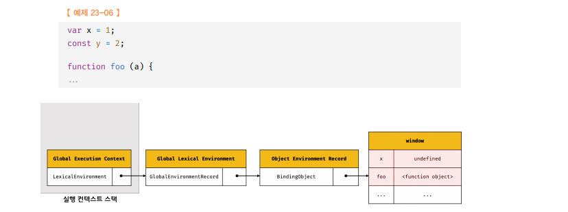
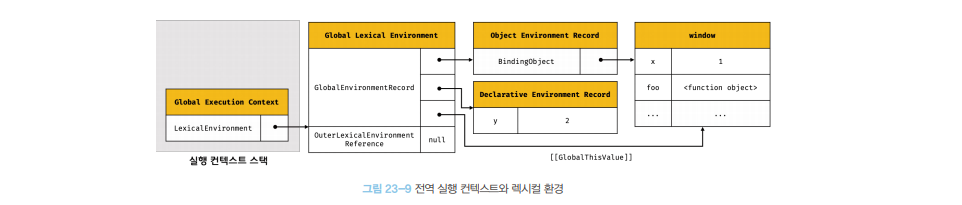

# 실행 컨텍스트 🎯💡🔥📌✅

- 자바스크립트의 `동작 원리`를 담고 있는 `핵심 개념`이다.

<br />
<br />

## ECMAScript 사양은 소스코드를 `4가지` 타입으로 구분한다. 4가지 타입의 소스 코드는 `실행 컨텍스트`를 `생성`한다.

```
💡 실행 코드를 4가지 타입으로 구분하는 이유는 소스코드의 타입에 따라 실행 컨텍스트를 생성하는 과정과 관리 내용이 달라지기 때문이다.

💡 자바스크립트 엔진은 소스코드를 2개의 과정 (소스코드 평가, 소스코드 실행)과정으로 나누어 처리한다.
```

<br />
<br />

- `전역 코드` : `전역에 존재하는 소스코드`를 말한다. 전역에 정의된 함수,클래스 등의 내부 코드는 포함하지 않는다.
  - 전역 코드는 `전역 변수`를 `관리`하기 위해 최상위 스코프인 `전역 스코프를 생성`
  - `var 키워드`, `함수 선언`문으로 정의된 전역 함수를 전역 객`체 프로퍼티로 바인딩하고 참조하기 위해 전역 객체와 연결`

<br />

- `함수 코드` : `함수 내부에 존재하는 소스코드`는 말한다. 함수 내부에 중첩된 함수,클래스등 내부 코드는 포함하지 않는다.
  - 함수 코드는 지역 스코프를 생성하고 `지역 변수`, `매개변수` , `arguments` 객체를 관리
  - 지역 스코프를 전역 스코프에서 시작하는 `스코프 체인의 일원으로 연결`함

<br />

- `eval 코드` : 빌트인 전역 함수 `eval 함수에 인수`로 전달되어 실행되는 `소스코드`를 말한다.
  - `strict mode`에서 자신만의 독자적인 `스코프를 생성`

<br />

- `모듈 코드` : `모듈 내부에 존재하는 소스코드를 말한다`. 모듈 내부의 함수,클래스 등의 내부 코드를 포함되지 않는다.
  - 모듈별로 `독립적인 모듈` 스코프를 `생성`한다.

<br />


<br />
<br />
<br />

---

## 소스코드의 평가와 실행

`소스코드의 평가 과정`

- `실행 컨텍스트`를 `생성`하고 `변수`, `함수` 등의 선언문만 먼저 실행하여 생성된 변수나 함수 식별자를 `키로 실행 컨텍스트가 관리하는 스코프에 등록`한다.
- 소스 평과 과정이 끝나면 `런타임`이 시작된다.
  - 런타임에서 필요한 변수나 함수의 참조는 실행 컨텍스트가 관리하는 `스코프`에서 `검색해서 취득`


<br />

```js
//식별자x는 실행 컨텍스트가 관리하는 스코프에 등록되고 undefined로 초기화
var x;
// 실행 컨텍스트가 관리하는 스코프에 x변수가 있는 지 확인 후 값 할당
x = 1;
```

<br />
<br />
<br />

---

## 실행 컨텍스트의 역할

```js
const x = 1;
const y = 2;

function foo(a) {
  const x = 10;
  const y = 20;

  console.log(a + x + y); //130
}

foo(100);
console.log(x + y); //3
```

## 위 코드 `평가`와 `실행 설명`

- `전역 코드 평가`
  - 전역 코드의 `변수 선언문` , `함수 선언문 실행` , 실행 컨텍스트가 관리하는 전역 스코프에 등록

<br />

- `전역 코드 실행`
  - 런타임 시작
  - 전역 `변수`에 `값이 할당` 되고 `함수`가 `호출`됨
  - 함수가 호출되면 코드 실행을 일시 중단 후 코드의 순서를 변경해서 함수 내부로 진입한다.

<br />

- `함수 코드 평가`
  - `매게변수`와 `지역 변수 선언문` 실행 후 실행 컨텍스트가 관리하는 `지역 스코프에 등록`
  - 함수 내부에서 지역 변수 처럼 사용할 수 있는 arguments 객체 생성되어 지역 스코프에 등록되고 this 바인딩도 결정 된다.

<br />

- `함수 코드 실행`
  - `함수 런타임 시작`
  - `console 식별자`는 스코프 체인에 등록되어 있지않고 전역 `객체의 프로퍼티로 존재`한다.
    - `전역 객체의 프로퍼티`는 `전역 변수 처럼` 전역 스코프를 통해 검색이 가능하다.

정리

```
🔥 실행 컨텍스트의 역할
1. 선언에 의해 생성된 모든 식별자 스코프를 구분하여 등록하고 상태변화 (식별자에 바인딩된 값의 변화)를 지속적으로 관리
2. 스코프는 중첩 관계에 의해 스코프 체인을 형성해야한다. 즉 스코프 체인을 통해 상위 스코프로 이동하며 식별자를 검색한다
3. 현재 실행 중인 코드의 실행 순서를 변경(함수 호출에 의한 실행 순선 변경)할 수 있어야 하며 다시 되돌아갈 수도 있어야한다.
```

- 실행 컨텍스트는 소스코드를 실행하는 데 `필요한 환경을 제공`하고 `코드의 실행 결과를 실제로 관리`하는 영역
- 실행 컨텍스트는 식별자를 등록하고 `관리하는 스코프`와 `코드 실행 순서 관리`를 `구현한 내부 매커니즘`으로, 모든 코드는 실행 컨텍스트를 통해 실행되고 관리된다.

<br />
<br />

```
✅식별자와 스코프 관리 : 실행 컨텍스트의 렉시컬 환경
✅코드 실행 순서 관리 : 실행 컨텍스트 스택
```

<br />
<br />
<br />

---

# 실행 컨텍스트 스택

> 대표 예제

```js
const x = 1;

function foo() {
  const y = 2;

  function bar() {
    const z = 3;
    console.log(x + y + z);
  }
  bar();
}
foo(); // 6
```

<br />
<br />

```
 전역코드를 평가해 전역 실행 컨텍스트 생성 , 함수가 호출되면 함수 코드를 평가해서 함수 실행 컨택스트를 생성한다.

📌이때 생성된 실행 컨텍스트는 `스택 자료구조`로 관리된다.
```


> 대표 예제 컨텍스트 평가 , 실행 과정

1. `전역 코드의 평가와 실행`

- 전역 코드 평가 후 전역 실행 컨텍스트 생성하고 스택에 `PUSH`
- `전역 변수`와 `전역 함수`는 전역 실행 컨텍스트에 `등록`

<br />

2. `foo 함수 코드의 평가 와 실행`

- `전역 함수가 호출`되면 전역 코드의 실행은 일시 중단되고 `코드의 제어권`이` 함수 내부`로 `이동`한다.
- 함수 내부의 함수 코드를 평가하여 함수 실행 컨텍스트를 생성하고 실행 컨텍스트에 `PUSH`
- 이때 함수의 `지역변수 Y`, `중첩함수BAR`가 `foo 함수 실행 컨텍스트`에 `등록`된다.

<br />

3. `bar 함수 코드의 평가 와 실행`

- 중첩 함수 bar가 호출되면 foo 함수 내부 실행 중지, `코드의 제어권`이 `bar함수로 이동`
- bar함수 코드를 평가 후 bar `실행 컨텍스트` 생성하고 스택에 `PUSH`

<br />

4. `foo함수 복귀`

- 중첩함수 bar 함수가 종료되면 코드의 제어권 다시 foo함수로 `복귀`
- 중첩함수 bar 함수 실행 컨텍스트를 실행 컨텍스트 스택에서 `POP`

<br />

5. `전역 코드로 복귀`

- foo함수 종료 시 코드의 `제어권`은 `전역 코드로 이동`
- foo함수 실행 컨텍스트를 실행 컨텍스트 스택에서 `POP`
- 더 이상 실행할 전역 코드가 없으므로 `전역 실행 컨텍스트`도 `POP`

<br />
<br />

정리

```
🎯실행 컨텍스트 스택은 코드의 실행 순서를 관리한다
🎯실행 컨텍스트 스택의 `최상위 존재하는 실행 컨텍스트`는 언제나 `실행 중인 코드의 실행 컨텍스트`이다.
```

<br />
<br />
<br />

---

# 렉시컬 환경

- `랙시컬 환경` : `스코프`를 구분하여 `식별자`를 등록하고 `관리`하는 저장소 역할
- `실행 컨텍스트` : `LexicalEnvironment`, `VariableEnvironment` 컴포넌트로 구성된다.

  - 두개의 컴포넌트는 생성초기 하나의 동일한 렉시컬 환경을 참조한다.

- `렉시컬 환경의 구성 컴포넌트` : `환경 레코드` , `외부 렉시컬 환경에 대한 참조`

```
`렉시컬 환경의 구성 컴포넌트`

💡 `환경 레코드` : 스코프에 포함된 식별자를 등록하고 등록된 식별자에 바인딩된 값을 관리하는 저장소

💡 `외부 레식컬 환경에 대한 참조` : 외부 렉시컬 환경에 대한 참조를 통해 단방향 링크드 리스트인 스코프 체인을 구성한다.
```


<br />
<br />
<br />

---

# 실행 컨텍스트의 생성과 식별자 검색 과정

- 전역 객체는 `전역 코드가 평가 되기 이전`에 `생성`
- `전역 객체`도 `Object.prototype`을 상속 받는다.
- `전역 객체`도 `프로토타입 체인`의 `일원`이다.

```js
// Object.prototype.toString() 상속 받아서 사용
window.toString();

window.__proto__.__proto__.__proto__.__proto__ === Object.prototype; //true
```

<br />
<br />
<br />

- 전역 코드 평가 > 전역 코드 실행
- 함수 코드 평가 > 함수 코드 실행
- 함수 종료 > 전역 코드 종료
- 총 과정 아래 정리

<br />

---

# `전역 코드 평가 과정`


- (1) `전역 실행 컨텍스트 생성`

> 설명

```
✅ 비어 있는 전역 실행 컨텍스트를 생성하고 실행 컨텍스트 스택에 `PUSH`
✅ 이때 전역 실행 컨텍스트는 실행 컨텍스트 스택의 최상위에 존재
```

<br />

- (2) `전역 렉시컬 환경 생성`

> 설명

```
✅ 전역 렉시컬 환경을 생성 -> 전역 실행 컨텍스트에 바인딩
```


<br />

- (2.1) `전역 환경 레코드 생성`

> 설명

```
✅ 전역 환경는 변수 관리(전역 스코프), 전역 프로퍼티, 표준 빌드인 객체를 제공한다.
✅ 전역 환경 레코드는 [객체 환경 레코드 , 선언적 환경 레코드]로 구성된다.
✅ 전역 스코프, 전역 객체를 관리한다.
```

<br />

- (2.1.1) `객체 환경 레코드 생성`

> 설명

```
✅ 전역 환경 레코드를 구성하는 컴포넌트 2개 중 하나 `객체 환경 레코드`
✅ `BindingObject`와 연결된다.
✅ 전역 코드 평가 과정에서 var키워드로 선언된 변수와 함수 선언문으로 정의된 전역 함수는
`BindingObject` 통해 `전역 객체의 프로퍼티와 메서드`가 된다.
✅ 이때 등록된 식별자를 전역 환경 레코드의 객체 환경 레코드에서 검색하면 전역 객체의 프로퍼티를 검색 해서 반환한다.
✅ 함수선언문으로 정의한 함수는 함수 선언문 이전에 호출 가능(BindingObject를 통해 전역 객체에 키로 등록 한 후 생성된 함수 객체를 즉시 할당하기 때문)
```



<br />

- (2.1.2) `선언적 환경 레코드 생성`

> 설명

```
✅ 전역 환경 레코드를 구성하는 컴포넌트 2개 중 하나 `선언적 환경 레코드`
✅ let,const 키워드로 선언한 전역 변수는 선언적 환경 레코드에 등록 되고 관리 된다.
✅ let,const 키워드로 선언한 변수는 전역 객체의 프로퍼티가 되지 않는다
✅ 선언 단계와 초기화 단계가 분리되어 진행됨, 런타임 실행 흐름이 변수 선언문에 도달하기 전까지 `일시적 사각지대`에 빠지게 된다.
```


<br />

- (2.2) `this 바인딩`

> 설명

```
✅ 전역 환경 레코드의 `[[GlobalThisValue]]` 내부 슬롯에 this가 바인딩 된다.
✅ 전역 코드에서 this를 참조하면 전역 환경 레코드의 `[[GlobalThisValue]]` 내부 슬롯에 `바인딩` 되어 있는 `객체가 바인딩된다`.

✅ this 바인딩은 전역 호나경 레코드와 함수 환경 레코드에만 존재
```


<br />

- (2.3) `외부 렉시컬 환경에 대한 참조 결정`

> 설명

```
✅ 외부 렉시컬 환경에 대한 참조는 현재 평가 중인 소스코드를 포함하는 외부 소스코드의 렉시컬 환경 , 즉 상위 스코프를 가리킨다.
✅ 이를 통해 단방향 링크드 리스트인 스코프 체인을 구현한다.
```

<br />



<br />
<br />
<br />

---

# 전역 코드 실행 (전역 코드 평가 과정 후)

- 전역 코드가 순차적으로 `실행`
  - 변수 할당문이 실행 , `전역 변수에 값이 할당`
- `동일한 이름`의 `식별자`가 다른 스코프에 `여러개` 존재할 수 있다.
  - 식별자 결정을 위해 `실행 중인 실행 컨텍스트`에서 `검색`하기 시작한다.
  - 실행 중인 컨텍스트의 렉시컬 환경에서 `식별자를 검색 할 수 없다면` `상위 스코프`에서 식별자를 `검색`한다.
  - `전역 렉시컬 환경`(스코프 체인의 종점)에도 검색할 수 없다면
    - `ReferenceError`가 발생한다.

<br />
<br />
<br />

---

# 함수 코드 평가 (전역 코드 실행 중 함수를 만났을 때)

- 함수가 호출되면 전역 코드의 실행을 일시 중단 하고 함수 내부로 `제어권이 이동`한다.

<br />


<br />
<br />

## (1) 함수 실행 컨텍스트 생성 (함수 코드 평가 中)

> 설명

```
💡 생성된 함수 실행 컨텍스트는 함수 렉시컬 환경이 완성된 다음 실행 컨텍스트 스택에 `PUSH`
```

<br />

## (2) 함수 렉시컬 환경 생성 (함수 코드 평가 中)

> 설명

```
💡 함수 렉시컬 환경을 생성하고 함수 실행 컨텍스트에 바인딩 한다

💡 함수 렉시컬 환경은 [환경 레코드와 외부 렉시컬 환경]으로 구성됨
```

<br />

## (2.1) 함수 환경 레코드 생성(함수 렉시컬 환경 컴포넌트 2개 中 1)(함수 코드 평가 中)

> 설명

```
💡 함수 환경 레코드 : 매개 변수 , arguments 객체, 함수 내수에서 선언한 지역변수와 중첩함수를 등록하고 관리 한다.
```


<br />

## (2.2) this 바인딩(함수 코드 평가 中)

> 설명

```
💡 함수 환경 레코드의 `[[ThisValue]]` 내부 슬롯에 `this`가 바인딩 된다.

💡 함수 내부 에서 this를 참조하면 함수 환경 레코드의 [[ThisValue]] 내부 슬롯에 바인딩 되어 있는 객체가 RETURN된다.
```

<br />


<br />
<br />

## (2.3) 외부 렉시컬 환경에 대한 참조 결정 (함수 코드 평가 中)

- 외부 렉시컬 환경에 대한 참조에 함수 정의가 평가된 시점에 실행 중인 실행 컨텍스트의 렉시컬 환경의 참조가 할당된다.

<br />
<br />

- `[[Environment]]` 은 렉시컬 스코프를 구현하는 메커니즘

```
💡 자바스크립트는 함수 객체를 생성할 때 함수 객체의 상위 스코프를 함수 객체 내부 슬롯 `[[Environment]]`에 저장한다.

💡 함수의 상위 스코프를 가리키는 함수 객체의 내부 슬롯 `[[Environment]]`이 렉시컬 스코프를 구현하는 메커니즘이다

```

<br />
<br />
<br />

---

# 함수 코드 실행 (함수 코드 평가 후)

- 런타임이 시작되어 함수 소스코드가 순차적으로 `실행`됨
- 변수 할당문이 실행되어 `지역 변수`에 `값이 할당`된다.
- `식별자 결정`을 위해 실행 중인 실행 컨텍스트의 `렉시컬 환경`에서 `식별자`를 `검색`한다
  - 실행 컨텍스트의 렉시컬 환경에서 `식별자를 검색할 수 없으면` `외부 렉시컬 환경`에 대한 참조가 가리키는 렉시컬 환경으로 이동해서 `식별자를 검색`한다.

<br />


<br />
<br />
<br />

---

# console.log를 만났을 때 (함수 코드 실행 中)

- console 식별자를 스코프 체인에서 검색한다.

  1. 실행 중인 실행 컨텍스트의 렉시컬 환경에서 console식별자 검색
  2. 외부 렉시컬 환경 참조가 가리키는 상위 스코프에서 console 식별자 검색
  3. 마지막으로 외부 렉시컬 환경에 대한 참조가 가리키는 전역 렉시컬 환경 으로 이동해서 console 식별자를 검색한다.
  4. `전역 렉시컬 환경`(`객체 환경 레코드` , `환경 레코드`)로 구성

  - console 식별자는 `객체 환경 레코드`의 BindingObject를 통해 전역객체에서 찾을 수 있다.

<br />
<br />

- `log 메서드 검색`
  - console 객체의 `프로토타입 체인`을 통해 `메서드 검색`
  - log 메서드는 상속 프로퍼티 아니고 객체가 `직접 소유하는 프로퍼티`

```js
console.hasOwnProperty("log"); //true
```

<br />
<br />
<br />

---

# 함수 코드 실행 종료 (함수 코드 실행 후)

```
🔥 함수 컨텍스트가 소멸되어도, 렉시컬 환경을 누군가 참조 하고 있다면 함수 렉시컬 환경은 소멸하지 않는다.🔥
```

- 실행 컨택스트 스택에서 `함수 실행 컨텍스트`가 `POP`
- 함수 실행 컨텍스트가 제거 되었다고 해서 `렉시컬 환경까지 소멸하지 않는다!!`
- `실행 컨텍스트`와 `렉시컬 환경`은 `독립적인 객체`이다.

<br />
<br />
<br />

---

# 전역 코드 실행 종료 (모든 코드 실행 후)

- 더 이상 실행할 전역 코드가 없으므로 전역 코드의 실행이 종료되고 전역 실행 컨텍스트도 실행 컨텍스트 스택에서 `POP`
