# 배열 🎯💡🔥📌✅

- 배열이란 여러 개의 값을 `순차적으로 나열한 자료구조`이다.
- 배열이 가지고 있는 값을 `요소`
  - 자바스크립트의 모든값은 배열의 요소가 될 수 있다.
  - `원시값`, `함수`, `객체` 모든것이 배열의 요소가 될 수 있다.
- 배열의 요소에 접근할 때 대괄호 표기법을 사용한다.
  - EX) arr[0] , arr[1] , ...
- 자바스크립트는 배열이라는 타입은 존재 하지 않는다. 배열은 `객체 타입`이다.

<br />
<br />
<br />

```
📌 배열은 배열 리터럴, Array 생성자 함수, Array of, Array.from메서드로 생성

📌 배열의 생성자 함수는 Array

📌 배열의 프로토타입 객체는 : `Array.prototype`이며, `Array.prototype`은 배열을
    위한 빌트인 메서드를 제공한다.
```

```js
const arr = [1, 2, 3];

arr.constructor === Array; //true
Object.getPrototypeOf(arr) === Array.prototype; // true
```

## 배열은 객체지만 일반 객체와는 구별되는 독특한 특징을 가지고 있다.

- 배열의 `장점`은 순차적으로 요소 접근 가능
- 특정 위치 부터 순차적으로 요소에 접근 가능
  - 이는 배열이 인덱스, 즉 값의 순서와 length 프로퍼티를 갖기 때문이다.

| 구분            | 객체                      | 배열          |
| --------------- | ------------------------- | ------------- |
| 구조            | 프로퍼티 키와 프로퍼티 값 | 인덱스의 요소 |
| 값의 참조       | 프로퍼티 키               | 인덱스        |
| 값의 순서       | X                         | O             |
| length 프로퍼티 | X                         | O             |

---

<br />
<br />
<br />

---

# 자바스크립트 배열은 배열이 아니다.

```
✅ 희소 배열은 성능에 좋지 않은 영향을 준다, (희소배열은 사용하지 않는 것이 좋다.)
✅ 요소의 타입이 일치하는 배열을 생성할 때 일반적인 의미의 배열처럼 연속된 메모리 공간을 확보한다.
```

- `밀집 배열 장점`
  - 자료구조에서 말하는 배열은 동일한 크기의 메모리 공간에 `빈틈없이 연속적으로 나열`된 자료구조를 말한다.
  - 각 요소가 동일한 데이터 크기, 빈틈없이 연속적이면 인덱스를 통해 단 한번의 연산으로 임의의 요소에 접근할 수 있다.
  - 매우 효율적, 고속임
  - 

<br />
<br />

- `밀집 배열의 단점`
  - 정렬되지 않은 배열에서 특정 요소를 찾을 때 `모든 요소를 특정 요소 찾을 때까지` 차례대로 검색해야함
  - 
  - 배열에 요소를 중간에 `삽입` , `삭제`하는 경우 배열의 요소를 `연속적으로 유지하기 위해` 요소를 이동시켜야 하는 단점이 있다.
  - 

```
🔥자바스크립트의 배열은 밀집 배열이 아닌, 희소 배열이다.
```

<br />
<br />

---

- `희소 배열`
  - 배열의 요소를 위한 각각의 메모리 공간은 `동일한 크기를 가지지 않아도 된다`.
  - `연속적으로 이어져 있지 않을 수도 있다`.
  - 자바스크립트의 배열은 `일반적인 배열의 동작을 흉내 낸 특수 객체`
    - 
    - 위 사진 처럼 배열은 `인덱스`를 `나타내는 문자열을 프로퍼티 키`로 가지며, length 프로퍼티를 갖는 특수 한 객체이다.
    - 자바스크립트의 배열의 요소는 프로퍼티의 값이다.

> 자바스크립트 모든 요소는 배열의 요소가 될 수 있다.

```js
const arr = [`string`, 10, true, NaN, [], {}, function foo() {}];
```

<br />
<br />

```
💡 ✅일반적인 배열 vs 📌자바스크립트 배열

✅ 일반적인 배열은 인덱스로 요소에 빠르게 접근가능, 요소 삭제,삽입 효율적이지 X

📌 자바스크립트의 배열은 해시 테이블로 구현된 객체이므로, 인덱스로 요소에 접근 시 성능적으로 느림, 하지만 요소 삽입, 삭제의 경우 일반적인 배열보다 효율적이다.
```

<br />
<br />
<br />

---

# length 프로퍼티와 희소 배열

- length 프로퍼티는 `배열의 요소`의 갯수를 나타낸다.
- length 프로퍼티 값은 `0 ~ 2^32 - 1` 미만의 양의 정수 를 가진다.

  - 즉, 최대 `2^32 - 1 `개의 `요소` 를 가질 수 있다.

- length 프로퍼티 값은 요소의 개수, `배열의 길이`를 바탕으로 `결정`되지만, `임의의 숫자 값`을 명시적으로 `할당` 할 수 있다.
  - 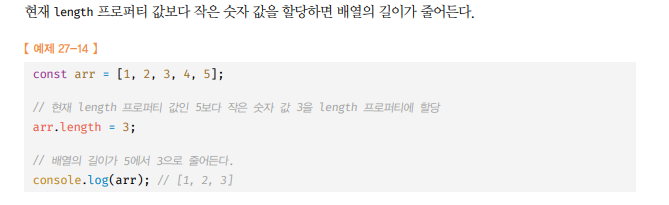
  - 현재 length 프로퍼티 값보다 큰 숫자를 할당하는 경우에 length 프로퍼티 값은 변경하지만 실제로 배열의 길이는 늘어나지 않는다.
    - length 프로퍼티 값은 성공적으로 `변경`, 실제 배열의 `아무런 변함이 없다`. 값 없이 비어 있는 요소를 위해 `메모리 공간을 확보하지 않는다`.

```js
const arr = [1];

//현재 length 프로퍼티 값인 1보다 큰 값인 3을 할당
arr.length = 3;

//length 프로퍼티 값은 변경되지만 실제로 배열의 길이가 늘어나지 않는다.
console.log(arr.length); //3
console.log(arr); // [1,empty * 2]
```

<br />

> 희소 배열 예제

```js
// 배열의 요소가 연속적으로 위치 하지 않고 일부가 비어있는 배열을 희소배열이라고 한다.
const sparse = [, 2, , 4];

//희소 배열의 length 프로퍼티 값은 요소와 일치 하지 않는다.
console.log(sparse.length); // 4
console.log(sparse); // [empty,2,empty,4]

//배열 sparse에는 인덱스가 0,2인 요소가 존재하지 않는다.
```

<br />
<br />
<br />

---

# 배열의 생성 방법

<br />

## 1. `배열 리터럴`

- 0개 이상의 요소를 쉼표로 구분하여 `[]`로 `묶는 방법`
  - 배열 리터럴에 요소를 생략하면 희소 배열이 생성

```js
const arr = [1, 2, 3];
consoel.log(arr); //3
//희소 배열
const arr = [1, , 3];
consoel.log(arr); // [1,empty,3]
```

<br />
<br />

## 2. `Array 생성자 함수`

- 인수의 개수에 따라 다르게 동작한다.
  - 전달된 인수가 1개 이며 숫자일 경우 : `length 프로퍼티 값이 인수인 배열을 생성`
  - 전달된 인수가 없는 경우 : `빈 배열 생성`
  - 전달된 인수가 2개 이상이거나 숫자가 아닌 경우 : `인수를 요소로 갖는 배열을 생성`

```js
// 인수가 1개이며 정수인 경우 -> 희소 배열 생성
const arr = new Array(10);

console.log(arr); // [ <10 empty items> ]
console.log(arr.length); // 10
console.log(Object.getOwnPropertyDescriptors(arr));
// { length: { value: 10, writable: true, enumerable: false, configurable: false } }

new Array(4294967295);
new Array(4294967296); // RangeError: Invalid array length
new Array(-1); // RangeError: Invalid array length

// 인수가 없는 경우 -> 빈 배열 생성
new Array(); // []

// 인수가 2개 이상이거나 숫자가 아닌 경우 -> 인수를 요소로 갖는 배열을 생성
new Array(1, 2, 3); // [1,2,3]
new Array({}); // [{}]
```

<br />
<br />

## 3. `Array.of 메서드`

- 전달된 인수를 갖는 배열을 생성
- 인수가 1개이고 숫자여도 인수를 요소로 갖는 배열을 생성

```js
const arr1 = Array.of(1);
const arr2 = Array.of(1, 2, 3);
const arr3 = Array.of("string");

console.log(arr1); // [ 1 ]
console.log(arr2); // [ 1, 2, 3 ]
console.log(arr3); // [ 'string' ]
```

<br />
<br />

## 4. `Array.from 메서드`

- `유사배열 객체` , `이터러블 객체`를 인수로 전달 받아 배열로 변환 후 반환
  - 두 번째 인수로 함께 전달할 콜백 함수를 통해 값을 만들면서 요소를 채울 수도 있다.
  - 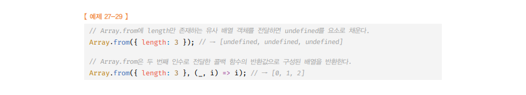

```js
// 유사 배열 객체를 배열로 변환
const arr1 = Array.from({ length: 2, 0: "a", 1: "b" });

// 이터러블 객체를 배열로 변환
// 문자열은 "이터러블 객체"이기도 하다.
const arr2 = Array.from("Hi");

console.log(arr1); // [ 'a', 'b' ]
console.log(arr2); // [ 'H', 'i' ]
```

```
💡 유사배열객체란 마치 배열 처럼 인덱스로 `프로퍼티 값에 접근`할 수 있고, `length 프로퍼티`를 갖는 `객체`를 말한다.
```

<br />
<br />
<br />

---

# 배열 참조

- 배열을 참조할 때는 대괄호`([])` 를 사용하며, 대괄호 안에는 `인덱스` 가 와야 한다.
- `정수로 평가되는 표현식` 이라면 인덱스로 사용 가능하다.
- 존재하지 않는 요소에 접근하면 `undefined`가 반환
  - 배열은 객체 이기 때문에 객체에서 존재하지 않는 프로퍼티에 접근하면 `undefined` 를 반환하는 것과 같다.

```js
// 희소 배열
const arr = [1, , 3];

// arr 배열의 1번째 인덱스에는 요소가 존재하지 않는다.
// 하지만, length 프로퍼티는 empty 요소도 포함해서 길이를 측정한다.
// 단, 실질적인 배열 프로퍼티의 메모리 공간에는 빈 요소의 영역은 할당되지 않는다.
console.log(Object.getOwnPropertyDescriptors(arr));
// {
//   '0': { value: 1, writable: true, enumerable: true, configurable: true },
//   '2': { value: 3, writable: true, enumerable: true, configurable: true },
//   length: { value: 3, writable: true, enumerable: false, configurable: false }
// }

// 존재하지 않는 요소를 참조하면 undefined
console.log(arr[1]); // undefined
console.log(arr[3]); // undefined
```

<br />
<br />
<br />

---

# 배열 요소의 추가, 갱신,삭제

## 추가 / 갱신

<br />

- 배열도 객체 이므로, 객체의 프로퍼티를 동적 으로 추가할 수 있는 것처럼 `배열에도 요소를 동적으로 추가할 수 있다`.
  - 
- 현재 배열의 length 프로퍼티 값보다 `큰 인텍스`로 새로운 요소를 추가하면 `희소 배열`이 된다.
  - 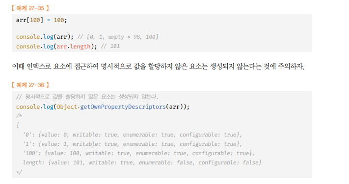

<br />
<br />

- `0이상 정수(또는 문자열 형태 숫자)` 로 인덱싱에 사용해야 한다
  - 만약, 정수 이외의 값을 인덱싱에 사용하면 요소가 생성되는 것이 아니라, 프로퍼티가 생성된다.
  - 프로퍼티는 length 프로퍼티 값에 영향을 주지 않는다.
  - 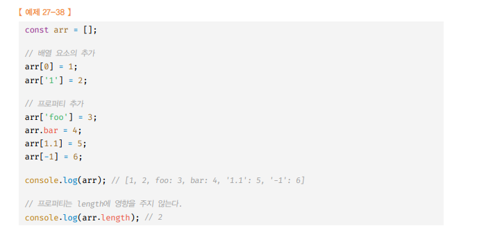

## 삭제

<br />

- 배열도 객체이므로 `delete 연산자`를 사용할 수 있다.
  - 하지만 `delete` 연산자를 이용해서 배욜의 요소를 삭제하면 `희소 배열`이 된다.
  - 배열에서 `delete 연산자`는 `사용하지 않는 것`이 좋음
- `Array.prototype.splice` 메서드를 사용해 배열의 요소를 삭제해야함
  - `희소배열을 만들지 않음`

> Array.prototype.splice 예시

```js
const arr = [1, 2, 3];
//Array.prototype.splice(삭제를 시작할 인덱스, 삭제할 요소의 수)
//arr[1]부터 1개의 요소를 제거

arr.splice(1, 1);
console.log(arr); //[1,3]

//length 프로퍼티가 자동으로 갱신된다.
console.log(arr.length); // 2
```

<br />
<br />

<br />
<br />

---

# `배열 메서드`

- Array 생성자 함수는 `정적 메서드`를 제공하며, `Array.prototype`은 프로토타입 메서드를 제공한다.
- 배열을 반환하는 패턴이 `두가지` 이다.
  - 원본 배열을 `직접 변경하는` 메서드
    - 원본 배열을 직접 변경하는 메서드는 `외부 상태를 직접 변경하는` `부수 효과`(side effect)가 있으므로 주의할 것
  - 원본 배열을 변경하지 않고 `새로운 배열`을 `생성`해서 반환하는 메서드
    - 원본 배열을 변경하지 않는 메서드를 사용하는 편이 좋다

<br />
<br />

---

## `배열 메서드 (Array.isArray)`

- 배열인지 아닌지 확인 해주는 메서드
- `Array.isArray`는 전달된 인수가 배열이면 `true`, 거짓이면 `false`를 return 한다.

> 예제 코드

```js
console.log(Array.isArray([])); // true
console.log(Array.isArray([1, 2])); // true
console.log(Array.isArray(new Array())); // true

console.log(Array.isArray(null)); // false
console.log(Array.isArray(1)); // false
console.log(Array.isArray("string")); // false
console.log(Array.isArray(undefined)); // false
console.log(Array.isArray(true)); // false
console.log(Array.isArray({})); // false
```

<br />
<br />

---

## `배열 메서드 (Array.prototype.indexOf)`

- 원본 배열에서 인수로 전달된 요소를 검색해서 `인덱스`를 `반환`한다.
  - 검색되는 요소가 중복되어 여러 개일 경우 `첫 번째 검색된 요소의 인덱스를 반환`
  - 원본 배열에 검색할 요소가 존재하지 않으면 `-1 반환`
  - 배열에 특정 요소가 존재하는지 확인할 때 유용

<br />

- `indexOf` 대신 `includes`를 사용하면 더 가독성이 좋다.

<br />

> 예시 코드 indexOf

```js
const arr = [1, 2, 2, 3];

console.log(arr.indexOf(2)); // 1  ( 2를 검색 )
console.log(arr.indexOf(2, 2)); // 2  ( 2번 째 인덱스 2를 검색)
console.log(arr.indexOf(-1)); // -1 ( 존재하지 않는 요소 검색 )
```

<br />

> 예시 코드 includes

```js
const foods = ["apple", "banana", "orange"];
//foods 배열에 `orange` 요소가 없다면 `orange`요소 등록
if (!foods.includes("orange")) {
  foods.push(`orange`);
}
console.log(foods); // ["apple", "banana", "orange"];
```

<br />
<br />

---

## `배열 메서드 (Array.prototype.push)` `원본 배열 변경`

- 인수로 전달받은 모든 값을 원본 배열의 `마지막 요소`로 추가하고 `length 프로퍼티 값`을 `반환`한다.
- `push`는 성능면에서 `좋지 않다`

  - push 메서드를 사용하지 않고, `length 프로퍼티를 사용해 배열에 마지막요소`에 `추가`하는 편이 더 성능이 좋다.
  - 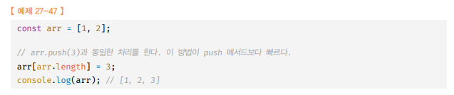
  - 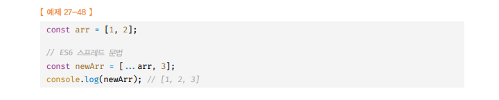

- 성능 측면에서 배열에 추가할 요소가 하나라면 마지막 배열 요소를 직접 추가하는 방법이 더 `빠르다`.

    <br />

```js
// 안 좋은 방식
const arr = [1, 2];

arr.push([3, 4]);
console.log(arr); // [ 1, 2, [ 3, 4 ] ]

arr.push("a", "b");
console.log(arr); // [ 1, 2, [ 3, 4 ], 'a', 'b' ]

const arr2 = [...arr, true];
console.log(arr2); // [ 1, 2, [ 3, 4 ], 'a', 'b', true ]
```

<br />
<br />

---

## `배열 메서드 (Array.prototype.pop)` `원본 배열 변경`

- 원본 배열에서 마지막 요소를 제거하고 `제거한 요소를 반환`한다.
  - 원본 배열이 빈 배열이면 `undefined`를 `반환`한다.
  - pop, push로 자료구조 `스택`을 구현 할 수 있다.
  - 
    <br />

> 예제 코드 pop

```js
const arr = [1, 2];

let pop = arr.pop();
console.log(arr); // [ 1 ]
console.log(pop); // 2
```

<br />

> 스택을 생성자 함수로 구현 예시

```js
// 클래스로 구현한 push와 pop 메서드를 활용한 "스택 자료구조"
class Stack {
  #array;

  constructor(array = []) {
    if (!Array.isArray(array)) {
      throw new TypeError(`${array} is not an array !`);
    }
    this.#array = array;
  }

  push(value) {
    return this.#array.push(value);
  }

  pop() {
    return this.#array.pop();
  }

  entries() {
    return [...this.#array];
  }
}

const stack = new Stack([1, 2]);
console.log(stack.entries()); // [ 1, 2 ]

stack.push(3);
console.log(stack.entries()); // [ 1, 2, 3 ]

let pop = stack.pop();
console.log(stack.entries(), pop); // [ 1, 2 ] 3
```

<br />
<br />

---

## `배열 메서드 (Array.prototype.unshift)` `원본 배열 변경`

- 인수로 전달 받은 모든 값을 `원본 배열의 선두`에 `추가`하고 변경된 `length 프로퍼티 값을 반환`
- `unshift`는 `원본 배열을 변경`하는 `부수효과`가 있다.
  - ES6의 `스프레드 문법`을 `사용`하는 편이 좋다.

<br />

> 예시 코드 unshift

```js
const arr = [1, 2];

// Bad!!!
let result = arr.unshift(3, 4);
console.log(result); // 4
console.log(arr); // [ 3, 4, 1, 2 ]

// Good!!!
const newArr = [100, ...arr];
console.log(newArr); // [ 100, 3, 4, 1, 2 ]
```

<br />
<br />

---

## `배열 메서드 (Array.prototype.shift )` `원본 배열 변경`

- 원본 배열에서 `첫 번째 요소`를 `제거`하고 제거한 요소를 `반환`

  - 원본 배열이 빈 배열이면 `undefined` 반환

- `unshift` 메서드와 혼합해서 `큐(queue)` 자료구조 를 구현할 수 있다.

<br />

> 예시 코드 shift

```js
const arr = [1, 2];

let shift = arr.shift();
console.log(shift); // 1
console.log(arr); // [ 2 ]
```

<br />

> 예시 코드 자료구조 `큐` 구현

```js
class Queue {
  #array;

  constructor(array = []) {
    if (!Array.isArray(array)) {
      throw new TypeError(`${array} is not an array !`);
    }
    this.#array = array;
  }

  enqueue(value) {
    return this.#array.push(value);
  }

  dequeue() {
    return this.#array.shift();
  }

  entries() {
    return [...this.#array];
  }
}

const queue = new Queue([1, 2]);
console.log(queue.entries()); // [ 1, 2 ]

queue.enqueue(3);
console.log(queue.entries()); // [ 1, 2, 3 ]

let dequeue = queue.dequeue();
console.log(queue.entries(), dequeue); // [ 2, 3 ] 1
```

<br />
<br />

---

## `배열 메서드 (Array.prototype.concat  )` `원본 배열 변경XX`

- 인수로 전달된 값을 `원본 배열의 마지막 요소에 추가`한 새로운 배열을 `반환`
  - 인수로 전달된 값이 배열의 값인 경우 `배열`을 `해체`하여 `새로운 배열의 요소`에 `추가`한다.
- push 메서드와 unshift 메서드는 `concat 메서드`로 `대체` 가능
  - 다만, 차이점은 concat 메서드는 원본 배열을 직접 변경하지 않고, `새로운 배열을 반환`하는 것
  - `push` 와 `unshift` 메서드의 경우 원본 배열은 다른 변수에 복사해놓고 사용해야 안전
- concat은 `ES6의 스프레드 문법으로 대체 가능`하다.

```
✅ ES6의 스프레드 문법을 일관성있게 사용하는 것을 권장
```

<br />

> concat , push, unshift 예시

```js
const arr = [3, 4];
//unshift와 push 메서드는 인수로 전달받은 배열을 그대로 원본 배열의 요소로 추가한다
arr.unshift([1, 2]);
arr.push([5, 6]);
console.log(arr); //[[1,2],3,4,[5,6]]

//concat 메서드는 인수로 전달받은 배열을 해체하여 새로운 배열의 요소에 추가한다.
let result = [1.2].concat([3, 4]);
result = result.concat([5, 6]);
console.log(result); // [1,2,3,4,5,6]
```

<br />

> concat , ES6 스프레드 문법 대체 예시

```js
let result = [1, 2].concat([3, 4]);
console.log(result); // [1,2,3,4]

//concat 메서드는 ES6 의 스프레트 문법으로 대체 가능하다.
result = [...[1, 2], ...[3, 4]];
console.log(result); // [1,2,3,4]
```

<br />
<br />

---

## `배열 메서드 (Array.prototype.splice )` `원본 배열 변경`

- 원본 배열의 `중간에 요소를 추가` 하거나 `중간에 있는 요소를 제거`하는 경우 사용
- 3개의 매개변수를 가진다.

  - `start` : 삭제 시작 인덱스
  - `deleteCount` : 시작 인덱스로부터 삭제할 요소의 개수
  - `items` : 요소를 삭제 후, 삭제한 인덱스로부터 추가할 데이터

- `3개 매개변수` 모두 있을 때 (`start` , `deleteCount` , `items`)
  - 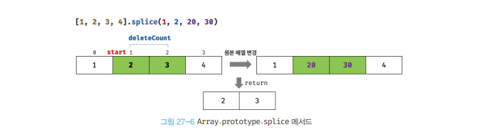
- `2개 매개변수` (`start`, `deleteCount`)
  - 
- `1개 매개변수` (`start`)
  - 첫번째 인수로 전달된 시작 인덱스부터 모든 요소를 제거한다.

<br />

```js
const arr = [1, 2, 3, 4];

const result = arr.splice(2, 1, 300);

console.log(result); // [ 3 ]
console.log(arr); // [ 1, 2, 300, 4 ]
```

- 배열에서 특정 요소를 제거하려면 Array.prototype.indexOf 와 혼합해서 구현할 수 있다.

```js
const arr = [1, 2, 3, 1, 2];

function remove(array, item) {
  const index = array.indexOf(item);

  if (index !== -1) array.splice(index, 1);

  return array;
}

console.log(remove(arr, 2)); // [ 1, 3, 1, 2 ] << 1번째 인덱스에 요소 2가 삭제된 후의 배열을 반환
console.log(remove(arr, 100)); // [ 1, 3, 1, 2 ] << 100은 존재하지 않으므로 삭제된 요소는 없음
```

<br />
<br />

---

## `배열 메서드 (Array.prototype.slice)` `원본 배열 변경XX`

- 인수로 전달된 범위의 요소들을 복사하여 배열로 반환한다.

  - `start` : 복사 시작할 인덱스
  - `end` : 복사 끝 인덱스
  - 

- 얕은 복사(shallow copy)를 통해 새로운 배열을 생성

<br />

```js
const arr = [1, 2, 3];

console.log(arr.slice(1, 3)); // [ 2, 3 ]
console.log(arr); // [ 1, 2, 3 ]
```

```js
const arr = [1, 2, 3];
const shallowCopy = arr.slice();

shallowCopy.splice(0, 1); // 복사본 배열 첫 번째 요소 삭제
console.log(shallowCopy); // [ 2, 3 ]
console.log(arr); // [ 1, 2, 3 ]
```

<br />
<br />

---

## `배열 메서드 (Array.prototype.join)` `원본 배열 변경XX`

- 원본 배열의 모든 요소를 문자열로 변환 후 인수로 `전달받은 문자열`, 즉 `구분자`로 연결한 `문자열을 반환`한다.
- 구분자는 `생략`이 `가능`
  - 기본 구분자 : `.`

<br />

```js
const arr = [1, 2, 3, 4];

console.log(arr.join()); // 1,2,3,4
console.log(arr.join(":")); // 1:2:3:4
console.log(arr.join("")); // 1234
```

<br />
<br />

---

## `배열 메서드 (Array.prototype.join)` `원본 배열 변경`

- `원본 배열`의 순서를 `반대로` `뒤집는다`.
- 반환 값은 `변경된 배열`이다

```js
const arr = [1, 2, 3];
const reversed = arr.reverse();

console.log(arr); // [ 3, 2, 1 ] << 원본 데이터 파괴 (mutator method)
console.log(reversed); // [ 3, 2, 1 ]
```

<br />
<br />

---

## `배열 메서드 (Array.prototype.fill)` `원본 배열 변경`

- ES6에 도입된 fill은 인수로 전달받은 값을 배열의 처음부터 끝까지 채운다
- 3개의 인수를 가진다.
  - `initialValue` : 초기화 시킬 값
  - `start` : 시작 인덱스 값
  - `end` : 끝 인덱스 값

<br />

```js
const arr = new Array(3);
console.log(arr); // [ <3 empty items> ]

arr.fill(1);
console.log(arr); // [ 1, 1, 1 ]

arr.fill(100, 1, 2);
console.log(arr); // [ 1, 100, 1 ] << 원본 데이터 파괴 (mutator method)
// 1인덱스부터 2인덱스전 까지 변경
```

- `fill` 메서드로 요소를 채울 경우 모든 요소를 한가지의 값으로만 채울 수 밖에 없는 `단점`이 있음
  - `Array.from` 사용하면 `두 번째 인수`로 전달한 `콜백 함수`를 통해 요소값을 만들면서 배열 채울 수 있다.
  - 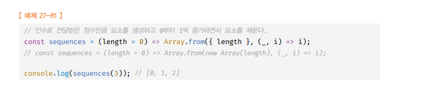

<br />
<br />

---

## `배열 메서드 (Array.prototype.includes)` `원본 배열 변경XX`

- 배열 내 특정 요소가 포함 되어있으면 `TRUE` 포함 되지 않으면 `False`를 `반환`
- 두개의 매개변수를 가짐
  - `serachValue` : 검색할 값
  - `start` : 시작 인덱스

<br />

```js
const arr = [1, 2, 3];

console.log(arr.includes(3)); // true
console.log(arr.includes(100)); // false
```

<br />

```js
const arr = [1, 2, 3];
// 배열에 요소 1이 포함되어 있는지 인덱스 1부터 확인한다.
arr.includes(1, 1);
// 배열에 요소 3이 포함되어 있는지 인덱스 2부터 확인한다.
arr.includes(3, -1);
```

```
✅ indexOf 와 includes 차이점


✅ `indexOf` 메서드는 없으면 -1 임을 확인해야하며 , 배열에 NaN 이 있다면 판별할 수 없다.
```

> indexOf 와 includes 차이점 예시

```js
console.log([NaN].indexOf(NaN)); // -1
console.log([NaN].includes(NaN)); // true
```

<br />
<br />

---

## `배열 메서드 (Array.prototype.flat)` `원본 배열 변경XX`

- 인수로 전달한 깊이만큼 `재귀적`으로 배열은 `평탄화` 한다.
- 중첩 배열을 평탄화할 깊이를 인수로 전달 가능
  - 인수를 `Infinity`로 넘기면 중첩 배열을 모두 평탄화 한다.

```js
const dupArr = [1, [2, 3, 4, 5]];
console.log(dupArr.flat()); // [ 1, 2, 3, 4, 5 ]

const dupArr2 = [1, [2, [3, 4, 5]]];
console.log(dupArr2.flat()); // [ 1, 2, [ 3, 4, 5 ] ]
console.log(dupArr2.flat(Infinity)); // [1, 2, 3, 4, 5];
```

<br />
<br />

<br />
<br />

---

# `배열 고차 함수`

- `고차 함수` : `함수`를 `인자`로 전달 받거나 `함수`를 `반환`하는 함수
  - 자바스크립트의 함수는 `일급 객체`이므로 함수를 값으로 `전달` or `반환` 가능
- 고차 함수는 외부 상태의 변경이나 `가변`데이터를 피하고 `불변성`을 지향하는 함수형 프로그래밍을 기반으로 한다.

```
📌 함수형 프로그래밍이란 순수 함수와 보조 함수의 조합을 통해 로직내에 있는 조건문과 반복문을 제거하여 복잡성을 해결하고 변수의 사용을 억제해서 상태 변경을 피하려는 프로그래밍 패러다임이다.

📌 반복문 , 조건문은 로직의 흐름을 이해하기 어렵게 하고, 변수는 누군가에 의해 변경 되어 오류 발생을 야기 할 수 있게 때문에
```

<br />

<br />
<br />

---

## `배열 고차 함수(Array.prototype.sort)` `원본 배열 변경 O`

- 배열의 요소를 정렬 한다.
- 원본 배열 `직접 변경`
- 기본적으로 `오름 차순`

<br />

> 예시 오름 차순(문자열)

```JS
const fruits = ["Banana", "Orange", "Apple"];

fruits.sort();
console.log(fruits); // [ 'Apple', 'Banana', 'Orange' ]
```

<br />

- 기본적인 정렬 순서는 `유니코드 코드 포인트의 순서를 따른다.`
  - 배열의 요소들을 정렬 시, 숫자 타입이어도 암묵적으로 `문자열 타입으로 변환 후 유니코드 코드 포인트 순서에 따라 정렬`
- 숫자 요소를 정렬 시에는 `정렬 순서`를 정의하고 `비교 함`수(compare function)를 `인수`로 전달해야 한다.
  - 비교함수는 `양수` OR `음수` OR `0`을 반환 해야 한다.
  - `양수` : 비교 함수의 두번째 인수를 우선 정렬
  - `음수` : 비교 함수의 첫번째 인수를 우선 정렬 - `0` : 정렬하지 않음
  - 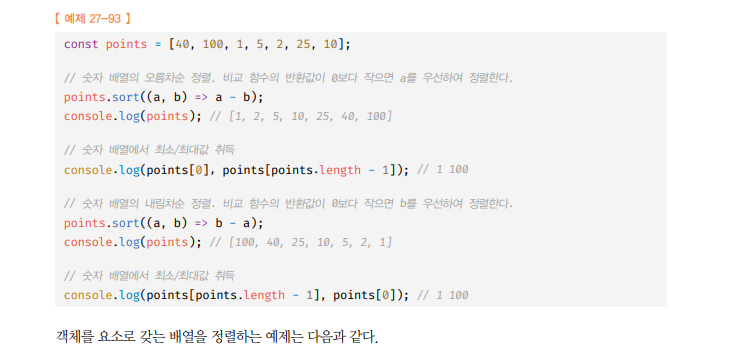

<br />

> 숫자열 SORT 예시

```JS
const numbers = [40, 100, 1, 5, 2, 25, 10];

numbers.sort();
console.log(numbers); // [1, 10, 100, 2, 25, 40, 5] << 제대로 된 오름차순 정렬이 아님

numbers.sort((a, b) => a - b);
console.log(numbers); // [1, 2, 5, 10, 25, 40, 100]
```

> 객체를 요소로 갖는 배열을 정렬하는 예시

```JS
const todos = [
  {id:4,content:"Javascript"},
  {id:1,content:"HTML"},
  {id:2,content:"CSS"},
];

// 비교 함수 , 매개변수 Key는 프로퍼티 키다.
function compare(key){
  //프로퍼티 값이 문자열인 경우 - 산술 연산으로 비교하면 NaN이 나오므로 비교연산 사용
  //비교함수는 양수/음수/0을 반환하면 되므로 - 산술연산 대신 비교 연산을 사용
  return (a,b) => (a[key] >  b[key] ? 1 : (a[key] < b[key] ? -1 : 0));
}

//id를 기준으로 오름차순 정렬
todos.sort(compare("id"));
//content를 기준으로 오름차순 정렬
todos.sort(compare("content"));
```

<br />

<br />
<br />

---

## `배열 고차 함수(Array.prototype.forEach)` `원본 배열 변경 X`

<br />

```
🔥 반환값은 언제나 undefined
🔥 콜백 함수 내부의 this와 호출한 메서드 내부의 this를 일치시키려면 화살표 함수나,
   this로 사용할 객체를 바인딩해야 한다.
🔥 forEach 문 내부에서는 break, continue 문을 사용할 수 없다. 즉, 중간에 순회를 중단할\
   수 없다.

🔥 for문에 비해 성능은 좋지 않지만, 가독성은 좋다
🔥 복잡한 배열이 아니라면 forEach를 사용하는 것이 좋다.
```

- `for문`을 대체 할 수 있는 고차 함수
- `자신의 내부`에서 반복문 실행
  - 즉, 반복문을 추상화한 고차 함수로서 내부에서 반복문을 통해 자신을 호출한 배열을 순회하면서 `수행해야 할 처리`를 `콜백 함수`로 `전달`받아 반복 호출한다.
  - 각 배열의 `요소에 대해` `한 번씩 콜백 함수`가 호출된다.
  - `콜백 함수`는 `일반 함수`로 적용되기 때문에, `this`의 참조는 `undefined`가 바인딩된다. ( 고차함수에서는 strict mode 가 반영되기 때문, 아닐 경우 전역 객체를 가리킨다. )

<br />

> forEach 예시

```js
[1, 2, 3].forEach((item, idx, arr) => {
  console.log(`요소 값 : ${item}, 인덱스 : ${idx}, this : ${arr}`);
});
// 요소 값 : 1, 인덱스 : 0, this : 1,2,3
// 요소 값 : 2, 인덱스 : 1, this : 1,2,3
// 요소 값 : 3, 인덱스 : 2, this : 1,2,3
```

<br />

> forEach 예시 (2) 콜백 함수의 `this`는 `undefined`를 가리킴

```js
class Numbers {
  numberArray = [];

  mul(arr) {
    arr.forEach(function (item) {
      // forEach 의 인수로 전달하는 콜백함수가 "일반함수"인 경우, this 참조는 undefined 를 바인딩
      // TypeError: Cannot read property 'numberArray' of undefined
      this.numberArray.push(item * item);
    });
  }
}

const numbers = new Numbers();
numbers.mul([1, 2, 3]);
```

<br />

> forEach 예시 (3) 콜백 함수 내부의 this와 호출한 메서드 내부의this 일치 (`화살표함수`, `바인딩`)

```js
class Numbers {
  numberArray = [];

  mul(arr) {
    arr.forEach((item) => {
      // forEach 의 인수로 전달하는 콜백함수가 "화살표 함수"인 경우, this 참조는 Lexical this 참조를 따른다. 즉 this 호출의 상위 스코프를 참조한다.
      this.numberArray.push(item * item);
    });
  }
}

const numbers = new Numbers();
numbers.mul([1, 2, 3]);
console.log(numbers.numberArray); // [ 1, 4, 9 ]
```

<br />

> forEach 예시 (4) break, continue 문을 사용할 수 없음

```js
[1,2,3].forEach((item, idx) => {
  console.log(item);
  if(idx > 0) break;
  // SyntaxError: Illegal break statement
})

[1,2,3].forEach((item, idx) => {
  console.log(item);
  if(idx > 0) continue;
  // SyntaxError: Illegal continue statement: no surrounding iteration statement
})
```

<br />

<br />
<br />

---

## `배열 고차 함수(Array.prototype.map)` `원본 배열 변경 X`

- `콜백 함수의 반환값들로 구성된 새로운 배열 반환`
  - map이 반환하는 새로운 배열의 `length` 프로퍼티 값은 `map 메서드`를 호출한 배열의 length와 `동일`하다.
  - 
- 자신을 호출한 배열의 모든 요소를 순회하면서 인수로 전달받은 `콜백 함수`를 `반복 호출`한다.
  - `콜백 함수의 반환값`들로 `구성된 새로운 배열`을 `반환`한다.
- 원본 배열의 요소값을 다른값으로 `매핑한 새로운 배열`을 `생성`하기 위한 고차함수

<br />

> map 예시

```js
const arr = [1, 2, 3];
const mappingArr = arr.map((item) => Math.pow(item, 2));

console.log(arr); // [ 1, 2, 3 ]
console.log(mappingArr); // [ 1, 4, 9 ]
```

<br />

> map (2) 예시

```js
//map 메서드는 콜백 함수를 호출하면서 3개(요소값,인덱스,this)의 인수를 전달한다.
[1, 2, 3].map((item, index, arr) => {
  console.log(`요소값${item}, 인덱스${index}, this${JSON.stringify(arr)}`);
});
```

<br />

<br />
<br />

---

## `배열 고차 함수(Array.prototype.filter)` `원본 배열 변경 X`

<br />

- 
- `콜백 함수의 반환값이 true`인 `요소`만으로 구성된 배열을 반환한다.
- 자신을 호출한 배열의 모든 요소를 순회하면서 `인수로 전달받은 콜백 함수를 반복 호출`한다.
- 원본 배열은 변경되지 않는다.
- 특정 조건에 맞는 배열의 요소들을 추출할 때 유용하게 사용된다.

<br />

> filter 예시

```js
const arr = [1, 2, 3, 4, 5];
const filteredArr = arr.filter((item) => item < 4);

console.log(arr); // [ 1, 2, 3, 4, 5 ]
console.log(filteredArr); // [ 1, 2, 3 ]
```

<br />

> filter 예시(2)

```js
//map 메서드는 콜백 함수를 호출하면서 3개(요소값,인덱스,this)의 인수를 전달한다.
[1, 2, 3].filter((item, index, arr) => {
  console.log(`요소값${item}, 인덱스${index}, this${JSON.stringify(arr)}`);
});
```

<br />

<br />
<br />

---

## `배열 고차 함수(Array.prototype.reduce)` `원본 배열 변경 X`

- 자신을 호출한 배열을 `모든 요소`를 `순회`하며 `인수`로 전달받은 `콜백 함수`를 `반복 호출`한다.
- 콜백 함수를 호출하여 `하나의 결과값을 만들어 반환`

  - 매 차례마다, 콜백 함수의 반환값과 두 번째 요소값을 콜백 함수의 인수로 전달하면서 호출한다.

<br />

```
🔥 reduce로 map,filter,every,find 구현 가능
🔥 reduce 메서드의 두 번째 인수로 전달하는 초기값은 첫 번째 순회에서 콜백 함수의
   첫번째 인수로 전달된다.
🔥 reduce 메서드를 호출할 때 두번째 인수인 초기값을 전달하는 편이 좋다.
```

<br />

- `4개의 매개변수`를 가진다.
  - `accumulator` : 누적될 값
  - `currentValue` : 현재 조회하는 값
  - `index` : 현재 조회하는 값의 인덱스
  - `array` : 원본 배열 참조

<br />

> reduce 예시 코드

```js
const sum = [1, 2, 3, 4].reduce((acc, cur, index, array) => acc + cur, 0);
console.log(sum); //10
```

- 콜백 함수는 4개의 인수를 전달 받아 배열의 length만큼 총 4회 호출된다.
- 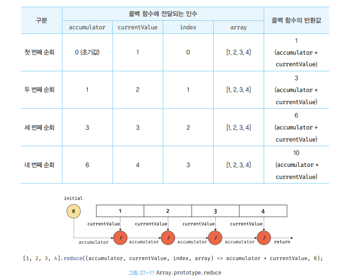
- 위 과정을 반복하여 reduce 메서드는 하나의 결과를 반환한다.
- 배열의 모든 요소를 순회해서 하나의 결과값을 구해야 하는 경우에 사용한다.

<br />

- reduce 메서드의 다양한 용도

---

<br />

- `평균 구하기(reduce)`

```js
const arr = [1, 2, 3, 4, 5];

const average = arr.reduce((acc, cur, idx, { length }) => {
  // 마지막 index 원소라면 마지막 원소까지 누적한 수의 arr 길이만큼 나눠서 평균을 반환, 그게 아니라면 누적한 수에 현재 요소를 더한 값을 다음 콜백함수의 사용할 반환값으로 반환
  return idx === length - 1 ? (acc + cur) / length : acc + cur;
}, 0);

console.log(average); // 3  = (1+2+3+4+5) / 5
```

<br />

- `최대값 구하기(reduce)`

```js
const arr = [1, 2, 3, 4, 5];

const max = arr.reduce((acc, cur) => (acc > cur ? acc : cur), 0);
console.log(max); // 5

// const max = Math.max(...arr);  // Math.max 를 사용하는 것이 사실 훨씬 더 직관적
// console.log(max);              // 5
```

<br />

- `요소의 중복 횟수 구하기(reduce)`

```js
const arr = ["banana", "apple", "apple", "orange", "apple"];

const dupArr = arr.reduce((acc, cur) => {
  acc[cur] = (acc[cur] || 0) + 1;
  return acc;
}, {});

console.log(dupArr); // { banana: 1, apple: 3, orange: 1 }
```

<br />

- `중복 요소 제거(reduce)`
  - 중복 요소 제거는 `set`를 사용하는 편이 좋다.

```js
const arr = [1, 2, 1, 3, 5, 4, 5, 3, 4, 4];

const removeDupArr = arr.reduce((acc, cur, idx, arr) => {
  if (arr.indexOf(cur) === idx) acc.push(cur);
  return acc;
}, []);

console.log(removeDupArr); // [ 1, 2, 3, 5, 4 ]

// 사실, 배열 내 중복된 요소를 제거한 배열을 추출하는 것은 Array.prototype.from 메서드와 Set 자료형을 활용하면 쉽게 구할 수 있다.
// const removeDupArr = Array.from(new Set(arr));
// console.log(removeDupArr1);   // [ 1, 2, 3, 5, 4 ]
```

<br />

```js
const arr = [1, 2, 1, 3, 4, 5, 4, 3, 4];

// 중복을 허용하지 않는 Set 객체의 특성을 활용해 배열에서 중복된 요소를 제거 할 수 있다.
const result = [...new Set(arr)];
console.log(result); // [1,2,3,4,5]
```

<br />

<br />
<br />

---

## `배열 고차 함수(Array.prototype.some)` `원본 배열 변경 X`

- some 메서드는 자신을 호출한 배열의 요소를 순회하면서 인수로 전달된 콜백 함수를 호출한다.
- 콜백 함수의 반환값이 단 한 번이라도 참이면 `true`, 모두 거짓이면 `false를` 반환
- 배열의 요소 중에 콜백 함수를 통해 정의한 조건을 만족하는 요소가 1개이상 존재하는지 확인하여 그 결과를 `boolean`타입으로 `반환`한다.
- 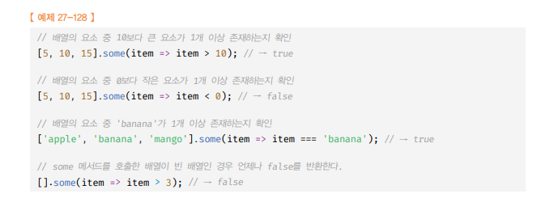
  <br />

<br />

> 예시 코드

```js
const odds = [1, 3, 5, 7];

// odds 배열 내에는 조건인 짝수가 하나도 없으므로, false 반환
console.log(
  odds.some((item) => {
    console.log(item);
    return item % 2 === 0;
  })
);
// 1
// 3
// 5
// 7
// false

// odds 배열 내에는 첫 요소 1부터 홀수 이므로, 하나라도 조건에 만족하는 요소가 있으니 true 반환
console.log(
  odds.some((item) => {
    console.log(item);
    return item % 2 !== 0;
  })
);
// 1
// true
```

<br />

<br />
<br />

---

## `배열 고차 함수(Array.prototype.every)` `원본 배열 변경 X`

<br />

- 콜백 함수의 반환값이 `모두 참이면 true`, 단 `한 번이라도 거짓이면 false`를 `반환`
- 자신을 호출한 `배열의 요소`를 `순회`하면서 인수로 전달된 `콜백 함수`를 `호출`한다.
- 즉, 배열의 모든 요소가 콜백 함수를 통해 `정의한 조건을 모두 만족하는지` `확인`하여 그 결과를 boolean 타입으로 반환

  - 단, 빈 배열인 경우 언제나 `true`를 반환

- 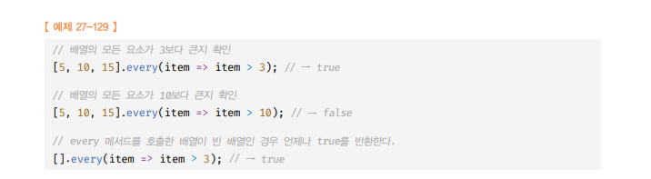

<br />
  <br />

> every 예시

```js
const odds = [1, 3, 5, 7];

// odds 배열 내에는 조건인 짝수가 하나도 없으므로, false 반환
console.log(
  odds.every((item) => {
    console.log(item);
    return item % 2 === 0;
  })
);
// 1
// false

// odds 배열 내에는 첫 요소 1부터 홀수 이므로, 하나라도 조건에 만족하는 요소가 있으니 true 반환
console.log(
  odds.every((item) => {
    console.log(item);
    return item % 2 !== 0;
  })
);
// 1
// 3
// 5
// 7
// true
```

<br />

<br />
<br />

---

## `배열 고차 함수(Array.prototype.find)` `원본 배열 변경 X`

- 자신을 호출한 배열의 요소를 순회하면서 인수로 전달된 `콜백 함수`를 호출하여 `true`를 반환하는 `첫 번째 요소`를 `반환`
  - true를 반환하는 첫번째 경우를 반환
  - true를 반환하는 경우가 없다면 `undefined`를 반환

<br />

> 예시 코드

```js
const users = [
  {
    id: 1,
    name: "a",
  },
  {
    id: 2,
    name: "b",
  },
  {
    id: 3,
    name: "c",
  },
  {
    id: 4,
    name: "d",
  },
];

console.log(users.find((item) => item.id === 3)); // { id: 3, name: 'c' }
console.log(users.find((item) => item.name === "qqq")); // undefined
```

<br />

<br />
<br />

---

## `배열 고차 함수(Array.prototype.findIndex )` `원본 배열 변경 X`

<br />

- findIndex 메서드는 콜백 함수에 정의한 조건에 대해 `true`를 반환하는 `요소의 인덱스`를 `반환`
  - `true`를 반환하는 경우가 없다면 `-1 반환`

<br />

> 예시 코드

```js
const users = [
  {
    id: 1,
    name: "a",
  },
  {
    id: 2,
    name: "b",
  },
  {
    id: 3,
    name: "c",
  },
  {
    id: 4,
    name: "d",
  },
];
// 인덱스 반환
console.log(users.findIndex((item) => item.id === 3)); // 2;
console.log(users.findIndex((item) => item.name === "YOUNG")); // -1
```

<br />

<br />
<br />

---

## `배열 고차 함수(Array.prototype.flatMap  )` `원본 배열 변경 X`

- map를 통해 생성된 새로운 배열을 `평탄화`한다.
- `map` , `flat` 메서드를 순차적으로 실행하는 효과가 있다.
  - 즉, map 함수 호출한 결과 → flat 메서드 호출한 결과와 같다.
  - 단, flat 과정의 깊이를 1로만 적용할 수 있다.

<br />

```js
const arr = ["hello", "world"];

console.log(arr.map((item) => item.split("")).flat()); // ["h", "e", "l", "l", "o", "w", "o", "r"]
console.log(arr.flatMap((item) => item.split(""))); // ["h", "e", "l", "l", "o", "w", "o", "r"]
```
