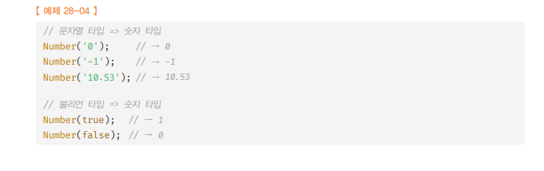

# NUMBER 🎯💡🔥📌✅

<br />

- `표준 빌트인 객체` : Number는 원시 타입 숫자를 다룰 때 유용한 `프로퍼티`, `메서드`를 제공한다.
- `Number`은 생성자 함수 객체이고, `new 연산자`와 함께 호출하면 인스턴스 생성 가능

<br />

- `Number`에 인수를 전달하지 않고, `new 연산자`와 함께 호출하면 `[[NumberDATA]]` 내부 슬롯에 `0`을 할당한 NUMBER `래퍼 객체`를 생성 한다.

  - `Number` 생성자 함수의 인수로 숫자를 전달하면, `[[NumberData]]` 내부 슬롯에 인수로 전달받은 숫자를 할당한` Number 래퍼 객체`를 `생성`한다.

<br />

- `명시적 타입` 변환에 사용되기도 한다.
  - 

> `[[NumberData]]` 내부 슬롯 예시 코드

```js
//Number 생성자 함수의 인수로 숫자가 아닌 값을 전달하면 인수를 숫자로 강제 변환
//인수를 숫자로 변환 할 수 없다면 NaN를 [[NumberData]]에 할당한 Number 래퍼 객체를 생성한다.
const numObj = new Number(10);
console.log(numObj); // Number{[[NumberData]] : 10}

const numObj2 = new Number("hoho");
console.log(numObj2); // Number{[[NumberData]] : NaN}
```

<br />
<br />
<br />

---

# Number 프로퍼티

<br />
<br />

---

## Number.EPSILON (Number 프로퍼티)

<br />

- `정확한 계산을 위해 사용함`
- `1과 1보다 큰 숫자 중에서 가장 작은 숫자와의 차이와 같다.`
- 약 `2.2204460492503130808472633361816 * 10^-16`
- 이 프로퍼티는 `부동소수점 산술의 오차 문제에 의한 정확한 계산` 을 `위해` 사용한다.

<br />

> 부동 소숫점 연산은 정확한 결과를 기대 하기 어려움

```js
0.1 + 0.2; //0.300000000000000000004
0.1 + 0.2 === 0.3; // false
//EPSILON은 부동 소수점으로 인해 발생하는 오차를 해결하기 위해 사용한다.
function exactIsEqual(a, b) {
  return Math.abs(a - b) < Number.EPSILON;
}

console.log(exactIsEqual(0.1 + 0.2, 0.3)); // true
console.log(0.1 + 0.2 === 0.3); // false
```

<br />
<br />
<br />

---

## Number.MAX_VALUE (Number 프로퍼티)

- 자바스크립트에서 표현할 수 있는 가장 작은 양수`(5 * 10^-324)`
- `Infinity > Number.MAX_VALUE`

<br />

> 예시 코드

```js
console.log(Number.MIN_VALUE); // 5e-324
console.log(0 < Number.MIN_VALUE); // true
```

<br />
<br />
<br />

---

## Number.MIN_VALUE (Number 프로퍼티)

- 자바스크립트에서 표현할 수 있는 가장 `작은 양수(5 * 10^-324)`
- `0 < Number.MIN_VALUE`

<br />

> 예시 코드

```js
console.log(Number.MIN_VALUE); // 5e-324
console.log(0 < Number.MIN_VALUE); // true
```

<br />
<br />
<br />

---

## Number.MAX_SAFE_INTEGER (Number 프로퍼티)

- 자바스크립트에서 `안전`하게 표현할 수 있는 `가장 큰 정수값(9007199254740991)`

<br />

> 예시 코드

```js
console.log(Number.MAX_SAFE_INTEGER); // 9007199254740991
```

<br />
<br />
<br />

---

## Number.MIN_SAFE_INTEGER (Number 프로퍼티)

- 자바스크립트에서 안전하게 표현할 수 있는 가장 `작은 정수값(-9007199254740991)`

<br />

> 예시 코드

```js
console.log(Number.MIN_SAFE_INTEGER); // -9007199254740991
```

<br />
<br />
<br />

---

## Number.POSITIVE_INFINITY (Number 프로퍼티)

- 양의 무한대를 나타내는 `Infinity`와 같다.

<br />

> 예시 코드

```js
console.log(Number.POSITIVE_INFINITY); // Infinity
console.log(Number.POSITIVE_INFINITY === Infinity); // true
```

<br />
<br />
<br />

---

## Number.NEGATIVE_INFINITY (Number 프로퍼티)

- 음의 무한대를 나타내는 `-Infinity`와 같다.

<br />

> 예시 코드

```js
console.log(Number.NEGATIVE_INFINITY); // -Infinity
console.log(Number.NEGATIVE_INFINITY === -Infinity); // true
```

<br />
<br />
<br />

---

## Number.NEGATIVE_INFINITY (Number 프로퍼티)

- 숫자가 아님(Not-a-Number)을 나타내는 숫자 값 `NaN`
- `Number.NaN == window.NaN`

<br />

> 예시 코드

```js
console.log(Number.NaN); // NaN
```

<br />
<br />
<br />

<br />
<br />
<br />

---

# Number 메서드

<br />
<br />

---

## Number.isFinite (Number 메서드)

- 인수로 전달된 숫자값이 정상적인 유한수, 즉 `Infinity` 또는 `-Infinity` 가 아닌지 `검사`, 결과 값으로 `boolean` 반환
- 암묵적 타입 변환은 하지 않는다.
  - 인수가 NaN이면 언제나 `false`를 반환한다.

<br />

> 코드 예시

```js
console.log(Number.isFinite(0)); // true
console.log(Number.isFinite(Number.MAX_VALUE)); // true
console.log(Number.isFinite(Number.MIN_VALUE)); // true

console.log(Number.isFinite(Infinity)); // false
console.log(Number.isFinite(-Infinity)); // false

console.log(Number.isFinite(NaN)); // false

console.log(Number.isFinite(null)); // false

console.log(isFinite(null)); // true
```

<br />
<br />
<br />

---

## Number.isInteger (Number 메서드)

- 인수로 전달된 숫자값이 `정수`인지 검사하여 결과를 `boolean`값으로 반환
- 검사전 암묵적 타입변화은 하지 않는다.

<br />

> 코드 예시

```js
console.log(Number.isInteger(0)); // true
console.log(Number.isInteger(123)); // true
console.log(Number.isInteger(-123)); // true

console.log(Number.isInteger(0.1)); // false

console.log(Number.isInteger("123")); // false

console.log(Number.isInteger(false)); // false

console.log(Number.isInteger(Infinity)); // false
console.log(Number.isInteger(Number.MAX_SAFE_INTEGER)); // true
```

<br />
<br />
<br />

---

## Number.isNaN (Number 메서드)

- 인수로 전달된 숫자값이 NaN인지 검사해서 그결과를 `boolean`값으로 `반환`한다.
- 암묵적 타입 변환은 하지 않는다.

```
🔥 Number.isNaN VS 빌트인 전역 함수 isNaN
🔥 빌트인 전역 함수 isNaN :  전달받은 인수를 숫자로 암묵적 타입 변환
🔥 Number.isNaN : 전달받은 인수를 숫자로 암묵적 타입 변환 X.X
```

<br />

> 코드 예시

```js
console.log(Number.isNaN(NaN)); // true

console.log(Number.isNaN(undefined)); // false

console.log(isNaN(undefined)); // true
```

<br />
<br />
<br />

---

## Number.isSafeInteger (Number 메서드)

- 인수로 전달된 숫자값이 안전한 정수인지 검사 후 `Boolean값으로` `반환`
- 암묵적 타입 변환은 하지 않는다.

<br />

> 코드 예시

```js
console.log(Number.isSafeInteger(0)); // true

console.log(Number.isSafeInteger(9007199254740991)); // true
console.log(Number.isSafeInteger(9007199254740992)); // false

console.log(Number.isSafeInteger(1.1)); // false

console.log(Number.isSafeInteger("123")); // false

console.log(Number.isSafeInteger(false)); // false

console.log(Number.isSafeInteger(Infinity)); // false
```

<br />
<br />
<br />

---

## Number.toExponential (Number 메서드)

- 숫자를 지수 표기법으로 변환해서 문자열로 반환한다.

  - `지수 표기법` : 매우 크거나 작은 숫자법을 나타낼때 주소 사용 e 앞에 있는 숫자에 10의 n승을 곱하는 형식으로 수를 나타내는 방법이다.

- 정수를 기준으로 호출할 경우 → `에러 발생`
- 정수 뒤에 마침표(.)연산이 부동소수점의 마침표인지 메서드 호출의 필요한 마침표인지, 자바스크립트 엔진 입장에서는 애매모호해서 발생하는 에러
- 따라서, 정수 기준으로 toExponential 메서드 호출시 `그룹 연산자(())`를 사용할 것

<br />

> 예시 코드

```js
console.log(77.toExponential());  // SyntaxError: Invalid or unexpected token
console.log((77).toExponential()); // 7.7e+1

console.log((77.1234).toExponential(3)); // 7.712e+1
console.log((77.1234).toExponential(1)); // 7.7e+1
```

<br />
<br />
<br />

---

## Number.toFixed (Number 메서드)

- 숫자를 `반올림` 하여 문자열로 반환한다.
  - 반올림할 소수점 자리수`(0~20까지의 정수)`를 `인수`로 전달
  - 인수의 `기본값`은 `0` 이다.

<br />

> 예시 코드

```js
console.log((12345.6789).toFixed()); // 12346
console.log((12345.6789).toFixed(1)); // 12345.7
console.log((12345.6789).toFixed(2)); // 12345.68
console.log((12345.6789).toFixed(3)); // 12345.679
```

<br />
<br />
<br />

---

## Number.toPrecision (Number 메서드)

- 인수로 전달받은 전체 자리수까지 유효하도록 `나머지 자리수`를 `반올림`하여 `문자열`로 반환
- 인수로 전달받은 전체 자릿수로 표현할 수 없는 경우, `지수 표기법`으로 `결과`를 반환
  - 전체 자리수를 나타내는 수(0~21 사이의 정수값)를 인수로 전달
  - 인수를 생략할 경우, 기본값은 0 이다.

<br />

> 예시 코드

```js
console.log((12345.6789).toPrecision()); // 12345.6789
console.log((12345.6789).toPrecision(1)); // 1e+4
console.log((12345.6789).toPrecision(2)); // 1.2e+4
console.log((12345.6789).toPrecision(6)); // 12345.7
```

<br />
<br />
<br />

---

## Number.toPrecision (Number 메서드)

<br />

- 숫자를 문자열로 변환하여 반환
- 진법을 나타내는 `정수`(2~36 사이의 정수)인 `기수`를 `인수`로 전달가능
  - 인수를 생략할 경우 `기본값 10진수`

<br />

- 전역 함수인 parseInt 로는 n진수 문자열을 n진수 정수로 변환 가능
  - 인수를 생략할 경우 `기본값 10진수`

<br />

> 예시 코드

```js
console.log((16).toString()); // '16'    십진수 정수 16 -> 10진수 16 문자열로 변환
console.log((16).toString(2)); // '10000'  십진수 정수 16 -> 2진수 10000 문자열로 변환
console.log((16).toString(8)); // '20'     십진수 정수 16 -> 8진수 20 문자열로 변환
console.log((16).toString(16)); // '10'    십진수 정수 16 -> 16진수 10 문자열로 변환
```

<br />
<br />
<br />
<br />
<br />
<br />
<br />
<br />
<br />
<br />
<br />
<br />
<br />

# Math 🎯💡🔥📌✅

- 표준 빌트인 객체인 `Math`는 수학적인 상수와 함수를 위한 `프로퍼티`와 `메서드`를 제공한다.
- `Math` 생성자 함수가 아니며, `정적 프로퍼티`와 `정적 메서드`만 제공한다.

<br />
<br />
<br />

---

## Math.PI (Math 프로퍼티)

- 원주율 PI값 을 반환한다.

<br />

> 예제 코드

```js
console.log(Math.PI); // 3.141592653589793
```

<br />
<br />
<br />

---

## Math.abs (Math 프로퍼티)

- 인수로 전달된 숫자의 `절대값`을 `반환`
- 절대값은 반드시 `0` 또는 `양수`여야 한다.

<br />

> 예제 코드

```js
console.log(Math.abs(-1)); // 1
console.log(Math.abs("-1")); // 1
console.log(Math.abs("")); // 0
console.log(Math.abs([])); // 0
console.log(Math.abs(null)); // 0
console.log(Math.abs(undefined)); // NaN
console.log(Math.abs({})); // NaN
console.log(Math.abs("string")); // NaN
console.log(Math.abs()); // NaN
```

<br />
<br />
<br />

---

## Math.round (Math 프로퍼티)

- 인수로 전달된 숫자의 소수점 이하를 `반올림`한 `정수`를 `반환`한다.

  <br />

> 예제 코드

```js
console.log(Math.round(1.4)); // 1
console.log(Math.round(1.5)); // 2
console.log(Math.round(-1.4)); // -1
console.log(Math.round(-1.5)); // -1
console.log(Math.round(-1.6)); // -2
console.log(Math.round()); // NaN
```

<br />
<br />
<br />

---

## Math.ceil (Math 프로퍼티)

- 인수로 전달된 숫자의 소수점 이하를 올림한 정수를 반환한다.
  - 소수점 이하를 올림하면 더 `큰 정수`가 된다.
  - ex) 1.4 -> 2 , -1.4 -> -1

<br />

> 예제 코드

```js
console.log(Math.ceil(1.4)); // 2
console.log(Math.ceil(1.5)); // 2
console.log(Math.ceil(-1.4)); // -1
console.log(Math.ceil(-1.5)); // -1
console.log(Math.ceil(-1.6)); // -1
console.log(Math.ceil()); // NaN
```

<br />
<br />
<br />

---

## Math.floor (Math 프로퍼티)

- 인수로 전달된 숫자의 소수점 이하를 `내림한 정수`를 `반환`한다.
- 소수점 이하를 내림하면 더 작은 정수가 된다.
  - ex) 1.9 -> 1 , -1.9 -> -2

<br />

> 예제 코드

```js
console.log(Math.floor(1.9)); // 1
console.log(Math.floor(1.9999)); // 1
console.log(Math.floor(-1.1)); // -2
console.log(Math.floor(-1.9)); // -2
console.log(Math.floor()); // NaN
```

<br />
<br />
<br />

---

## Math.sqrt (Math 프로퍼티)

- 인수로 전달된 숫자의 제곱근을 반환한다.

<br />

> 예제 코드

```js
console.log(Math.sqrt(9)); // 3
console.log(Math.sqrt(4)); // 2
console.log(Math.sqrt(2)); // 1.4142135623730951
console.log(Math.sqrt(1)); // 1
console.log(Math.sqrt(0)); // 0
console.log(Math.sqrt()); // NaN
```

<br />
<br />
<br />

---

## Math.random (Math 프로퍼티)

- 임의의 `난수`를 반환한다.
  - 반환한 난수는 `0~1 미만의 실수` 이다. (1은 포함되지 않는다.)

<br />

> 예제 코드

```js
// 0 ~ 1 사이의 랜덤 실수
console.log(Math.random());

// n ~ m 사이의 랜덤 정수 뽑는 로직 (ex. 1 ~ 10 사이의 랜덤 정수)
const random = Math.floor(Math.random() * 10 + 1);
console.log(random);
```

<br />
<br />
<br />

---

## Math.pow (Math 프로퍼티)

- 첫 번째 인수를 밑으로, 두 번째 인수를 지수로 거듭제곱한 결과를 반환한다.

  - 두개의 인자를 받음

    - 첫번째 인자 : 밑
    - 두번째 인자 : 지수

      <br />

- 지수 연산자를 사용하면 더 가독성이 좋다

<br />

> 예제 코드

```js
console.log(Math.pow(2, 1)); // 2
console.log(Math.pow(2, 4)); // 16
console.log(Math.pow(2, 6)); // 64
console.log(Math.pow(2, -1)); // 0.5
console.log(Math.pow(2)); // NaN

// ES7의 지수 연산자
console.log(2 ** 1); // 2
console.log(2 ** 4); // 16
console.log(2 ** 6); // 64
console.log(2 ** -1); // 0.5
console.log(2); // NaN
```

<br />
<br />
<br />

---

## Math.max (Math 프로퍼티)

- 전달 받은 인수중에서 `가장 큰 수`를 반환한다.
  - 인수가 전달되지 않으면 `-Infinity` 반환
- 배열 요소 중에서 최대값을 구하기 위해서
  - `Function.prototype.apply` 메서드 사용
  - `스프레드 문법`을 사용 해야 한다.

<br />

> 예제 코드

```js
console.log(Math.max(1)); // 1
console.log(Math.max(1, 2, 3)); // 3
console.log(Math.max()); // -Infinity

// 배열 요소들 중 최대값 뽑는 로직
const arr = [1, 4, 2, 7, 5];
console.log(Math.max(...arr)); // 7
console.log(Math.max.apply(null, arr)); // 7
```

<br />
<br />
<br />

---

## Math.min (Math 프로퍼티)

- 전달 받은 인수중에서 `가장 작은 수`를 반환한다.
  - 인수가 전달되지 않으면 `Infinity`를 반환한다.
- 배열 요소 중에서 최소값을 구하기 위해서
  - `Function.prototype.apply` 메서드 사용
  - `스프레드 문법`을 사용 해야 한다.

<br />

> 예제 코드

```js
console.log(Math.min(1)); // 1
console.log(Math.min(1, 2, 3)); // 1
console.log(Math.min()); // Infinity

// 배열 요소들 중 최대값 뽑는 로직
const arr = [1, 4, 2, 7, 5];
console.log(Math.min(...arr)); // 1
console.log(Math.min.apply(null, arr)); // 1
```
