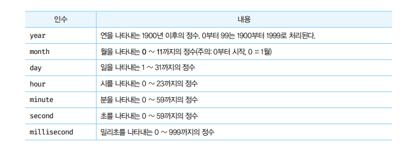
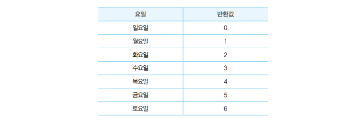

# Date 객체🎯💡🔥📌✅

- `표준 빌트인 객체`인 Date는 날짜와 시간을 위한 메서드를 제공하는 빌`트인 객체`이면서 `생성자 함수`이다.
- UTC는 `국체 표준시`를 말한다.
  - KST는 UTC에 `9시간`을 `더한 시간`이다.
  - 즉 KST는 UTC보다 `9시간`이 빠르다.

<br />
<br />
<br />

---

# Date 생성자 함수

- `Date`는 생성자 함수이다.
  - `Date`생성자 함수로 생성한 Date 객체는 내부적으로 날짜와 시간을 나타내는 `정수값`을 가진다.
- `모든 시간 시점`을 UTC 국제 표준시`(1970년 1월 1일 00:00:00)`를 기준으로 한다.
  - 하루는 `86,400,000(24h * 60m * 60s * 1000ms)ms`을 갖는다.
- Date 생성자 함수로 객체를 생성하는 `4가지`가 존재한다.

<br />
<br />
<br />

---

## 첫번째 new Date()

- Date 생성자 함수를 인수 없이 `new 연산자`와 함께 호출하면 `현재 날짜`와 `시간`을 가지는 `Date 객체`를 반환한다.
  - `Date`객체는 내부적으로 날짜와 시간을 나타내는 `정수값`을 갖지만, 출력하면 기본적으로 `날짜`와 `시간 정보`를 출력한다.
- Date 생성자 함수를 `new 연산자 없`이 호출하면 Date 객체를 반환하지 않고 날짜와 `시간을 나타내는 문자열`을 `반환`한다.

<br />

> 예시 코드

```js
console.log(new Date(), typeof new Date()); // Tue Jan 04 2022 22:43:51 GMT+0900 (한국 표준시) object
console.log(Date(), typeof Date()); // Tue Jan 04 2022 22:44:45 GMT+0900 (대한민국 표준시) string
```

<br />
<br />
<br />

---

## 두번째 new Date(dataString)

- Date 생성자 함수에 `날짜`와 `시간`을 나타내는 문자열을 `인수로 전달`
  - 전달한 문자열은 `Date.parse`에 의해 해석이 가능해야한다.
  - 지정된 `날짜`와 `시간`을 나타내는 `Date 객체`를 `반환`한다.

<br />

> 예시 코드

```js
console.log(new Date("Jan 01, 2022 13:00:00")); // Sat Jan 01 2022 13:00:00 GMT+0900 (한국 표준시)
console.log(new Date("2022/01/01/13:00:00")); // Sat Jan 01 2022 13:00:00 GMT+0900 (한국 표준시)
```

<br />
<br />
<br />

---

## 세번째 new Date(milliseconds)

- Date 생성자 함수에 `숫자 타입`의 밀리초를 `인수로 전달`
  - `(1970년 1월 1일 00:00:00)`UTC를 기점으로 인수로 전달된 밀리초만큼 경과한 `날짜`와 `시간`을 나타내는 `Date 객체`를 반환한다.

<br />

> 예시 코드

```js
console.log(new Date(0)); // Thu Jan 01 1970 09:00:00 GMT+0900 (한국 표준시)
console.log(new Date(86400000)); // Thu Jan 02 1970 09:00:00 GMT+0900 (한국 표준시)
```

<br />
<br />
<br />

---

## 네번째 new Date(year, month[,day, hour, minute, second, milliseconds])

- Date 생성자 함수에 연,월,일,시,분,초,밀리초를 의미하는 숫자를 `인수`로 `전달`
  - `년,월`은 `필수값`
  - 지정된 `날짜와 시간`을 나타내는 `Date 객체`를 `반환`한다.
    - 지정되지 않은 옵션은 `0` or `1`로 초기화 된다.
    - 

<br />

> 예시 코드

```js
console.log(new Date(2022, 1)); // Tue Feb 01 2022 00:00:00 GMT+0900 (한국 표준시)
console.log(new Date(2022, 1, 4, 22, 0, 0)); // Fri Feb 04 2022 22:00:00 GMT+0900 (한국 표준시)
```

<br />
<br />
<br />
<br />
<br />
<br />
<br />
<br />
<br />

---

# Date 메서드

<br />

```
📌 Date 객체의 다양한 `메서드`
```

<br />
<br />
<br />

## Date.now (Date 메서드 中 1)

- `(1970년 1월 1일 00:00:00)`을 기점으로 `현재 시간까지 경과한 밀리초`를 숫자로 반환

<br />

> 예제 코드

```js
const now = Date.now(); // 15939231232112
new Date(now); // Mon Jul 06 2020 02:52:19 GMT+0900(대한민국표준시)
```

<br />
<br />
<br />

## Date.PARSE (Date 메서드 中 1)

- `(1970년 1월 1일 00:00:00)`을 기점으로 인수로 전달된 지정시간(n`ew Date()의 인수와 동일한 형식`)까지의 밀리초를 `숫자로 반환`

<br />

> 예제 코드

```js
console.log(Date.parse("Jan 2, 1970 00:00:00 UTC")); // 8640000 (UTC 기준)
console.log(Date.parse("Jan 2, 1970 09:00:00")); // 8640000 (KST 기준)
console.log(Date.parse("1970/01/02/09:00:00")); // 8640000 (KST 기준)
```

<br />
<br />
<br />

## Date.UTC (Date 메서드 中 1)

- `(1970년 1월 1일 00:00:00)`즉 UTC을 지점으로 인수로 전달된 지정 시간까지의 `밀리초를 숫자`로 `반환`한다.
- 인수는 `new Date(year, month[, day, hour, minute, second, millisecond])`와 같은 형식이어야 한다.

<br />

> 예제 코드

```js
console.log(Date.UTC(1970, 0, 2)); // 86400000
console.log(Date.UTC("1970/1/2")); // NaN
```

<br />
<br />
<br />

## Date.prototype.getFullYear (Date 프로토타입 메서드 中 1)

- Date 객체의 `연도`를 나타내는 정수를 반환한다.

<br />

> 예제 코드

```js
console.log(new Date("2022/01/04").getFullYear()); // 2022
```

<br />
<br />
<br />

## Date.prototype.setFullYear (Date 프로토타입 메서드 中 1)

- Date 객체에 연도를 나타내는 `정수를 설정`한다.
  - 연도 이외에 옵션으로 `월,일`도 `설정이 가능`한다.

<br />

> 예제 코드

```js
const today = new Date();

today.setFullYear(2022);
console.log(today.getFullYear()); // 2022

today.setFullYear(2021, 1, 14);
console.log(today.getFullYear()); // 2021
```

<br />
<br />
<br />

## Date.prototype.getMonth (Date 프로토타입 메서드 中 1)

- Date 객체에서 월을 나타내는 `0~11`의 정수를 반환한다.
  - `1월 = 0 , 12월 11`

<br />

> 예제 코드

```js
console.log(new Date("2022/01/04").getMonth()); // 0 (즉, 실제는 1월)
```

<br />
<br />
<br />

## Date.prototype.setMonth (Date 프로토타입 메서드 中 1)

- Date 객체에 월을 나타내는 `0~11`의 정수를 설정한다.
  - 월 이외에 `일(day)`도 설정가능하다.

<br />

> 예제 코드

```js
const today = new Date();

today.setMonth(3);
console.log(today.getMonth()); // 3 (실제는 4월)

today.setMonth(5, 1);
console.log(today.getMonth()); // 5 (실제는 6월)
```

<br />
<br />
<br />

## Date.prototype.getDate (Date 프로토타입 메서드 中 1)

- Date 객체의 날짜 `1~31`를 나타내는 정수를 반환한다.

<br />

> 예제 코드

```js
console.log(new Date("2022/01/04").getDate()); // 4
```

<br />
<br />
<br />

## Date.prototype.setDate (Date 프로토타입 메서드 中 1)

- Date 객체에 날짜 `1~31`를 나타내는 `정수를 설정`한다.

<br />

> 예제 코드

```js
const today = new Date();

today.setDate(30);
console.log(today.getDate()); // 30
```

<br />
<br />
<br />

## Date.prototype.getDay (Date 프로토타입 메서드 中 1)

- Date 객체의 요일`(0~6)`을 나타내는 정수를 반환한다.
- 반환값은 다음사진과 같다.
  - 

<br />

> 예제 코드

```js
console.log(new Date("2022/01/04").getDay()); // 2 (화요일)
```

<br />
<br />
<br />

## Date.prototype.getHours (Date 프로토타입 메서드 中 1)

- Date 객체의 시간`(0~23)`을 나타내는 정수를 반환한다.

<br />

> 예제 코드

```js
// 시간 명시하지 않을 경우 -> default 는 모두 0
console.log(new Date("2022/01/04").getHours()); // 0

// 시간 명시
console.log(new Date("2022/01/04/23:00").getHours()); // 23
```

<br />
<br />
<br />

## Date.prototype.setHours (Date 프로토타입 메서드 中 1)

- Date 객체의 시간`(0~23)`을 나타내는 정수를 `설정`한다.
  - `분,초,밀리초`도 설정이 가능하다.

<br />

> 예제 코드

```js
const today = new Date();

today.setHours(23);
console.log(today.getHours()); // 23

today.setHours(0, 0, 0, 0); // 시,분,초,밀리초 순
console.log(today.getHours()); // 0
```

<br />
<br />
<br />

## Date.prototype.getMinutes (Date 프로토타입 메서드 中 1)

- Date 객체의 분`(0~59)`을 나타내는 정수를 `반환`한다.

<br />

> 예제 코드

```js
console.log(new Date("2022/01/04/12:34:56").getMinutes()); // 34
```

<br />
<br />
<br />

## Date.prototype.setMinutes (Date 프로토타입 메서드 中 1)

- Date 객체의 분`(0~59)`을 나타내는 정수를 `설정`한다.
  - 이외에 `초,밀리초 설정가능`

<br />

> 예제 코드

```js
const today = new Date();

today.setMinutes(34);
console.log(today.getMinutes()); // 34

today.setMinutes(34, 0); // 분,초,밀리초 순
console.log(today.getMinutes()); // 34
```

<br />
<br />
<br />

## Date.prototype.getSeconds (Date 프로토타입 메서드 中 1)

- Date 객체의 초`(0~59)`을 나타내는 정수를 `반환`한다.

<br />

> 예제 코드

```js
console.log(new Date("2022/01/04/12:34:56").getSeconds()); // 56
```

<br />
<br />
<br />

## Date.prototype.setSeconds (Date 프로토타입 메서드 中 1)

- Date 객체의 초(0 ~ 59)를 나타내는 정수를 설정

<br />

> 예제 코드

```js
const today = new Date();

today.setSeconds(56);
console.log(today.getSeconds()); // 56

today.setSeconds(56, 0); // 초,밀리초 순
console.log(today.getSeconds()); // 56
```

<br />
<br />
<br />

## Date.prototype.getMilliseconds (Date 프로토타입 메서드 中 1)

- Date 객체의 밀리초(0 ~ 999)를 나타내는 정수를 반환
  <br />

> 예제 코드

```js
console.log(new Date("2022/01/04/12:34:56:789").getMilliseconds()); // 789
```

<br />
<br />
<br />

## Date.prototype.setMilliseconds (Date 프로토타입 메서드 中 1)

- Date 객체의 밀리초(0 ~ 999)를 나타내는 정수를 설정

  <br />

> 예제 코드

```js
const today = new Date();

today.setMilliseconds(789);
console.log(today.getMilliseconds()); // 789
```

<br />
<br />
<br />

## Date.prototype.setTime (Date 프로토타입 메서드 中 1)

- UTC를 기점으로 경과된 밀리초를 설정

  <br />

> 예제 코드

```js
const today = new Date();

today.setTime(86400000);
console.log(today.getTime(), today); // 86400000 Fri Jan 02 1970 09:00:00 GMT+0900 (한국 표준시)
```

<br />
<br />
<br />

## Date.prototype.getTimezoneOffset (Date 프로토타입 메서드 中 1)

- UTC와 Date 객체에 지정된 로컬 시간과의 차이를 분 단위로 반환
- UTC = KST - 9h

<br />

> 예제 코드

```js
const today = new Date();

console.log(today.getTimezoneOffset() / 60); // -9 (UTC = KST - 9h 를 의미)
```

<br />
<br />
<br />

## Date.prototype.toDateString 메서드 (Date 프로토타입 메서드 中 1)

- 사람이 읽을 수 있는 형식의 문자열로 Date 객체의 날짜를 반환

<br />

> 예제 코드

```js
const today = new Date("2022/01/04/23:12");

console.log(today.toString()); // Tue Jan 04 2022 23:12:00 GMT+0900 (대한민국 표준시)
console.log(today.toDateString()); // Tue Jan 04 2022
```

<br />
<br />
<br />

## Date.prototype.toTimeString 메서드 (Date 프로토타입 메서드 中 1)

- 사람이 읽을 수 있는 형식의 문자열로 Date 객체의 시간을 반환

<br />

> 예제 코드

```js
const today = new Date("2022/01/04/23:12");

console.log(today.toString()); // Tue Jan 04 2022 23:12:00 GMT+0900 (대한민국 표준시)
console.log(today.toTimeString()); // 23:12:00 GMT+0900 (대한민국 표준시)
```

<br />
<br />
<br />

## Date.prototype.toISOString 메서드 (Date 프로토타입 메서드 中 1)

- ISO형식(YYYY-MM-DDTHH:MM:SS.SSSZ)으로 Date 객체의 날짜와 시간을 표현한 문자열을 반환

<br />

> 예제 코드

```js
const today = new Date("2022/01/04/23:12");

console.log(today.toString()); // Tue Jan 04 2022 23:12:00 GMT+0900 (대한민국 표준시)
console.log(today.toISOString()); // 2022-01-04T14:12:00.000Z
```

<br />
<br />
<br />

## Date.prototype.toLocaleString 메서드 (Date 프로토타입 메서드 中 1)

- 인수로 전달한 로컬을 기준으로 Date 객체의 날짜와 시간을 표현한 문자열을 반환
- 인수를 생략한 경우, 브라우저가 동작 중인 시스템의 로컬을 적용

<br />

> 예제 코드

```js
const today = new Date("2022/01/04/23:12");

console.log(today.toString()); // Tue Jan 04 2022 23:12:00 GMT+0900 (대한민국 표준시)
console.log(today.toLocaleString()); // 2022. 1. 4. 오후 11:12:00
console.log(today.toLocaleString("ko-KR")); // 2022. 1. 4. 오후 11:12:00
console.log(today.toLocaleString("en-US")); // 1/4/2022, 11:12:00 PM
console.log(today.toLocaleString("ja-JP")); // 2022/1/4 23:12:00
```

<br />
<br />
<br />

## Date.prototype.toLocaleTimeString 메서드 (Date 프로토타입 메서드 中 1)

- 인수로 전달한 로컬을 기준으로 Date 객체의 시간을 표현한 문자열을 반환
- 인수 생략시, 브라우저가 동작 중인 시스템의 로컬을 적용

<br />

> 예제 코드

```js
const today = new Date("2022/01/04/23:12");

console.log(today.toString()); // Tue Jan 04 2022 23:12:00 GMT+0900 (대한민국 표준시)
console.log(today.toLocaleTimeString()); // 오후 11:12:00
console.log(today.toLocaleTimeString("ko-KR")); // 오후 11:12:00
console.log(today.toLocaleTimeString("en-US")); // 11:12:00 PM
console.log(today.toLocaleTimeString("ja-JP")); // 23:12:00
```

<br />
<br />
<br />

---

# Date를 활용한 시계 예제 코드

- 현재 날짜와 시간을 초 단위로 반복 출력하는 예제

<br />

> 예제코드

```js
// 시계 만들기
(function printNow() {
  // 시계 인스턴스 생성
  const today = new Date();

  const dayNames = [
    "(일요일)",
    "(월요일)",
    "(화요일)",
    "(수요일)",
    "(목요일)",
    "(금요일)",
    "(토요일)",
  ];

  const day = dayNames[today.getDay()];

  const year = today.getFullYear();
  const month = today.getMonth() + 1;
  const date = today.getDate();
  let hour = today.getHours();
  let minute = today.getMinutes();
  let second = today.getSeconds();

  const ampm = hour >= 12 ? "PM" : "AM";

  // 12시간제로 변경
  hour %= 12;
  hour = hour || 12; // hour 0인 경우 12를 재할당

  // 10 미만인 분,초 2자리로 변경
  minute = minute < 10 ? "0" + minute : minute;
  second = second < 10 ? "0" + second : second;

  const now = `${year}년 ${month}월 ${date}일 ${day} ${hour}:${minute}:${second} ${ampm}`;

  console.log(now);

  setTimeout(printNow, 1000); // 1초마다 타이머 함수 재귀호출
})();
```
