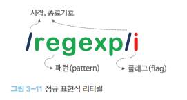

# 정규식 🎯💡🔥📌✅

- 일정한 패턴을 가진 문자열의 집합을 표현하기 위해 사용하는 `형식 언어 `이다.
  - `대부분의 프로그래밍 언어에서 사용 가능하다.`
- 정규 표현식은 문자열을 대상으로 패턴 매칭 기능을 제공한다.
  - `패턴 매칭 기능이란?` 특정 패턴과 `일치하는 문자열을 검색`하거나 `추출` 또는 `치환` 할 수 있는 기능을 말한다.
- `정규 표현식`을 사용하면 반복문과 조건문없이 `패턴을 정의`하고 `테스트하는 것`으로 간단히 체크할 수 있다.

<br />
<br />
<br />

---

# 정규 표현식의 생성

- 정규 표현식 객체를 생성하기 위해서는 `정규 표현식 리터럴`과 `RegExp 생성자` 2가지 방법 존재
- 일반적으로 정규 표현식 리터럴을 사용한다.
  - 정규 표현식은 리터럴은 패턴과 플래그로 구성되어 있다.
  - 

<br />

> 정규 표현식 예제 (1) 객체 표현식 리터럴 사용

```js
const target = "Is this all there is?";
// 패턴 is
// 플래그 : i => x대소문자 구별X
const regexp = /is/i;
// test 메서드는 target문자열에 대해 정규 표현식 regexp의 패턴을 검색해서 매칭 결과를 불리언값으로 반환한다.
regexp.test(target);
```

<br />

> 정규 표현식 예제 (2) `RegExp 생성자` 사용

```js
const target = "Is this all there is?";
const regexp = new RegExp(/is/i);
regexp.test(target);
```

<br />
<br />
<br />

---

# RegExp 메서드

<br />

<br />

## RegExp.prototype.exec (RegExp 메서드 中 1)

- 인수로 전달받은 문자열에 대해 `정규 표현식의 패턴`을 `검색`하여 매칭 결과를 `배열`로 반환한다.
- 매칭 결과가 없을 경우 `배열`로 반환한다.
  - 문자열내 모든 패턴 검색 = `g 플래그`를 지정해도 `첫 번째 매칭 결과만` 반환한다.
    <br />

> 예제 코드

```js
const target = "Is this all there is?";
const regExp = /is/;

console.log(regExp.exec(target)); // [ 'is', index: 5, input: 'Is this all there is?', groups: undefined ]
```

<br />
<br />
<br />

## RegExp.prototype.test (RegExp 메서드 中 1)

- 인수로 전달 받은 문자열에 대해 정규 표현식의 패턴을 `검색`하여 매칭 `결과를 불리언 값`으로 반환한다.

> 예제 코드

```js
const target = "Is this all there is?";
const regExp = /is/;

console.log(regExp.test(target)); // true
```

<br />
<br />
<br />

## String.prototype.match (String 메서드 中 1)

- `String 표준 빌트인 객체에서 제공하는 메서드`
- 대상 문자열과 인수로 전달 받은 정규 표현식과의 매칭 결과를 `배열로 반환`한다.
  - 문자열내 모든 패턴 검색 = `g 플래그`를 지정하면 `모든 매칭 결과를 반환`한다.

> 예제 코드

```js
const target = "Is this all there is?";
const regExp = /is/g;

console.log(target.match(regExp)); // ["is","is"]
```

<br />
<br />
<br />

---

# RegExp 플래그

- 플래그란 정규 표현식의 검색 방식을 설정하기 위해서 사용한다.
  - 플래그는 옵션이므로 선택적 사용 가능
  - 순서와 상관없이 `하나 이상의 플래그를 동시에 사용 가능`
  - 
- 플래그는 6개가 있다. 아래 표 참고(자주 쓰이는 3가지)

<br />

| 플래그 | 의미        | 설명                                                       |
| ------ | ----------- | ---------------------------------------------------------- |
| i      | Ignore case | 대소문자를 구분하지 않고 패턴을 검사                       |
| g      | Global      | 대상 문자열 내에서 패턴과 일치하는 모든 문자열을 전역 검색 |
| m      | Multi line  | 문자열이 행이 바뀌더라도 패턴 검색을 계속한다.             |

<br />
<br />
<br />
<br />

---

# RegExp 패턴

- 정규 표현식은 (`패턴 + 플래그`)로 구성된다.
- `패턴` : 문자열의 `일정한 규칙을 표현`하기 위해 사용

  - 패턴은 `/`로 열고 닫는다. `따옴표`는 생략한다.
  - 따옴표를 포함하면 따옴표까지 패턴에 포함되어 검색된다.

 <br />

- `플래그` : 정규표현식의 `검색 방식`을 설정하기 위해 사용

<br />
<br />

---

## 문자열 검색

```
🔥 정규 표현식의 패턴에 문자 또는 문자열을 지정하면 검색 대상 문자열에서 패턴으로 지정한 문자 또는 문자열을 검색
🔥 i 플래그 :  대소문자를 구분하지 않고 검색
🔥 g 플래그 :  검색 대상 문자열 내에서 패턴과 매치되는 모든 문자열을 전역 검색
```

<br />

> 예제 코드

```js
const target = "Is this all there is?";

// 문자열 검색 + i 플래그
console.log(target.match(/is/i).l); // [ 'Is', index: 0, input: 'Is this all there is?', groups: undefined ]

// 문자열 검색 + g 플래그
console.log(target.match(/is/g)); // [ 'is', 'is' ]

// 문자열 검색 + i 플래그 + g 플래그
console.log(target.match(/is/gi)); // [ 'Is', 'is', 'is' ]
```

<br />
<br />

## 임의의 문자열 검색

- `.`은 임의의 `문자 한 개`를 의미한다.
- 문자의 내용은 무엇이든 상관 없다.
- 띄어쓰기도 포함

<br />

> 예제 코드

```js
const target = "Is this all there is?";
const regExp = /.../g; // ... 즉, . 하나당 문자 하나를 의미하므로 총 3개의 문자열을 하나로 패턴으로 모든 문자열 반환

console.log(target.match(regExp)); // ["Is ", "thi", "s a", "ll ", "the", "re ", "is?"];
```

<br />
<br />

## 반복 검색

- {m,n}은 앞선 패턴이 `최소 m번`, `최대 n번` `반복되는 문자열`을 의미한다.
  - `콤마 뒤에 공백이 있다면 정상 동작하지 않는다.`

<br />

```
🔥 {n} : 앞선 패턴이 n번 반복되는 문자열을 의미 ( = {n,n} )

🔥 {n,} : 앞선 패턴이 최소 n번 반복되는 문자열을 의미

🔥 + : 앞선 패턴이 최소 한번 이상 반복되는 문자열을 의미 ( = {1,n} )

🔥 ? : 앞선 패턴이 최대 한 번(0번 포함) 이상 반복되는 문자열을 의미 ( = {0,1} )
```

<br />

> 예제 코드

```js
const target = "A AA B BB Aa Bb AAA";

// A로 최소 1개 ~ 최대 2개 반복되는 문자열 모두를 반환
console.log(target.match(/A{1,2}/g)); // [ 'A', 'AA', 'A', 'AA', 'A' ]

// A로 최소 1개 ~ 최대 1개 반복되는 문자열
console.log(target.match(/A{1}/g)); // ["A", "A", "A", "A", "A", "A", "A"]

// A로 최소 2개 ~ 반복되는 문자열
console.log(target.match(/A{2,}/g)); //  [ 'AA', 'AAA' ]

// A가 최소 한 번 이상 반복되는 문자열을 반환
console.log(target.match(/A+/g)); // [ 'A', 'AA', 'A', 'AAA' ]

const otherTarget = "color colour";
// u가 최대 한 번(0번 포함) 반복되는 문자열을 반환
console.log(otherTarget.match(/colou?r/g)); //  [ 'color', 'colour' ]
```

<br />
<br />

## OR 검색

- `| : or 의 의미를 갖는다.`
  - `+` 와 함께 사용하면 분해되지 않은 단어 레벨로 검색
  - `[ ] 내의 문자는 or로 동작`
    - 뒤에 + 까지 붙이면 앞선 패턴을 한 번 이상 반복
  - ` ` 내에 `-` 를 사용하면 `범위를 지정하는 의미`
  - `\d` : 숫자를 의미
  - `\D`: \d와 정반대, 즉 숫자를 제외한 모든 문자를 의미
  - `\w` : 알파벳, 숫자, 언더스코어를 의미
  - `\W` : \w와 정반대, 즉 알파벳, 숫자, 언더스코어를 제외한 모든 문자를 의미

<br />

> 예제 코드

```js
const target = "A AA B BB Aa 12,345 Bb AAA _#!$";

// A 또는 B를 전역 검색
console.log(target.match(/A|B/g)); // ["A", "A", "A", "B", "B", "B", "A", "B", "A", "A", "A"]

// A 또는 B로 시작하는 문자열을 단어 레벨로 전역 검색
console.log(target.match(/A+|B+/g)); // ["A", "AA", "B", "BB", "A", "B", "AAA"]

// 위의 예제와 같은 의미
console.log(target.match(/[AB]+/g)); // ["A", "AA", "B", "BB", "A", "B", "AAA"]

// 범위 지정
console.log(target.match(/[A-Z]+/g)); // ["A", "AA", "B", "BB", "A", "B", "AAA"]

// 대소문자 구별하지 않고 알파벳 검사
console.log(target.match(/[A-Za-z]+/g)); // ["A", "AA", "B", "BB", "Aa", "Bb", "AAA"]

// 숫자를 검색
console.log(target.match(/[0-9]+/g)); // [ '12', '345' ]

// 숫자를 검색
console.log(target.match(/[\d]+/g)); // [ '12', '345' ]

// 숫자를 제외하고 블록 단위로 검색
console.log(target.match(/[\D]+/g)); // [ 'A AA B BB Aa ', ',', ' Bb AAA _#!$' ]

// 알파벳, 숫자, 언더스코어 검색
console.log(target.match(/[\w]+/g)); // ["A", "AA", "B", "BB", "Aa", "12", "345", "Bb", "AAA", "_"]

// 알파벳, 숫자, 언더스코어 제외하고 검색
console.log(target.match(/[\W]+/g)); // [" ", " ", " ", " ", " ", ",", " ", " ", " ", "#!$"]
```

<br />
<br />

## NOT 검색

- `[^0-9]`는 숫자를 제외한 문자를 의미한다
- `[ ]`안에 `^`은 `not`를 의미한다.

<br />

> 예제 코드

```js
const target = "AA BB 12 Aa Bb";

console.log(target.match(/[^0-9]+/g)); // [ 'AA BB ', ' Aa Bb' ]
```

<br />
<br />

## 시작 위치로 검색

- `[ ]` 밖의 `^`은 `문자열의 시작`을 의미한다.
- `[ ]` 외에 다른 곳에서 사용하면 `문자열의 시작`을 의미

<br />

> 예제 코드

```js
const target = "http://google.com";

console.log(/^https/.test(target)); // false
console.log(/^http/.test(target)); // true
```

<br />
<br />

## 마지막 위치로 검색

- `$`은 `문자열의 마지막`을 의미한다.

<br />

> 예제 코드

```js
const target = "http://google.com";

console.log(/com$/.test(target)); // true
console.log(/org$/.test(target)); // false
```

<br />
<br />
<br />

---

# 자주 사용하는 정규 표현식

<br />
<br />

## 1. 특정 단어로 시작하는 검사하는 코드

<br />

> 예제 코드

```js
// url 프로토콜 검사
const http = "http://example.com";
const https = "https://example.com";
const testUrl = "httpss://example.com";

const regExp = /^https?:\/\//;

console.log(regExp.test(http)); // true
console.log(regExp.test(https)); // true
console.log(regExp.test(testUrl)); // false
```

<br />
<br />

## 2. 특정 단어로 끝나는 지 검사하는 코드

<br />

> 예제 코드

```js
const fileName1 = "index.html";
const fileName2 = "index.js";

const regExp = /html$/;

console.log(regExp.test(fileName1)); // true
console.log(regExp.test(fileName2)); // false
```

<br />
<br />

## 3. 숫자로만 이루워진 문자열인지 검사하는 코드

<br />

> 예제 코드

```js
const target = "12345";
const regExp = /^\d+$/;

console.log(regExp.test(target)); // true
```

<br />
<br />

## 4. 하나 이상의 공백으로 시작하는지 검사하는 코드

<br />

> 예제 코드

```js
const targets = [" Hi!", "Hi! ", "Hi!"];
const regExp = /^[\s]+/;

targets.forEach((target) => console.log(regExp.test(target)));
// " Hi!" => true
// "Hi! " => false
// "Hi!"  => false
```

<br />
<br />

## 5. 아이디로 사용 가능한지 검사하는 코드

<br />

> 예제 코드

```js
const userIds = ["id123", "id123$", "id_123", "id1234123400"];
const regExp = /^[A-Za-z0-9]{4,10}$/;

userIds.forEach((userId) => console.log(regExp.test(userId)));
// id123        => true
// id123$       => false
// id_123       => false
// id1234123400 => false
```

<br />
<br />

## 6. 아이디로 사용 가능한지 검사하는 코드

<br />

> 예제 코드

```js
const userIds = ["id123", "id123$", "id_123", "id1234123400"];
const regExp = /^[A-Za-z0-9]{4,10}$/;

userIds.forEach((userId) => console.log(regExp.test(userId)));
// id123        => true
// id123$       => false
// id_123       => false
// id1234123400 => false
```

<br />
<br />

## 7. 메일 주소 형식에 맞는지 검사하는 코드

<br />

> 예제 코드

```js
const emails = [
  "email@email.com",
  "email#email.com",
  "email@email.hack",
  "em<sricpt>@email.com",
];
const regExp =
  /^[0-9a-zA-Z]([-_\.]?[0-9a-zA-Z])*@[0-9a-zA-Z]([-_\.]?[0-9a-zA-Z])*\.[a-zA-z]{2,3}$/;

emails.forEach((email) => console.log(regExp.test(email)));
// email@email.com      => true
// email#email.com      => false
// email@email.hack     => false
// em<sricpt>@email.com => false
```

<br />
<br />

## 8. 핸드폰 번호 형식에 맞는지 검사하는 코드

<br />

> 예제 코드

```js
const phoneNumbers = [
  "010-1234-5678",
  "02-1234-5678",
  "032-123-4567",
  "02-123-4567",
  "010:1234:5678",
];

phoneNumbers.forEach((phoneNumber) => {
  console.log(/^\d{2,3}-\d{3,4}-\d{4}$/.test(phoneNumber));
});
// 010-1234-5678 => true
// 02-1234-5678  => true
// 032-123-4567  => true
// 02-123-4567   => true
// 010:1234:5678 => false
```

<br />
<br />

## 9. 특수 문자 포함 여부 검사하는 코드

<br />

> 예제 코드

```js
const target1 = "abc<123";

console.log(/[^A-Za-z0-9]/gi.test(target1)); // true

// 특수 문자 확인 시 제거하기 ( accessor method, 원본 데이터 변경 X )
console.log(target1.replace(/[^A-Za-z0-9]/gi, "")); // abc123
console.log(target1); // true
```
