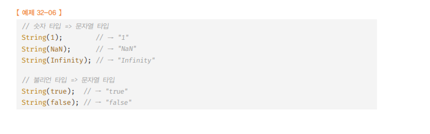
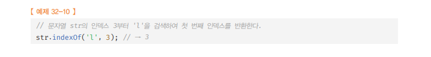
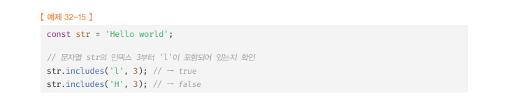
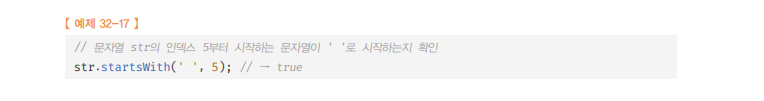
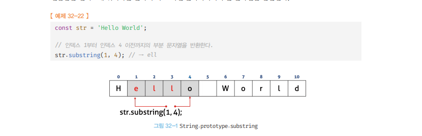
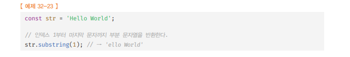

# String 🎯💡🔥📌✅

- 표준 빌트인 객체인 `String`은 원시타입 문자열을 다룰 때 유용한 `프로퍼티`와 `메서드`를 제공한다.

<br />
<br />
<br />

---

# String 생성자 함수

- 표준 빌트인 객체인 String 객체는 `생성자 함수`이다.
  - 따라서 `new 연산자`와 함께 호출 해야 한다.
- String 생성자 함수에 인수를 전달하지 않고, new 연산자와 호출 시 `[[StringData]]` 내부 슬롯에 `빈문자열`을 할당한 `String 래퍼 객체`를 생성한다.
- 반대로, String 생성자 함수의 인수로 문자열을 전달하면서 new 연산자와 함께 호출 시 인수로 전달 받은 문자열을 `[[StringData]]` 내부 슬롯에 `래퍼 객체로 생성`
- new 연산자를 사용하지 않고 String 생성자를 호출하면 String 인스턴스가 아닌 문자열을 반환한다( 명시적 타입 변환에도 사용 됨 )
  - 

<br />

```JS
💡 String 래퍼 객체는 배열과 마찬가지로 length 프로퍼티를 가지며, 유사 배열이면서 이터러블이다.

//문자열은 원시값이기 때문에 변경할 수 없다. 에러 발생XX
래퍼객체[0] = "S"
```

  <br />

> 예제 코드 문자열 전달 X

```js
const strObj = new string();
console.log(strObj); //String {length:0, [[StringData]]:""}
```

  <br />

> 예제 코드 문자열 전달 O

```js
const strObj = new String("KIM");
console.log(Object.getOwnPropertyDescriptors(strObj));
// {
//   '0': { value: 'K', writable: false, enumerable: true, configurable: false },
//   '1': { value: 'I', writable: false, enumerable: true, configurable: false },
//   '2': { value: 'M', writable: false, enumerable: true, configurable:
// }
```

<br />
<br />

---

# String 여러 메서드

- String 객체에는 원본 String 래퍼 객체를 `직접 변경하는 메서드는 없다.`
  - 문자열은 변경 불가능한 `원시값`이기 때문에 `String 래퍼 객체`도 `읽기 전용` 객체로 제공됨
- String 객체의 모든 메서드는 String `래퍼 객체를 직접 변경 불가능`
- String 객체의 메서드는 `언제나 새로운 문자열을 생성`해서 반환 한다.

<br />

> 예제 코드

```js
const strObj = new String("kim");
console.log(Object.getOwnPropertyDescriptors(strObj));
// {
//   '0': { value: 'k', writable: false, enumerable: true, configurable: false },
//   '1': { value: 'i', writable: false, enumerable: true, configurable: false },
//   '2': { value: 'm', writable: false, enumerable: true, configurable: false },
// }
```

<br />
<br />
<br />

## String.prototype.indexOf (String 메서드 中)

- 인수로 전달받은 `문자열을 검색`해서 첫번째 문자열을 반환한다.
  - 검색 실패시 `-1`
  - `index.of 메서드의 2번째 인수로 검색을 시작할 인덱스 전달 가능`
  - 
- 대상 문자열에 특정 문자열이 존재하는지 확인할 때 유용하다.

```js
const str = "Hello World";

console.log(str.indexOf("l")); // 2

// 2개 이상 문자열 검색 가능
console.log(str.indexOf("or")); // 7

// 존재하지 않는 문자열 검색
console.log(str.indexOf("z")); // -1

// 6번째 인덱스부터 검색
console.log(str.indexOf("l", 6)); // 9

// ES6 includes 메서드 => 가독성 증가
console.log(str.includes("l")); // true
```

<br />
<br />
<br />

## String.prototype.search (String 메서드 中)

- 인수로 전달받은 `정규표현식`과 `매치`하는 문자열을 검색하여 일치하는 문자열 `인덱스를 반환`
  - 검색 실패 시 `-1`

<br />

> 예시 코드

```js
const str = "Hello World";

console.log(str.search(/o/)); // 4
console.log(str.search(/z/)); // -1
```

<br />
<br />
<br />

## String.prototype.includes (String 메서드 中)

- 문자열에 인수로 전달받은 `문자열이 포함` 되어있는지 확인 후 `boolean으로 반환`
- 메서드의 2번째 인수로 `검색을 시작할 인덱스 전달` 가능
  - 

<br />

> 예시 코드

```js
const str = "Hello World";

console.log(str.includes("World")); // true
console.log(str.includes("")); // true
console.log(str.includes("z")); // false
console.log(str.includes()); // false
```

<br />
<br />
<br />

## String.prototype.startsWith (String 메서드 中)

- 대상 문자열이 인수로 전달받은 `문자열로 시작`하는지 확인 후 `boolean 반환`
- 메서드의 2번째 인수로 `검색을 시작할 인덱스 전달` 가능
  - 

<br />

> 예시 코드

```js
const str = "Hello World";

console.log(str.startsWith("Hell")); // true
console.log(str.startsWith("")); // true
console.log(str.startsWith("z")); // false
console.log(str.startsWith()); // false
```

<br />
<br />
<br />

## String.prototype.endsWith (String 메서드 中)

- 대상 문자열이 인수로 전달받은 `문자열로 끝나는지` 확인 후 `boolean 반환`
  - 메서드의 2번째 인수로 `검색할 문자열의 길이` 전달 가능

<br />

> 예시 코드

```js
const str = "Hello World";

console.log(str.endsWith("rld")); // true
console.log(str.endsWith("")); // true
console.log(str.endsWith("z")); // false
console.log(str.endsWith()); // false
```

<br />
<br />
<br />

## String.prototype.charAt (String 메서드 中)

- 대상 문자열에서 인수로 `전달받은 인덱스에 위치한 문자`를 검색해서 ``한다.
  - 인덱스의 문자열 범위 : `0 ~ (문자열 길이-1)`
  - 인덱스가 문자열의 범위를 벗어 났을 때 : `빈 문자열 반환`

<br />

> 예시 코드

```js
const str = "Hello World";

console.log(str.charAt(4)); // o
console.log(str.charAt(0)); // H
console.log(str.charAt(-1)); //
console.log(str.charAt(1000)); //
```

<br />
<br />
<br />

## String.prototype.substring (String 메서드 中)

- 대상 문자열에서 첫 번째 인수로 전달받은 인덱스 -> 두 번째 인수로 전달받은 인덱스에 위치하는 `문자의 바로 이전까지`의 `문자열 반환`
- 

<br />

- 두 번째 인수는 생략 가능

  - 

- `전달하는 인수에 대해 다음과 같은 특징이 존재`
  - 첫 번째 인수 > 두 번째 인수 : `두 인수는 교환`
  - 인수 < 0 or NaN : `0으로 취급`
  - 인수 > 전체 문자열 길이 : `인수는 전체 문자열 길이로 취급`

<br />
<br />
<br />

## String.prototype.slice (String 메서드 中)

- `substring`메서드와 동일하게 동작함
- `slice`는 음수인 인수를 전달 가능하다.
  - `음수인 인수를 전달`하면 대상 문자열의 `가장 뒤에서 부터 시작`하여 문자열을 `잘라내어 반환`한다.

<br />

> 예시 코드

```js
const str = "hello world";

//substring slice 메서드와 동일하게 작동
//0번째 부터 5번째 이전 문자까지 잘라내어 반환
str.substring(0, 5); // 'hello'
str.slice(0, 5); // 'hello'

//인수 < 0 or NaN인 경우 0으로 취급한다
str.substring(-5); // 'hello world'
//slice 메서드는 음수인 인수를 전달할 수 있다. 뒤에서 5자기를 잘라내어 반환한다.
str.slice(-5); // 'world'
```

<br />
<br />
<br />

## String.prototype.toUpperCase (String 메서드 中)

- 대상 문자열을 모두 대문자로 변경해서 반환

<br />

> 예시 코드

```js
const str = "Hello World";

console.log(str.toUpperCase()); // HELLO WORLD
```

<br />
<br />
<br />

## String.prototype.toLowerCase (String 메서드 中)

- 대상 문자열을 모두 `소문자로 변경해서 반환`

<br />

> 예시 코드

```js
const str = "Hello World";

console.log(str.toLowerCase()); // hello world
```

<br />
<br />
<br />

## String.prototype.trim (String 메서드 中)

- 대상 문자열 `앞뒤`에 `공백문자`가 있을 겨우 이를 `제거 후 문자열 반환`

<br />

> 예시 코드

```js
const str = "   Hello World          ";

console.log(str.trim()); // Hello World
console.log(str.trimRight()); //    Hello World
console.log(str.trimLeft()); // Hello World
console.log(str.trimStart()); // Hello World
console.log(str.trimEnd()); //   Hello World
```

<br />
<br />
<br />

## String.prototype.repeat (String 메서드 中)

- 인수로 전달받은 `정수만큼 반복해` 연결한 새로운 문자열을 반환한다.
  - `인수 0` : 빈문자열 반환
  - `인수 < 0` : RangeError 발생
  - `인수 생략` : 기본값 0 이 된다.

<br />

> 예시 코드

```js
const str = "Hello ";

console.log(str.repeat()); //
console.log(str.repeat(2)); // Hello Hello
console.log(str.repeat(0)); //
console.log(str.repeat(2.5)); // Hello Hello
console.log(str.repeat(-2)); // RangeError: Invalid count value
```

<br />
<br />
<br />

## String.prototype.replace (String 메서드 中)

- 첫번째 인수로 전달 받은 `문자열` or `정규표현식`을 검색하여 `두 번째 전달한 문자열로 치환`
  - 여러 문자열이 존재할 경우 `첫번째로 검색된 문자열만 치환`된다.

<br />

> 예제 코드

```js
const str = "Hello World";

console.log(str.replace("World", "word")); // Hello word
console.log(str.replace(/^hello/i, "Hell")); // Hell World
```

<br />

- 두번째 인수로 `치환 함수` 전달 가능하다
- 매치되어 치환된 결과를 두 번째 인수로 전달한 치환 함수의 인수로 전달하면서 호출하고 치환 함수가 반환한 결과와 매치 결과를 치환

<br />

> 예제 코드

```js
// String.prototype.replace 치환 함수 적용 예

// 카멜 케이스 -> 스네이크 케이스로
function camelToSnake(camelCase) {
  return camelCase.replace(/.[A-Z]/g, (match) => {
    console.log(match); // oW
    return match[0] + "_" + match[1].toLowerCase();
  });
}

const camelCase = "helloWorld";
console.log(camelToSnake(camelCase)); // helloWorld

// 스네이크 케이스 -> 카멜 케이스로
function snakeToCamel(snakeCase) {
  return snakeCase.replace(/_[a-z]/g, (match) => {
    console.log(match); // _w
    return match[1].toUpperCase();
  });
}

const snakeCase = "hello_world";
console.log(snakeToCamel(snakeCase)); // hello_world
```

<br />
<br />
<br />

## String.prototype.split (String 메서드 中)

- 첫 번째 인수로 전달한 `문자열` or `정규 표현식`을 검색해서 문자열을 구분한 후 `분리된 각 문자열로 이루어진 배열`을 `반환`한다.
  - `빈문자열 전달` : 문자를 모두 분리
  - `인수를 생략` : 대상 문자열 전체를 단일 요소로 하는 배열 반환
  - `두 번째 인수`로 `배열의 길이를 지정`할 수 있다. 배열의 길이가 길면 잘림
    - 

<br />

> 예제 코드

```js
const str = "How are you doing?";

console.log(str.split(" ")); // [ 'How', 'are', 'you', 'doing?' ]
console.log(str.split(/\s/)); // [ 'How', 'are', 'you', 'doing?' ]
console.log(str.split("")); // ["H", "o", "w", " ", "a", "r", "e", " ", "y", "o", "u", " ", "d", "o", "i", "n", "g", "?"]
console.log(str.split()); // [ 'How are you doing?' ]
```

<br />
<br />
<br />
<br />
<br />
<br />
<br />
<br />

---

---

# Symbol 🎯💡🔥📌✅

- 변경 불가능한 원시 타입의 값
- 다른 값과 중복되지 않는 유일 무의한 값
- 이름의 충돌 위험이 없는 유일한 프로퍼티 키를 만들기 위해 사용

<br />
<br />
<br />

---

# Symbol값의 생성

- 생성자 함수가 아니기 때문에 new 사용 시 : `TypeError 발생`
- Symbol 함수를 호출해서 생성한다. (`리터럴 표기법으로 생성 불가능`)

  - 이때 생성된 Symbol 값은 외부로 노출되지 않아` 확인 할 수 없고`, 다른 값과 중복되지 않는 `유일무이한 값`이다.

  <br />

> 예시 코드 (Symbol 값 확안 불가)

```js
// 심벌 값 생성 - Symbol 함수
const symbol = Symbol();
console.log(typeof symbol); // symbol

// 심벌 값은 외부로 노출되지 않아 확인 불가
console.log(symbol); // Symbol()
```

  <br />

- Symbol 함수에는 선택적으로 `문자열 인수 전달 가능`
  - `설명(디버깅) 용도로만 활용`되며, Symbol 함수에 전달된 인수가 같더라도
    Symbol은 항상 유일무이한 값이다.

> 예시 코드 (Symbol 함수에 문자 전달)

```js
const symbol1 = Symbol("symbol1");
const symbol2 = Symbol("symbol1");

console.log(symbol1 === symbol2); // false
console.log(symbol1.description === symbol2.description); // true
console.log(symbol1, symbol2); // Symbol(symbol1) Symbol(symbol1)
```

  <br />

- Symbol값도 객체 처럼`(.)` 접근 시 암묵적으로 `래퍼 객체` 생성한다.

> 예시 코드 (Symbol 래퍼 객체)

```js
const mySymbol = Symbol("mySymbol");

// 심벌 값도 객체처럼 사용 시 래퍼 객체를 생성
console.log(mySymbol.description); // mySymbol
console.log(mySymbol.toString()); // Symbol(mySymbol)
```

  <br />

- Symbol값은 암묵적으로 숫자 타입, 문자열로 변환되지 않는다.
  - `boolean`으로는 암묵적 타입 변환된다.

> 예시 코드 (Symbol 암묵적 타입 변환)

```js
const mySymbol = Symbol();

console.log(!!mySymbol); // true
console.log(mySymbol + ""); // TypeError: Cannot convert a Symbol value to a string
```

  <br />
    <br />

---

# Symbol.for / Symbol.keyfor 메서드

```
💡 인수로 전달받은 문자열을 키로 사용하여 { 키 : 심벌 값 }의 쌍들이 저장되어 있는 전역 심벌 레지스트리에서 해당 키와 일치하는 심벌 값을 검색

💡 Symbol.keyFor 메서드를 사용해서 전역 심벌 레지스트리에 저장된 심벌 값의 키를 추출할 수 있다.
```

- 인수로 전달 받은 문자열을 키로 사용하여 키와 심벌 값의 쌍들이 저장되어 있는 `전역 심벌 레지스트리`에서 `해당 키와 일치하는 심벌값` 검색한다.

  - 검색 성공 : `검색된 심벌 값 반환`한다.
  - 검색 실패 : `새로운 심벌 값을 생성` 후 Symbol.for 메서드의 인수로 전달된 키로 `전역 심벌 레지스트리에 저장` 된 후 , `생성된 심벌값 반환`

  <br />
  <br />

- `Symbol.for` 메서드를 사용하면 전역에서 유일무이한 심벌 값을 단 하나만 생성하여 전역 심벌 레지스트리를 통해 공유 가능

> 예제 코드 Symbol.for

```js
const symbol1 = Symbol.for("symbol");
const symbol2 = Symbol.for("symbol");

// 상단에서 symbol 이름의 심벌 값을 symbol1 생성시 이미 전역 심벌 레지스트리에 등록했다.
// symbol2 에서 Symbol.for 호출할 경우, 이미 전역 심벌 레지스트리에는 symbol 이라는 이름을 키로 가지는 심벌 값이 존재한다.
// 따라서, symbol1 과 symbol2 에 할당된 심벌 값은 같은 심벌 값이다.
console.log(symbol1 === symbol2); // true
```

  <br />

- `Symbol.keyfor` 메서드를 사용하면 전역 심벌 레지스트리에 저장된 심벌 값의 키를 추출 가능 하다.
  > 예제 코드 Symbol.keyfor

```js
// Symbol.for 메서드롤 생성된 심벌 값은 전역 심벌 레지스트리에 존재하지 않을 경우 생성 후 등록되어 관리된다.
const symbol1 = Symbol.for("symbol1");
console.log(Symbol.keyFor(symbol1)); // symbol1

// Symbol 함수로 생성한 심벌 값은 전역 심벌 레지스트리에 등록되어 관리되지 않는다.
const symbol2 = Symbol("symbol2");
console.log(Symbol.keyFor(symbol2)); // undefined
```

<br />
<br />
<br />

---

# Symbol 과 상수

- 값에는 특별한 의미가 없고 상수 이름 자체에 의미가 있는 경우
  - 다른 변수 값과 `중복`될 수 도 있다.
- `변경/중복`될 가능성 있는 `무의미한 상수`
  - 중복될 가능성이 없는 유일무이한 `심벌 값을 사용`하는 것이 좋음

<br />

> 예제 코드

```js
// { 키: 값(상수) } 형태로 4방향을 의미하는 Direction 객체
// 1,2,3,4 라는 상수는 특별한 의미도 없고, 이후 다른 변수에 값과 중복될 가능성이 크다.
const Direction = {
  UP: 1,
  DOWN: 2,
  LEFT: 3,
  RIGHT: 4,
};

// { 키 : 값(심벌 값) } 형태로 변경한 Direction 객체
// 키의 값들이 심벌 값으로, 중복될 가능성이 없는 상수 값이 되었다.
const Direction = {
  UP: Symbol("up"),
  DOWN: Symbol("down"),
  LEFT: Symbol("left"),
  RIGHT: Symbol("right"),
};
```

<br />
<br />
<br />

---

# Symbol과 프로퍼티 키

- `유일 무의한 프로퍼티 키값 생성가능`
  - `for...in`, `Objects.keys` 메서드로 찾을 수 없어서 프로퍼티를 `은닉`할 수 있다.
- 객체의 프로퍼티 키는 빈 문자열을 포함하는 `모든 문자열` 또는 `심벌 값`으로 만들 수 있다.
  - 심벌 값을 프로퍼티 키로 사용하려면 프로퍼티 키로 사용할 심벌 값에 `대괄호`를 사용 해야 한다.

<br />

> 예제코드

```js
// 심벌은 유일무이한 값으로 심벌 값으로 프로퍼티 키를 만들면 다른 프로퍼티 키와 절대 충돌하지 않는다.
const obj = {
  [Symbol.for("mySymbol")]: 1,
};
obj[Symbol.for("mySymbol")];
```

<br />
<br />
<br />

---

# Symbol 과 빌트인 객체 확장

```
💡 일반적으로 표준 빌트인 객체에 사용자 정의 메서드를 직접 추가하는 것은 권장하지 않는다. (미래의 표준 사양 메서드와 중복될 수 있기 때문)

💡 하지만, 중복될 가능성이 없는 심벌 값으로 프로퍼티 키 값을 생성하여 객체를 확장하면 어떤 프로퍼티 키와도 충돌하지 않기 때문에 안전하게 확장이 가능하다.
```

<br />

```js
// Array 표준 빌트인 객체에 메서드를 추가하여 확장하는 것 => 권장 X
Array.prototype.sum = function () {
  return this.reduce((acc, cur) => acc + cur, 0);
}[(1, 2, 3)].sum(); // 6

// 심벌 값으로 프로퍼티 키를 갖는 메서드로 확장하는 경우 => 호환성 측면에서 O
Array.prototype[Symbol.for("sum")] = function () {
  return this.reduce((acc, cur) => acc + cur, 0);
}[
  // 단, 호출 시에 어색한 상황이 연출
  (1, 2, 3)
][Symbol.for("sum")](); // 6
```

<br />
<br />
<br />

---

# Well-known Symbol

<br />

```
💡 자바스크립트가 기본 제공하는 빌트인 심벌 값을 ECMAScript 사양에서는 Well-known Symbol 이라 부른다. (자바스크립트 내부 알고리즘에 사용됨)
```

- `for - of` 문으로 순회 가능한 이터러블은 `Well-known Symbol` 인 `Symbol.iterator`를 키로 갖는 메서드를 가진다.
  - `Symbol.iterator 메서드를 호출 → 이터레이터를 반환 ( 이터레이션 프로토콜 )`
- 만약, 일반 객체를 이터러블처럼 동작하도록 구현하고 싶다면 이터레이션 프로토콜을 따르면 된다.
  - 즉, Symbol.iterator 를 키로 갖는 메서드를 객체에 추가하고 이터레이터를 반환하도록 구현하면, 그 객체를 이터러블이 된다.

> 예제 코드

```js
const iterable = {
  // Symbol.itertor 메서드를 구현하여 이터러블 프로토콜을 준수
  [Symbol.iterator]() {
    let cur = 1;
    const max = 5;

    // Symbol.iterator 메서드는 next 메서드를 소유한 이터레이터를 반환해야 한다.
    return {
      next() {
        return { value: cur++, done: cur > max + 1 };
      },
    };
  },
};

for (const num of iterable) {
  console.log(num); // 1 2 3 4 5
}
```
