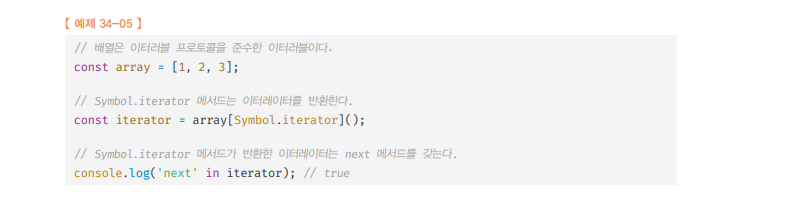
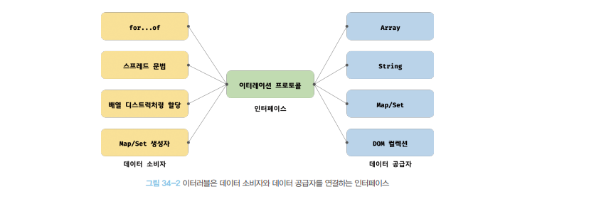

# 이터레이션 프로토콜 🎯💡🔥📌✅

- `순회 가능한 자료구조`를 만들기 위해 ECMAScript 사양에 미리 약속한 `규칙`이다.
- ES6에서는 순회 가능한 데이터 컬렉션을 이터레이션 프로토콜을 준수하는 `이터러블로 통일`
- `for - of문`, `스프레드 문법`, `배열 디스트럭`처링 할당의 대상으로 사용할 수 있도록 `일원화`했다.
- 이터레이션 프로토콜에는 `이터러블 프로토콜`과 `이터레이션 프로토콜`이 존재
  - 사진은 이터레이션 프로토콜 예시
  - <br />

<br />

```
💡 이터러블 프로토콜
- Well-known Symbol 인 `Symbol.iterator` 를 프로퍼티 키로 사용한 메서드를 직접 구현
- 프로토타입 체인을 통해 상속 받은 `Symbol.iterator` 메서드를 호출하면 이터레이터 프로토콜을 준수한 이터레이터를 반환
- 이터러블 프로토콜을 준수한 객체를 이터러블이라 한다.
- 이터러블은 for - of문, 스프트레드 문법, 배열 디스트럭처링 할당 문법을 사용 가능


💡 이터레이션 프로토콜
- 이터레이터는 next 메서드를 소유
- next 메서드를 호출하면 이터러블을 순회하며 value 와 done 프로퍼티를 갖는 이터레이터 리절트 객체를 반환
- 이터레이터 프로토콜을 준수한 객체를 이터레이터라 한다.
- 이터레이터는 이터러블의 요소를 탐색하기 위한 포인터 역할
```

<br />
<br />
<br />

---

# 이터러블

- 이터러블 : `Symbol.iterator`를 `프로퍼티 키로 사용한 메서드를 직접` 구현하거나 프로토타입 체인을 통해 `상속받은 객체`
- 이터러블인지 확인 하는 함수

```js
// 이터러블 확인 함수
// v가 비어있지 않고 Symbol.iterator 메서드 프로퍼티를 가지고 있는 이터러블인지 확인
const isIterable = (v) =>
  v !== null && typeof v[Symbol.iterator] === "function";

console.log(isIterable([])); // true
console.log(isIterable("")); // true
console.log(isIterable(new Map())); // true
console.log(isIterable(new Set())); // true
console.log(isIterable({})); // false (일반 객체는 기본적으로 이터러블 X)
// 일반 객체는 Symbol.iterator 메서드를 직접 구현하지 않거나 상속 받지 않기 때문에 이터러블이 아니다.
// for of 같은 이터러블이 제공하는 기능을 사용하지 못한다.
```

<br />

- 일반 객체는 `이터러블이 아니다`.
  - 이터러블이 제공하는 기능을 사용 못함
    - for of문 사용 시 : `TypeError : obj is not iterable`
    - (2021년도 기준) : 일반 객체도 `스프레드 문법은 사용 가능`

> 일반 객체 이터러블 제공 기능 사용 예제

```js
const obj = { a: 1, b: 2 };

console.log(Symbol.iterator in obj); // false

for (const iter of obj) {
  console.log(iter); // TypeError: obj is not iterable
}

// (2021년도 기준) : 일반 객체도 `스프레드 문법은 사용 가능`
const obj = { a: 1, b: 2 };
const { a, b } = { ...obj };
console.log(a, b); // 1 2
```

<br />

- 배열 : `Array.prototype`의 `Symbol.iterator` 메서드를 상속받은 `이터러블`이다.
  - 따라서 배열은 `for - of`, `스프레드 문법`, `배열 디스트럭처링` 할당 `사용 가능`

> 배열의 for of, 스프레드 문법, 디스트럭처링 사용 예제

```js
const array = [1, 2, 3];

//배열은 `Symbol.iterator` 상속 받은 이터러블이다.
console.log(Symbol.iterator in array); // true
// 배열은 이터러블이고, for of 사용가능(1)
for (const item of array) {
  console.log(item);
}
// 이터러블인 배열은 스프레드 문법의 대상으로 사용가능
console.log([...array]); //[1,2,3]
// 이터러블인 배열은 디스트럭처링 사용 가능
const [a, ...rest] = array;
console.log(a.rest); // 1, [rest]
```

<br />
<br />
<br />

---

# 이터레이터

- `Symbol.iterator 메서드를 호출`하면 이터레이터 프로토콜을 준수한 `이터레이터`를 `반환`한다.

  - 
  - 이 `이터레이터`는 next 메서드를 갖는다.
  - `next 메서드`는 이터러블의 각 요소를 순회하기 위한 `포인터` 역할
  - `next 메서드`호출 시 이터러블을 `순차적으로 한 단계씩 순회`하며 `순회결과`를 나타내는 `이터레이터 리적트 객체`를 반환

- `이터레이터의 next 메서드` : 2가지 반환값
  - `value 프로퍼티` : 현재 순회중인 이터러블값
  - `done 프로퍼티` : 이터러블 순회 완료 여부

<br />

> 이터레이터의 next 메서드 예제

```js
const array = [1, 2, 3];
const iterator = array[Symbol.iterator]();

console.log("next" in iterator); // true

console.log(iterator.next()); // { value: 1, done: false }
console.log(iterator.next()); // { value: 2, done: false }
console.log(iterator.next()); // { value: 3, done: false }
console.log(iterator.next()); // { value: undefined, done: true }
```

<br />
<br />
<br />

---

# 빌트인 이터러블

```
✅ 자바스크립트는 이터레이션 프로토콜을 준수한 객체인 빌트인 이터러블을 제공한다
```

<br />

| 빌트인 이터러블 | Symbol.iterator 메서드                |
| --------------- | ------------------------------------- |
| Array           | Array.prototype[Symbol.iterator]      |
| String          | String.prototype[Symbol.iterator]     |
| Map             | Map.prototype[Symbol.iterator]        |
| Set             | Set.prototype[Symbol.iterator]        |
| TypedArray      | TypedArray.prototype[Symbol.iterator] |
| arguments       | arguments.prototype[Symbol.iterator]  |
| DOM 컬렉션      | NodeList.prototype[Symbol.iterator]   |

<br />
<br />
<br />

---

# for - of 문

- `for ...of`문은 이터러블을 순회하면서 `이터러블의 요소`를 `변수`에 `할당`한다.

<br />

> `for ...of` || `for ...in` 차이점

```
📌 for (변수선언문 of 이터러블){...}
- 이터러블만 사용 가능
- for ... of은 내부적으로 next 메서드를 호출해 이터러블을 순회해서 next 메서드가 반환한 이터레이터 리절트 객체의 value 프로퍼티값을 for ...of 문의 변수에 할당한다.
- 이터레이터 리절트 객체의 done 프로퍼티 값이 true가 되면 순회를 중단한다.

📌 for (변수선언문 in 객체){...}
- 객체면 사용 가능
- 프로토타입 체인 상에 존재하는 모든 프로퍼티 중에 프로퍼티 어트리뷰트[[Enumerable]] 값이 true 인 프로퍼티를 순회하며 열거한다.
- 심벌인 프로퍼티는 열거하지 않는다.
```

<br />

> `for ...of` 사용 예시

```js
// for문으로 구현한 for - of문
// 이터러블
const iterable = [1, 2, 3];

// 이터러블[Symbol.iterator] 메서드 호출 -> 이터레이터 생성
const iterator = iterable[Symbol.iterator]();

for (;;) {
  const res = iterator.next();

  if (res.done) break;

  const item = res.value;
  console.log(item); // 1 2 3
}
```

<br />
<br />
<br />

---

# 이터러블 유사 배열 객체

```
💡 유사 배열 객체
- 유사 배열 객체는 일반 객체로 이터러블이 아님(for of 사용 불가능)
- length 프로퍼티를 갖기 때문에 for문 순회가능
- 배열 처럼 인덱스로 프로퍼티 값에 접근 가능
- 원시값이라서 값 변경 불가능
```

<br />

> 위 예시 코드

```js
// 임의의 유사 배열 객체
let arrayLike = {
  0: 1,
  1: 2,
  2: 3,
  length: 3,
};

for (const item of arrayLike) {
  console.log(arrayLike[item]); // TypeError: arrayLike is not iterable
}

arrayLike = Array.from(arrayLike);
console.log(arrayLike); // [1, 2, 3]
for (const el of arrayLike) {
  console.log(el); // 1, 2, 3
}
```

<br />
<br />
<br />

---

# 이터러블 프로토콜의 필요성

- `이터러블`은 for - of 문, 스프레드 문법, 배열 디스트럭처링 할당과 같은 데이터 소비자에 의해 사용되므로 `데이터 공급자의 역할`을 한다고 할 수 있다.
- 다양한 데이터 공급자가 각자의 순회 방식을 갖는다면 데이터 소비자 입장에서는 다양한 데이터 공급자의 순회 방식을 모두 지원해야 한다.
- 하지만, `데이터 공급자`가 `이터레이션 프로토콜`을 준수하도록 규정하면 데이터 소비자는 이터레이션 프로토콜만 지원하도록 구현하면 된다.

  - 데이터 소비자는 `Symbol.iterator` 메서드를 호출해 `이터레이터`를 생성
  - next 메서드를 호출하여 이터러블 순회하며, `이터레이터 리절트 객체`를 반환
  - 이터레이터 리절트 객체의 `value/done` 프로퍼티 값을 취득하는 프로세스

  ```
  💡 이터레이션 프로토콜은 다양한 데이터 공급자가 하나의 순회 방식을 갖도록 규정하여 데이터 소비자가 효율적으로 다양한 데이터 공급자를 사용할 수 있도록 데이터 소비자와 데이터 공급자를 연결하는 인터페이스 이다.
  ```

  <br />



<br />
<br />
<br />

---

# 사용자 정의 이터러블

- 일반 객체도 `이터레이션 프로토콜을 준수`하도록 구현하면 `사용자 정의 이터러블`이 됨
  1. Symbol.iterator 메서드를 구현하고 Symbol.iterator 메서드가 `next 메서드를 갖는 이터레이터를 반환`하도록 한다.
  2. next 메서드는 done 과 value 프로퍼티를 가지는 `이터레이터 리절트 객체를 반환`

<br />

> 사용자 정의 이터러블 예제 피보나치 수열

```js
// "피보나치 수열"을 통한 이터러블 예제
// 사용자 정의 이터러블 구현
const fibo = {
  // Symbol.iterator 메서드를 직접 구현하여 이터러블 프로토콜을 준수
  [Symbol.iterator]() {
    let [pre, cur] = [0, 1];
    const max = 10;

    // Symbol.iterator 메서드는 next 메서드를 소유한 이터레이터를 반환해야 한다.
    return {
      next() {
        [pre, cur] = [cur, pre + cur];
        // 이터레이터 리절트 객체를 반환
        return { value: cur, done: cur >= max };
      },
    };
  },
};

for (const num of fibo) {
  console.log(num); // 1 2 3 5 8
}
```

<br />
<br />

## `이터러블을 생성하는 함수` 매개변수 전달 예시

```js
// "피보나치 수열"을 통한 이터러블 예제
// 사용자 정의 이터러블 -> 이터러블을 생성하는 함수
const fibo = (max) => {
  let [pre, cur] = [0, 1];

  // Symbol.iterator 메서드를 구현한 이터러블 반환
  return {
    [Symbol.iterator]() {
      return {
        next() {
          [pre, cur] = [cur, pre + cur];
          return { value: cur, done: cur >= max };
        },
      };
    },
  };
};

for (const num of fibo(15)) {
  console.log(num); // 1 2 3 5 8 13
}
```

<br />
<br />

## 이터러블이면서 이터레이터인 객체를 생성하는 함수

```js
const fibo = (max) => {
  let [pre, cur] = [0, 1];

  // Symbol.iterator 메서드를 구현한 이터러블 반환
  return {
    [Symbol.iterator]() {
      return {
        next() {
          [pre, cur] = [cur, pre + cur];
          return { value: cur, done: cur >= max };
        },
      };
    },
  };
};

const iterable = fibo(5); // 이터러블 반환
const iterator = iterable[Symbol.iterator](); // 이터레이터 반환

while (true) {
  let next = iterator.next();

  if (next.done) break;

  console.log(next.value); // 1 2 3
}

//이터러블이면서 이터레이터인 객체를 생성하면 Symbol.iterator 메서드를 호출하지 않아도 된다.

const fibo = function (max) {
  let [pre, cur] = [0, 1];

  // Symbol.iterator 메서드와 next 메서드를 소유한 이터러블이면서 이터레이터인 객체를 반환
  return {
    [Symbol.iterator]() {
      return this;
    },
    next() {
      [pre, cur] = [cur, pre + cur];
      return { value: cur, done: cur >= max };
    },
  };
};

let iter = fibo(10); // 이터러블이면서 이터레이터

for (const num of iter) {
  console.log(num); // 1 2 3 5 8
}

iter = fibo(10); // 이터러블 재할당으로 초기화 됨
while (true) {
  let next = iter.next();

  if (next.done) break;

  console.log(next.value); // 1 2 3 5 8
}
```

<br />
<br />

## 무한 이터러블과 지연 평가

- `이터러블` : `지연평가`를 통해 `데이터를 생성`한다.

```
📌 배열이나 문자열등은 모든 데이터를 메모리에 미리 확보한 다음 데이터를 공급한다.

📌 지연 평가 : 데이터가 필요한 시점 전까지는 미리 데이터를 생성X , 데이터가 필요한 시점에 데이터를 생성하는 기법
, 즉 평가 결과가 필요할 때 까지 평가를 늦추는 기법이다.

📌 지연 평가를 사용하면, 불필요한 데이터를 미리 생성하지 않고, 데이터가 필요한 순간에 생성하므로 빠를 실행 속도를 기대할 수 있다.
```
