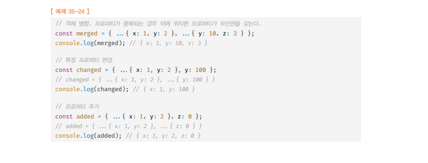

# 스프레드 문법 🎯💡🔥📌✅

- 스프레드 문법`(...)`은 뭉쳐 있는 여러 값들의 집합을 펼쳐서 `개별적인 값들의 목록`으로 만든다.
- `유사 배열`은 스프레드 문법을 사용할 수 없다.
  - `Array.from`은 유사 배열 객체, `이터러블`을 인수로 받아 `배열로 변환`한다.
- 스프레드 문법 사용 대상
  - `Array`
  - `String`
  - `Map/Set`
  - `DOM 컬렉션(NodeList,HTMLCollection)`
  - `이터러블`

<br />

> 사용 예시

```js
// ...[1,2,3]은 [1,2,3]을 개별 요소로 분리한다 ->1,2,3
console.log(...[1, 2, 3]); // 1 2 3
// 문자열은 리터러블이다
console.log(..."Hello"); // H e l l o
//Map Set은 이터러블이다.
console.log(
  ...new Map([
    ["a", "1"],
    ["b", "2"],
  ])
); //  ['a' ,'1'] ['b','2']
```

```
💡 스프레드 문법의 결과는 값이 아니라 값들의 목록이다!
💡 ...이 피연산자를 연산하여 값을 생성하는 연산자가 아니며, 스프레드 문법의 결과는 변수에 할당할 수 없다.

💡 보통 함수 호출문의 인수 목록 , 배열 리터럴의 요소 목록 , 객체 리터럴의 프로퍼티 목록에 사용
```

<br />

> 스프레드 문법의 결과는 값이 아님

```js
const list = ...[1,2,3]; // SyntaxError
```

<br />
<br />
<br />

---

# (...) 함수 호출 문의 인수 목록에서 사용하는 경우

- 대표적으로 Math.max 메서드가 있다.
  - Math.max 메서드는 `가변 인자 함수`로 전달 받은 인수 중 가장 큰 정수 반환
  - 요소들의 집합인 `배열을 펼쳐서` 개별적인 값들의 `목록`으로 만든 후 이를 함수의 인수 목록으로 전달해야함

<br />

```js
//X스프레드 문법 사용X
const arr = [1, 2, 3];
const max = Math.max(arr); //NaN

//O스프레드 문법 사용O
const arr = [1, 2, 3];
//Math.max (...[1,2,3])은 Math.max(1,2,3)과 같음
const max = Math.max(...arr);
```

<br />

- Rest 파라미터와 스프레드 문법은 정반대의 개념이다.
  - `Rest 파라리터` : 함수에 전달된 인수들의 목록을 배열로 전달 받기 위해 사용
  - `스프레드 문법` : 하나로 뭉친 값을 개별적인 목록으로 만들기 위해 사용

<br />
<br />
<br />

---

# (...) 배열 내부에서 사용하는 경우

## 두개의 배열 결합 하기

- ES5 `concat` 메서드 VS ES6 `스프레드`

```js
// ES5 `concat` 메서드 사용
var arr = [1, 2].concat([3, 4]);
console.log(arr); //[1,2,3,4]
// ES6 ... 스프레드 문법 사용
const arr = [...[1, 2], ...[3, 4]];
console.log(arr); //[1,2,3,4]
```

<br />

## 배열의 중간에 다른 배열 요소 추가 or 제거

- ES5 `splice` + `apply` 메서드 VS ES6 `splice` + `스프레드`

```js
const arr1 = [1, 4];
const arr2 = [2, 3];

// ES5 배열 삭제 후 추가 (by. splice + apply + concat 메서드)
Array.prototype.splice.apply(arr1, [1, 0].concat(arr2));
console.log(arr1); // [ 1, 2, 3, 4 ]

// ES6부터 삭제 후 추가 (by. splice 메서드 + 스프레드 문법)
arr1.splice(1, 0, ...arr2);
console.log(arr1); // [ 1, 2, 3, 4 ]
```

<br />

## 배열 복사 하기

- ES5 `slice` 메서드 VS ES6 `스프레드`
- ES5 `slice` 메서드 , ES6 `스프레드` 둘 다 `얕은 복사`하여 새로운 복사본을 만든다.

<br />

```
💡 얕은 복사 : 객체의 참조값(메모리 주소값)을 복사
💡 깊은 복사 : 객체의 실제값을 복사 (원본과 복사된 객체는 메모리 주소 다름)
```

```js
const arr = [1, 2, 3, 4];

// ES5 배열 복사 (by. slice 메서드)
let dup = arr.slice();
console.log(dup); // [ 1, 2, 3, 4 ]

// ES6 배열 복사 (by. 스프레드 문법)
dup = [...arr];
console.log(dup); // [ 1, 2, 3, 4 ]
console.log(dup === arr); // false
```

<br />

## 이터러블을 배열로 변환

- ES5 에서는 apply , call 메서드 + slice를 사용
- ES6 에서는 스프레드 문법 or 파라미터
  - 단, 이터러블 한정 가능

<br />

> ES5 에서는 apply , call 메서드 + slice를 사용 예시

```js
function sum() {
  // ES5에서 이터러블 -> 배열로 변환
  const args = Array.prototype.slice.call(arguments);

  return args.reduce((acc, cur) => acc + cur, 0);
}

console.log(sum(1, 2, 3)); // 6
```

<br />

> ES6 스프레드 문법 or Rest 파라미터 사용 예시

```js
function sum() {
  // arguments 객체는 이터러블이면서 유사 배열 객체 -> 스프레드 문법 가능
  return [...arguments].reduce((acc, cur) => acc + cur, 0);
}

console.log(sum(1, 2, 3)); // 6
// 유사배열은 스프레드 문법을 사용할 수 없다
const arrayLike = {
  0: 1,
  1: 2,
  2: 3,
  length: 3,
};
const arr = [...arrayLike]; // TypeError: object is not iterable (cannot read property Symbol(Symbol.iterator))
```

<br />
<br />
<br />

---

# (...) 객체 리터럴의 프로퍼티 목록에서 스프레드 문법

- 스프레드 문법은 원래 일반 객체에서 사용할 수 없지만, 2021년 기준으로 `일반 객체에서도 스프레드 문법의 사용이 허용되었다.`

<br />

> 일반 객체에서 스프레드 문법 사용 예시

```js
const obj = { x: 1, y: 2 };

// 객체 복사 (얕은 복사)
const copy = { ...obj };
console.log(copy); // { x: 1, y: 2 }
console.log(obj === copy); // false

// 객체 병합
const merged = { ...obj, ...{ a: 3, b: 4 } };
console.log(merged); // { x: 1, y: 2, a: 3, b: 4 }
```

- 스프레드 프로퍼티는 객체의 프로퍼티 변경, 추가를 간편하게 할 수 있다.
  - 

<br />
<br />
<br />

---

<br />
<br />
<br />
<br />
<br />
<br />
<br />
<br />
<br />
<br />

---

---

# 디스트럭처링 할당 🎯💡🔥📌✅

- `디스트럭처링 할당` : 구조화된 배열과 같은 `이터러블` or `객체`를 destructuring하여 `1개 이상의 변수에 개별적으로 할당`하는 것을 말한다.
- 배열의 디스트럭처링 할당은 각 요소를 추출하여, `1개 이상의 변수에 할당`
  - 디스트럭처링 할당의 대상(우변)은 `이터러블`이어야 하고, 할당 기준은 `배열의 인덱스` 이다.
  - 즉, 순서대로 할당함
- 배열 디스트럭처링 할당에서 변수의 개수와 이터러블의 요소 개수가 반드시 `일치할 필요는 없다.`
- 배열 디스트럭처링 할당을 위해 `변수에 기본값을 설정할 수 있다.`
- 이터러블에서 `필요한 요소만 추출하여 변수에 할당`하고 싶을 때 유용하게 사용
- 디스트럭처링 할당을 받을 변수에 `Rest 파라미터`를 `사용 가능`

<br />

> 디스트럭처링 사용 예시

```js
// 배열 (=이터러블)
const arr = [1, 2, 3];
//디스트럭처링 할당 순서대로
const [one, two, thee] = arr;

console.log(one, two, three); // 1 2 3
```

<br />

> 디스트럭처링 할당을 위해서 할당받을 변수는 배열 리터럴 형태로 선언 해야 함

```js
const [x, y] = [1, 2];
```

<br />

> 디스트럭처링 할당에서 이터러블을 할당하지 않으면 Error

```js
const [x,y]      // SyntaxError
const [a,b] = {} // TypeError
```

<br />

- 배열 디스트럭처링 할당에서 변수의 개수와 이터러블의 요소 개수가 반드시 `일치할 필요는 없다.`

```js
const arr = [1, 2, , 3];
// 선언한 디스트럭처링 할당 변수보다 배열의 요소 개수가 더 많음 ( 상관없음 )
const [one, two, three] = arr;

console.log(one, two, three); // 1 2 undefined

const [g, , h] = [1, 2, 3];
console.log(g, h); //1 3
```

<br />

- 배열 디스트럭처링 할당을 위해 변수에 기본값을 설정할 수 있다.

```js
const arr = [1, 2, 4];

// 디스트럭처링 할당 변수에 기본값 설정
// 우선 순위 = 기본값 설정 < 디스트럭처링 할당
const [one, two, three = 3] = arr;

console.log(one, two, three); // 1 2 4
```

<br />

- 이터러블에서 필요한 `요소만 추출`하여 `변수에 할당`하고 싶을 때 유용하게 사용
- URL을 파싱하여 protocol, host, path 프로퍼티를 갖는 객체를 생성해 반환한다.

```js
// URL 파싱 -> { protocol, host, path } 프로퍼티를 갖는 객체 생성 후 반환

function parseURL(url = "") {
  const parsedURL = url.match(/^(\w+):\/\/([^/]+)\/(.*)$/);
  console.log(parsedURL);
  // [
  //   'https://google.com/ko/javascript',
  //   'https',
  //   'google.com',
  //   'ko/javascript',
  //   index: 0,
  //   input: 'https://google.com/ko/javascript',
  //   groups: undefined
  // ]

  if (!parseURL) return {};

  const [, protocol, host, path] = parsedURL;
  return { protocol, host, path };
}

const parsedURL = parseURL("https://google.com/ko/javascript");
console.log(parsedURL); // { protocol: 'https', host: 'google.com', path: 'ko/javascript' }
```

<br />

- 디스트럭처링 할당을 받을 변수에 Rest 파라미터 사용 가능

```js
const [x, ...y] = [1, 2, 3];
console.log(x, y); // 1 [ 2, 3 ]
```

# 객체 디스트럭처링 할당 {}

```
🔥 프로퍼티 키 값과 디스트럭처링되는 변수의 이름이 같으면 디스트럭처링 할당이 된다.
🔥 객체 디스트럭처링 할당을 위해 할당 받는 변수는 객체 리터럴 형태로 선언해야한다
🔥 우변에 객체 or 객체로 평가 될 수 있는 표현식을 할당하지 않으면 에러가 발생한다.
🔥 객체의 프로퍼티 키로 필요한 프로퍼티 값만 추출하여 변수에 할당하고 싶을 때 유용하게 사용
```

<br />
<br />

- ES5에서의 객체의 각 프로퍼티를 객체로부터 디스트럭처링 하는 방법

```js
// ES5방법 예전
var user = { firstName: "kim", lastName: "Lee" };
var firstName = user.firstName;
var lastName = user.lastName;

console.log(firstName, lastName); // kim Lee
```

<br />
<br />
<br />

---

- ES6에서의 객체의 각 프로퍼티를 객체로부터 디스트럭처링 하는 방법
  - 할당 기준은 프로퍼티 키이다.
    - 즉, 순서는 의미가 없고, 선언된 변수 이름과 프로퍼티 키가 일치하면 할당된다.
    - 아래 예시 참고

```js
// ES6방법 현재
var user = { firstName: "kim", lastName: "Lee" };

//firstName,lastName을 선언하고 user 객체를 디스트럭처링하여 할당 한다.
//이때, 프로퍼티 키를 기준으로 디스트럭처링 할당이 이루어진다.
// 프로퍼티 키 값과 디스트럭처링되는 변수의 이름이 같으면 디스트럭처링 할당이 된다.
const { lastName, firstName } = user;
console.log(lastName, firstName); // Lee kim
```

<br />

- 할당받을 변수이름을 디스트럭처링 대상 객체의 프로퍼티 이름과 `다르게 하려면` 다음과 같이 변수를 선언

```js
const user = {
  firstName: "kim",
  lastName: "lee",
};

// 객체 디스트럭처링 할당 변수의 이름과 객체 프로퍼티 키 이름을 다르게 할당받고 싶을 경우
const { lastName: ln, firstName: fn } = user;
console.log(ln, fn); // kim lee
console.log(lastName, firstName); // ReferenceError: lastName is not defined
```

<br />

- 객체 디스트럭처링 할당은 객체에서 `프로퍼티 키`로 `필요한 값만 추출`하여 변수에 `할당`할 때 유용하다.

```js
const str = "string";
// String 래퍼 객체로 부터 length 프로퍼티를 추출해서 할당
const { length } = str;
console.log; // 5 (프로퍼티값 추출)

//다른 예제
const todo = { id: 1, content: "HTML", completed: true };
//todo 객체로 부터 id 프로퍼티만 추출한다
const { id } = todo;
console.log(id); // 1
```

<br />

- 객체 디스트럭처링 할당 `함수의 매개 변수`에도 활용 가능하다.

```js
//디스트럭처링 할당 매개 변수 예제
function printTodo({ content, completed }) {
  console.log(`할일 ${content}은 ${completed ? `완료` : `비완료`} 상태입니다`);
}
printTodo({ id: 1, content: "HTML", completed: true });
```

<br />

- 객체 디스트럭처링 할당을 위한 변수에 Rest 요소를 사용 가능

```js
// 객체 디스트럭처링 Rest 요소 적용
const { x, ...rest } = { x: 1, y: 2, z: 3 };

console.log(x, rest); // 1 { y: 2, z: 3 }
```
