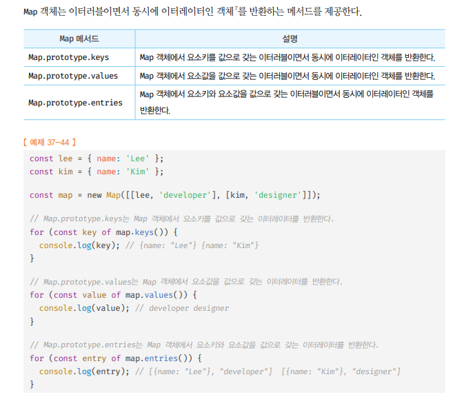

# Set 🎯💡🔥📌✅

- `Set` : Set 객체는 중복되지 않는 유일한 값들의 집합이다.
  - `Set`은 `수학적 집합`을 구현하기 위한 자료구조
    - `교집합`,`합집합`,`차집합`,`여집합` 구현가능
  - 배열과 유사하지만, 3가지의 차이가 있다.
  - `아래 표` 참고
    |구분|배열|Set 객체|
    |---|---|---|
    |동일한 값을 중복해서 포함할 수 있다.|O|X|
    |요소 순서에 의미가 있다.|O|X|
    |인덱스로 요소에 접근할 수 있다|O|X|

<br />
<br />

---

## Set 객체의 생성

- Set 객체는 Set 생성자 함수로 생성한다.
  - Set 생성자 함수는 이터러블을 전달 받아 `Set 객체`를 `생성`함
  - 이터러블의 중복된 값은 Set 객체에 저장되지 않는다.
    - 이를 이용해 배`열의 중복된 값`을 `제거`할 수 있다.

> 예시 코드

```js
const set = new Set();
console.log(set); // Set(0){}

//터러블의 중복된 값은 Set 객체에 저장되지 않는다.
const set1 = new Set([1, 2, 3, 3]);
console.log(set1); //Set(3){1,2,3}
const set2 = new Set("Javascript");
console.log(set2); // Set(9) { 'J', 'a', 'v', 's', 'c', 'r', 'i', 'p', 't' }

// 중복된 요소 제거 -> Set 객체
const uniq = (arr) => [...new Set(arr)];
console.log(uniq([2, 1, 2, 3, 4, 3, 4])); // [ 2, 1, 3, 4 ]
```

<br />
<br />
<br />

---

## Set 객체의 요소 개수 확인 size

- Set 객체의 요소 개수 확인 : `Set.prototype.size` 프로퍼티를 사용한다.
  - setter 함수없이 `getter 함수`만 존재하는 `접근자 프로퍼티`이다.
- 디스트럭처링 방식 사용

<br />

> 사용 예제

```js
const set1 = new Set([1, 2, 2, 3]);
console.log(set1.size); // 3

// size 접근자 프로퍼티는 setter 함수가 없어서 무시
set1.size = 10;
console.log(set1.size); // 3
```

<br />
<br />
<br />

---

## Set 객체의 요소 개수 확인 add

- `Set 객체`에 요소를 추가할 때 `Set.prototype.add` 메서드를 사용한다.
  - `add 메서드` : 새로운 요소가 추가된 `Set 객체`를 `반환`한다.
  - `add 메서드` : `연속적` 호출 가능
    - 중복된 요소의 추가는 허용 X
- `Set 객체`는 배열과 같이 자바스크립트의 `모든 값`을 요소로 `저장 가능`

<br />

> 사용 예시

```js
const set1 = new Set([1, 2, 2, 3]);
console.log(set1); // Set(3) { 1, 2, 3 }

set1.add(4).add(5);
console.log(set1); // Set(4) { 1, 2, 3, 4, 5 }
```

<br />

> 사용 예시

```js
const set = new Set();

// add 메서드 체이닝
set
  .add(1)
  .add("a")
  .add(true)
  .add(undefined)
  .add(null)
  .add({})
  .add([])
  .add(() => {});

console.log(set);
// Set(8) {
//   1,
//   'a',
//   true,
//   undefined,
//   null,
//   {},
//   [],
//   [Function (anonymous)]
// }
```

<br />
<br />
<br />

---

## Set 객체의 요소 존재 여부 확인 has

- `Set 객체에` 특정 요소가 존재하는지 확인 하려면 `Set.prototype.has` 메서드를 사용한다.
  - 특정 요소 존재 여부를 `boolean으로` 반환

<br />

> 사용 예시

```js
const set = new Set([1, 2, 3]);

console.log(set.has(3)); // true
console.log(set.has(4)); // false
```

<br />
<br />
<br />

---

## Set 객체의 요소 삭제 delete

- Set 객체의 특정 요소를 삭제하려면, `Set.prototype.delete` `메서드를 사용`한다.
  - 삭제 성공 여부를 `boolean으로 반환`
- 삭제 시 인덱스X , `요소값`을 `전달`해야 함
- `연속적 호출` 불가능

<br />

> 사용 예시

```js
const set = new Set([1, 2, 3]);

let result = set.delete(3);
console.log(set, result); // Set(2) { 1, 2 } true

result = set.delete(4);
console.log(set, result); // Set(2) { 1, 2 } false
```

<br />
<br />
<br />

---

## Set 객체의 모든 요소 삭제 clear

- Set 객체의 모든 요소를 `일괄 삭제할 때 사용`
  - 반환값 : 언제나 `undefined`

<br />

> 사용 예시

```js
const set = new Set([1, 2, 3]);

let result = set.clear();
console.log(set, result); // Set(0) {} undefined
```

<br />
<br />
<br />

---

## Set 객체의 요소 순회 forEach

`Set.prototype.forEach` 는 `Array.prototype.forEach` 메서드와 유사함

- `Set객체`는 순서에 의미가 없어 배열과 같이 `인덱스를 가지지 않는다.`

- `Set.prototype.forEach` : `첫번째,두번째 인수는 같다`
  - `첫번째 인수` : 현재 순회중인 값
  - `두번째 인수` : 현재 순회중인 값
  - `세번째 인수` : 현재 순회중인 Set 객체 자체

<br />

> 사용 예시

```js
const set = new Set([1, 2, 3]);

set.forEach((v1, v2, self) => console.log(v1, v2, self));
// 1 1 Set(3) { 1, 2, 3 }
// 2 2 Set(3) { 1, 2, 3 }
// 3 3 Set(3) { 1, 2, 3 }
```

- Set 객체는 `이터러블`이다.
  - 이터러블 이기 때문에 `for ...of`, `스프레드 문법`, `디스트럭처링 사용` 가능
  - `for ...of` : 순회하는 순서는 요소가 `추가된 순서`를 따른다.

<br />

> 사용 예시

```js
const set = new Set([1, 2, 3]);

// Set 객체가 이터러블 -> Symbol.iterator 프로퍼티가 존재하는지 확인
console.log(Symbol.iterator in set); // true

// Set 객체가 이터러블 -> for - of문 가능
for (const value of set) {
  console.log(value); // 1 2 3
}

// Set 객체가 이터러블 -> 스프레드 문법 가능
console.log([...set]); // [ 1, 2, 3 ]

// Set 객체가 이터러블 -> 배열 디스트럭처링 가능
const [a, ...rest] = set;
console.log(a, rest); // 1 [ 2, 3 ]
```

<br />
<br />
<br />

---

## Set 집합 구현 (교집합,합집합,차집합,부분집합 & 상위집합)

- 교집합 구현

```js
// Set 객체 프로토타입에 "교집합" 정의
Set.prototype.intersection = function (set) {
  const result = new Set();

  for (const val of set) {
    if (this.has(val)) result.add(val);
  }

  return result;
};

const setA = new Set([1, 2, 3, 4]);
const setB = new Set([2, 4]);

// setA 와 setB의 교집합
console.log(setA.intersection(setB)); // Set(2) { 2, 4 }
// setB 와 setA의 교집합
console.log(setB.intersection(setA)); // Set(2) { 2, 4 }
```

- (고차함수 + Set)교집합

```js
Set.prototype.intersection = function (set) {
  return new Set([...this].filter((v) => set.has(v)));
};

const setA = new Set([1, 2, 3, 4]);
const setB = new Set([2, 4]);

console.log(setA.intersection(setB)); // Set(2) { 2, 4 }
console.log(setB.intersection(setA)); // Set(2) { 2, 4 }
```

<br />
<br />

---

<br />

- 합집합 구현

```js
// Set 객체 프로토타입에 "합집합" 정의
Set.prototype.union = function (set) {
  const result = new Set(this);

  for (const val of set) {
    result.add(val);
  }

  return result;
};

const setA = new Set([1, 2, 3, 4]);
const setB = new Set([2, 4]);

// setA 와 setB의 합집합
console.log(setA.union(setB)); // Set(4) { 1, 2, 3, 4 }
// setB 와 setA의 합집합
console.log(setB.union(setA)); // Set(4) { 2, 4, 1, 3 }

/**
 * 💡 합집합의 요소 구성은 같으나, 요소 구성 순서는 보장하지 X
 */
```

- (고차함수 + Set)합집합

```js
Set.prototype.union = function (set) {
  return new Set([...this, ...set]);
};

const setA = new Set([1, 2, 3, 4]);
const setB = new Set([2, 4]);

console.log(setA.union(setB)); // Set(4) { 1, 2, 3, 4 }
console.log(setB.union(setA)); // Set(4) { 2, 4, 1, 3 }
```

<br />
<br />

---

<br />

- 차집합

```js
// Set 객체 프로토타입에 "차집합" 정의
Set.prototype.difference = function (set) {
  const result = new Set(this);

  for (const val of set) {
    result.delete(val);
  }

  return result;
};

const setA = new Set([1, 2, 3, 4]);
const setB = new Set([2, 4]);

// setA - setB
console.log(setA.difference(setB)); // Set(2) { 1, 3 }
// setB - setA
console.log(setB.difference(setA)); // Set(0) {}
```

<br />

- (고차함수 + Set)차집합

```js
Set.prototype.difference = function (set) {
  return new Set([...this].filter((v) => !set.has(v)));
};

const setA = new Set([1, 2, 3, 4]);
const setB = new Set([2, 4]);

console.log(setA.difference(setB)); // Set(2) { 1, 3 }
console.log(setB.difference(setA)); // Set(0) {}
```

<br />
<br />

---

<br />

- 부분집합 & 상위집합

```js
// Set 객체 프로토타입에 "서브셋에 대한 상위 집합" 정의
Set.prototype.isSuperset = function (subset) {
  for (const val of subset) {
    if (!this.has(val)) return false;
  }

  return true;
};

const setA = new Set([1, 2, 3, 4]);
const setB = new Set([2, 4]);

// setB가 setA의 부분집합인지 판별 (= setA가 setB의 상위 집합인지 판별)
console.log(setA.isSuperset(setB)); // true
// setA가 setB의 부분집합인지 판별 (= setB가 setA의 상위 집합인지 판별)
console.log(setB.isSuperset(setA)); // false
```

<br />
<br />
<br />
<br />
<br />
<br />
<br />

---

# Map 객체

- Map 객체는 `키와 값`의 쌍으로 이루어진 `컬렉션`
- Map 객체는 일반 객체와 유사 하지만 `3가지의 차이점`이 있다.
  |구분|객체|Map 객체|
  |---|---|---|
  |키로 사용할 수 있는 값 |문자열 or 심벌 값 |객체를 포함한 모든 값|
  |이터러블|X|O|
  |요소 개수 확인 |Object.keys(obj).length |Map.prototype.size|

<br />

```
✅ 일반 객체는 문자열,심벌만 키로 사용 가능
✅ Map 객체는 키 타입에 제한이 없다. (객체를 포함한 모든 값을 키 값으로 사용 가능 하다)
```

<br />
<br />

---

## Map 객체 생성 하기

- 이터러블을 인수로 전달받아 Map 객체를 생성 한다.
  - 전달되는 `인수`는 `키와 값`으로 이루어진 요소로 구성 되어야 한다.
- 인수로 전달된 이터러블 중에 `중복된 키는 존재할 수 없다`
  - `중복된 키를 가지는 요소는 덮어써진다.`

<br />

> 사용 예제

```js
const map1 = new Map([
  ["key1", "value1"],
  ["key2", "value2"],
]);
console.log(map1); // Map(2) { 'key1' => 'value1', 'key2' => 'value2' }

const map2 = new Map([1, 2]); // TypeError: Iterator value 1 is not an entry object

const map1 = new Map([
  ["key1", "기존 값"],
  ["key1", "덮어쓰인 값"],
]);
console.log(map1); // Map(1) { 'key1' => '덮어쓰인 값' }
```

<br />
<br />

---

## Map 객체 요소 개수 확인 하기 size

- `Map 객체` 요소 확인 시 `Map.prototype.size` 프로퍼티를 사용한다.
- setter 없이 `getter 함수만 존재하는 접근자 프로퍼티`
  - size 프로퍼티에 숫자를 할당해 `요소 개수 변경 XX`

<br />

> 사용 예제 (디스트럭처링 사용 size 이름 같음)

```js
const { size } = new Map([
  ["key1", "value1"],
  ["key1", "value2"],
]);

console.log(size); // 1
```

<br />
<br />
<br />

---

## Map 객체 요소 추가 하기 set

- `Map` 객체에 요소를 추가 할때 `Map.prototype.set` 사용
  - set은 `연속적`으로 호출 가능
  - 중복되는 값 추가 시 `덮어써짐`

<br />

> 사용 예제 (디스트럭처링 사용 size 이름 같음)

```js
//(1)첫번째 예제
const map = new Map();
console.log(map); // Map(0) {}

map.set("key1", "value1");
console.log(map); // Map(1) { 'key1' => 'value1' }

//(2)두번째 예제  set 연속 사용!
const map = new Map();
console.log(map); // Map(0) {}

map.set("key1", "value1").set("key2", "value2");
console.log(map); // Map(2) { 'key1' => 'value1', 'key2' => 'value2' }

//(3)세번째 예제  중복된 값이 있다면 덮어 쓰여짐
const map = new Map();
console.log(map); // Map(0) {}

map.set("key1", "기존 값");
map.set("key1", "덮어쓰인 값");
console.log(map); // Map(1) { 'key1' => '덮어쓰인 값' }

//(4)네번째 예제 키값을 일반 객체로
const map = new Map();

const objKey1 = { lastName: "W" };
const objKey2 = { firstName: "YM" };

// 객체를 Map 객체의 키로 사용 가능
map.set(objKey1, "value 1");
map.set(objKey2, "value 2");

console.log(map);
// Map(2) {
//   { lastName: 'W' } => 'value 1',
//   { firstName: 'YM' } => 'value 2'
// }
```

<br />
<br />
<br />

---

## Map 객체 요소 획득 get

- `Map객체에서` 특정 요소 취득하려면 `Map.prototype.get` 메서드를 사용한다.
  - get 메서드의 인수로 키를 전달 -> Map 객체에서 인수로 전달한 키를 갖는 값을 반환
  - 존재하지 않는다면 `undefined`

<br />

> 사용 예시

```js
const map = new Map();

const obj1 = { name: "W" };
const obj2 = { name: "YM" };

map.set(obj1, "developer").set(obj2, "Front Dev");

console.log(map.get(obj1)); // developer
console.log(map.get(obj2)); // Front Dev
console.log(map.get("key")); // undefined
```

<br />
<br />
<br />

---

## Map 객체 요소 존재 여부 확인 has

- `Map 객체`에서 특정 요소가 있는지 확인 Map.prototype.has 메서드 사용한다.
  - 특정 요소의 존재 여부에 따라 `boolean 값을 반환`

<br />

> 사용 예제

```js
const obj1 = { name: "W" };
const obj2 = { name: "YM" };

const map = new Map([
  [obj1, "developer"],
  [obj2, "Front Dev"],
]);

console.log(map.has(obj1)); // true
console.log(map.has("key")); // false
```

<br />
<br />
<br />

---

## Map 객체 요소 삭제 delete

- `Map 객체` 요소를 삭제 하려면 `Map.prototype.delete` 메서드를 사용한다.
  - `delete`메서드는 삭제 성공 여부를 나타내는 boolean 값 반환 한다.
  - 키에 해당하는 요소가 없다면 `무시`

<br />

> 사용 예제

```js
const obj1 = { name: "k" };
const obj2 = { name: "im" };

const map = new Map([
  [obj1, "developer"],
  [obj2, "Front Dev"],
]);

let result = map.delete(obj1);
console.log(map, result); // Map(1) { { name: 'im' } => 'Front Dev' } true

result = map.delete("key");
console.log(map, result); // Map(1) { { name: 'im' } => 'Front Dev' } false
```

<br />
<br />
<br />

---

## Map 객체 요소 일괄 삭제 clear

`Map 객체의 요소를 일괄 삭제 하려면` `Map.prototype.clear`메서드를 사용한다.

- clear은 언제나 `undefined`를 반환 한다.

<br />

> 사용 예제

```js
const obj1 = { name: "k" };
const obj2 = { name: "im" };

const map = new Map([
  [obj1, "developer"],
  [obj2, "Front Dev"],
]);

let result = map.clear();
console.log(map, result); // Map(0) {} undefined
```

<br />
<br />
<br />

---

## Map 객체 요소 순회

- Array.prototype.forEach 메서드와 유사하지만, `전달받는 인수가 다르다.`

- `첫 번째 인수` : 현재 순회 중인 요소 값
- `두 번째 인수` : 현재 순회 중인 요소 키
- `세 번쨰 인수` : 현재 순회 중인 Map객체 자신
- 첫 번째, 두 번째 인수가 같은 것은 단순히 Array.prototoype.forEach 메서드와 인터페이스를 통일하기 위함

<br />

> 사용 예제

```js
const obj1 = { name: "W" };
const obj2 = { name: "YM" };

const map = new Map([
  [obj1, "developer"],
  [obj2, "Front Dev"],
]);

map.forEach((v, k, self) => console.log(v, k, self));
// developer { name: 'W' } Map(2) { { name: 'W' } => 'developer', { name: 'YM' } => 'Front Dev' }
// Front Dev { name: 'YM' } Map(2) { { name: 'W' } => 'developer', { name: 'YM' } => 'Front Dev' }
```

- Map 객체는 이터러블이다.
  - for of, 스프레드 문법 , 드스트럭처링 사용 가능

<br />

> 사용 예시

```js
const obj1 = { name: "k" };
const obj2 = { name: "im" };

const map = new Map([
  [obj1, "developer"],
  [obj2, "Front Dev"],
]);

// Map 객체 -> 이터러블 -> Symbol.iterator 프로퍼티 존재 판별
console.log(Symbol.iterator in map); // true

// Map 객체 -> 이터러블 -> for - of문 가능
for (const entry of map) {
  console.log(entry);
}
// [{ name: "k" }, "developer"]
// [({ name: "im" }, "Front Dev")]

// Map 객체 -> 이터러블 -> 스프레드 문법 가능
console.log([...map]); // [ [ { name: '=k' }, 'developer' ], [ { name: 'im' }, 'Front Dev' ] ]

// Map 객체 -> 이터러블 -> 배열 디스트럭처링 할당 가능
const [a, b] = map;
console.log(a, b); // [ { name: 'k' }, 'developer' ] [ { name: 'im' }, 'Front Dev' ]
```

- 
