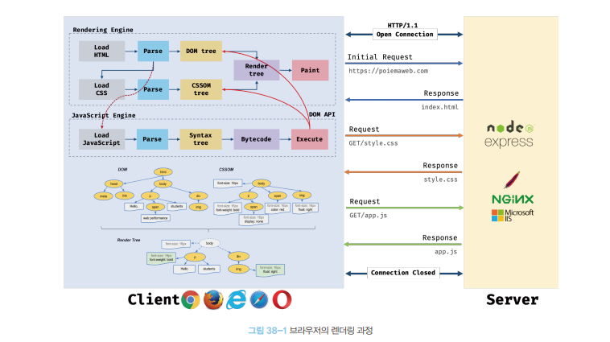
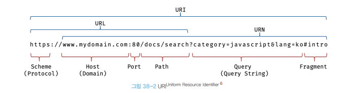
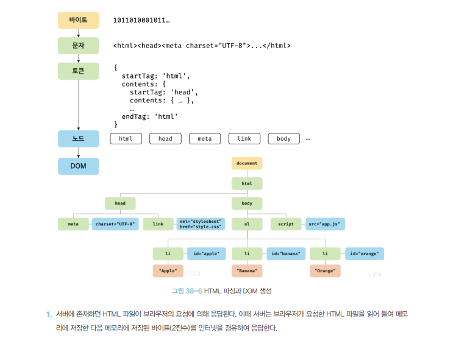
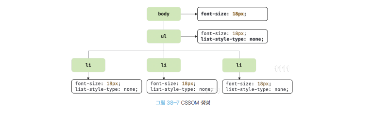
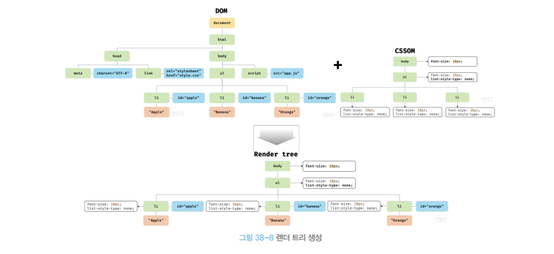
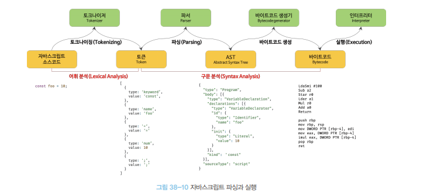
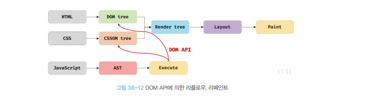
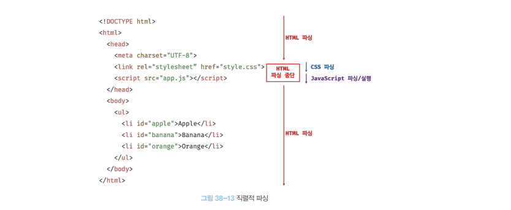
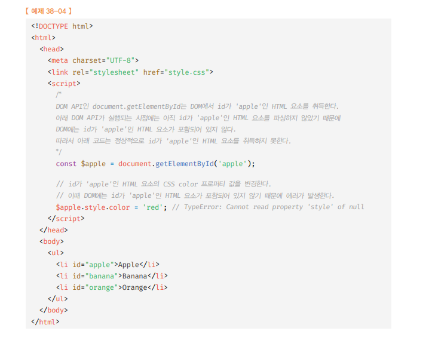

# 브라우저 렌더링 과정 🎯💡🔥📌✅

<br />
<br />

- 자바스크립트 언어는 브라우저에서 `HTML`,`CSS`와 함께 실행 된다.
- 브라우저 렌더링 과정
  1. 브라우저는 HTML,CSS,자바스크립트.. 등 렌더링에 필요한 `리소스를 요청`하고 서버로 부터 `응답을 받는다`.
  2. 서버로 받은 HTML,CSS를 파싱해서 `DOM`과`CSSOM`를 생성하고 이를 결합해서 `랜더 트리`를 생성한다.
  3. 브라우저 자바스크립트 엔진은 서버로 부터 응답받은 자바스크립트를 파싱해서 `AST`를 생성 후 바이트코드로 변환하여 실행 (`자바스크립트는 DOM,CSSOM 변경 가능`)
  4. `렌더 트리를 기반`으로 HTML,요소의 레이아웃을 계산하고 브라우저 화면에 `HTML 요소를 페인팅 한다`.
- 

<br />
<br />
<br />

---

# 응답과 요청

- 브라우저 핵심 : `HTML,CSS,JAVASCRIPT`... 를 서버에 요청하고 응답을 받아 `브라우저`에 `랜더링` 하는 것이다.
  - 즉, 서버에서 받은 것을 파싱하여 `렌더링` 함

<br />

- 
  - `www.mydomain.com` 루트, 요청에는 리소스를 요청하는 내용이 없지만 암묵적으로 index.html을 응답한다.
    - `www.mydomain.com` === `www.mydomain.com/index.html`
  - URL의 호스트 뒤의 PATH를 기술해서 요청하면
    - 서버는 루트폴더의 정적 파일을 보내줌

<br />
<br />
<br />

---

# HTTP/1.1과 HTTP/2.0

- HTTP : 웹에서 브라우저와 서버가 `통신하기 위한 규약`이다.
  - `HTTP 1.1` : 기본적으로 커넥션 당 하나의 요청과 응답만 처리함
    - 여러 개의 요청을 한번에 전송,응답 할 수 없다.
    - `동시 전송이 불가능한 구조이다.`
  - `HTTP 2.0` : 커넥션당 여러개의 요청과 응답이 가능하다
    - `HTTP 1.1`보다 50퍼 빠름

<br />
<br />
<br />

---

# HTML 파싱과 DOM 생성

- 서버가 응답한 HTML 문서는 `문자열로 된 텍스트`
  - 브라우저에 랜더링하려면, 브라우저가 이해할 수 있는 자료구조로 변환하여 메모리에 저장 해야 한다.

<br />

```HTML
<HTML>
<HEAD></HEAD>
<BODY>
    <li id="apple">apple</li>
    <li id="banana">banana</li>
    <li id="Orange">Orange</li>
</BODY>
</HTML>
```

- 위 html 파일을 서버로 부터 응답받으면 브라우저 렌더링 엔진은 html 문서를 파싱해서 이해 할 수 있는 자료구조인 DOM를 생성한다.
- 
  - `DOM`은 HTML 문서를 파싱한 결과물이다.
  1. HTML파일을 읽어 들어 메모리에 저장, `메모리에 저장된 바이트를 인터넷을 경유해 응답한다`.
  2. 응답된 바이트 형태의 HTML 문서는 `meata charset` 어트리뷰트에 의해 지정된 인코딩 방식을 기준으로 문자열로 변환된다.
  3. 문자열로 변환된 html 문서를 읽어 들어 문법적 의미를 갖는 `토큰들로 분해`된다.
  4. 각 토큰들을 객체로 변환해서 `node`(dom를 구성하는 기본 요소) 생성한다.
  5. html요소는 중첩 관계를 갖는다. html요소 간에는 중첩관계에 의해 부자 관계가 형성된다. 부자 관계를 반영해서 모든 노드들은 `트리 자료구조`를 구성한다.

<br />
<br />
<br />

---

# css 파싱과 cssom 생성

- 렌더링엔진은 HTML을 처음부터 `한 줄씩 파싱해서 DOM` `생성`한다.
  - `link`태그나 `style`태그를 만나면 dom 생성을 일시 중단
    - 지정된 css 파일을 서버에 요청 후 응답을 받고 (`바이트->문자->토큰->노트->CSSOM`)을 거치며 해석아여 `CSSOM를 생성`한다.
  - `CSS 파싱`을 완료하면, HTML 파싱이 중단된 시점 부터 다시 파싱을 시작
    - `CSSOM`은 CSS의 상속을 반영하여 생성된다.
    - 

<br />
<br />
<br />

---

# 랜더 트리 생성

- 랜더링 엔진은 `HTML`과 `CSS`를 파싱하여 `DOM` , `CSSOM`를 생성 한다.
  - `DOM`과 `CSSOM`은 랜더링을 위해 `렌더 트리`로 결합 된다.
  - `렌더 트리` : 렌더링을 위한 자료 구조 이다.
    - 브라우저 화면에 렌더링 되지 않는 노드(`meta`, `script`)는 렌더 트리에 포함되지 않는다.
    - 즉, `브라우저 화면에 보이는 것만 렌더 트리`
      - 

<br />

- 완성된 렌더 트리는 각 HTML 요소의 `레이아웃을 계산 하는데 사용`되며, 브라우저 화면에 픽셀을 렌더링하는 `페인팅 처리`에 `입력`된다.

  - 

<br />

- 렌더링 과정은 `반복적`으로 실행 될 수 있다. (레이아웃 계산과 페인팅 작업)
  - `리렌더링은 비용이 많이 드는 작업`
  1. 자바스크립트에 의한 노드 추가 또는 삭제
  2. 브라우저 창의 리사이징
  3. HTML 요소 레이아웃 변경을 발생 시키는 `width` , `margin` , `border` , `display`... 등의 스타일 변경

<br />
<br />
<br />

---

# 자바스크립트 파싱과 실행

- `DOM`은 HTML 문서의 구조 정보 뿐만 아니라 `HTML` , `CSS스타일` 등을 변경할 수 있는 프로그래밍 인터페이스로서 `DOM API를 제공`

  - JAVASCRIPT에서 DOM API 를 통해 이미 생성된 `DOM`을 동적으로 조작 할 수 있다.

<br />

- `렌더링`엔진은 순차적으로 파싱 하며 `DOM` 생성하다가 `SCRIPT`태그를 만나면 `DOM`생성을 일시 중단 한다.
  - src 어트리뷰트에 정의된 `자바스크립트 파일`을 서버에 요청
  - 로드한 자바스크립트 파일을 파싱하기 위해 자`바스크립트 엔진에 제어권 넘김`
    - 자바스크립트 엔진은 `javascript`를 해석해 `AST`(추상적 구문 트리)를 생성 한다.
    - AST를 기반으로 인터프리터가 실행할 수 있는 중간 코드인 `바이트코드`를 `생성하여 실행`
  - 자바스크립트 파싱이 종료 되면,다시 제어권을 넘거 `html파싱을 시작`
  - (자바스크립트 파싱과 실행은 브라우저 렌더링 엔진이 아닌 `자바스크립트 엔진`이 처리함)

<br />

- 

<br />
<br />
<br />

## 토크 나이징

- 단순한 문자열인 자바스크립트 소스코드를 어휘 분석해서 `문법적인 의미를 갖는 코드의 최소 단위인 토큰들로 분해`하는 것

<br />

## 파싱

- 토큰들의 집합을 구문 분석해서 추상적 구문 트리(`AST`)를 생성
- `AST` : 토큰에 `문법적 의미`와 `구조`를 반영한 `트리 구조의 자료구조`

<br />

## 바이트코드 생성과 실행

- 파싱의 결과물인 `AST`는 인터프리터가 실행 할 수 있는 중간 코드인 바이트 코드로 변환되고 `인터프리터에 의해 실행`된다.

<br />
<br />
<br />

---

# 리플로우와 리페인트

- 자바스크립트는 `DOM API`를 이용해 `DOM` 이나 `CSSOM`를 변경할 수 있다.
  - 이때, 변경된 `DOM`, `CSSOM`은 다시 `렌더 트리`로 `결합`되고 렌더 트리를 기반으로 `레이아웃, 페인트 과정이 일어나 다시 렌더링 된다.`
  - 위 과정을 `리플로우`,`리페인트`라고 한다.
  - 

<br />

- `리플로우` : 레이아웃 계산을 다시 하는 것
  - 노드추가,삭제 / 요소읰 크기/위치 변경 / 리사이징 등 `레이아웃에 영향을 주는 작업에 실행된다`.

<br />

- `리페인트` : 재결합된 `렌더 트리를 기반`으로 `다시 페인트 하는 것`을 말한다.

<br />

```
✅ 리플로우 , 리페인트는 반드시 순차적으로 실행되는 것은 아니며, 리페인트만 실행될 수 도 있다.
```

<br />
<br />
<br />

---

# 자바스크립트 파싱에 의한 HTML 파싱 중단

- 자바스크립트는 병렬적 파싱 X 직렬적으로 파싱 O (아래 그림 참고)
  - 
  - 브라우저는 동기적으로 파싱하고 실행한다
    - `SCRIPT 태그의 위치에 따라` HTML 파싱이 블로킹되어 `DOM 생성이 지연`될 수 있다.

<br />

- 
- 위 예제에서 `document.getElementById('apple')`을 실행하는 시점에 html 요소 파싱하지 않았기 때문에 `에러가 발생`
  - `DOM`이 완성 되지 않은 상태에서 자바스크립트가 DOM를 조작하면 에러 발생할 수 있다.
  - 자바스크립트 로딩,파싱으로 인해 HTML 요소 렌더링에 지장이 생김
- 위 문제 해결하기 위해 `body 아래에 자바스크립트를 위치`하는 것은 좋은 아이디어

<br />
<br />
<br />

---

# script 태그의 async/defer 어트리뷰트

- 자바스크립트 파싱에 의한 `DOM` 생성 중단되는 문제를 해결하기 위해 `async/defer`가 추가 되었다.
- `async/defer` : src 속성을 통해 `외부 자바스크립트 파일을 로드`하는 경우에만 사용 가능
  - `src 속성이 없는 인라인 자바스크립트는 사용 불가능`

<br />
<br />

- `async` : `HTML 파싱`과 `외부 자바스크립트 파일의 로드`가 `비동기적`으로 진행

  - 자바스크립트 파싱,실행 할때는 `HTML 파싱`이 중단 된다.
  - 
  - async 속성을 지정하면 script 태그의 순서와는 상관없이 `로드가 완료된 자바스크립트 먼저 실행`
  - E10 이상 부터 지원

- `defer` : `HTML` 파싱과 외부 자바스크립트 파일의 로드가 `비동기적으로 동시에 진행`
  - `async`와 다르게 자바스크립트 `파싱과 실행`은 HTML 파싱이 완료된 직후 실행된다.- 
  - `DOM` 생성이 완료된 이후 실행 되어야 할 자바스크립트에 유용하다.
