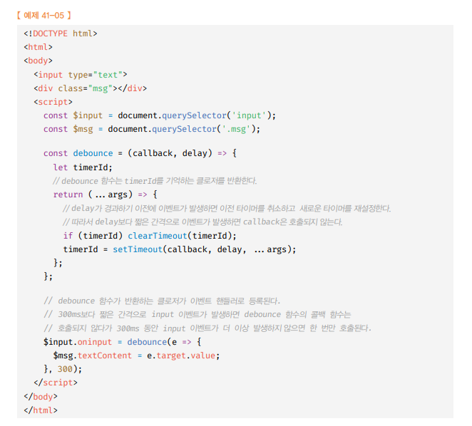
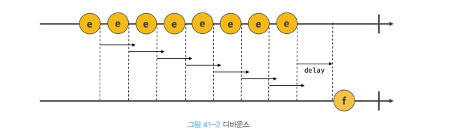
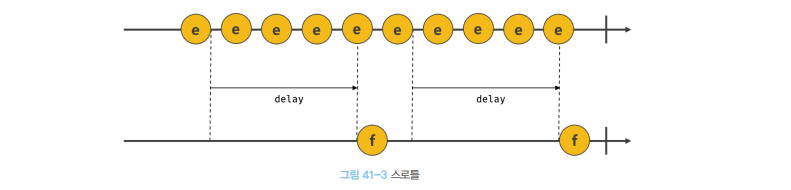

# 타이머 🎯💡🔥📌✅

- 함수를 명시적으로 호출하지않고, `일정 시간이 경과한 후` `호출`되도록 함수 호출을 하려면 `타이머 함수를 사용 해야 한다.`
- 타이머 함수는 `ESCMASript 사양에 정의된 빌트인 함수가 아니다`.

  - 하지만, `브라우저` 환경 , `Node.js`에서 `전역 객체`의 메서드로 `타이머 함수를 제공`

<br />

- 자바스크립트 타이머 함수(2 가지)
  - `setTimeout` : 타이머가 완료되면 콜백함수를 `단 한번 호출`
  - `setInterval` : 타이머가 완료될때 마다 콜백 함수를 `반복 해서 호출`
- 자바스크립트 타이머 제거 함수(2 가지)
  - `clearTimeout` , `clearInterval`

<br />

```
🔥 자바스크립트는 단 하나의 실행 컨텍스트 스택을 가지기 때문에 두가지 이상의 태스크를 동시에 실행 할 수 없다.

🔥 자바스크립트 엔진은 `싱글 스레드`로 동작한다.

🔥 따라서 타이머 함수 (setTimeout, setInterval)은 비동기 처리 방식으로 동작한다.
```

<br />
<br />
<br />

---

## (1) 타이머 (setTimeout / clearTimeout)

- `setTimeout` : 두번째 인수로 `전달 받은 시간`으로 `단 한번` 동작하는 타이머를 생성 한다.

  - 타이머가 만료되면, `콜백 함수`를 호출 한다.
  - 즉, setTimeout 함수의 콜백 함수는 두 번째 인수로 전달 받은 시간 이후 `단 한 번 실행되도록 호출 스케줄링` 된다.
  - setTimeout함수는 생성된 타이머를 식별할 수 있는 고유한 `id를 return`
    - `id가 숫자인 경우` : 브라우저
    - `id가 객체인 경우` : Node.js 환경

- `clearTimeout` : `setTimeout 반환한 id`를 clearTimeout의 `인자`로 전달하면 타이머를 취소 할 수 있다.

<br />

```js
const timeoutId = setTimeout(fun | code[, delay, param1, param2, ...])
```

- `setTimeout 옵션`

  - 

<br />

> setTimeout 예제 코드

```js
//1초 후 타이머 만료되면 콜백 함수 호출된다.
setTimeout(() => console.log("HI"), 1000);

//1초 후 타이머가 만료 되면 콜백 함수가 호출된다.
// 이때 콜백 함수에 `Lee`가 인수로 전달 됨
setTimeout((name) => console.log(`HI! ${name}`), 1000, "Lee");

// 두번째 인수를 생략하면 기본값 0이 지정된다.
setTimeout(() => console.log(`Hello`));
```

<br />

> clearTimeout 예제 코드

```js
const timeId = setTimeout(() => console.log("HI"), 1000);

// 타이머 스케줄링 취소 ~!
clearTimeout(timerId);
```

<br />
<br />
<br />

---

## (2) 타이머 (setTimeout / clearTimeout)

`setTimeout` : 두번째 인수로 `전달받은 시간으로` `반복` 동작하는 타이머 생성

- 타이머가 완료 될 때마다 첫번째 인수로 받은 `콜백함수가 반복 호출`
- 즉, 두번째 인수로 받은 시간이 경과할 때 마다, 반복 실행되도록 호출 스케줄링 된다.
- `setTimeout`은 생성된 타이머를 `식별`할 수 있는 `id를 반환한다.`
  - 브라우저 환경 : id 숫자 return
  - Node.js 환경 : 객체 return

<br />

`clearTimeout` : `setTimeout`함수가 반환한 id값을 인수로 전달하면, 함수의 스케줄링이 취소 된다.

<br />

```js
const timeId = setInterval(func|code[,delay,params1,params2,...]);
```

<br />

> 예시 코드

```js
let count = 1;

//1초가 만료될때 마다 콜백함수가 호출 된다.
//setInterval 함수는 생성된 타이머를 식별할 수 있는 고유한 타이머 id를 반환한다.
const timeoutId = setInterval(() => {
  console.log(count);
  //count가 5이면, 타이머 취소
  if (count++ === 5) clearInterval(timeoutId);
}),1000;
```

<br />
<br />
<br />

---

## 디바운스와 스로틀

- `디바운스와 스로틀` : `짧은 시간 간격`으로 `연속`해서 발생하는 이벤트를 그룹화해서 `과도한 이벤트 핸들러의 호출을 방지`하는 프로그래밍 기법이다.
  - `scroll` , `resize` , `input` , `mousemove` 같은 이벤트는 짧은 시간 간격으로 `연속`해서 `발생`한다.
    - 성능에 문제를 일으킬 수 있다.

<br />

## `디바운스` : 짧은 시간 간격으로 `이벤트`가 `연속`해서 `발생`하면, 이벤트 핸들러를 호출하지 않다가 `일정시간`이 `경과`한 이후 `이벤트 핸들러`가 `한 번만` 호출하도록한다.

<br />

- 짧은 시간 간격으로 발생한느 이벤트를 묶어서 `마지막`에 `한번만` `이벤트 핸들러` `호출`하게 함
- 예제
- 
  - `300ms` 보다 짧은 간격으로 input 일어나면, 콜백함수를 호출하지 않다가 `300ms` 동안 input이 발생하지 않으면, 콜백함수를 호출한다.
- 
- `resize` , `ajax 요청하는 입력 필드 자동완성`, `버튼 중복 클릭 방지` 에 유용하다.
- 실무에서는 `Underscore의 debounce` 함수나 `Lodash의 debounce` 사용 권장

<br />
<br />
<br />

## `스로틀` : 짧은 시간 간격으로 이벤트가 연속해서 발생하더라도 일정 시간 간격으로 이벤트 핸들러가 회대 한 번만 호출 되도록 한다.

- 스로틀은 `짧은 시간 간격`으로 `연속`해서 `발생`하는 `이벤트`를 `그룹화`해서 `일정 시간 단위`로 이벤트 핸들러가 `호출`되도록 `호출 주기`를 만든다.

- `scroll`이벤트는 사용자가 스크롤할 때 짧은 시간 간격으로 연속 실행
  - 과도한 이벤트 핸들러 호출방지를 위해 이벤트를 `그룹화`해서 `일정 시간 단위`로 이벤트 `핸들러가 호출`되도록 함
- 
  - 이처럼 짧은 간격으로 `연속`해서 `발생`하는 `이벤트`를 `그룹화`해서 `일정 시간 간격`으로 이벤트 핸들러를 `호출`하는 `스로틀`은 `scroll 이벤트 처리` , `무한 스크롤 구현`에 `유용`

<br />

```js
const throttle = (callback, delay) => {
  let timerId;
  //throttle함수는 timeId를 기억하는 클로저를 반환한다.
  return (...args) => {
    //delay가 경과하기 이전에 이벤트가 발생하면 가만히 , delay가 경과 되면 이벤트 발생 시
    //새로운 타이머를 재설정함
    //따라서 delay 간격으로 callback이 호출 된다.
    if (timerId) return;
    timerId = setTimeout(() => {
      callback(...args);
      timeId = null;
    }, delay);
  };
};
```
