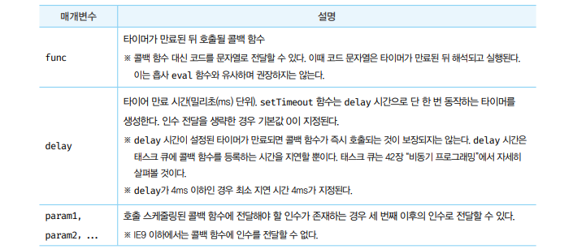

# 타이머 🎯💡🔥📌✅

- 함수를 명시적으로 호출하지않고, `일정 시간이 경과한 후` `호출`되도록 함수 호출을 하려면 `타이머 함수를 사용 해야 한다.`
- 타이머 함수는 `ESCMASript 사양에 정의된 빌트인 함수가 아니다`.

  - 하지만, `브라우저` 환경 , `Node.js`에서 `전역 객체`의 메서드로 `타이머 함수를 제공`

<br />

- 자바스크립트 타이머 함수(2 가지)
  - `setTimeout` : 타이머가 완료되면 콜백함수를 `단 한번 호출`
  - `setInterval` : 타이머가 완료될때 마다 콜백 함수를 `반복 해서 호출`
- 자바스크립트 타이머 제거 함수(2 가지)
  - `clearTimeout` , `clearInterval`

<br />

```
🔥 자바스크립트는 단 하나의 실행 컨텍스트 스택을 가지기 때문에 두가지 이상의 태스크를 동시에 실행 할 수 없다.

🔥 자바스크립트 엔진은 `싱글 스레드`로 동작한다.

🔥 따라서 타이머 함수 (setTimeout, setInterval)은 비동기 처리 방식으로 동작한다.
```

<br />
<br />
<br />

---

## (1) 타이머 (setTimeout / clearTimeout)

- `setTimeout` : 두번째 인수로 `전달 받은 시간`으로 `단 한번` 동작하는 타이머를 생성 한다.

  - 타이머가 만료되면, `콜백 함수`를 호출 한다.
  - 즉, setTimeout 함수의 콜백 함수는 두 번째 인수로 전달 받은 시간 이후 `단 한 번 실행되도록 호출 스케줄링` 된다.
  - setTimeout함수는 생성된 타이머를 식별할 수 있는 고유한 `id를 return`
    - `id가 숫자인 경우` : 브라우저
    - `id가 객체인 경우` : Node.js 환경

- `clearTimeout` : `setTimeout 반환한 id`를 clearTimeout의 `인자`로 전달하면 타이머를 취소 할 수 있다.

<br />

```js
const timeoutId = setTimeout(fun | code[, delay, param1, param2, ...])
```

- `setTimeout 옵션`

  - 

<br />

> setTimeout 예제 코드

```js
//1초 후 타이머 만료되면 콜백 함수 호출된다.
setTimeout(() => console.log("HI"), 1000);

//1초 후 타이머가 만료 되면 콜백 함수가 호출된다.
// 이때 콜백 함수에 `Lee`가 인수로 전달 됨
setTimeout((name) => console.log(`HI! ${name}`), 1000, "Lee");

// 두번째 인수를 생략하면 기본값 0이 지정된다.
setTimeout(() => console.log(`Hello`));
```

<br />

> clearTimeout 예제 코드

```js
const timeId = setTimeout(() => console.log("HI"), 1000);

// 타이머 스케줄링 취소 ~!
clearTimeout(timerId);
```

<br />
<br />
<br />

---

## (2) 타이머 (setTimeout / clearTimeout)
