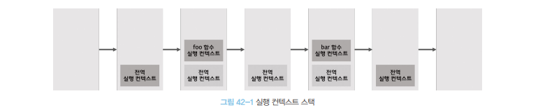

# 비동기 프로그래밍 🎯💡🔥📌✅

- `함수를 호출하면`
  1. 함수 평가 후 함수 실행 컨텍스트 생성
  2. 실행 컨텍스트에 함수 실행 컨텍스트 `PUSH` 후 함수 코드 실행
  3. 함수 코드 실행 이후 함수 실행 컨텍스트 `POP`

<br />

- `함수가 실행 되려면`
  - 함수 코드 평가 과정 -> 함수 실행 컨텍스트 생성 -> 실행 컨텍스트 스택에 `PUSH`
  - 실행 컨텍스트 `스택`에 `푸시` 되는 것이 함수 실행의 시작을 의미한다.

<br />

- `함수가 호출된 순서대로 실행되는 이유`
  - 함수가 호출된 순서대로 함수 실행 컨텍스트가 실행 컨텍스트 스택에 `푸시`되기 때문이다.
  - 자바스크립트는 단 하나의 실행 컨텍스트를 가진다.
    - `최상위 요소`인 실행 중인 `컨텍스트`를 `제외`하면, 모든 실행 컨텍스트는 모두 `실행 대기 중인` `태스크`들이다.
    - 대기 중인 태스크들은 현재 실행 중인 컨텍스트가 `POP`되어 스택에서 제거되면, 비로소 `실행`됨
    - 자바스크립트는 `싱글스레드`이다.

<br />

> 예시 코드

```js
const foo = () => {};
const bar = () => {};
```

- 위 실행 컨텍스트 스택
- 

<br />

---

## 블로킹

- 자바스크립트는 `싱글스레드` 방식 이며, 한 번에 하나의 태스크만 실행 가능하다.
  - `싱글 스레드 방식`은 처리 시간이 걸리는 태스크를 실행하는 경우 `블로킹`이 발생 한다.

<br />

- `동기 처리` : 태스크를 순서대로 하나씩 처리, `실행 순서가 보장 된다.`

  - 앞선 태스크가 종료될때 까지 `이후 태스크들이 블로킹` 됨
  - 

<br />

- `비동기 처리` : 현재 실행 중인 태스크가 `종료되지 않은 상태`라 해도, 다음 `태스크`가 곧바로 실행되는 방식
  - 블로킹은 발생하지 않지만, 실행 순서를 보장 하지 않는다.
  - 
  - 타이머 함수(`setTimeout`, `setInterval`) , `HTTP 요청` , `이벤트 핸들러` 는 비동기 처리 방식으로 동작
  - 비동기 처리는 전통적으로 `콜백 패턴`을 사용 한다.
    - 콜백 패턴은 `가독성`을 `나쁘게 함`

<br />

> 동기 처리 예제

```js
// sleep 함수는 일정 시간이 경과한 이후에 콜백 함수를 호출한다.
function sleep(func, delay) {
  //Date.now()는 현재 시간을 숫자로 반환한다.
  const delay = Date.now() + delay;

  //현재 시간(Date.now())에 delay를 더한 delayUnit이 현재 시간 보다 작으면 계속 반복 한다.
  while (Date.now() < delayUntil);
  //일정 시간이 경과한 이후에 콜백함수를 호출한다
  func();
}

function foo() {
  console.log("foo");
}
function bar() {
  console.log("bar");
}

//sleep 함수는 3초 이상 실행
sleep(foo, 3 * 1000);
//bar 함수는 sleep 함수의 실행이 종료된 이후에 호출되므로 3초 이상 블로킹된다.
bar();
// 3초 경과 후 foo 호출 -> bar 호출
```

<br />

> 비동기 처리 예제

```js
function foo() {
  console.log("foo");
}

function bar() {
  console.log("bar");
}

// setTimeout 타이머 비동기 함수 호출
setTimeout(foo, 3000);
bar();

/*
실행결과
bar
(약 3초뒤)
foo
*/
```

<br />
<br />
<br />

---

# 이벤트 루프와 태스크 큐

- `이벤트 루프` : HTML 요소가 애니메이션 효과를 통해 움직이면서 이벤트처리 하기도 하고, HTTP 요청을 통해 데이터를 가지고 오면서 렌더링 하기도 한다.
  - `자바스크립트의 동시성`을 지원하는 것이 바로 이벤트 루프
  - 

<br />

## 구글의 V8 자바스크립트 엔진은 `2개의 영역으로 구분` (`콜 스택`, `힙`)

- `콜스택`
  - 소스코드 평가 과정에서 생성된 실행 컨텍스트가 추가되고 제거되는 스택 자료구조인 `실행 컨텍스트`가 바로 `콜스택`
  - `콜스택`은 단하나만 사용되기 때문에 최상위 실행 컨텍스트가 종료되기 전까지 `다른 태스크는 실행 되지 않음`

<br />

- `힙`
  - `객체가 저장되는 메모리 공간`
  - `메모리`에 값을 저장하려면, 메모리 공간의 크기 결정해야함
    - 객체는 크기가 정해져 있지 않기 때문에 `동적 할당` 해야 한다.
    - `객체가 저장되는 메모리 공간`인 `힙`은 구조화 되어 있지 않다는 특징이 있다.

...
