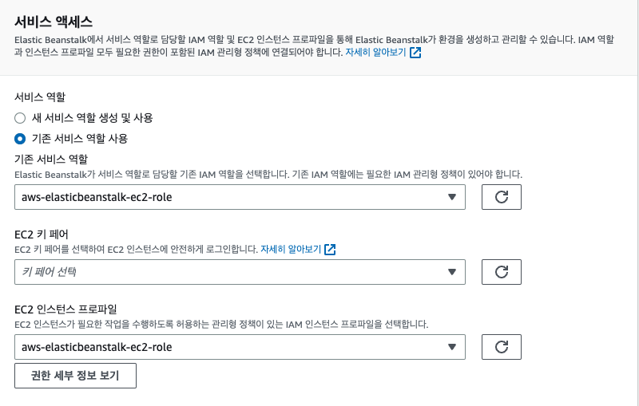

# AWS Elastic BeanStalk

## Elastic BeanStalk 생성하기

- 

```bash
## Elastic BeanStalk
## 서비스 엑세스 구성
✅ 환경 티어 : 웹서버 환경
✅ 애플리케이션 : myapp
✅ 플랫폼 : php
✅ 시간 설정 : 단일 인스턴스 (프리 티어 사용)

## 서비스 엑세스 구성
기존 서비스 역할 : aws-elasticbeanstalk-ec2-role
키페어 선택 : 기존 키페어 선택
EC2 인스턴스 프로파일 : aws-elasticbeanstalk-ec2-role

## 네트워킹, 데이터베이스 및 태그 설정
default 설정으로 다음

## 업데이트, 모니터링 및 로깅 구성
default 설정으로 다음
```

<br />

## Elastic BeanStalk 생성하기

1. 
   - 배포 완료

<br />

2.  코드 압축

```php
<?php
    echo "Hello EB 1";
?>
```

<br />

3. 
   - 작성된 코드 zip파일로 압축 후 Elastic BeanStalk 업로드

<br />

4. v1 버전 생성 완료 (Branch)
   - 

<br />

5. v1 버전 production , develop 환경에 배포 선택
   - 
   - 
   - 동일한 방법으로 이전 버전을 선택해 이전 버전으로 다시 배포가 가능하다.

<br />
<br />
<br />

---

# Elastic BeanStalk Error 시 iam 권한 설정이 잘못 된 것

## Iam 권한에 아래 3개를 추가 해준 뒤 다시 BeanStalk 생성하면 문제 해결

- `서비스 액세스`
  - 직접 IAM에서 권한 5개 rule를 추가해야한다. (안하면 ERROR)
  - 
  - 권한이 잘 추가 됐다면 이런식으로 뜸
    - IAM에서 권한 이름 : aws-elasticbeanstalk-service-role
    - ✅ AWSElasticBeanstalkWebTier
    - ✅ AWSElasticBeanstalkWorkerTier
    - ✅ AWSElasticBeanstalkMulticontainerDocker
