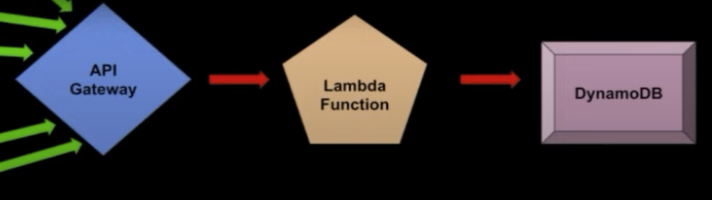
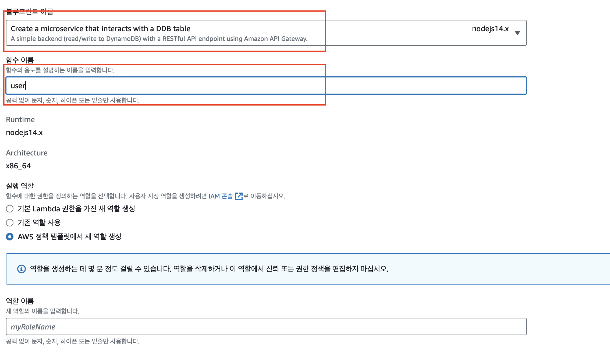
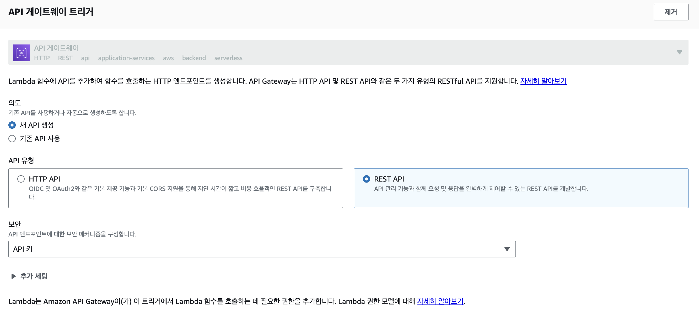
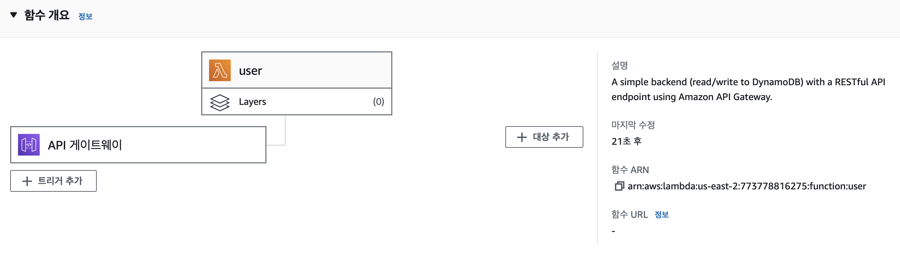
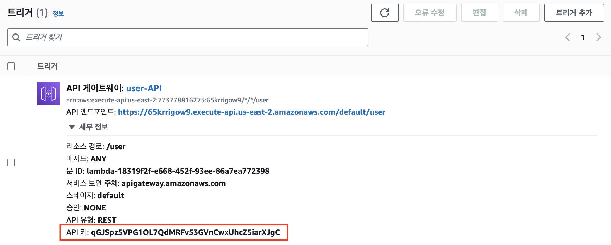
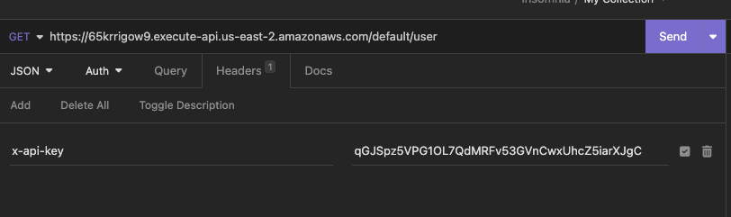
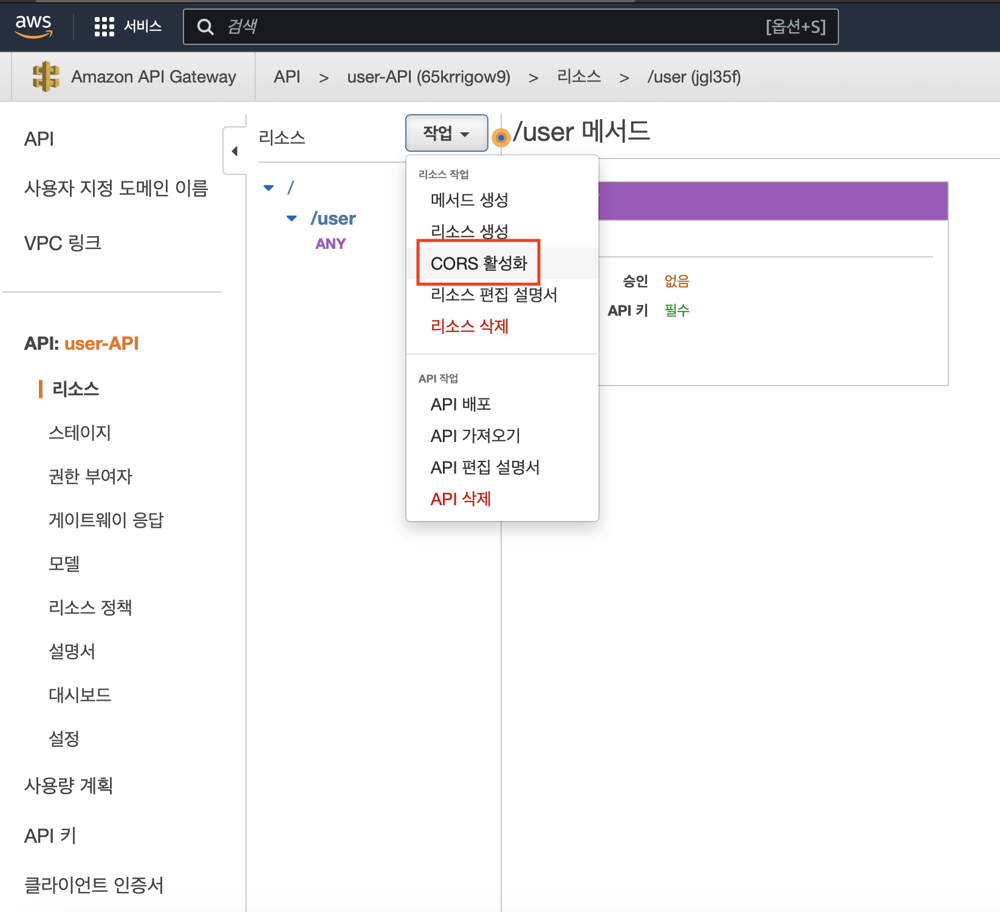
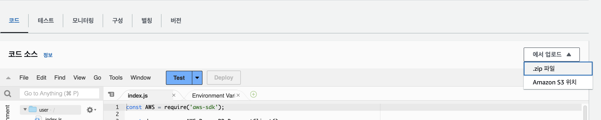

# AWS LAMBDA

- 

> 람다란 서버리스 컴퓨팅 서비스로 별도의 서버 셋업없이 곧바로 코드를 실행시켜주는 서비스 <br />
> 서버를 만들지 않고 서버운영 할 필요X , api만 제작하면 됨 <br>
> 서버코드를 작성하고 클라우드에 올리는 공수가 줄기 때문에 강력한 서비스

<br />
<br />

## LAMDBA 함수 생성

- 
- 

- 블루스크린 사용 및 함수 기능에 맞는 이름을 작명한다.
- API 생성한 뒤 보안은 API키로 설정한다.

- 

> 함수 생성 완료

<br />

## Lamdba 코드 설명

- 
- 

> api키를 헤더에 넣어 데이터를 전송하면 람다 함수 사용 가능

> a-api-key : api를 넣어 함수를 호출하면 정상 적으로 작동한다

```js
const AWS = require("aws-sdk");

//람다가 호출되었을때 실행되는 함수
exports.handler = async (event, context) => {
  //이벤트 객체와 켄텍스트가 넘어옴
  let body;
  let statusCode = "200";
  const headers = {
    "Content-Type": "application/json",
  };

  try {
    switch (event.httpMethod) {
      //이벤트 객체에 httpMethod로 ㅇ청 메서드정보를 제공해준다. 그것을 통해 get / put / post등등을  구분해준다.
      case "DELETE":
        //각 케이스에 따라 body에 값을 넣어준다.
        body = await dynamo.delete(JSON.parse(event.body)).promise();
        break;
      case "GET":
        body = await dynamo
          .scan({ TableName: event.queryStringParameters.TableName })
          .promise();
        break;
      case "POST":
        body = await dynamo.put(JSON.parse(event.body)).promise();
        break;
      case "PUT":
        body = await dynamo.update(JSON.parse(event.body)).promise();
        break;
      default:
        throw new Error(`Unsupported method "${event.httpMethod}"`);
    }
  } catch (err) {
    statusCode = "400";
    body = err.message;
  } finally {
    body = JSON.stringify(body);
  }

  //return 구문을 통해 api 요청에 대한 응답값을 반환해준다.
  return {
    statusCode,
    body,
    headers,
  };
};
```

<br />

## API 게이트웨이 CORS 설정

> api 게이트 웨이에서 cors설정을 한다.

```bash
# 전체 허용을 하려면 *
Access allow origin : "*"
메서드 ✅ OPTIONS
# 원하는 특정 도메인만 허용하려면 http://localhost:3000를 넣어준다.
http://localhost:3000
```

- 

<br />

# 람다를 통한 CRUD 구현

> index.js

## 인덱스 함수

```
*** 람다 api에 쿼리스트링으로 요청한다면 (get 요청) ***

event 객체에 queryStringParameters라는 객체로 넘어오게 된다.
아무것도 보내지 않는다면 null로 넘어온다 get요청 참고

?user_id=1이라고 입력하면
{
    user_id : 1
}
이런식으로 넘어오게 된다.

  //쿼리스트링이 안왔을때의 예외 처리
  if (event.queryStringParameters && event.queryStringParameters.user_id) {
    //유저아이디가 쿼리 스트링 파라미터로 넘어 왔을때 where 구문을 사용하는 쪽
    query += ` where user_id=${event.queryStringParameters.user_id}`;
  }
*** 람다 api에 쿼리스트링으로 요청한다면 (get 요청) ***


https://github.com/silivalleydev/aws-lambda-class (소스 참고)


*** 람다 api에 쿼리스트링으로 요청한다면 (post 요청) ***

쿼리 문에 post body받을 때 event.body로 받는다.
event.body는 string으로 오기 때문에 JSON.parse로 객체로 변환 시켜 그 프로퍼티에 접근해야한다.

let query = `insert into user(name) values('${
  JSON.parse(event.body).name
}')`;

*** 람다 api에 쿼리스트링으로 요청한다면 (post 요청) ***
```

<br />

```js
//index.js
const connectInfo = require("./env");
const getMethod = require("./get");
const postMethod = require("./post");
const putMethod = require("./put");
const deleteMethod = require("./delete");
const mysql = require("mysql");

// mysql 패키지를 통해 커넥션을 연결한다.
// connectinfo는 .env.json에서 파일을 가져온다
const conn = mysql.createConnection({
  host: connectInfo.host,
  user: connectInfo.user,
  port: "3306",
  password: connectInfo.password,
  database: connectInfo.database,
});
exports.handler = async function (event, context, callback) {
  //console.log('Received event:', JSON.stringify(event, null, 2));

  let body;
  let statusCode = "200";
  const headers = {
    "Content-Type": "application/json",
  };

  try {
    switch (event.httpMethod) {
      case "DELETE":
        body = await deleteMethod(conn, event);
        break;
      case "GET":
        console.log(event.queryStringParameters, getMethod);
        body = await getMethod(conn, event);
        break;
      case "POST":
        body = await postMethod(conn, event);
        break;
      case "PUT":
        body = await putMethod(conn, event);
        break;
      default:
        throw new Error(`Unsupported method "${event.httpMethod}"`);
    }
  } catch (err) {
    statusCode = "400";
    body = err.message;
  } finally {
    body = JSON.stringify(body);
  }

  return {
    statusCode,
    body,
    headers,
  };
};
//.env.json
{
    "host":"",
    "user":"",
    "port":3306,
    "password":"",
    "database":""
}
```

<br />

## Get 메서드

> get.js

```js
module.exports = async function get(conn, event) {
  //get 메서드를 보면 conn과 event를 받는다.
  // conn은 아까 연결한 sql 커넥션이 되고, event는 람다함수가 받은 메서드 및 파라미터 값을 저장한다.
  let query = "SELECT * FROM user";

  //쿼리스트링이 안왔을때의 예외 처리
  if (event.queryStringParameters && event.queryStringParameters.user_id) {
    //유저아이디가 쿼리 스트링 파라미터로 넘어 왔을때 where 구문을 사용하는 쪽
    query += ` where user_id=${event.queryStringParameters.user_id}`;
  }

  try {
    // 이 함수가 리턴하는 것은 promise문을 이용해서
    // mysql 커넥션에 쿼리를 넘겨 그 쿼리의 실행 결과를 반환하는 함수
    // 결과적으로, get요청에 대한 쿼리를 짜서 커넥션에 넘겨주면 그 결과를 리턴한다.
    return await new Promise((resolve, reject) => {
      conn.query(query, function (err, rows, fields) {
        console.log("검색결과?", err, rows, fields);
        if (!err) {
          resolve(rows);
        } else {
          console.log("Error while performing Query.", err);
          reject(err);
        }
      });
    });
  } catch (error) {
    console.log("get error=>", error);
    return {
      status: "FAIL",
    };
  }
};
```

<br />

## Post 메서드

> post.js

```js
module.exports = async function post(conn, event) {
  try {
    //쿼리 문에 post body받을 때 event.body로 받는다.
    //event.body는 string으로 오기 때문에 JSON.parse로 객체로 변환 시켜 그 프로퍼티에 접근해야한다.
    let query = `insert into user(name) values('${
      JSON.parse(event.body).name
    }')`;
    return await new Promise((resolve, reject) => {
      conn.query(query, function (err, rows, fields) {
        console.log("검색결과?", err, rows, fields);
        if (!err) {
          resolve(rows);
        } else {
          console.log("Error while performing Query.", err);
          reject(err);
        }
      });
    });
  } catch (error) {
    console.log("get error=>", error);
    return {
      status: "FAIL",
    };
  }
};
```

<br />

## mysql,aync 패키지 설치 후 코드 업로드

> 위처럼 작성한 코드를 zip파일로 업로드

> Deploy버튼을 눌러 적용

- 
