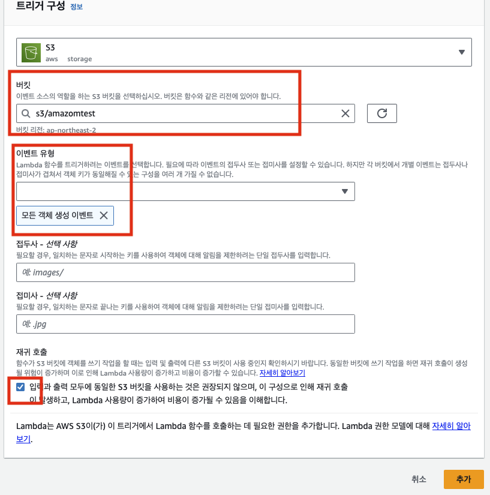

# LAMBDA - S3 함수 생성

## Lambda 생성

- 
- 

> 람다 생성 후 source code 수정

<br />

## Lambda 테스트 진행

> 테스트 쪽 탭에서 테스트 진행

- 

```js
// value
{
    "left": 1
    "right": 2
}

//코드
import json

def lambda_handler(event, context):
    print(event)
    return event['left']+event['right']
```

<br />

## Lambda 로그 확인

- 
- 
- `가장 맨위에 위치한 것이 가장 최근의 log`

<br />

## Lambda 트리거 S3

> S에 파일이 업로드 되었을 때 Lambda 함수 호출

> 모든 s3에 변동이 생겼을 때 람다 함수 호출되도록

- 
- 

> 트리거 추가 완료

- 

```
S3에 이벤트가 생길 때 마다 람다 함수가 실행되고 그 이벤트는 cloudWath를 통해 로그를 확인 할 수 있다.
- 아래는 S3가 Lambda에게 전달한 event 콘솔 값이다.
- s3는 이런식의 값을 입력값으로 준다.
***********************************************
{
   "Records":[
      {
         "eventVersion":"2.1",
         "eventSource":"aws:s3",
         "awsRegion":"ap-northeast-2",
         "eventTime":"2023-07-20T03:40:49.101Z",
         "eventName":"ObjectCreated:Put",
         "userIdentity":{
            "principalId":"AKMWREBY3MK2R"
         },
         "requestParameters":{
            "sourceIPAddress":"115.91.226.43"
         },
         "responseElements":{
            "x-amz-request-id":"QFW99RTT156AD16M",
            "x-amz-id-2":"Yt9J9wOmoQ41Ic0GiaMBcDsEduWZsJ1UtqV1DJlX0a47mCZHiwn0b5RXfp/++Keu7VQWQAYSRj1mssRWH0RWOLJmqAByGZv0Gv3P3j+08vk="
         },
         "s3":{
            "s3SchemaVersion":"1.0",
            "configurationId":"ceef8556-4dfa-4a9f-bfc6-b480525c0e6b",
            "bucket":{
               "name":"amazomtest",
               "ownerIdentity":{
                  "principalId":"AKMWREBY3MK2R"
               },
               "arn":"arn:aws:s3:::amazomtest"
            },
            "object":{
               "key":"a50.png",
               "size":57541,
               "eTag":"4af82f2da24d6a0548bca5aaa842f952",
               "versionId":"VltADxP7QOApUgI5XNLusaMiftrpeXd.",
               "sequencer":"0064B8ACC1049990B8"
            }
         }
      }
   ]
}
***********************************************
```

<br />

## S3 이벤트 불러오기

```js
def lambda_handler(event,context):
    print(event['Records'][0]['s3']['object']['key'])
    return 'S3'
```
