# LAMBDA - GATEWAY

## LAMbDA 함수 생성

> `Hello from Lambda!`를 반환하는 함수 생성

- 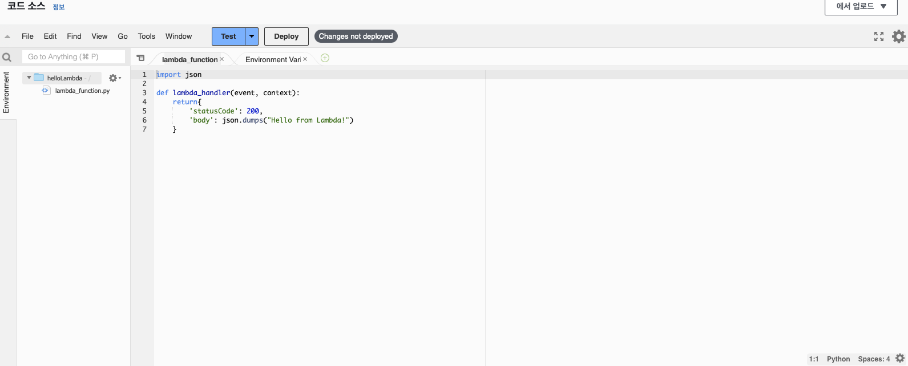

```py
def lambda_handler(event, context):
    return {
        'statusCode':200,
        'body':"Hello Lambda!"
    }
```

<br />

## `HTTP API` 생성 (API - Gateway)

> `HTTP API` 생성 , 모두 default 설정으로 검토 및 생성 클릭

- 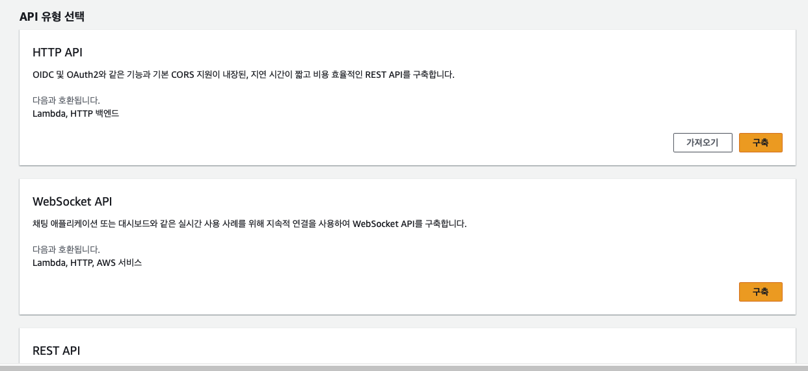
- 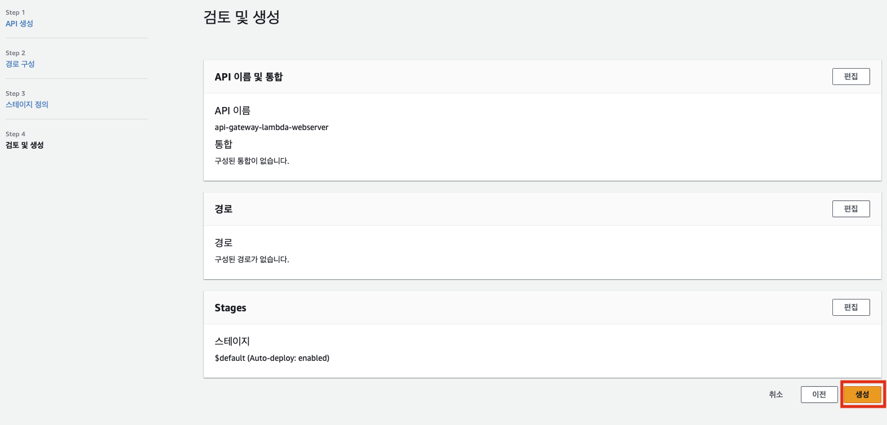

<br />

## API Gateway - Lambda 연결 - api 사용

> gateway와 lambda 연결

1. 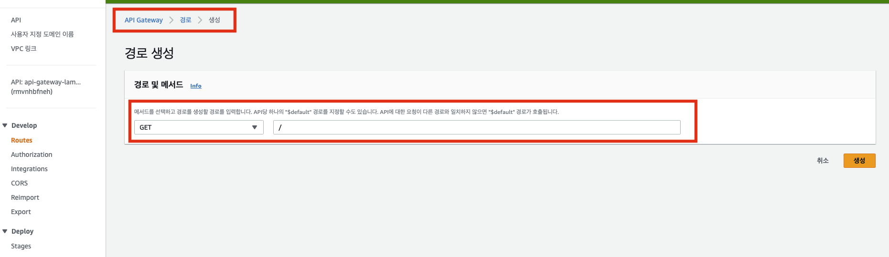
   - 경로 생성 완료

<br />

2. 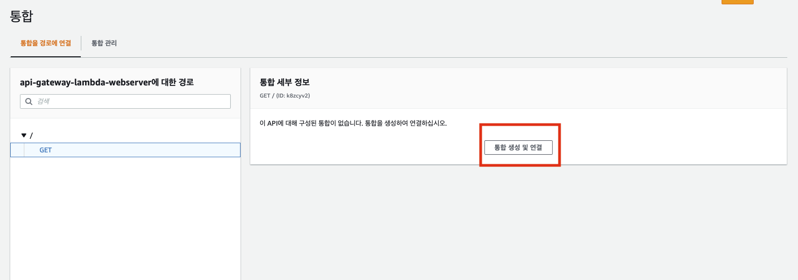
   - integrations > 통합 생성 및 연결

<br />

3. 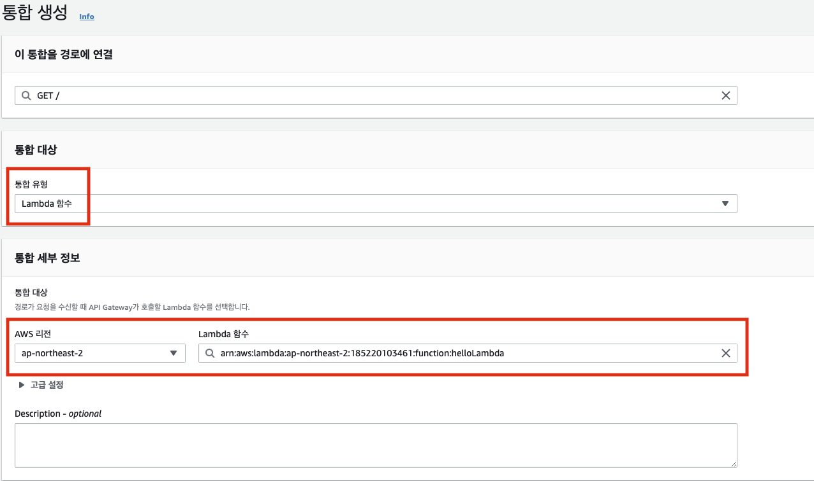
   - 방금만든 람다 함수 연결

<br />

4. 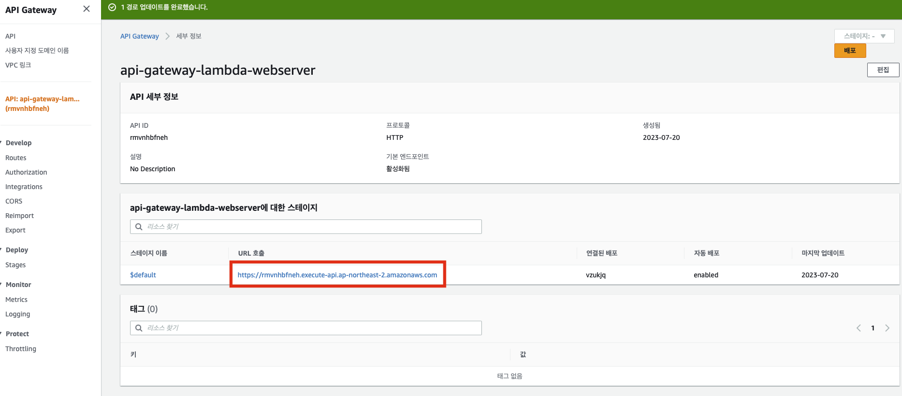
   - api 게이트 웨이를 통해 람다 함수 사용

> api를 호출해서 사용 가능

<br />
<br />
<br />
<br />
<br />
<br />
<br />
<br />

# Lambda header값 변경

1. 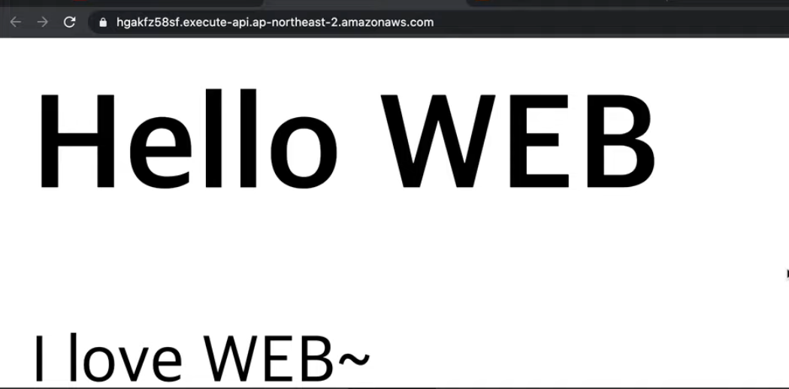
   - "Content-Type" : "text/html" 으로 반환

```js
// html 형식으로 api 반환
// html로 처리해서 값 반환
def lambda_handler(event, context):
    return{
        'statusCode': 200,
        'body': """
        <h1>Hello Web</h1>
        """
        'headers':{
            "Content-Type" : "text/html"
        }
    }
//json 형식으로 api 반환
def lambda_handler(event, context):
    return{
        'statusCode': 200,
        'body': "Hello from Lambda!!"
        'headers':{
            "Content-Type" : "application/json"
        }
    }
```

<br />
<br />

# Lamdba에서 path / query string 값 사용하기

1. 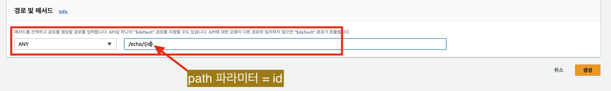
   - 경로 생성

<br />

2. 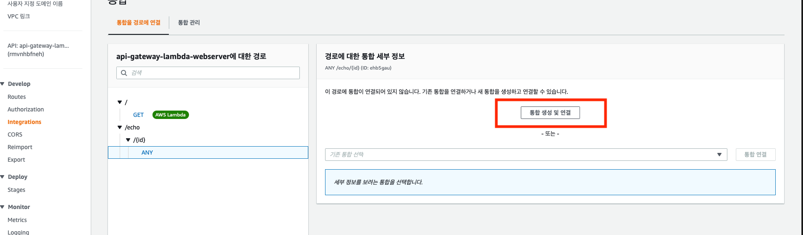
   - Gateway - lambda 연결

<br />

3. lambda 함수 생성
   - event['pathParameters']['id'] `pathparameter 값 가져오기`
   - event['requestContext']['http']['method'] `무슨 메소드 인지 가져옴`

```js
import json

def lambda_handler(event, context):
    print(event)
    return{
        'statusCode': 200,
        'body': json.dumps({
            "id": event['pathParameters']['id'],
            "method": event['requestContext']['http']['method'],
            "filter":event['queryStringParameters']['filter']
        })
    }
```

> api 호출

> https://rmvnhbfneh.execute-api.ap-northeast-2.amazonaws.com/echo/2?filter=body

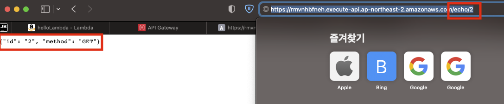
