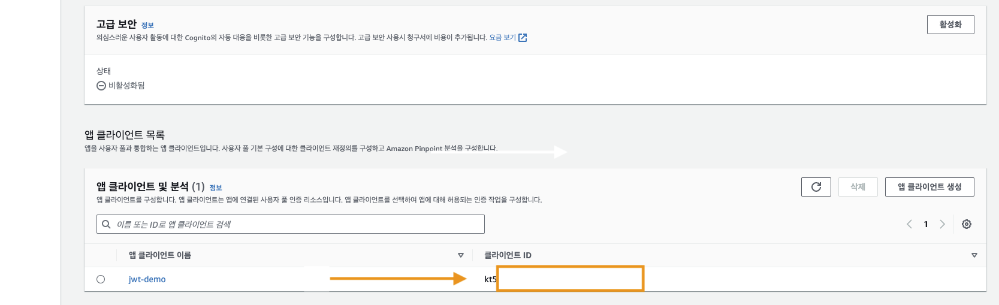

# AWS LOGIN COGNITO (JWT token)

## API gateway 생성 (1)

- HTTP API 구축
  - API 생성
  - API 이름 : jwt-demo
  - 전부 Default 다음 후 생성

> api 경로 게이트웨이 생성

<br />

## API Lambda 함수 생성 (2)

- Lambda 함수 생성
  - 함수 이름 : test-1
  - 아키텍처 : x86_64
  - ✅ 기본 실행 역할 변경
    - 역할 이름 : basic
    - 정책 템플릿 : ✅ 단순 마이크로서비스
  - Deploy!

> 백엔드 코드 (Lamdba 생성)

<br />

## API Lambda 함수 + api gateway 통합 설정 (3)

- ## API 대시보드 -> Develop -> Integrations -> 통합 관리 -> Create

  - 통합 대상 : ✅ Lambda 함수
  - 통합 세부 정보 : ✅ AWS 리전 / ✅ [Lambda 함수 생성 (2)]에서 만든 Lamdba함수 선택
  - 호출 권한 : ✅ 체크
  - 

<br />

- API gateway -> Develop -> Routes -> Create -> 통합 [(2)에서 만든 Lamdba 연결]
  - 

> Lambda 함수 /api gateway 연결 (배포는 안해도 자동으로 됨)

<br />

## Conginito 생성 (4)

- Cognito 대시보드 생성
  - Cognito 사용자 풀 로그인 옵션 : ✅ 이메일 다음
    - `보안 요구 사항 구성`
      - 암호 정책 : ✅ Cognito 기본값
      - 멀티 팩터 인증 : ✅ MFA 없음
      - 사용자 계정 복구 : ✅ 셀프 서비스 계정 복구 활성화 / ✅ 이메일만 ✅ 다음
        - `가입 환경 구성`
        - Default 구성으로 ✅ 다음
          - `메시지 전송 구성`
          - ✅ Cognito를 사용하여 이메일 전송 (production에서는 ✅Amazon SES를 사용해서 이메일 전송으로)
          - ✅ 다음
            - `앱 통합`
            - 사용자 풀 이름 : jwt-cognito
            - 호스팅 인증 페이지 : ✅ Cognito 호스팅 이용 (로그인 ui를 보여주기 위해서)
            - 도메인 : ✅ Cognito 도메인 사용 / Cognito 도메인 `ex)` https://jwttokensda.....
            - 초기 앱 클라이언트 : ✅ 퍼블릭 클라이언트 / 앱클라이언트 이름 : jwt-demo
            - 허용된 콜백 url : https://google.com [테스트 환경이기 때문에]
            - ✅✅ 고급 앱 클라이언트 설정

```bash
OAuth 2.0 권한 부여 유형
  ✅ 암시적 권한 부여 (이것을 체크해야 access token를 받아올 수 있다.)
###Conginito 설정 끝 -> 사용자 풀 생성
```

<br />

## Conginito 회원가입 / 로그인 UI 확인 (5)

```
 Conginito -> 사용자 풀 -> 앱 통합 -> 앱 클라이언트 목록 -> 호스팅 UI (호스팅 ui 보기)
```

- 
- 

<br />

## JWT 동작 확인 with HTTP API

- api gateway 대시보드 -> [API gateway 생성 (1)]에서 만든 gateway선택 -> Authorization 선택
  - 권한 부여자 생성 및 연결
  - 

```
- "권한 부여자 유형"
  - ✅ JWT
- "권한 부여자 설정"
  - 이름 : jwt-2
  - 자격 증명 소스 : $request.header.Authorization
  - 발급자 url : [cognito의 ARN의 arn:aws: ~~~~~~~~~:772??????:userpool] ~~~값
  - ex) 발급자 url : https://cognito-idp.us-east-2.amazonaws.com/[userpool 아이디]
  - ex) 발급자 url : https://cognito-idp.us-east-2.amazonaws.com/ㅁㄴㅇㄴㅁㅇㅁㄴㅇ

- "대상"
  - 대상 추가
  - cognito client id 추가 (위치는 아래 스크린 샷 참고)
```

- cognito 설정값 (1)
  - 
  - ARN / userpool

<br />

- cognito 설정값 (2)
  - cognito -> 사용자 풀 -> 앱 통합 -> 앱 클라이언트 목록 -> client id 확인
  - 

<br />

- 
- `완료`
