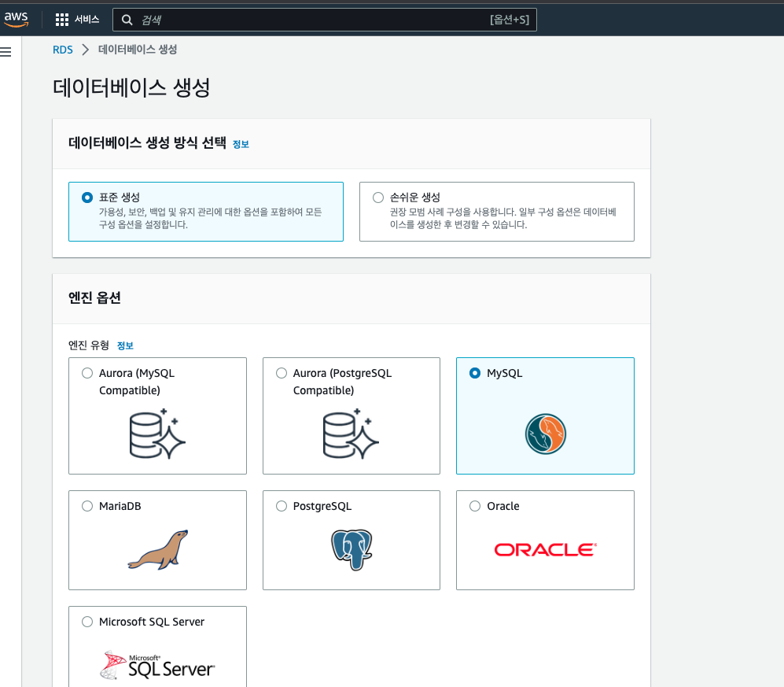
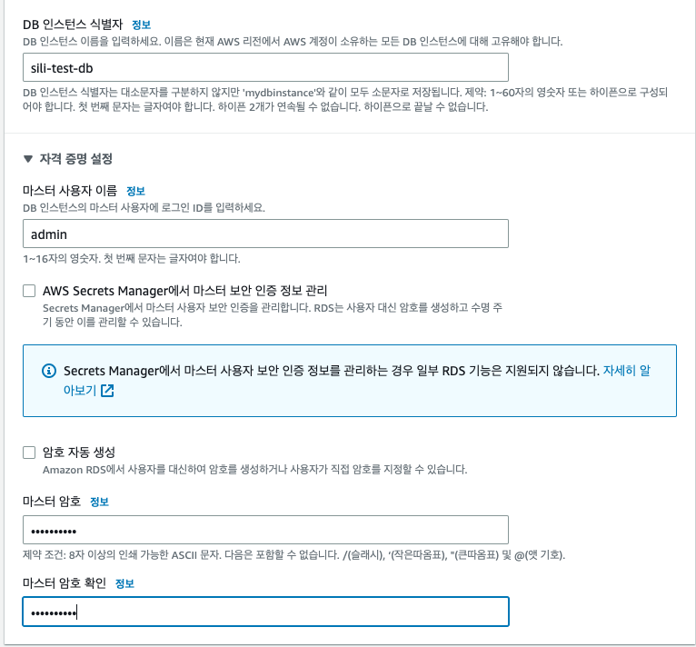
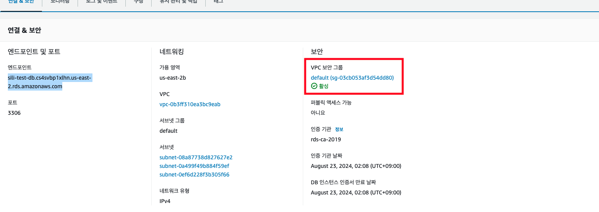
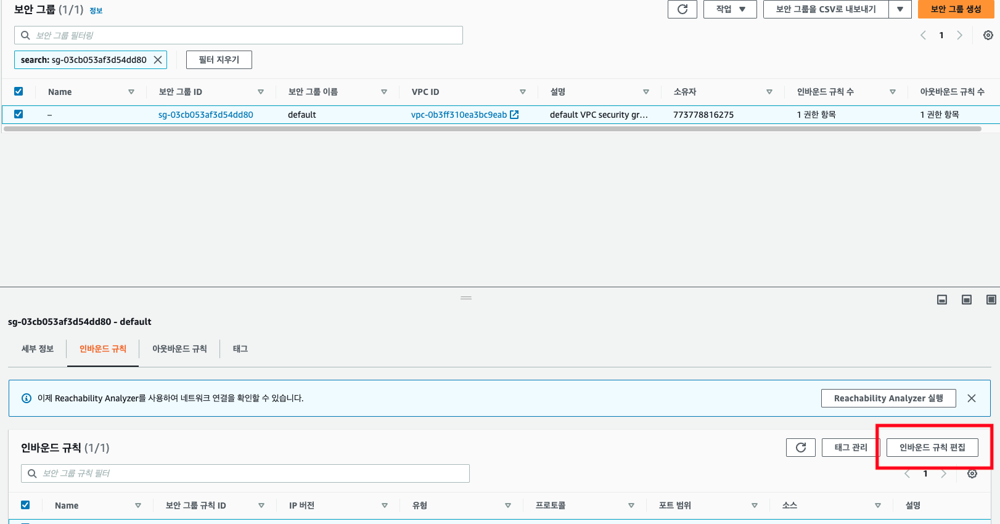
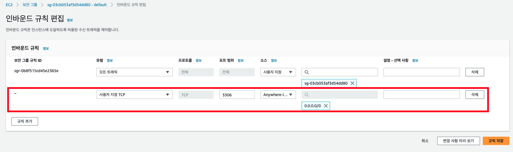
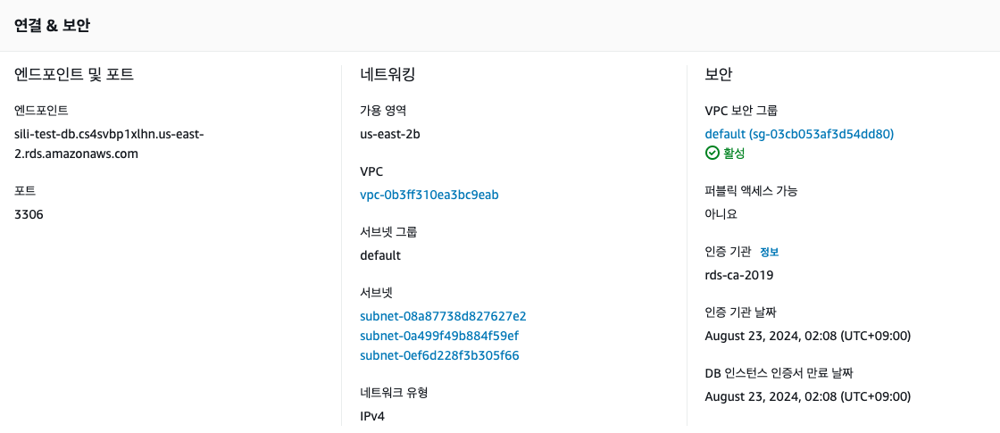
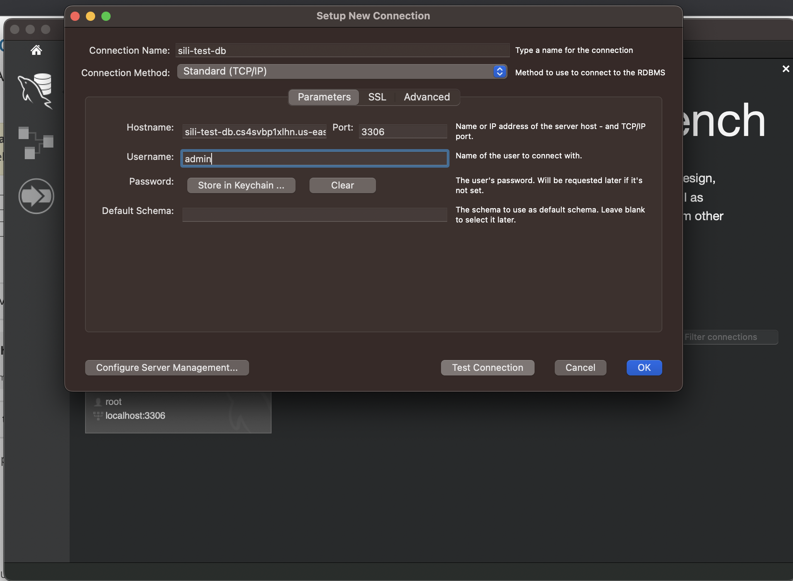
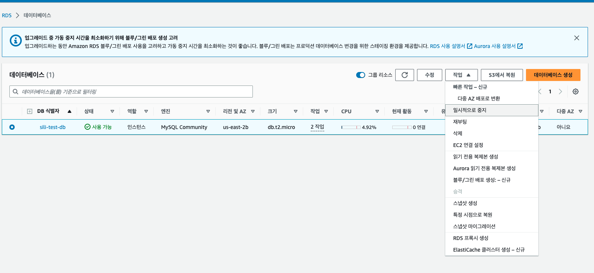
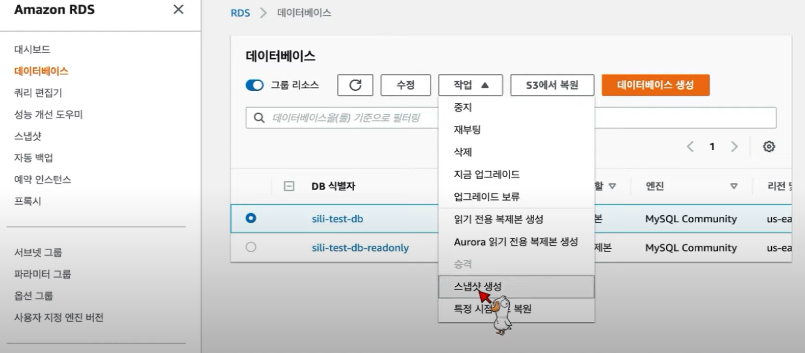
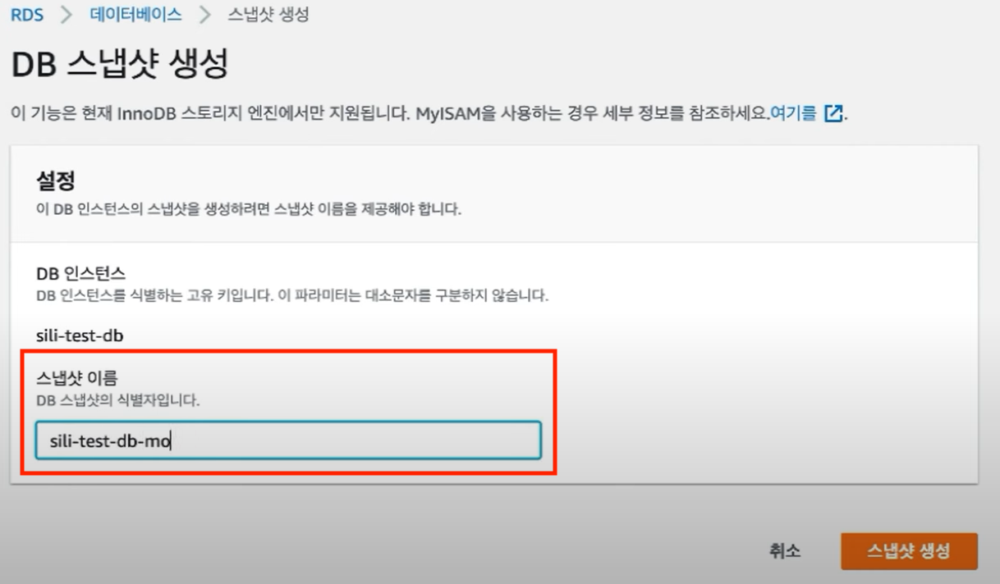

# AWS RDS

## RDS 생성 (1)

- 
- 
- RDS 생성

```
- DB 식별자는 DB의 용도에 맞게 지어주면 됨
- 아이디랑 비밀번호도 지정한다.
- DB 인스턴스 클래스는 한마디로 얼마나 좋은 컴퓨터를 빌릴 지 이다. (db.t2.micro)
- ✅ 퍼블릭 엑세스는 에를 체크한다.✅
- 나머지는 default사양으로 선택해 데이터베이스를 생성해준다.
```

<br />

## VPC 설정 (2)

- 
- 
- 

```
vpc는 공항의 검색대 , 인바운드 규칙을 입국절차라고 할 수 있다.
```

<br />

## RDS 포트 , 엔드포인트 지정 및 워크벤치 접속(3)

- 
- 

```
hostname : 확인한 엔드포인트
Username : 디비 만들 때 작성한 username
Password : 디비 만들 때 작성한 password
```

> 데이터 베이스 접속 완료

> 워크 벤치에서 테이블 및 데이터 삽입 삭제 실행

<br />

## 읽기 전용 데이터 베이스 생성 (4)

- 

```
-- 설정 --
💡 복제원본
💡 DB 인스턴스 식별자 : 데이터 베이스 이름 앞에 readonly 이름을 붙여준다.
💡 퍼블릭 엑세스 : ✅ 허용

> 나머지는 기본옵션으로 생성
```

> 읽기 전용 데이터 베이스 생성 완료

> 읽기 전용이기 때문에 데이터 추가가 불가능하다.

<br />
<br />

## 데이터 특정 상태 스냅샷 저장하기

- 
- 

```
스냅샷 보존을 이용해서 db를 이전 상태로 보존 할 수 있다.
이전에 스냅샷 시점의 데이터가 들어있는 인스턴스 생성 완료
```
