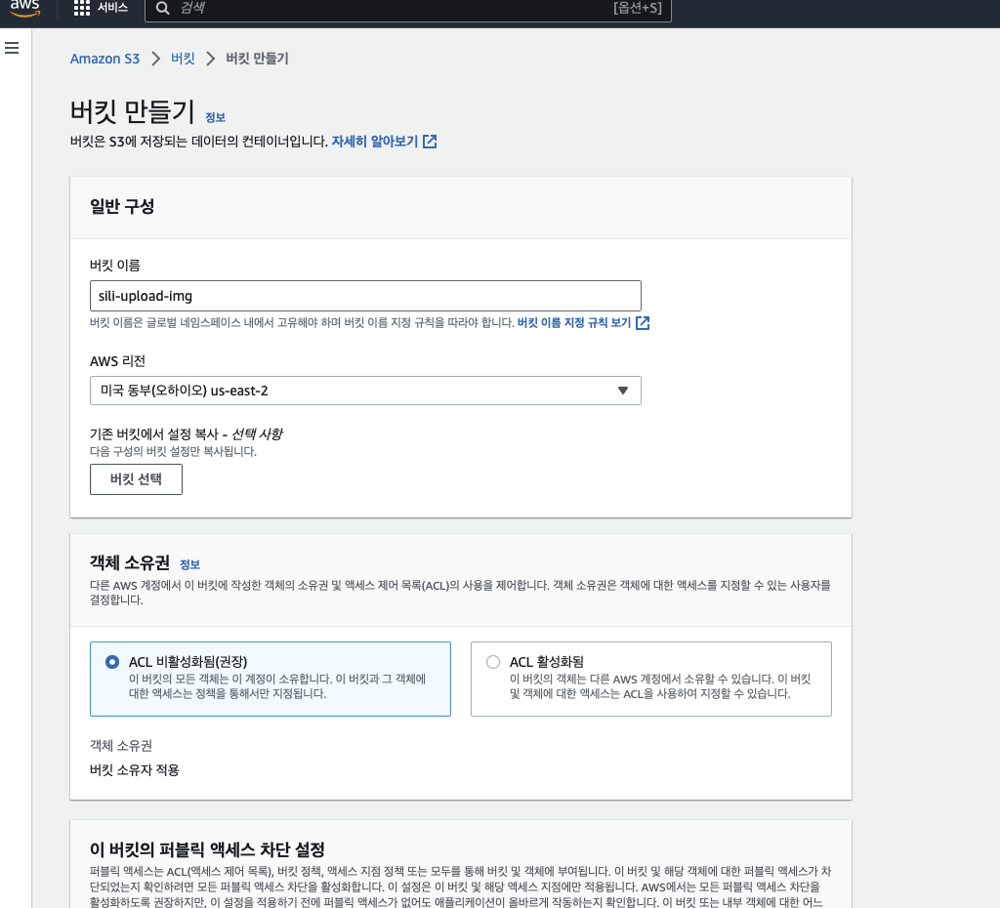
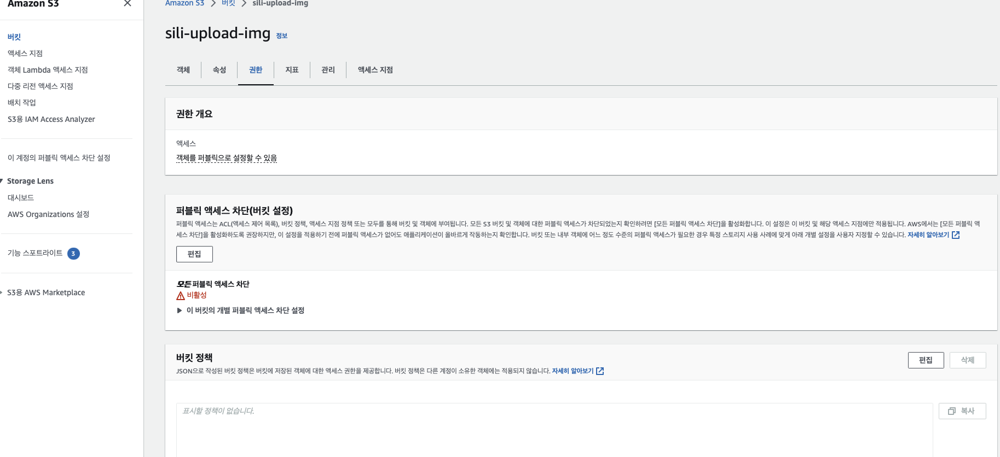
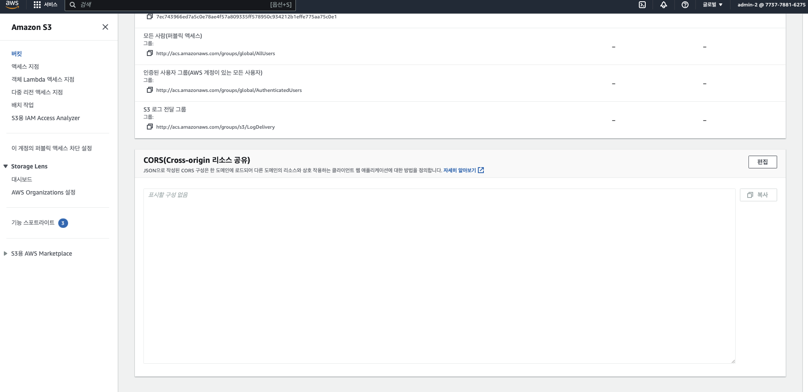
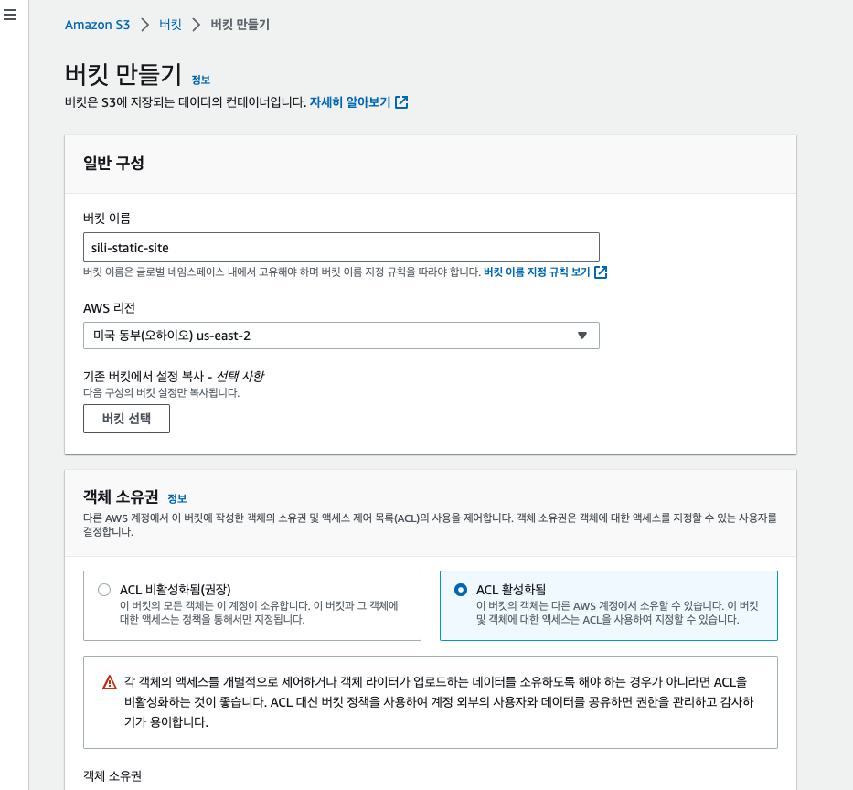
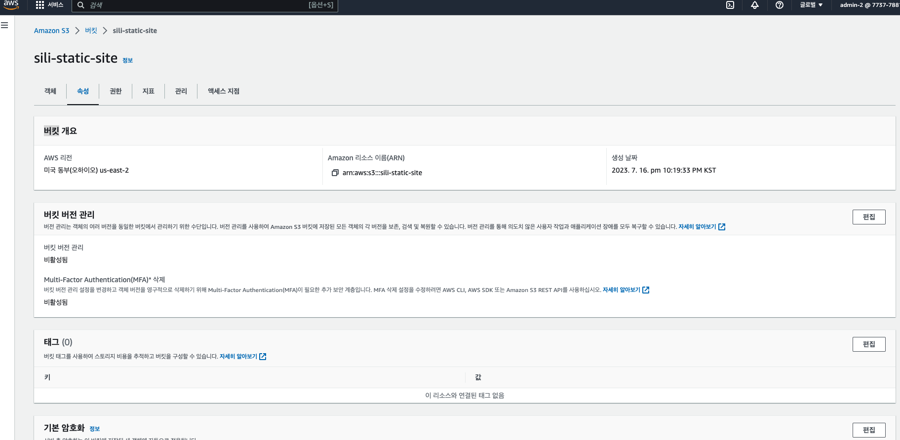
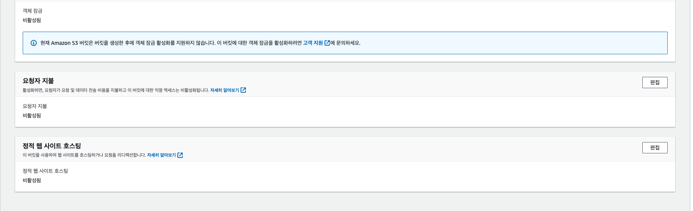
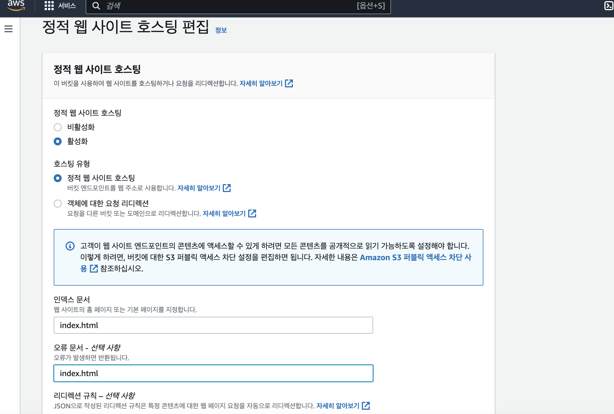
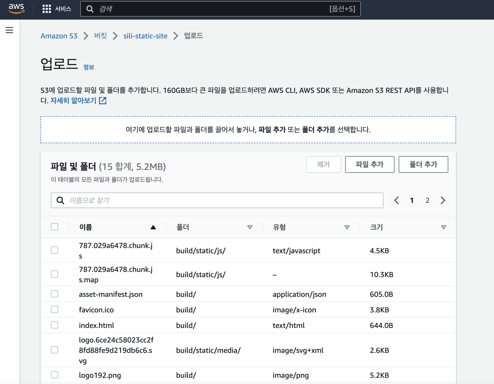
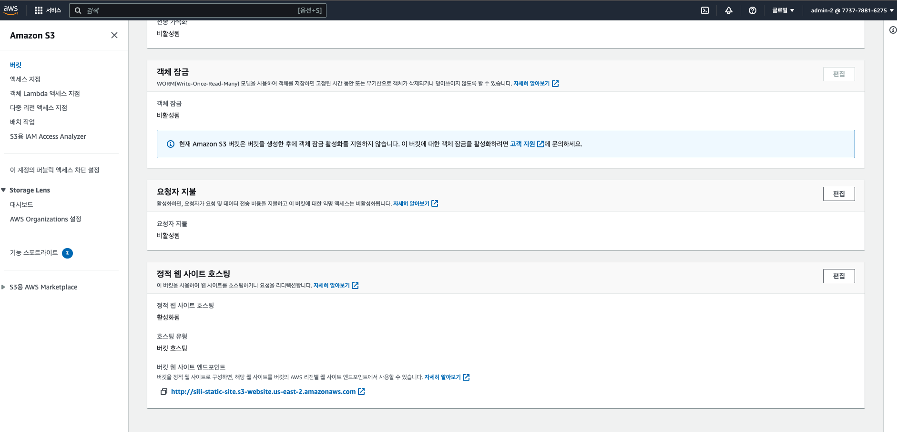

# AWS S3

## Aws 에서 S3 버킷 만들기 (1)

- 

```bash
💡 버킷 이름 : sli-upload-img
💡 AWS 리전 : us-east-2
💡 객체 소유권 : ACL 활성화됨
  - 버킷 소유자 선호

💡 이 버킷의 퍼블릭 엑세스 차단 설정을 모두 풀어준다.
✅ 모든 퍼블릭 액세스 차단을 비활성화하면 이 버킷과 그 안에 포함된 객체가 퍼블릭 상태가 될 수 있습니다. (체크)

💡 버킷 버전 관리
✅ 비활성화

💡 기본 암호화
✅ 비활성화


>>> S3 생성 완료
```

<br />
<br />

## 버킷 정책 만들기(2)

> 업로드된 파일에는 객체 url이라는게 생긴다. 이를 통해 이미지를 확인하려고 할 때 에러가 나오게 된다. (정책을 설정하지 않는다면)

- 
- 권한 > 버킷 정책 > 편집을 클릭한다.

> 정책 코드

> [버킷 이름]에 버킷 이름을 넣어주고 변경 사항 저장을 한다.

```
{
    "Version": "2012-10-17",
    "Statement": [
        {
            "Sid": "PublicReadGetObject",
            "Effect": "Allow",
            "Principal": "*",
            "Action": "s3:GetObject",
            "Resource": "arn:aws:s3:::[버킷 이름]/*"
        }
    ]
}
```

> 객체url로 이미지를 미리 볼 수 있게 되었다.

<br />
<br />

## 버킷 CORS 설정하기 (3)

- 

> 아래코드를 그대로 복사 붙여넣기 > 변경 사항 저장

> 정해진 도메인만 허용하고 싶다면, AllowOrigins에 넣어주면 된다.

```
[
    {
        "AllowedOrigins": [ "*" ],
        "AllowedMethods": [ "GET", "PUT", "POST", "HEAD" ],
        "AllowedHeaders": [ "*" ],
        "ExposeHeaders": [ "x-amz-server-side-encryption", "x-amz-request-id", "x-amz-id-2" ],
        "MaxAgeSeconds": 3000
    }
]
```

<br />
<br />

> 리액트 - aws 관련 라이브러리를 설치한다

```bash
npm i aws-sdk
npm i util
```

<br />

> aws로 이미지 전송하는 간단 코드
> access key , 버킷 이름, 버킷리전을 명시해준다.

```js
import logo from "./logo.svg";
import "./App.css";
import AWS from "aws-sdk";

export function onFileUpload(e) {
  const ACCESS_KEY = "계정 PUBLIC ACCESS KEY입력";
  const SECRET_ACCESS_KEY = "계정 SECRET ACCESS KEY입력";
  const REGION = "버킷리전";
  const S3_BUCKET = "버킷이름";

  // AWS ACCESS KEY를 세팅합니다.
  AWS.config.update({
    accessKeyId: ACCESS_KEY,
    secretAccessKey: SECRET_ACCESS_KEY,
  });

  // 버킷에 맞는 이름과 리전을 설정합니다.
  const myBucket = new AWS.S3({
    params: { Bucket: S3_BUCKET },
    region: REGION,
  });

  const file = e.target.files[0];

  // 파일과 파일이름을 넘겨주면 됩니다.
  const params = {
    ACL: "public-read",
    Body: file,
    Bucket: S3_BUCKET,
    Key: file.name,
  };

  myBucket
    .putObject(params)
    .on("httpUploadProgress", (evt) => {
      alert("SUCCESS");
    })
    .send((err) => {
      if (err) console.log(err);
    });
}
function App() {
  return (
    <div className="App">
      <input type={"file"} onChange={onFileUpload} />
    </div>
  );
}

export default App;
```

> 이미지 올렸을 때 S3에 저장 완료

<br />
<br />
<br />

```
# React - S3 이미지 업로드 완료
```

# React 정적 웹사이트 S3 배포

<br />

## 버킷 생성 (1)

```
위와 같은 방법으로 s3를 생성한다.
```

- 

<br />

## 위와 같은 방법으로 S3 버킷 정책, CORS를 설정해준다. (2)

- 

<br />

## 정적 사이트 배포 설정을 버킷에 설정한다. (3)

- 
- 
- 설정에 들어가 맨아래 있는 `정적 웹 사이트 호스팅`편집을 눌러준다.

- 

<br />

```
인덱스 문서가 기준 html이 된다.
번들링 파일은 index.html 기준으로 세팅하니 그렇게 설정한다.
오류 문서도 같게 설정한다. (리액트 기준)
```

<br />

```bash
# 빌드해서 웹 사이트 빌드한다.
npm run build
# S3 파일 업로드를 진행한다.
```

<br />

## S3 파일 업로드를 진행한다 (4)

- 
- 
