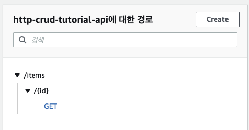
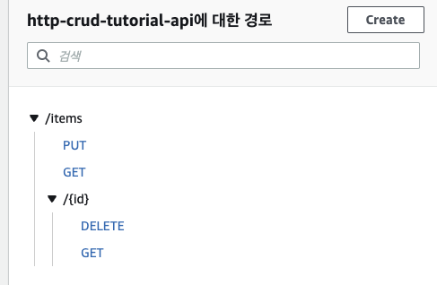
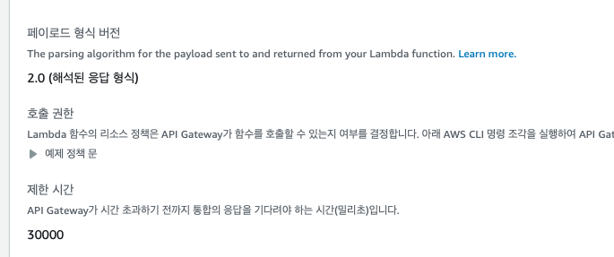
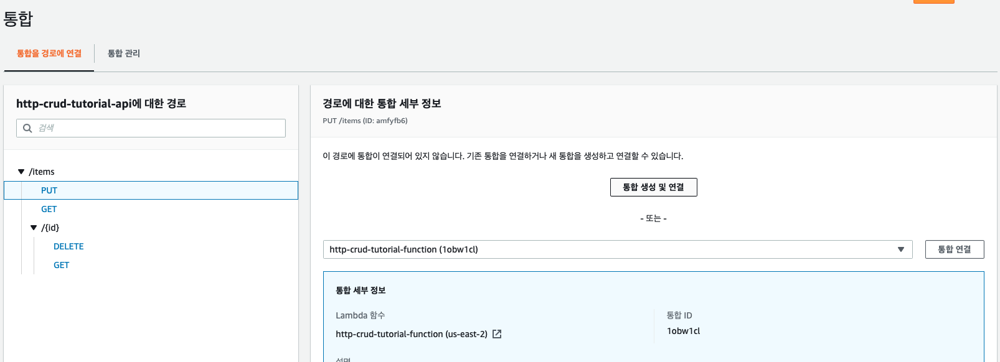
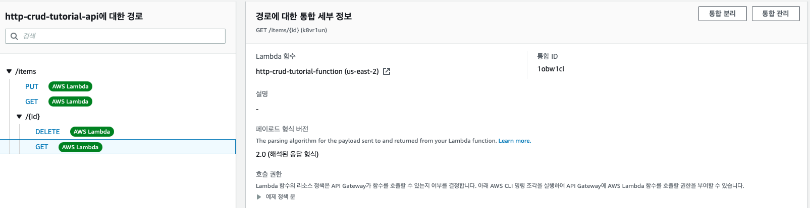
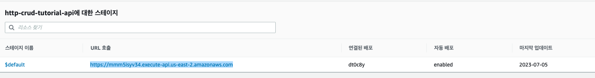

# SERVER LESS HTTP API (REST API 보다 싸고 성능 안좋음)

## DynamoDB 생성 (1)

- DynamoDB 대시보드 -> 테이블 생성
  - 테이블 이름 : http-crud-tutorial-items
  - 파티션 키 : id (문자열)
  - ✅ 기본 설정
  - 테이블 생성

<br />

## Lambda 함수 생성 (2)

- Lambda 대시보드 -> 함수 생성

  - 함수 이름 : http-crud-tutorial-function
  - 런타임 : node.js 18 version (Default)
  - 아키텍쳐 : x86_64 (Default)
  - 기본 실행 역할 변경
    - ✅ AWS 정책 템플릿에서 새 역할 생성
      - 역할 이름 : http-crud-tutorial-role
      - 정책 템플릿 : ✅ 단순 마이크로서비스 권한
  - 함수 생성

<br />

- Lambda 함수 추가

> 코드 소스 http-crud-tutorial-function > index.mjs

```mjs
// 아래 코드 복붙 후 deploy
import { DynamoDBClient } from "@aws-sdk/client-dynamodb";
import {
  DynamoDBDocumentClient,
  ScanCommand,
  PutCommand,
  GetCommand,
  DeleteCommand,
} from "@aws-sdk/lib-dynamodb";

const client = new DynamoDBClient({});

const dynamo = DynamoDBDocumentClient.from(client);

const tableName = "http-crud-tutorial-items";

export const handler = async (event, context) => {
  let body;
  let statusCode = 200;
  const headers = {
    "Content-Type": "application/json",
  };

  try {
    switch (event.routeKey) {
      case "DELETE /items/{id}":
        await dynamo.send(
          new DeleteCommand({
            TableName: tableName,
            Key: {
              id: event.pathParameters.id,
            },
          })
        );
        body = `Deleted item ${event.pathParameters.id}`;
        break;
      case "GET /items/{id}":
        body = await dynamo.send(
          new GetCommand({
            TableName: tableName,
            Key: {
              id: event.pathParameters.id,
            },
          })
        );
        body = body.Item;
        break;
      case "GET /items":
        body = await dynamo.send(new ScanCommand({ TableName: tableName }));
        body = body.Items;
        break;
      case "PUT /items":
        let requestJSON = JSON.parse(event.body);
        await dynamo.send(
          new PutCommand({
            TableName: tableName,
            Item: {
              id: requestJSON.id,
              price: requestJSON.price,
              name: requestJSON.name,
            },
          })
        );
        body = `Put item ${requestJSON.id}`;
        break;
      default:
        throw new Error(`Unsupported route: "${event.routeKey}"`);
    }
  } catch (err) {
    statusCode = 400;
    body = err.message;
  } finally {
    body = JSON.stringify(body);
  }

  return {
    statusCode,
    body,
    headers,
  };
};
```

<br />

## API Gateway 추가 (3)

- API Gateway -> HTTP API 구축

  - API 이름 : http-crud-tutorial-api
  - 나머지 모두 Default로 다음 누르면 API Gateway 생성 완료

> api 주소 router 생성

- API Gateway -> 생선된 게이트 웨이 선택 -> Routes -> create
  - ✅ GET 선택 후 input창에 `/items/{id}` 입력 후 생성
  - 
  - 
  - 총 4개 생성
    - GET : /items
    - GET : /items/{id}
    - PUT : /items
    - DELETE : /items/{id}
  - 배포는 아직 누르지 않는다.

<br />

## API Integrations 연결 (4)

> Lamdba에 http api를 연결시키는 작업

- API Gateway -> Develop -> Integrations
  - 통합 관리 탭 선택 -> Create 선택
  - 이 통합을 경로에 연결 : [공백]
  - 통합 대상 : ✅ Lambda 함수
  - 통합 세부 정보
    - AWS 리전 : ✅ us-east-2
    - Lambda 함수 : ✅ arn:aws:lambda:us-east-2:773778816275:function:http-crud-tutorial-function
    - 호출 권한 : ✅
    - Create 클릭
    - 

<br />

- API -> Gateway -> Develop -> Integrations
  - 통합을 경로에 연결
  - 생성한 4개의 api에 람다를 통합 연결하기
    - 
    - put , get , delete , get 모두 통합 연결 클릭
      - 

> 끝끝 <br /> [ 모든 api 람다에 연결 완료 ] <br /> Deploy는 연결할 필요 없다.

> api 만들기는 끝

- 
  - url 호출 뒤에 / 엔드포인터 넣어서 api 호출한다.

<br />

## API 테스트 하기 (5)

```bash
# api 요청 테스트 하기

#Get 요청
https://mmm5isyv34.execute-api.us-east-2.amazonaws.com/items

#put 요청
https://mmm5isyv34.execute-api.us-east-2.amazonaws.com/items
{
 "id":"id-1",
 "price":10000,
 "name":"name1"
}

#Delete 요청 items-2 삭제
https://mmm5isyv34.execute-api.us-east-2.amazonaws.com/items/1
```

<br />

## CORS 구성 [선택] (6)

- API Gateway -> Develop -> CORS -> 구성
  - 
  - Access-Control-Allow-Methods : GET / POST/ PUT /DELETE / \*
  - Access-Control-Allow-Headers : authorization, \*
  - Access-Control-Max-Age : 300
  - Access-Control-Allow-Origin : \*
  - Access-Control-Allow-Credentials : No
  - Access-Control-Expose-Headers : date, x-api-id
  - 저장

<br />

## 전부 삭제 (7)

- Dynamic table 삭제
- api-gateway 삭제
- 람다 함수 삭제
- log-groups 삭제
- 역할 삭제
