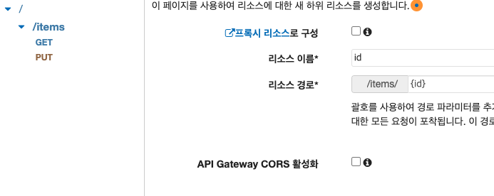
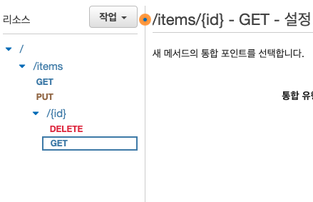
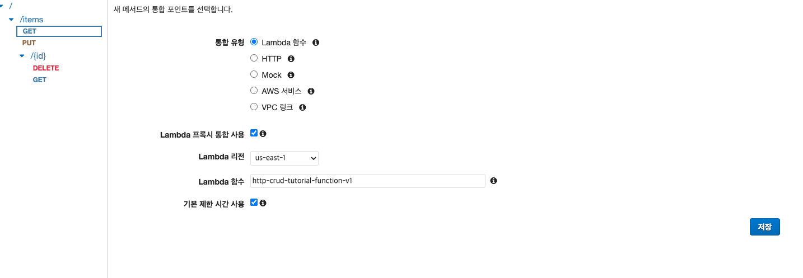
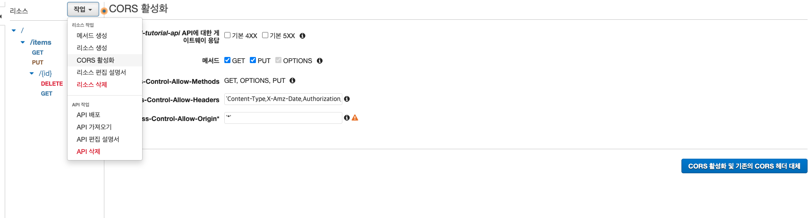

# API SERVERLESS REST API (REST API)

## Dynamic DB 생성 (1)

- Dynamic DB 대시 보드 -> 테이블 생성
  - 테이블 이름 생성 : http-crud-tutorial-items
  - 파티션 키 생성 : id [문자열]
  - 나머지 Default 설정으로 테이블 생성

> Dynamic DB 생성 완료

<br />

## Lambda 생성 (2)

- Lambda 대시보드 -> 함수 생성
  - 함수 이름 : http-crud-tutorial-function-v1
  - 아키텍쳐 : x86_64
  - ✅ AWS 정책 템플릿에서 새 역할 생성
    - 역할 이름 : http-crud-tutorial-role
    - 정책 템플릿 : 단순 마이크로서비스 권한
    - 생성

> 생성 후 코드 소스에 아래 코드 삽입 http-crud-tutorial-function-v1 > index.mjs

> 후 코드 복붙 후 deploy

```js
import { DynamoDBClient } from "@aws-sdk/client-dynamodb";

import {
  DynamoDBDocumentClient,
  ScanCommand,
  PutCommand,
  GetCommand,
  DeleteCommand,
} from "@aws-sdk/lib-dynamodb";

const client = new DynamoDBClient({});

const dynamo = DynamoDBDocumentClient.from(client);

const tableName = "http-crud-tutorial-items";

export const handler = async (event, context) => {
  let body;

  let statusCode = 200;

  const headers = {
    "Content-Type": "application/json",
  };

  try {
    switch (`${event.httpMethod} ${event.resource}`) {
      case "DELETE /items/{id}":
        await dynamo.send(
          new DeleteCommand({
            TableName: tableName,

            Key: {
              id: event.pathParameters.id,
            },
          })
        );

        body = `Deleted item ${event.pathParameters.id}`;

        break;

      case "GET /items/{id}":
        body = await dynamo.send(
          new GetCommand({
            TableName: tableName,

            Key: {
              id: event.pathParameters.id,
            },
          })
        );

        body = body.Item;

        break;

      case "GET /items":
        body = await dynamo.send(new ScanCommand({ TableName: tableName }));

        body = body.Items;

        break;

      case "PUT /items":
        let requestJSON = JSON.parse(event.body);

        await dynamo.send(
          new PutCommand({
            TableName: tableName,

            Item: {
              id: requestJSON.id,

              price: requestJSON.price,

              name: requestJSON.name,
            },
          })
        );

        body = `Put item ${requestJSON.id}`;

        break;

      default:
        throw new Error(`Unsupported route: "${event.routeKey}"`);
    }
  } catch (err) {
    statusCode = 400;

    body = err.message;
  } finally {
    body = JSON.stringify(body);
  }

  return {
    statusCode: statusCode,

    headers: headers,

    isBase64Encoded: false,

    body: body,
  };
};
```

<br />

## API GATEWAY 생성 (3)

- API GATEWAY -> REST API 구축 선택
  - 프로토콜 선택 : ✅ REST
  - 새 API 생성 : ✅ 새 API
  - 설정 API 이름 : http-crud-tutorial-api
  - API 생성

<br />

> api 라우터 생성

- Amazone API Gateway
  - 
  - 리소스 -> 작업 -> 리소스 생성 : items
  - 
  - 
    - 리소스 생성 / 메소드 생성 해가면서 api를 만듦
  - 
    - 각 api 마다
      - 통합 유형 : Lamda함수
      - Lambda 프록시 통합 사용 : ✅
      - Lambda 리전 : Lambda 함수 지역
      - Lambda 함수 : 생성한 Lambda 함수 이름

<br />

> CRUD API 완성

## CORS 대응 (4)

- query string 마다 작업 -> CORS 활성화 -> 전부 Default 값으로 해더 대체 버튼 클릭

  - 
  - 기본값으로 선택 후 CORS 활성화 및 기존의 CORS 해더 대체
  - 예, 기본값으로 대체 하겠습니다.

<br />

## 배포 하기 (5)

- / -> 리소스 -> 작업 -> api 배포
  - API 배포
    - 배포 스테이지 : 새 스테이지
    - 스테이지 이름 : api
    - 스테이지 설명 : rest api
    - 배포 설명 : deploy

<br />

> 배포 완료 / api를 수정하면 배포를 다시 해야한다.

> api를 추가할 때 마다 다시 배포를 진행해야한다.

---

## 삭제 과정

- amazon API gateway 삭제
- lamdba 삭제
- dynamoDB 테이블 삭제
