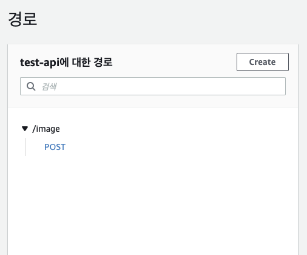
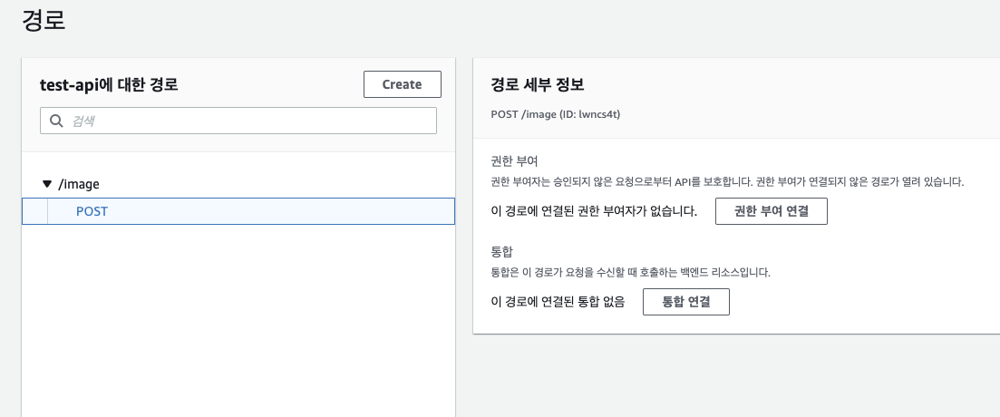
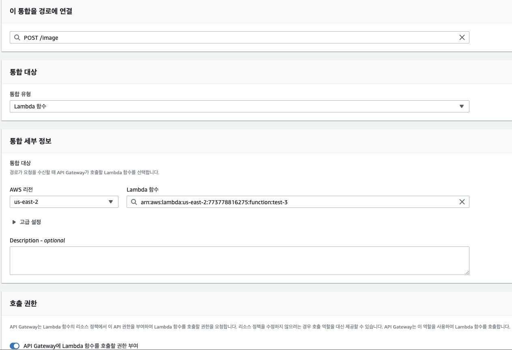
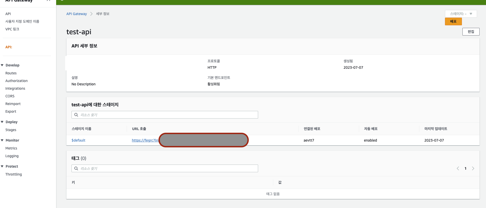
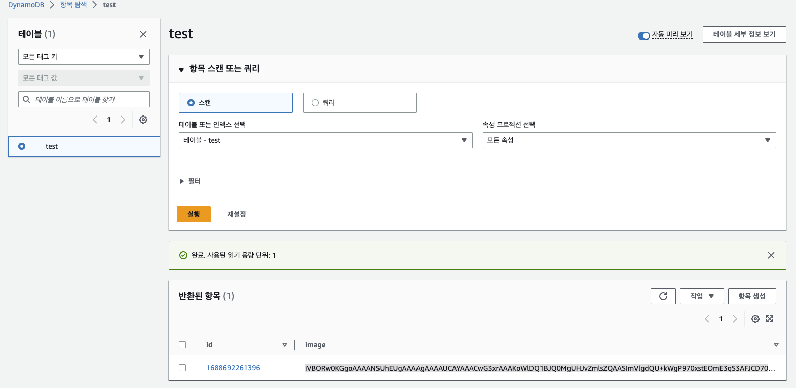

# AWS SERVERLESS IMAGE UPLOAD HTTP

```bash
### 전체 구조 ###
API -> LAMbda -> DynamoDB
API <- LAMbda <- DynamoDB

## DynamoDB 이미지 400kb만 사용 가능
```

<br />

## HTTP API 생성 (1)

- API Gateway -> Http api 구축
  - API 생성 API 이름 : test-api -> 다음
  - 전부 Default값 선택 후 -> 다음 -> 생성

> api 생성 완료

<br />

## HTTP Routes 생성 (2)

- API Gateway -> Develop -> Routes
  - Create
    - 경로 및 메서드
    - POST /image
    - 

> api 주소 엔드포인트 설정 완료

<br />

## Lamdba 생성 (3)

- Lamdba 생성하기
  - 함수 생성
  - 함수 이름 : test-3
  - 아키텍처 : x86_64
  - 기본 실행 역할 변경
    - ✅ aws 정책 템플릿에서 새 역할 생성
    - 역할 이름 : simple-microservice-permissions
    - 정책 템플릿 - 선택 사항 : ✅ 단순 마이크로서비스 권한
    - ✅ 함수 생성

> 백엔드 코드 설정 완료

<br />

## API + Lamdba 연결 (4)

- 위 (1)에서 생성한 API Gateway -> Develop -> Routes 접속
  - 
  - 통합 연결 클릭
    - 통합 연결
    - 이 통합을 경로에 연결 : ✅ POST / image
    - 통합 대상 : Lambda 함수
    - 통합 세부 정보 : AWS 리전 / Lambda 함수 선택
    - 
    - 
    - ✅ 생성

> api gateway + lambda 연결 완료 (백엔드 코드 + 라우터 연결)

<br />

## DynamoDB 생성 및 Lamdba(test-3) 코드 수정

- DynanoDB 생성
  - 데이블 이름 : test
  - 파티션 키 : id (문자열)
  - ✅ Default 설정으로 생성

<br />

> Lambda 코드 수정

```js
//위 [Lamdba 생성 (3)]에서 만든 Lambda코드 수정
import { DynamoDBClient } from "@aws-sdk/client-dynamodb";
import {
  DynamoDBDocumentClient,
  ScanCommand,
  PutCommand,
  GetCommand,
  DeleteCommand,
} from "@aws-sdk/lib-dynamodb";

const client = new DynamoDBClient({});

const dynamo = DynamoDBDocumentClient.from(client);

//테이블 이름
const tableName = "test";

export const handler = async (event, context) => {
  let body;
  let statusCode = 200;
  const headers = {
    "Content-Type": "application/json",
  };

  try {
    switch (event.routeKey) {
      //APi gateway 주소 api gateway routes 주소
      case "POST /image":
        await dynamo.send(
          new PutCommand({
            TableName: tableName,
            // DynamoDB 테이블 input
            Item: {
              id: String(Date.now()),
              image: event.body,
            },
          })
        );
        body = `Post image created`;
        break;
      default:
        //에러 시
        throw new Error(`Unsupported route: "${event.routeKey}"`);
    }
  } catch (err) {
    statusCode = 400;
    body = err.message;
  } finally {
    // 성공 return 메세지
    body = JSON.stringify(body);
  }

  return {
    statusCode,
    body,
    headers,
  };
};
```

> Deploy 적용 완료

- 이미지 DynamoDB에 잘 올라온 것 확인
  - 
