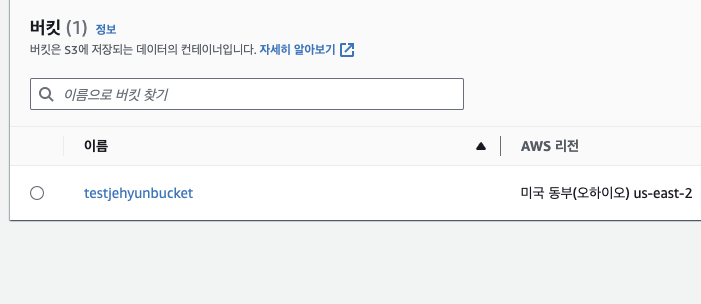
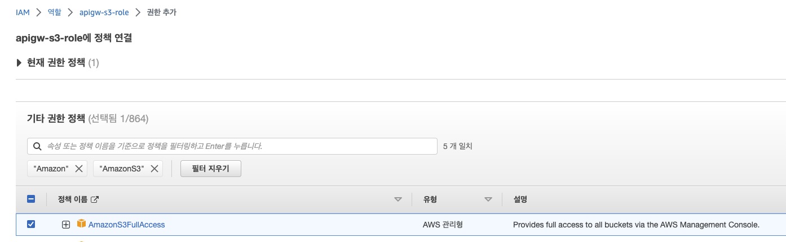
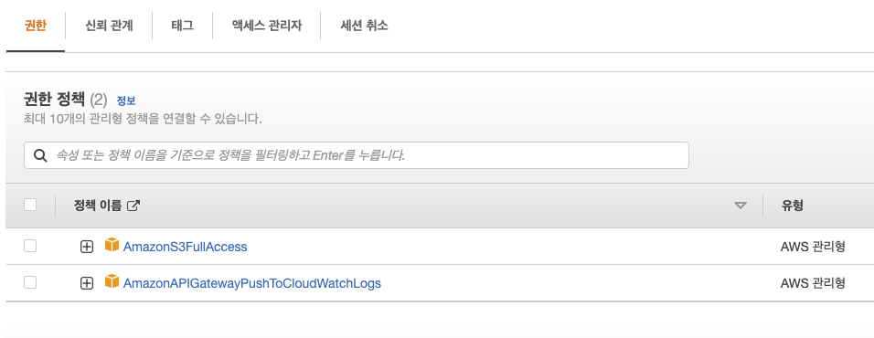
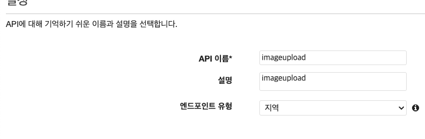
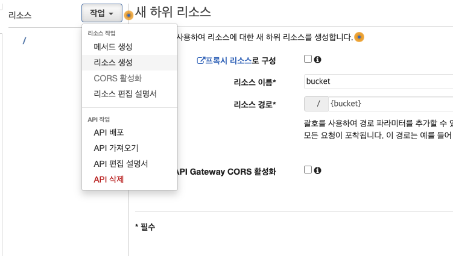
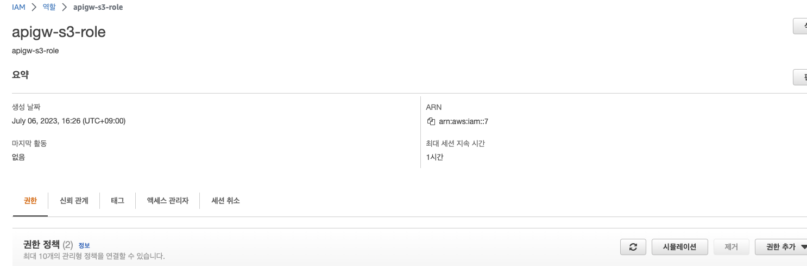
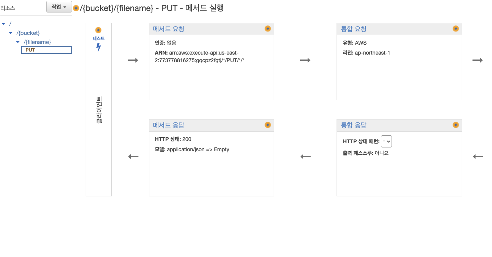
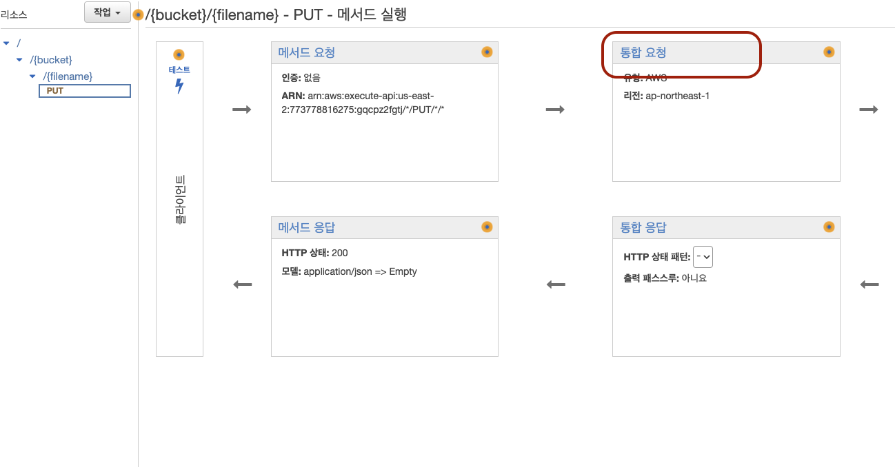
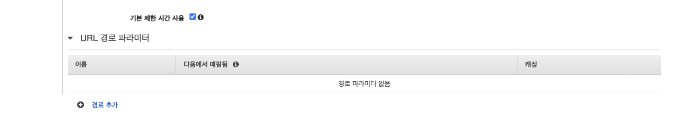
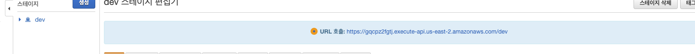

# Image Upload Rest API

```
 이미지 저장 방법
1. POST body
2. POST form-data
3. Binary File S3

## api gateway -> s3
```

<br />

## amazon S3 (1)

- 버킷 생성 >
  - 버킷 이름 : Test S3
  - 객체 소유권 : ✅ ACL 비활성화
  - 이 버킷의 퍼블릭 액세서 차단 설정 ✅ (테스트 할때 풀고 진행)
    - ✅를 안하고 진행한다면 아래 ✅ 모든 퍼블릭 액세스 차단을 비활성화하면... 체크한다.
  - 나머지는 Default 설정으로 `버킷 만들기` 선택!
  - 

> S3 생성완료

<br />

## 역활 생성하기 (2)

- Iam 대시보드 -> 역할 만들기
  - 신뢰할 수 있는 엔터티 유형 : AWS 서비스
  - 사용 사례 : 다른 AWS 서비스 사용 사례 (API Gateway) 후 다음
    - 권한 추가
    - Default 후 다음
      - 역할 세부 정보
      - 역할 이름 : apigw-s3-rule
      - 설명 : 대충 설명
      - 권한 생성 완료

<br />

- 만든 역할에 `AmazonS3FullAccess 권한`을 `추가`한다.
  - 
  - 

> 권한 설정 완료!

<br />

## API Gateway 생성하기 (REST API 생성) (3)

- api gateway -> REST API 구축
  - 프로토콜 선택 : REST
  - 새 API 생성 : ✅ 새 API
  - 설정 : api 이름 , 설명 , 엔드포인트 유형
  - 
  - API 생성

<br />
<br />

## API Gateway (REST API 생성) 리소스 생성 (4)

- api gateway 리소스 생성 (`bucket` / `filename`)
  - 
  - `/{bucket}/{filename}`

<br />
<br />

## API Gateway (REST API 생성) 메소드 생성 및 S3 연결(5)

```bash
# 현재 구조
/
  /{bucket} - 리소스
    /{filename} - 리소스
    put - 메소드

#####메소드 생성#####
통합 유형 : AWS 서비스
AWS 리전 : ap-northeast-1
AWS 서비스 : simple Storage Service (S3)
하위 도메인 :
HTTP 메서드 : put
작업 유형 : ✅ 경로 재정의 사용
경로 재정의 (선택 사항) : {bucket}/{filename}
실행 역할 : 위의 (2)에서 생성한 rule의 arn
콘텐츠 처리 : 패스스루
기본 제한 시간 사용 : ✅
```

- S3 연결 및 메소드 생성
  - 
  - 
  - 

<br />

## api 설정 마무리 (6)

- 
  - put 메소드에서 통합 요청
  - 
    - 경로 파라미터 추가

```bash
## put 메서드 -> 통합 요청 -> URL 경로 파라미터

bucket(이름) | method.request.path.bucket (다음에서 매핑됨)|
filename(이름) | method.request.path.filename (다음에서 매핑됨) |

## api gateway > api > 설정 > 이진 미디어 형식
image/png
image/jpeg
image/jpg
추가

## 위 두 설정 후에 api로 돌아간다음 배포하면 끝!!!
```

- 
  - 완료

```
binary 형식으로 프론트에서 보내주면 됨

```
