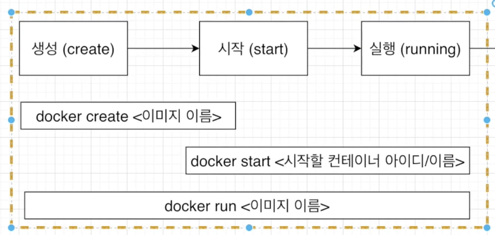
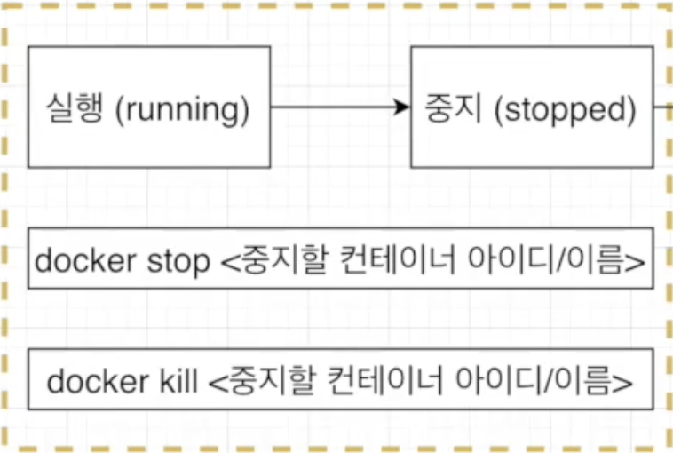
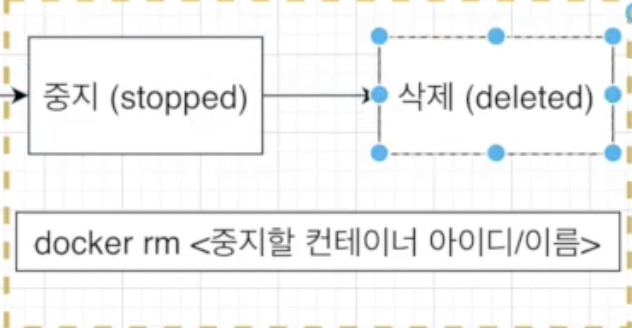
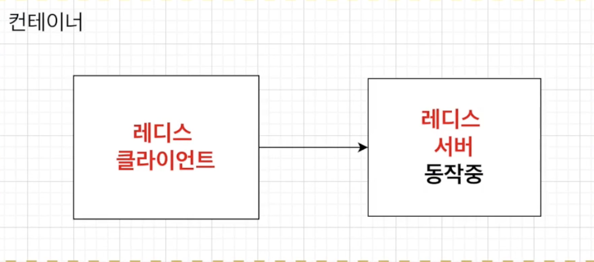

# Docker

<br />

## 기본적인 Docker 명령어

```bash
###docker run hellow-world###
docker run hello-world
[도커 클라이언언트언급] [컨테이너 생성 및 실행] [이 컨테이너를 위한 이미지]

docker run alpine ls
[도커 클라이언언트언급] [컨테이너 생성 및 실행] [이 컨테이너를 위한 이미지] [이미지가 있는 시작 명령어를 무시하고 여기에 있는 커멘드 실행 (파일 검색)]

작동 순서
1. 도커 클라이언트에 명령어 입력 후 도커 서버로 보냄
2. 도커 서버에서 컨테이너를 위한 이미지가 이미 캐쉬가 되어 있는지 확인
3. 없으면 도커 허브에서 다운 받아옴 있다면 이미 가지고 있는 이미지로 컨테이너 생성
```

<br />

## 현재 실행중인 컨테이너 나열하기

```bash
## 실행되고 있는 컨테이너 리스트 확인
docker ps
[도커 클라이언트 언급] [process status]

## 원하는 항목만 보기 NAMES / Image 항목만 보기
docker ps --format 'table{{.Name}}\table{{.Image}}'

## 모든 컨테이너 확인
docker ps -a

-- 리스트 설명 --
CONTAINER ID   IMAGE     COMMAND            CREATED         STATUS         PORTS     NAMES
99908e3a16bb   alpine    "ping localhost"   3 seconds ago   Up 2 seconds             mystifying_merkle


```

- `docker ps` `명령어 알아보기`

| CONTAINER ID            | IMAGE                             | COMMAND                       | CREATED              | STATUS        | PORTS     | NAMES              |
| ----------------------- | --------------------------------- | ----------------------------- | -------------------- | ------------- | --------- | ------------------ |
| 99908e3a16bb            | alpine                            | "ping localhost"              | 3 seconds ago        | Up 2 seconds  | -         | mystifying_merkle  |
| 컨테이너 고유 id 해쉬값 | 컨테이너 생성 시 만든 도커 이미지 | 컨테이너 생성시 실행될 명령어 | 컨테이너 생성된 시간 | 컨테이너 상태 | 연결 포트 | 컨테이너 고유 이름 |

<br />

## 도커의 생명 주기 [생성 -> 시작 -> 실행]

- 

```bash
# hello-world 파일 스냅샷을 컨테이너 하드디스크에 넣어줌 + 컨테이너 생성
docker create hello-world
# 19f2a5dc69985baeb0a4f13a25d6972d6bc7ecd7c623689a44cc9e8d4a077d7c

# 컨테이너 구동 시 실행될 명령어 실행
docker start hello-world
# Hello from Docker!

# Create -> Start === running 합친 거
```

<br />

## 도커의 생명 주기 [Stop -> Kill]

- 

```bash
# 도커 중단하기
1. docker stop 99908e3a16bb
2. docker kill 99908e3a16bb
```

`Kill 과 Stop의 차이점`

- `Kill`
  - 어떠한 것도 기다리지 않고 바로 종료시킨다.
- `Stop`
  - Gracefully하게 중단시킨다.
  - 메세지를 보내고 있었다면 보내고 있던 메세지를 완료하고 중지 시킨다.

<br />

## 도커의 생명 주기 [Stop -> deleted]

- 

```bash
# 도커 이미지 삭제
# 실행중인 컨테이너를 모두 중지한 후에 사용가능하다.
docker rm 99908e3a16bb

#모든 컨테이너 삭제
docker rm `docker ps -a -q`

#모든 도커 이미지를 삭제
docker rmi <이미지id>
```

<br />

## 실행중인 컨테이너에 명령을 전달



```bash
# 실행중인 컨테이너에게 명령어를 전달
docker exec 99908e3a16bb ls

# docker run
- 새로 컨테이너를 만들어서 실행
# docker exec
- 이미 실행중인 컨테이너에 명령어를 전달
```

<br />

## redis 서버 컨테이너 구동

```bash
# redis서버 컨테이너에서 구동
docker run redis

# exec명령어를 통해 redis 서버 컨테이너에 명령어를 전달
# docker exec -it [컨테이너id] redis-cli
docker exec -it 71b9b296c4a4 redis-cli
# redis 클라이언트 접속 완료


## 컨테이너 안에 쉘이나 터미널 환경으로 접속하는 방법
## 하나씩 말고 계속 명령어를 전달시키는 방법
docker exec -it [컨테이너id] sh
```

- `-it`명령어 --> `-it`를 붙여줘야 명령어를 실행 한 후 계속 명령어를 적을 수 있다.
- `-it`명령어가 없다면 redis-cli를 실행하고 바로 밖으로 나와버린다.
