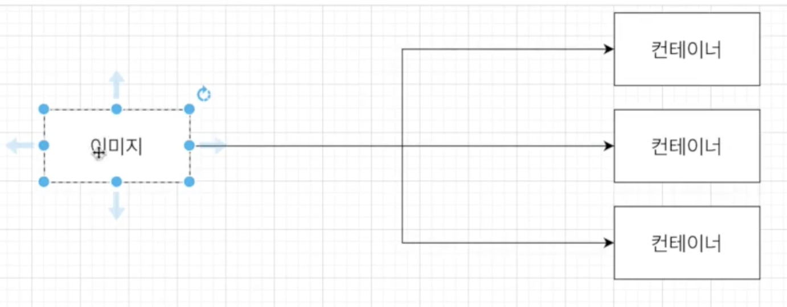
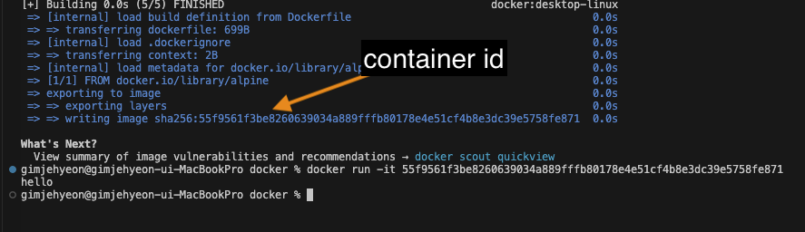
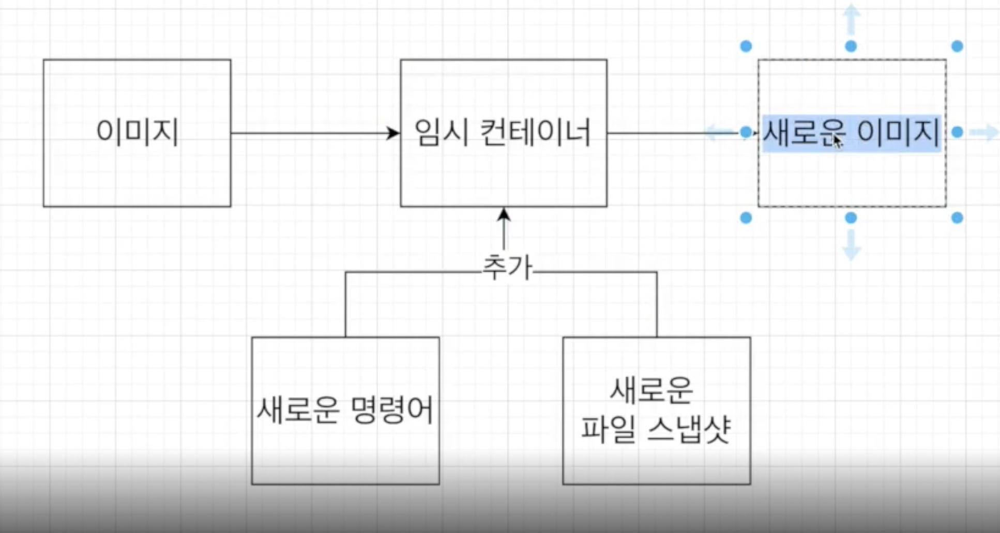

# Docker 이미지 만들기

- 

<br />

```bash
# 도커 이미지 생성하는 순서
[Dockerfile 작성] -> [도커 클라이언트] -> [도커 서버] -> [이미지 생성]

# 1. Dockerfile : Docker Image를 만들기 위한 설정 파일
# 2. 도커 클라이언트 : 도커 파일에 입력된 것들이 도커 클라이언트에 전달되어야한다.
# 3. 도커 서버 : 도커 클라이언트에 전달된 모든 중요한 작업들을 하는 곳
# 4. 이미지 생성
```

<br />

## Dockerfile 파일 생성(1)

> 도커 이미지를 만들기 위한 `설정 파일`이며, 컨테이너가 `어떻게 행동`해야 하는지에 대한 `설정 정의`

```bash
## 도커파일 만드는 순서
1. 베이스 이미지 명시 (파일 스냅샷에 해당)
  - 베이스 이미지 : 무슨 OS 사용할 지?
2. 추가적으로 필요한 파일 다운 받기 위한 몇가지 명령어 명시 (파일 스냅샷에 해당)
3. 컨테이너 시작시 실행 될 명령어를 명시해준다. (시작시 실행될 명령어에 해당)

## 이미지
[시작시 실행될 명령어]-[파일 스냅샷]
```

<br />

> 도커 파일 생성

```Docker
# 베이스 이미지 명시 무슨 OS 사용할 지 명시
# <이미지 이름> : <테그 형식>
# 태그를 붙이지 않는다면, 가장 최신것을 다운 받음
# ubuntu or linux를 사용해도 되지만 일단 alpine 사용
FROM alpine

# 추가적으로 필요한 파일들을 다운로드 받는다.
# RUN 도커 이미지가 생성되기 전에 수행될 쉘 명령어
# RUN command


# 컨테이너 시작시 실행 될 명령어를 명시해준다.
# CMD - 컨테이너가 시작되었을 때 실행할 실행 파일 / 쉘 스크립트
# CMD는 Dockerfile내에서 한번 사용 가능
CMD [ "echo","hello" ]
```

- 

<br />

## 도커 파일로 이미지 만들기(2)

- 

```bash
# Dockerfile에 입력된 것들이 도커 클라이언트에 전달되어서 도커 서버가 인식하게 해야한다.
- docker build ./
or
- docker build .


## 이미지 만드는 과정
alpine 이미지 -> 임시컨테이너 [하드 디스크에 넣음] -> cmd를 넣어주고 -> 이미지 생성
## 이미지 만드는 과정 결론
베이스 이미지에서 다른 종속성이나 새로운 커맨드를 추가 할 때는 임시 컨테이너를
만든 후 그 컨테이너를 토대로 새로운 이미지를 만든다. 그리고 그 임시 컨데이너는 지워준다.
```

- `Build`라는 명령어 : . 해당 디렉토리 내에서 `dockerfile`이라는 파일을 찾아 `도커 클라이언트`에 `전달`한다.
- `./` or `/`
  - 은 둘다 현재 디렉토리를 가르킨다.

<br />

## 내가 생성한 이미지 기억하기 쉬운 이름 주기

```bash
# 도커 이미지에 이름을 주는 방법
# 이름 주는 build
# docker build -t jehyun/hello:latest ./
docker build -t 도커아이디/저장소이름:버전 ./
```
