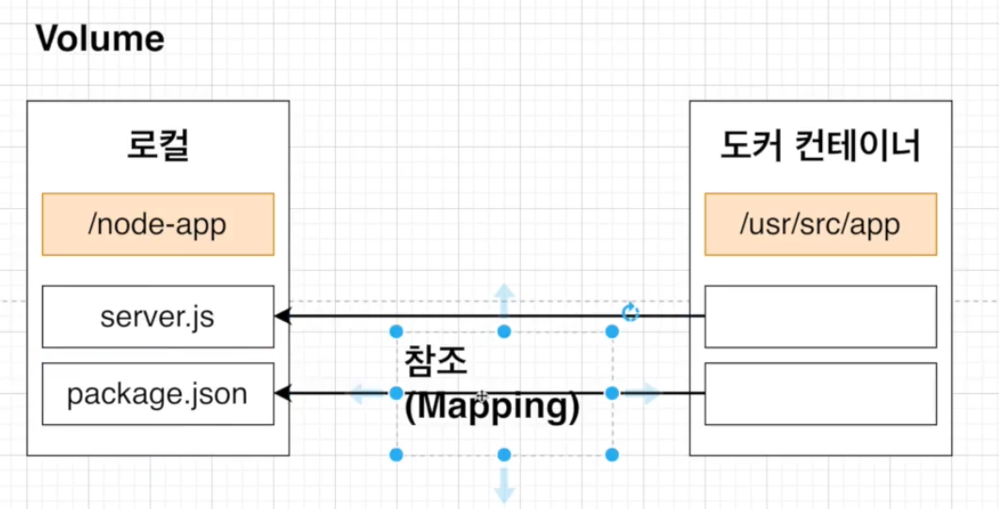

# 간단 Docker node application

```bash
# 컨테이너를 실행하기 위해 사용할 명령어
docker run -p 49160:8080 [이미지 이름]

```

## node 프로젝트 생성 (1)

<br />

> package.json

```json
// package.json 생성
{
  "name": "docker",
  "version": "1.0.0",
  "description": "",
  "main": "server.js",
  "scripts": {
    "start": "node server.js",
    "test": "echo \"Error: no test specified\" && exit 1"
  },
  "devDependencies": {
    "express": "4.18.2"
  },
  "author": "",
  "license": "ISC"
}
```

> 서버 시작점 파일 생성

```js
const express = require("express");

const PORT = 8080;

//APP
const app = express();
app.get("/", (req, res) => {
  res.send("Hello Docker");
});

app.listen(PORT);
console.log(`Running ${HOST}:${PORT}`);
```

<br />

## Dockerfile 생성 (2)

```docker
1. 베이스 이미지 명시 (파일 스냅샷에 해당)
  - 베이스 이미지 : 무슨 OS 사용할 지?
2. 추가적으로 필요한 파일 다운 받기 위한 몇가지 명령어 명시 (파일 스냅샷에 해당)
3. 컨테이너 시작시 실행 될 명령어를 명시해준다. (시작시 실행될 명령어에 해당)


# os는 node10 버전 사용 / 베이스 이미지를 가져옴
FROM node:10

## workdir 생성하기
# 이미지안에서 어플리케이션 소스코드를 가지고 있을 디렉토리를 생성하는 것
# 이 디렉토리가 어플리케이션 working directory가 된다.
# base 이미지 말고 어플리케이션을 위한 소스코드는 가독성을 위해 work 디렉토리를 따로 만들어서 보관한다.
# WORKDIR를 지정해주면 docker로 접근할 때 root로 접근하지 않고
# 맨처음 부터 WORKDIR 디렉토리에 접근하게 된다.
WORKDIR /usr/src/app


# 컨테이너 밖에 있는 파일을 컨테이너 안으로 복사한다.
# COPY [복사할 파일 경로] [컨테이너내에서 파일이 복사될 경로]
# COPY를 통해 파일을 컨테이너 안으로 넣어준다.
# 모든 파일을 복사해서 컨테이너 안으로 넣기
COPY package.json ./

# 종속성들 설치
RUN npm install


# COPY 캐싱기능을 활용해서
# 모듈은 모듈의 변화가 생기때만 다시 다운 받으며, 소스 코드에 변화가 생길때 모듈을 다시 받는 현상을 없앴다.

COPY ./ ./


# 명령어 입력
CMD ["node","server.js"]

```

<br />

- `재빌드 시 효율적으로 하는 법`

  - 

- `빌드 완료`
  - 
- `생성한 컨테이너 폴더 구조`
  - `WORKDIR`
  - 

<br />

## 포트를 매핑해서 도커 컨테이너안 포트와 연결 (3)

- 
- 

```bash
# 컨테이너 8080포트와 연결
# 컨테이너를 실행하기 위해 사용할 명령어
docker run -p 49160:8080 [이미지 이름]
- 49160 로컬 컴퓨터 포트 : 8080 도커 컨테이너 포트 와 연결
```

<br />

## Docker Volumn를 이용해서 Docker코드 변경 후 바로 적용하기 (4)

- 
- 

<br />

> Volume 사용해서 어플리케이션 실행하는 법

```bash
# -d : background mode로 실행
docker run -d -p 5000:8080 -v /usr/src/app/node_modules -v $(pwd):/usr/src/app <이미지 아이디>

# node_modules은 로컬에서 참조하지 않는다.
# -v /usr/src/app/node_modules node_modules은 로컬에서 ₩참조를하지 않고 도커내에서 참조를 해야하다는 설정₩


# $(pwd) : 현재 작업 중인 디렉터리의 이름을 출력하는데 쓰인다.
# 아래부분은 로컬 컴퓨터에서 ₩참조할 부분₩을 명시
# $(pwd):/usr/src/app
```

- `위처럼 Volume을 이용해서 키면 빌드할 때 소스를 바꾸더라도 바꾼 코드가 바로 적용된다.`
- 
  - `로컬의 코드를 참고 / node_modules은 도커내 폴더를 참고하기 때문에 코드 변경이 있어도 바로 확인이 가능하다.`
