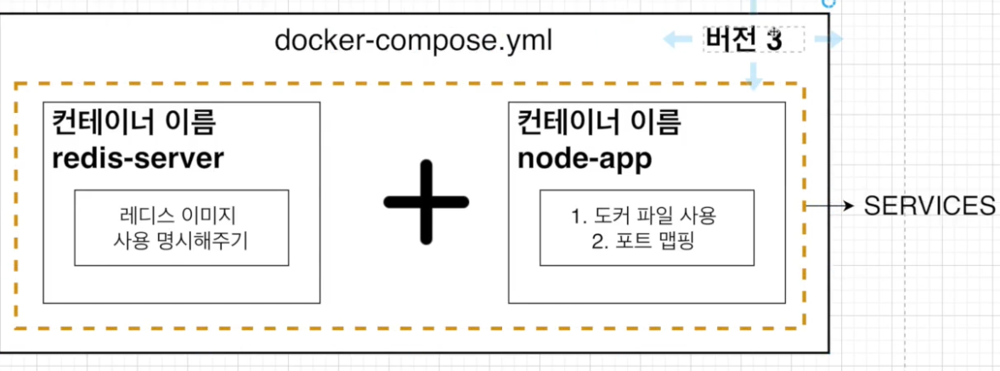
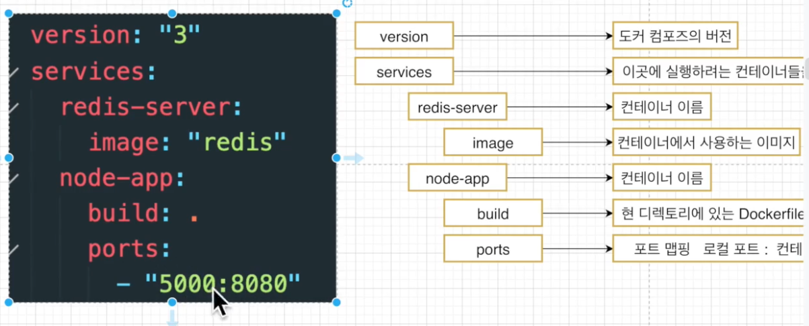
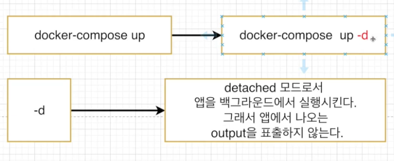

# Docker COMPOSE 🎯💡🔥📌✅

> `Docker Compose란 다중 컨테이너 도커 애플리케이션을 정의하고 실행하기 위한 도구`

```bash
## 간단한 redis설명
💡 redis
- 메모리 기반의 키-값 구조 데이터 관리 시스템이며, 모든 데이터를 메모리에 저장하고 빠르게 조회할 수 있는 비관계형 데이터 베이스이다

💡 사용이유
- 메모리에 저장하기 때문에 데이터 베이스보다 속도 빠름
- 메모리에 저장하지만 영속적으로 보관 가능
- 서버 재부팅 시에도 데이터를 유지할 수 있다.
```

- 
  - `서로 다른 컨테이너에서 아무런 설정없이 접근/통신을 할 수 없다.`
  - 멀티 컨테이너 상황에서 사용하는 것 : `Docker Compose`

<br />

## 폴더 구조 및 소스 코드 (1)

> 현재 폴더 구조

```js
root/
  - /node_modules
  - dockerfile
  - package.json
  - server.js


// server.js 코드
// server.js 코드
// server.js 코드
server.js
const express = require("express");
const redis = require("redis");
const client = redis.createClient({
  socket: {
    host: "redis-server",

    port: 6379,
  },
});
const app = express();
app.get("/", async (req, res) => {
  await client.connect();
  let number = await client.get("number");
  if (number === null) {
    number = 0;
  }
  console.log("Number: " + number);
  res.send("숫자가 1씩 올라갑니다. 숫자: " + number);
  await client.set("number", parseInt(number) + 1);
  await client.disconnect();
});

//dockerfile
//dockerfile
# os는 node10 버전 사용
FROM node:10
WORKDIR /usr/src/app
COPY package.json ./
RUN npm install
COPY  ./ ./
CMD ["node","server.js"]
```

<br />

## docker Compose 파일 작성하기(2)

- 
- 

- 컨테이너 사이에 네트워크를 연결 시켜주는 것 : `Docker Compose`

> docker-compose.yml 파일 양식

```bash
version: "3"  (도커 컴포즈 버전)
services:  (이곳에 실행하려는 컴테이너들을 정의)
  redis-server: (컨테이너 이름)
    image: "redis" (컨테이너에서 사용하는 이미지)
  node-app: (컨테이너 이름)
    build: . (현 디렉토리에 있는 Dockfile 사용)
    ports:    (포트 매핑)
      - "5000:8080"

--------------------------------------------------

version: "3"
services:
  redis-server:
    image: "redis"
  node-app:
    build: .
    ports:
      - "5555:8080"
```

<br />

## docker Compose로 파일 실행/종료하기(3)

- 
- 
  - 컨테이너 백그라운드 실행 명령어
    > docker compose 실행 명령어

```bash
docker-composeup VS docker-compose up --build

# 이미지가 없을때 이미지를 빌드하고 컨테이너 시작
💡 docker-composeup

# 이미지가 있든 없든 이미지를 빌드하고 컨테이너 시작
💡 docker-compose up --build
```

<br />
<br />

> docker compose 종료 명령어

```bash
# docker 종료하기
💡 docker down
```
