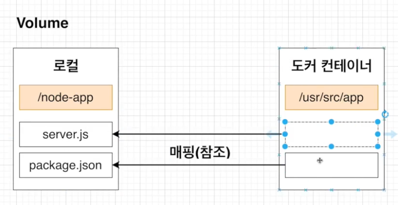

# Docker Deploy

> 도커를 이용해서 개발단계에서 리액트 실행하기

- 
  - 개발 환경 도커 파일 / 운영 파일 도커 파일 두개를 만들어주는 것이 좋다.

<br />

## 도커 파일 만들기 (1)

> 개발 환경 도커 파일 (Dockerfile.dev)

```bash
## Dockerfile.dev
# node base 이미지 사용
FROM node:alpine

# 워크 디렉토리 설정
WORKDIR /usr/src/app

COPY package.json ./

RUN npm install
# 불필요한 종속성을 다시 다운 받지 않게 하기 위해서
COPY ./ ./
# 리액트 실행
CMD "npm", "run", "start
```

- 위 dockerfile.dev 작성 후 root 폴더에서 `docker build ./` 실행
  - dockerfile.dev은 도커가 찾을 수 없기 때문에 직접 지정해주어야 한다.
  - 아래 참고

> 이미지 빓드

```bash
# Dockerfile.dev는 도커가 인식 못하기 때문에 직접 지정해야한다.
# 도커 환경 구동할 때 로컬에서의 node_modules는 지워도 상관없다.

✅ docker build -f Dockerfile.dev -t jjehyun/reactfirst .
```

- 

<br />

## 생성된 도커 이미지로 리액트 앱 실행해보기 (2)

- 
  - 3000:3000 으로 포트 매핑 완료

```
✅ docker run -it -p 3000:3000 이미지이름
✅ docker run -it -p 3000:3000 jjehyun/reactfirst

✅ -it (리액트 프로젝트는 무조건 -it옵션이 있어야한다.)
```

<br />

## 볼륨(VOLUME)을 이용한 소스 코드 변경 (3)

- 

> COPY 대신 COLUME을 이용해서 소스코드를 변경했을때 다시 이미지를 빌드하지 않아도 변경한 소스 부분이 어플리케이션에 반영

- 
  - COPY
- 
  - Volume

```bash
# 도커 환경에서 로컬 코드 변경 시 바로 반영되도록 하는 volumn 명령어
✅ docker run -it -p 3000:3000 -v /usr/src/app/node_modules -v $(pwd):/usr/src/app jjehyun/reactfirst

# 예시 node_module은 도커 환경에서 참조 나머지는 로컬 소스에서 참조
✅ docker run -it -p 3000:3000 -v /usr/src/app/node_modules -v $(pwd):/usr/src/app [이미지 이름]
```

<br />

## 도커 컴포즈로 더 간단하게 어플 실행 (4)

- 위 단계생략 가능 (docker-compose 사용 시)
- 
- 

> docker-compose.yml

```bash
## docker-compose.yml
verson - 도커 컴포즈 버전
service - 이곳에 실행하려는 컨테이너 정의
  react - 컨테이너 이름
    build = 현 디렉토리의 Dockerfile 사용
      context . - 도커 이미지를 구성하기 위한 파일과 폴더듫이 있는 위치
      dockerfile - 도커 파일이 어떤 것인지 지정
    ports - 포트매핑 | 로컬포트 : 컨테이너 포트
    volumes - 로컬 머신에 있는 파일들 매핑
    stdin_open - 리액트 앱 끌때 필요

## docker-compose.yml
version: "3"
services:
  # 도커 이미지 이
  react:
    # 현재 폴더에서 Dockerfile.dev를 참조
    build:
      context: .
      dockerfile: Dockerfile.dev
      # 포트 매핑하는 부분
    ports:
      - "3000:3000"
    volumes:
      # 로컬의 node_modules을 참조 하지않고 도커의 node_modules를 참조
      - /usr/src/app/node_modules
      # 로컬의 node_modules 빼고 다 참조
      - ./:/usr/src/app
      # 이게 없으면 react 에러남
    stdin_open: true

```

> 아래 명령어로 실행 (compose)

```bash
✅ docker-compose up
```

<br />

## 도커 환경헤서 react test 진행하기 (5)

- 코드 변경 시 바로 테스트 코드 실행

- 

> react 테스트 명령어

```bash
# 도커에서 테스트 진행하기
✅ docker run -it [이미지 이름] npm run test
✅ docker run -it jjehyun/reactfirst npm run test
```

<br />

> 코드 변경 시 테스트 코드도 바로 반영되도록 설정하기!

```bash
## services react / test 두개니까 앱을 시작할 때 두개의 컨테이너가 다 시작되게 된다.
## 먼저 (react)엡을 실행 한 후 (tests)를 진행하게 된다.
## 두개의 컨테이너 모두 실행하는 명령어
## docker-compose up --build

version: "3"
services:
  # react라는 이름의 컨테이너 추가
  react:
    # 현재 폴더에서 Dockerfile.dev를 참조
    build:
      context: .
      dockerfile: Dockerfile.dev
      # 포트 매핑하는 부분
    ports:
      - "3000:3000"
    volumes:
      # 로컬의 node_modules을 참조 하지않고 도커의 node_modules를 참조
      - /usr/src/app/node_modules
      # 로컬의 node_modules 빼고 다 참조
      - ./:/usr/src/app
      # 이게 없으면 react 에러남
    stdin_open: true
  # tests라는 이름의 컨테이너 추가
  tests:
    build:
      context:
      dockerfile: Dockerfile.dev
    volumes:
      - /usr/src/app/node_modules
      # 로컬의 node_modules 빼고 다 참조
      - ./:/usr/src/app
      # 이게 없으면 react 에러남
    command: ["npm", "run", "test"]


✅ docker-compose up --build
```

- 
  - 두개의 컨테이너 실행

<br />

```bash
# 두개의 컨테이너 실행
# 코드에 변화가 있다면 --build 해주서야 함
✅ docker-compose up --build
```

## Nginx에 배포 하기 (6)

> Root 폴더에 Dockerfile 생성

```bash
# 기본 베이스
# builer 라는 컨테이너
FROM node:alpine as builder
# 워킹 폴더
WORKDIR '/usr/src/app'
COPY package.json .
RUN npm install
# 불필용한 의존성 파일 다운 방지
COPY ./ ./
RUN npm run build

# 기본 베이스
# nginx 라는 컨테이너
# --from=연결할 컨테이너 베이스 osi
FROM nginx
COPY --from=builder /usr/src/app/build /usr/share/nginx/html


############
docker build -t jjehyun/reactb .       [로 빌드 하기]
docker run -p 8080:80 jjehyun/reactb   [포트 연결]
############
```
