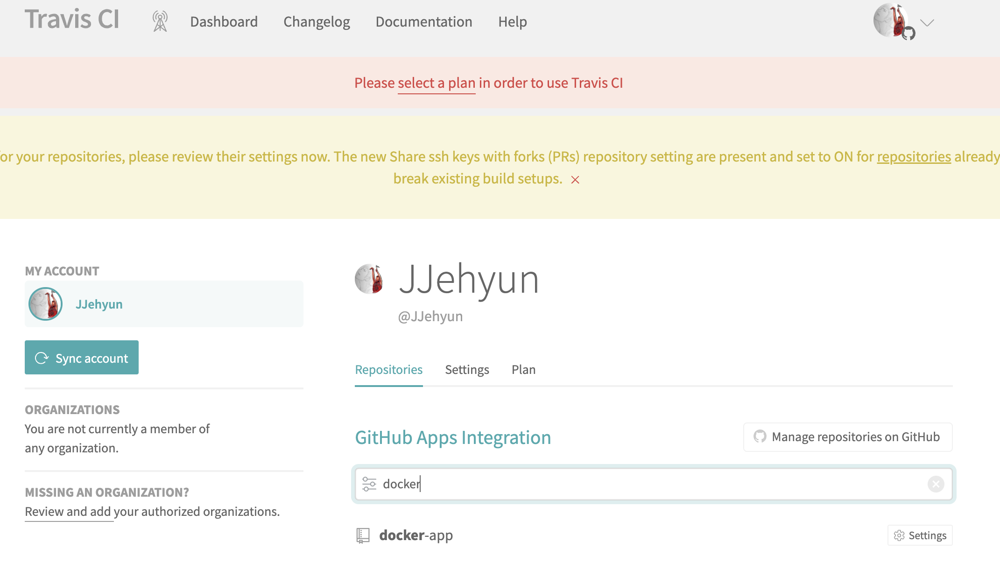
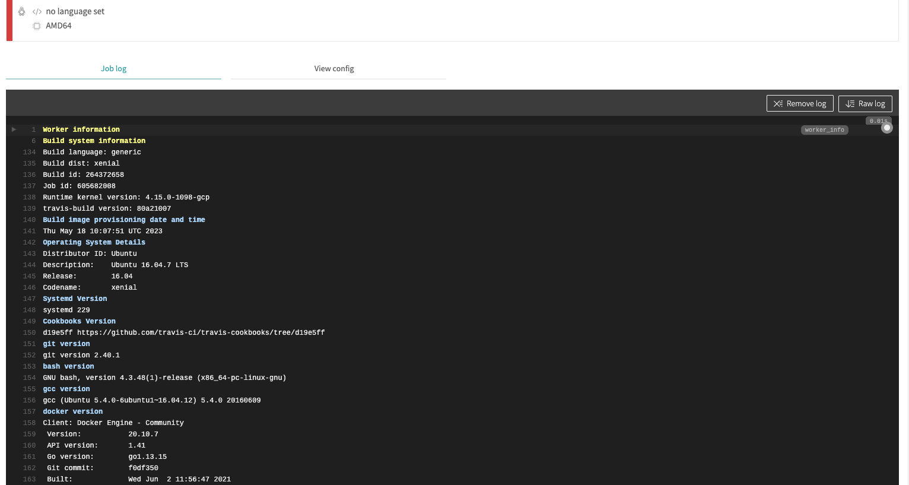
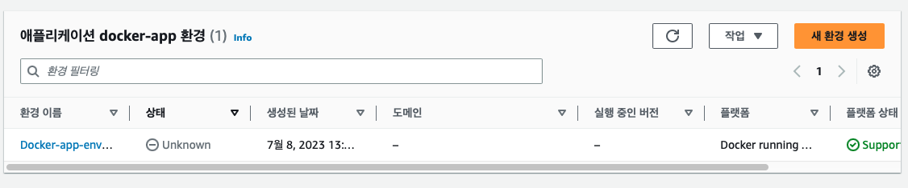
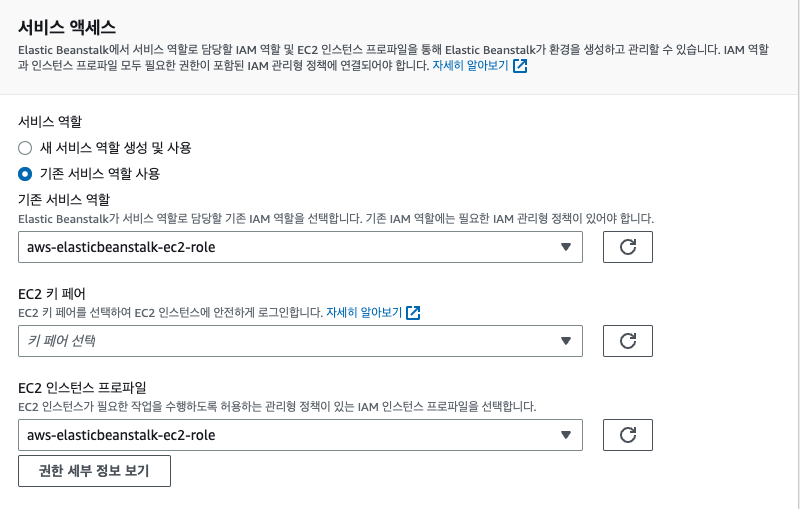
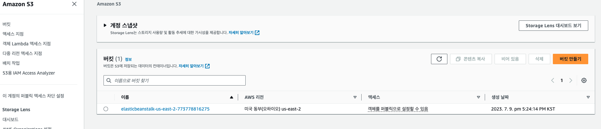
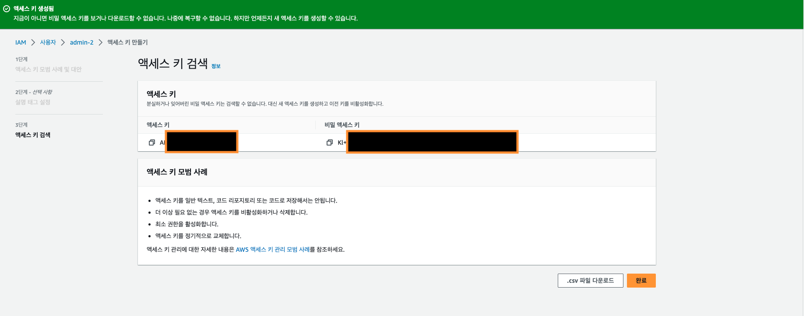
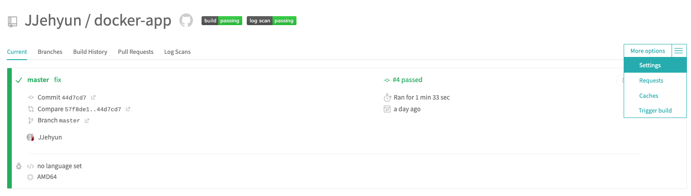
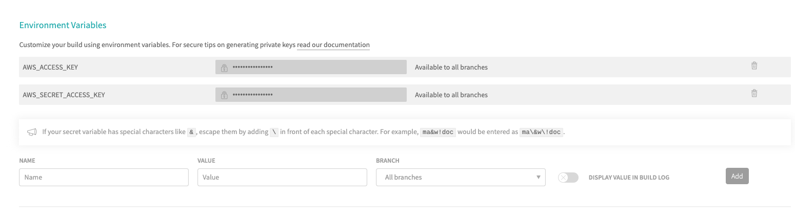

# Travis CI

- CI (지속적인 통합)을 위한 오픈소스 서비스
- Github repository에 있는 프로젝트를 특정 이벤트에 따라 자동 테스트 / 빌드 배포가 가능하다.
- 
  - Travis CI 연결

```bash
## Travis CI 흐름 ##
[로컬 Git] - [github] - [travis CI] - [AWS]

## 소스 파일을 전달하기 위한 접근 조건
[github] -github아이디로 연동- [travis CI] -AWS에서 제공하는 Secret Key를 .travis.yml파일에 넣어준다. - [AWS]
```

<br />
<br />

## .travis.yml 파일 작성 (배포전에 테스트 진행) (1)

> .travis.yml

```yml
# 관리자 권한으로 실행
sudo: required

# 언어의 플랫폼 선택 (node,c,java....)
language: generic

# 도커환경에서 실행
services:
  - docker

# script(테스트를 진행하기전에) 해주어야하는 것들을 before_install에서 명시 해주어야 한다.
# 해주어야하는 것
# 1. dockerfile를 이용해서 도커 이미지를 생성해야한다.,
before_install:
  - echo  "start Creating an image with dockerfile"
  # 도커 이미지 빌드 (Dockerfile.dev) 개발용으로 이미지 빌드
  - docker build -t jjehyun/reactbb -f Dockerfile.dev .

# 테스트를 실행하는 부분
script:
  # 도커 실행 -> CI=true없으면 에러 / npm run test 테스트 실행 / -- --coverage(상세하게 보기)
  - docker run -e CI=true jjehyun/reactbb npm run test -- --coverage

# sciprt(테스트 이후에) 할 일
after_success:
  - echo "Test Success"
```

- 위코드 추가 후 push 아래처럼 travis ci 자동 실행
- 

<br />
<br />

## AWS Elastic Beanstalk를 이용해서 배포하기 (2)

## (AWS Elastic Beanstalk 생성하기)

- `Amazon Elastic Beanstalk 대시보드 이동` - 애플리케이션 생성

  - `환경 구성`
    - 환경 티어 : 웹 서버 환경
    - 애플리케이션 이름 : docker-app
    - 플랫폼 : Docker
    - 플랫폼 브랜치 : Docker running Amazon Linux 2 ...
    - 아키텍쳐 : x86_64 / t2.micro
    - 다른 값들 모두 Default 선택 후 다음
    - 
  - `서비스 액세스`
    - 직접 IAM에서 권한 5개 rule를 추가해야한다. (안하면 ERROR)
    - 
    - 권한이 잘 추가 됐다면 이런식으로 뜸
      - IAM에서 권한 이름 : aws-elasticbeanstalk-service-role
      - ✅ AWSElasticBeanstalkWebTier
      - ✅ AWSElasticBeanstalkWorkerTier
      - ✅ AWSElasticBeanstalkMulticontainerDocker

- 
  - `AWS Elastic Beanstalk`를 생성하면 S3가 자동으로 생성된다.

 <br />

## .travis.yml 테스트 성공한 코드를 AWS Elatic Beanstalk에 자동 배포 (3)

- 배포 관련 코드 추가

> .travis.yml

```bash
deploy:
  #외부 환경에 대한 표시 (aws...)
  provider: elasticbeanstalk
  # aws 환경 지역
  region: "ap-northeast-2"
  # 생성된 elasticbeanstalk 앱 이름
  app: "REACTdoker"
  # 생성된 elasticbeanstalk 앱 dev 이름
  env: "REACTdoker-env"
  # S3 버킷 이름
  # [travis] -> travis에서 가지고 있는 파일을 s3에 압축해서 우선 보냄
  bucket_name: "elasticbeanstalk-us-east-2-773778816275"
  # 어플리케이션 이름과 동일하다 ("docker-app")
  bucket_path: "REACTdoker"
  # 마스터 branch만 배포
  on:
    branch: master
  ## travis-ci 에 세팅한 AWS_ACCESS_KEY | AWS_SECRET_ACCESS_KEY 가져오는 부분
  access_key_id: $AWS_ACCESS_KEY
  secret_access_key_id: $AWS_SECRET_ACCESS_KEY
```

<br />
<br />

## IAM에서 액세스 키 발급(4)

- 사용자 그룹 - 엑세스 키 발급

  - 사용 시례
  - ✅AWS 외부에서 실행되는 애플리케이션

- 

<br />

```
발급받은 키는 노출되면 안되기 때문에 travis-ci에 직접 기입해준다.
1. 액세스 키
2. 비밀 엑세스 키
```

- `(1)` 배포할 프로젝트에서 setting이동

  - 

- `(2)` Environment Varaiables 에 AWS KEY VALUE 추가
  - 
