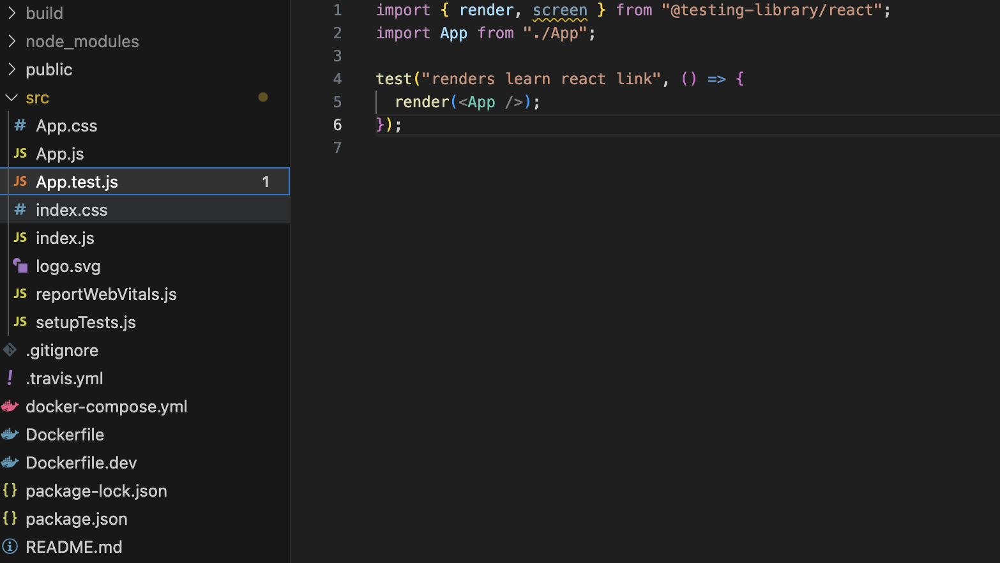

# ElasticBeanstic react 간단 배포하는 방법

## 폴더 구조

- 

```js
- .travis.yml
- Dockerfile
- Dockerfile.dev
- docker-compose.yml
  - ElasticBeanstic에서 Linux2 버전을 사용한다면  docker-compose.yml 보고 배포를 진행한다.
  - docker-compose.yml 파일을 보고서 순서대로 처리한다
```

<br />

## .travis.yml 파일 (1)

```yml
# # 관리자 권한으로 실행
sudo: required
# # 언어의 플랫폼 선택 (node,c,java....)
language: generic
# # 도커환경에서 실행
services:
  - docker

# # script(테스트를 진행하기전에) 해주어야하는 것들을 before_install에서 명시 해주어야 한다.
# # 해주어야하는 것
# # 1. dockerfile를 이용해서 도커 이미지를 생성해야한다.,
before_install:
  - echo "start creating an image with dockerfile"
  - docker build -t jjehyun/reactcc -f Dockerfile.dev .

# # 테스트를 실행하는 부분
script:
  - docker run -e CI=true jjehyun/reactcc npm run test -- --coverage

# # sciprt(테스트 이후에) 할 일
# after_success:
#   - echo "Test Success"

# 배포 연결 관련 세팅
deploy:
  edge: true
  provider: elasticbeanstalk
  region: us-east-2
  app: REACTdoker
  env: REACTdoker-env
  bucket_name: elasticbeanstalk-us-east-2-77ㅁㄴㄴㅁㅇㄴㅁ
  bucket_path: REACTdoker
  on:
    branch: master
  access_key_id: $AWS_ACCESS_KEY
  secret_access_key: $AWS_SECRET_ACCESS_KEY
```

<br />

## docker-composer.yml (EB에서 참조함) (2)

```yml
# 도커 컴포즈의 버전
version: "3"
# 실행하는 컨테이너들을 정의
services:
  # 서비스 이름
  react:
    build:
      context: .
      # 도커 파일 어떤 것인지 지정
      dockerfile: Dockerfile
    # 포트 매핑 로컬 포트 : 컨테이너 포트
    ports:
      - "80:80"
    # 로컬 머신에 있는 파일들을 매핑
    volumes:
      - /usr/src/app/node_modules
      - ./:/usr/src/app
    stdin_open: true
```

<br />

## Dockerfile 소스 (3)

```dockerfile
# 기본 베이스
## builer 라는 컨테이너
FROM node:16-alpine as builder
## 워킹 폴더
WORKDIR '/usr/src/app'
COPY package.json .
RUN npm install
## 불필용한 의존성 파일 다운 방지
COPY ./ ./
RUN npm run build

## 기본 베이스
## nginx 라는 컨테이너
FROM nginx
## 포트 매핑 NGINEX의 에러를 잡기 위해 80
EXPOSE 80
COPY --from=builder /usr/src/app/build /usr/share/nginx/html
```

<br />

## Dockerfile.dev 소스 (4)

```dockerfile
## Dockerfile.dev
# node base 이미지 사용
FROM node:alpine

# 워크 디렉토리 설정
WORKDIR /usr/src/app

COPY package.json ./

RUN npm install
# 불필요한 종속성을 다시 다운 받지 않게 하기 위해서
COPY ./ ./
# 리액트 실행
CMD "npm", "run", "start
```
