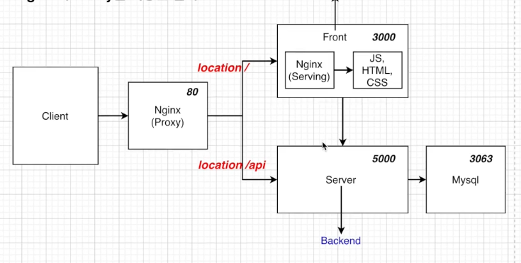
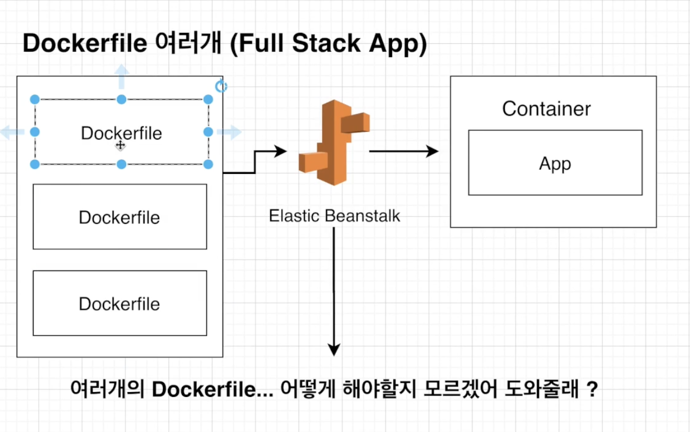
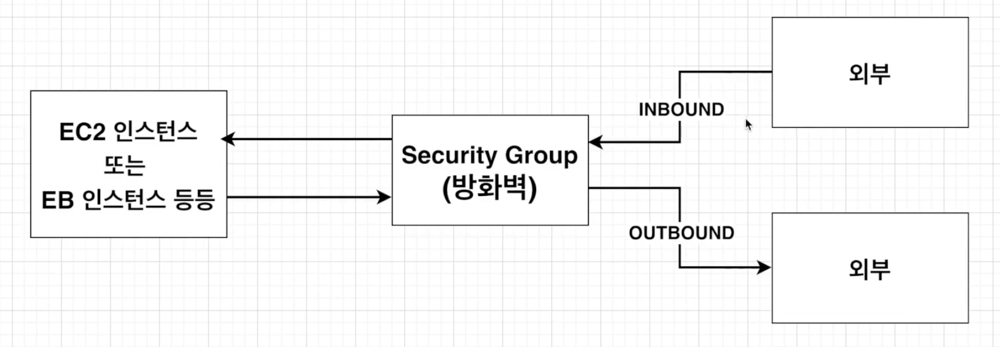
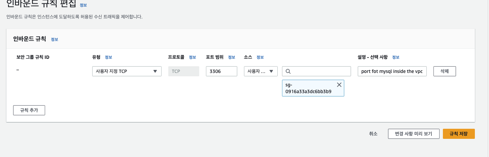
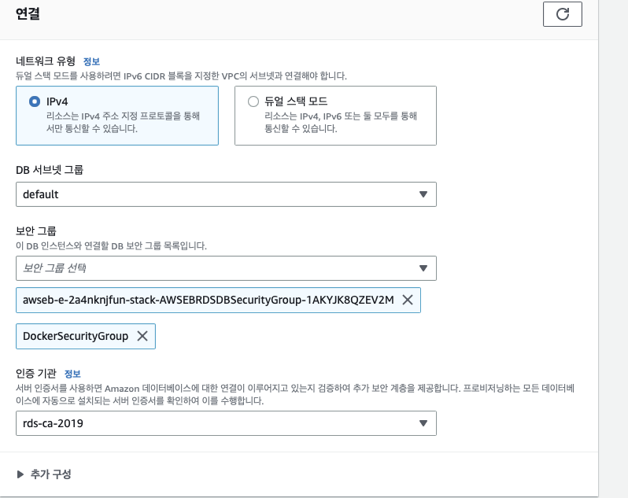
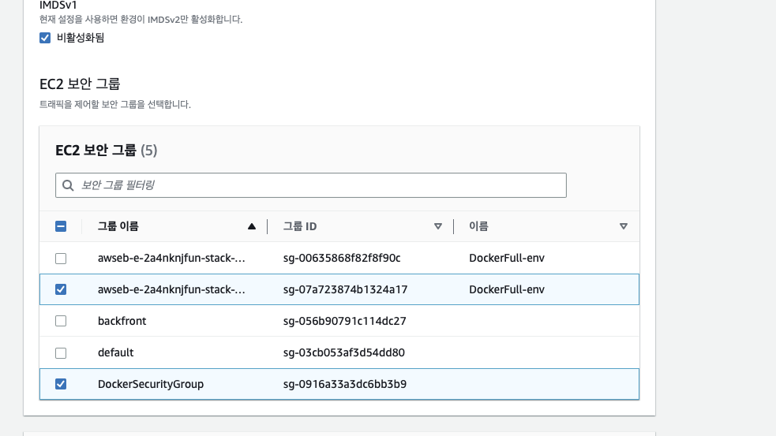
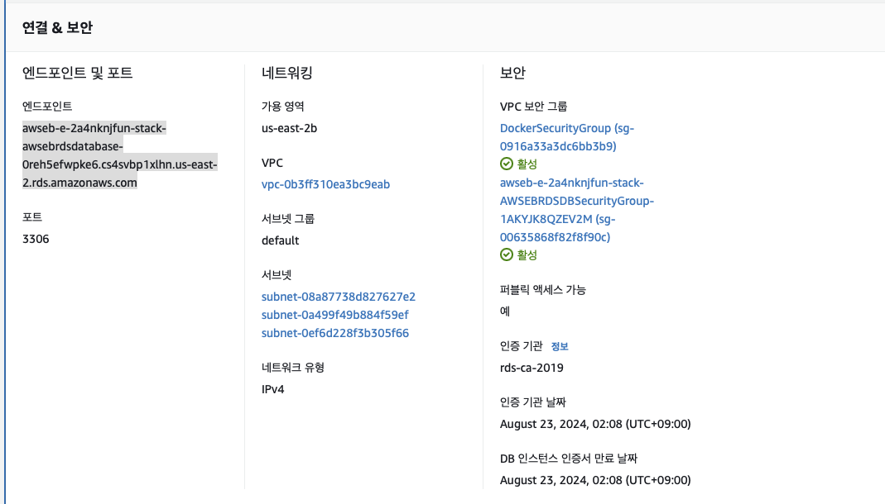
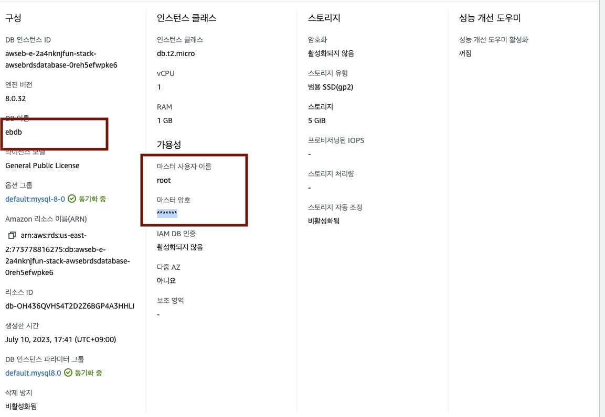
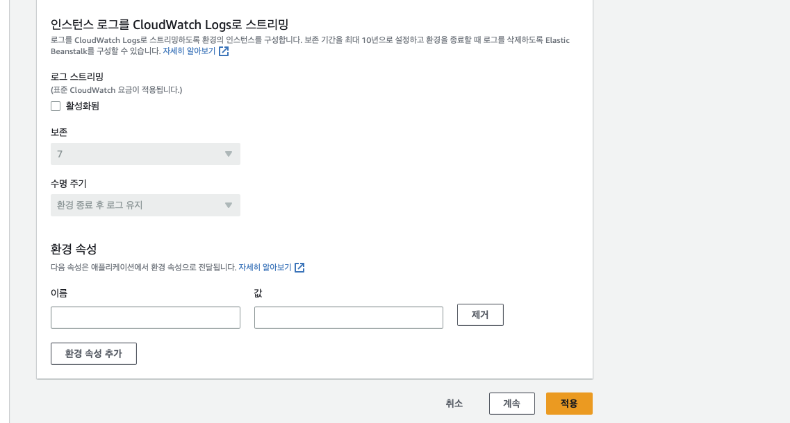

# 07. Deploy FE / BE / DB

## 프로젝트 구조

- 

## 폴더 구조

```bash
/root
    - /backend
        - dockerfile (prod)
        - dockerfile.dev (dev)

    - /frontend
        - nignx (nginx 설정)
        - dockerfile (prod)
        - dockerfile.dev (dev)

    - /mysql
        - dockerfile.dev (prod,dev)
        - my.cnf (한국어 설정)

    - /nginx
        - dockerfile (prod,dev)
        - default.conf (nginx 설정)

    - .travis.yml
        - ci 코드

    - docker-compose.dev.yml
        - 테스트 환경 실행

    - docker-compose.yml
        - Elastic 배포
```

<br />

## 테스트 환경 코드 !!

> backend

```docker
# dev
FROM node:14.14.0-alpine

WORKDIR /app

COPY ./package.json ./

RUN npm install

COPY . .

CMD ["npm", "run", "dev"]

# prod
FROM node:14.14.0-alpine

WORKDIR /app

COPY ./package.json ./

RUN npm install

COPY . .

CMD ["npm", "run", "dev"]
```

<br />

```docker
# prod
# 배포 환경을 위한 도커 파일
# 어래 : Nginx가 제공을 해줄 Build파일을 생성하는 단계 (정적파일 제공하는 단계)
FROM node:16-alpine as builder
WORKDIR /app
COPY ./package.json ./
RUN npm install
COPY . .
RUN npm run build

# 아래는 Nginx를 가동하고 윗 단께에서 생성된 빌드파일들을 제공하여준다.
# default.conf에서 해준 설정을 nginx컨테이너 안에 설정되게 복사해준다.
FROM nginx
EXPOSE 3000
# 컨테이너 안의 nignsx의 폴터안에 로컬에서 적은 값으로 덮어준다. (컨테이너 안에서 로컬의 nginx의 default.conf값이 필요함)
COPY ./nginx/default.conf /etc/nginx/conf.d/default.conf
# 빌드 파일을 nginx의 파일에 넣어줌
COPY --from=builder /app/build  /usr/share/nginx/html


# dev
## 개발 환경을 위한 도커 파일
FROM node:16-alpine

WORKDIR /app

COPY package.json ./

RUN npm install

COPY ./ ./

CMD [ "npm", "run", "start" ]

# nginx/default.conf
server {
    # nginx가 listen하고 있는 포트 / 3000포트로 접속하면, nginx가 제공하는 static한 파일을 받을 수 잇다.
    listen 3000;

    location / {
        # '/'로 접속 했을 때 '/usr/share/nginx/html'에 build파일을 넣어주면, '/'로 접속했을때 build파일을 읽어들일 수 있다.
        root /usr/share/nginx/html;
        # react의  index.html를 index로 하겠다는 설정
        index index.html index.htm;
        # react를 위한 설정 : 이부분이 없으면 react에서 라우터 이동이 불가능
        try_files $uri  $uri/ /index.html;

    }
}
```

<br />

> mysql

```docker
# prod / dev
# m1 용
# FROM --platform=linux/x86_64 mysql:5.7

FROM --platform=linux/x86_64 mysql:5.7
# 로컬의 my.cnf 컨테이너에 넣어줌
# my.cnf는 데이터 베이스에 한글값이 잘 들어갈 수 있게 해주는 속성
# utf8로 변환
ADD ./my.cnf /etc/mysql/conf.d/my.cnf

# my.cnf
[mysqld]
character-set-server=utf8

[mysql]
default-character-set=utf8

[client]
default-character-set=utf8
```

<br />

> nginx

```docker
# prod / dev
FROM nginx
# nginx 베이스 이미지로 가져온다음 / 작성된 conf파일을 컨테이너 실행될 Nginx에도 적용될 수 있게 copy
COPY ./default.conf  /etc/nginx/conf.d/default.conf


# default.conf
upstream frontend {
    # 프론트 엔드가 3000번 포트에서 돌아감
    server frontend:3000;
}

upstream backend {
    # 백엔드가 5000번 포트에서 돌아감
    server backend:5000;
}

server {
    # nginx 서버포트 80번을 열어줌
    listen 80;

    location / {
        # docker-compose에서 작성한 serviced이름
        proxy_pass http://frontend;
    }

    location /api {
        # docker-compose에서 작성한 serviced이름
        proxy_pass http://backend;
    }

    # 개발환경에서 에러를 잡기위해 작성
    location /sockjs-node {
        proxy_pass http://frontend;
        proxy_http_version 1.1;
        proxy_set_header Upgrade $http_upgrade;
        proxy_set_header Connection "Upgrade";
    }

}
```

```
테스트 환경 세팅 끝

🔥docker-compose up --build🔥

로 로컬 테스트
```

<br />
<br />
<br />

---

---

---

<br />
<br />
<br />

# 배포 진행

## 전체적인 구조

```
1. [코드 push]

2. Travis CI가 코드를 가져오고 테스트 코드 실행

3. Travis CI test 성공 시 이미지 Build

3. 빌드된 이미지 Docker Hub로 전송
- Docker Hub에 빌드된 이미지를 보내고 AWS에서 그 이미지를 가져가서 EB에서 다시 빌드 하지 않아도 된다.

4. AWS EB에 DockerHub에 이미지를 보냈다고 알림

5. AWS EB에서 DockerHub에 있는 이미지를 가져온 후에 배포를 진행
```

<br />
<br />

## travis.yml ci 코드 작성 (1)

```yml
language: generic

sudo: required

# 도커 환경임
services:
  - docker
# 도커 이미지 생성
before_install:
  - docker build -t jjehyun/react-test-app -f ./frontend/Dockerfile.dev ./frontend
# 위에서 만든 이미지를 통해 테스트 진행
script:
  - docker run -e CI=true jjehyun/react-test-app npm run test

## 테스트가 성공했다면, 하나하나의 프로젝트의 운영버전 이미지를 빌드(생성)하는 설정하기
after_success:
  - docker build -t jjehyun/docker-frontend ./frontend
  - docker build -t jjehyun/docker-backend ./backend
  - docker build -t jjehyun/docker-nginx ./nginx
  # 도커허브에 생성한 이미지를 넣어주어야함, 도커 허브에 로그인하는 코드 (DOCKER_HUB_PASSWORD,DOCKER_HUB_ID travis-ci에서 설정 값)
  - echo "$DOCKER_HUB_PASSWORD" | docker login -u "$DOCKER_HUB_ID" --password-stdin
  # 생성된 도거 이미지를 하나씩 도커 허브에 push
  - docker push jjehyun/docker-frontend
  - docker push jjehyun/docker-backend
  - docker push jjehyun/docker-nginx

deploy:
  provider: elasticbeanstalk
  region: "us-east-2"
  app: "dockerFull"
  env: "DockerFull-env"
  #S3이름
  bucket_name: elasticbeanstalk-us-east-2-773778816275
  bucket_path: "dockerFull"
  on:
    branch: master

  access_key_id: $AWS_ACCESS_KEY
  secret_access_key: $AWS_SECRET_ACCESS_KEY
```

<br />
<br />

## Dockerrun.aws.json

- 

> dockerfile이 많은 멀티 프로그림에서 사용

> 어떻게 다중 컨테이너를 작동 시킬지 알려준다.

```bash
# Dockerrun.aws.json
# 설명
{
    # hostname이름을 통해 컨테이너간의 소통이 가능하다.
    # 버전 명시
    # essential : true면 다른 작업도 중지
    "AWSEBDockerrunVersion":2,
    # 이안에 컨테이너를 정의해준다 (프론트,백,db,nginx)
    "containerDefinitions":{
        "name":"frontend",
        # 구축할 온라인 Docker리포지토리의 Docker이미지 이름 도커에 올린 이미지 이름
        "image":"jjehyun/docker-frontend",
        "hostname":"frontend",
        "essential":false,
        "memory":128
    },{
        "name":"backend",
        # 구축할 온라인 Docker리포지토리의 Docker이미지 이름 도커에 올린 이미지 이름
        "image":"jjehyun/docker-backend",
        "hostname":"backend",
        "essential":false,
        "memory":128
    },{
        "name":"nginx",
        # 구축할 온라인 Docker리포지토리의 Docker이미지 이름 도커에 올린 이미지 이름
        "image":"jjehyun/docker-nginx",
        "hostname":"nginx",
        "essential":true,
        "memory":128,
        "portMappings":[
            {
            "hostPort":80,
            "containerPort":80
            }
        ],
        # nginx와 frontend | backend 연결됨
        "links":["frontend","backend"],
        "memory":128
    }
}


```

<br />
<br />

## Elastic Beanstalk / RDS 한번에 환경 세팅 (2)

- 애플리케이션 생성
  - 환경 구성 : ✅ 웹 서버
  - 플랫폼 : ✅ 64bit Amazon Linux 2
    - `서비스 엑세스`
      - 기존 역할 : ✅ aws-elasticbeanstalk-ec2-role
      - EC2 인스턴스 프로파일 : aws-elasticbeanstalk-ec2-role
        - `네트워킹, 데이터 베이스`
          - 데이터 베이스 : - , mysql ,스토리지 5
          - Virtual Private Cloud
            - `인스턴스 트래픽 및 크기 조정..`
            - 아키텍처 : t3.micro

> Elastic Beanstalk 생성 완료

> RDS 생성 완료

<br />

## VPC -> 보안 -> 보안그룹 -> 보안그룹 생성하기

- 

```
- 인 바운드는 데이터 베이스에서 데이터를 가져오는 부분
```

<br />
<br />

- `보안 그룹 생성`
  - 보안 그룹 이름 : DockerSecurityGroup
  - 설명 : allow (도커안에 서비스 참조 가능)
  - `세부 적인 선택 없이 보안그룹 생성 완료`
- 그 후
  - 리다이렉션 된 페이지에서 인바운드 규칙 편집 클릭
  - 

<br />
<br />
<br />

## 위에서 만든 보안그룹을 EB | RDS에 적용하기 (3)

- RDS

  - 인스턴스 - 수정 - 즉시 수정
  - 

- Elastic Beanstic
  - Elastic Beanstalk - 환경 - 구성 - 인스턴스 - 편접
  - 

<br />

> RDS / EB 둘 다 DockerSecurityGroup 보안그룹 적용 완료

> RDS / EB 보안 그룹을 서로 같게 해줌으로써 RDS / EB 서로 통신이 가능하게 됨

<br />
<br />

## RDS 와 EB 환경 변수 적용 하기

- 
- 

- Elastic Beanstalk 환경 변수
  - 환경 - 구성 - 업데이트,모니터링 로깅 구성
  - 환경 변수 추가
    - 

> RDS , EB 환경 변수 세팅 완료
