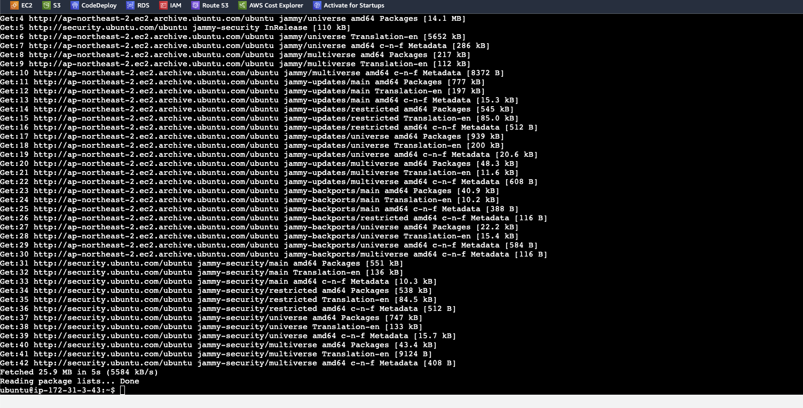
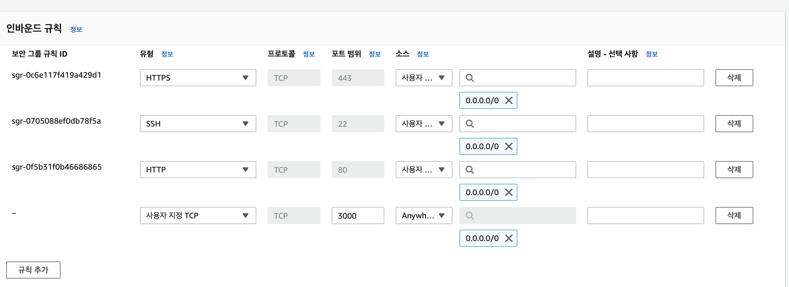
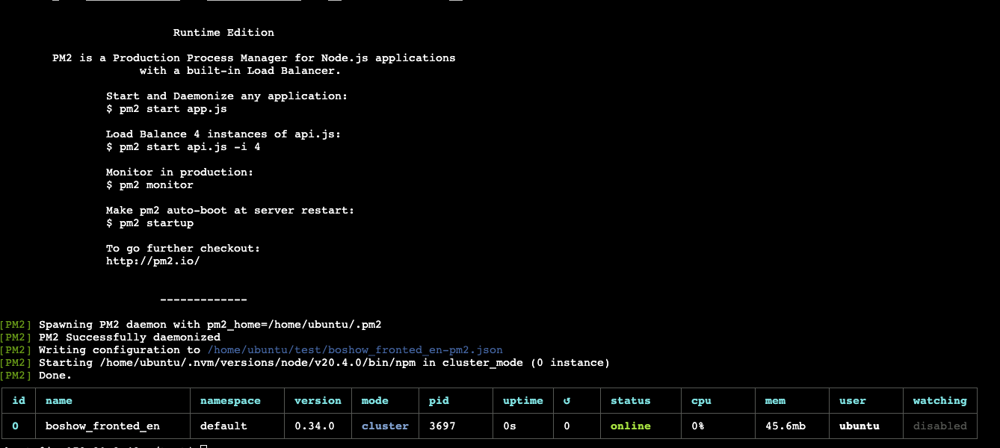
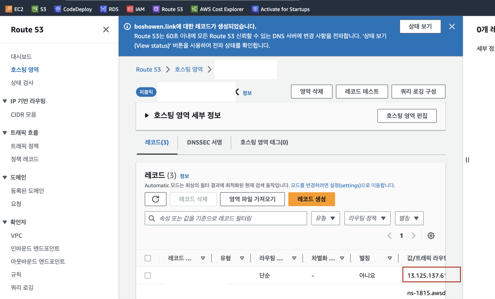

# Nextjs 간단 배포

## 인스턴스 시작

- 이름 및 태그 : 원하는 이름
- OS : Ununtu Server freetier
- 키페어 생성 : ✅ RSA (.pem)
- 방화벽 : ✅ 보안 그룹 생성
  - ✅ 위치 무관 (접속 ip가 계속 변한다면)
  - ✅ 인터넷에서 HTTPS 트래픽 허용
  - ✅ 인터넷에서 HTTP 트래픽 허용
    (백엔드 https 통신 구현이 안되어 있다면)
- 스토리지 구성 : 1x30 GiB gp2
- 인스턴스 생성

## 인스턴스 연결 후 기본적인 세팅

- 

```bash
# 기본적인 우분투 업데이트
sudo apt-get update
curl -o- https://raw.githubusercontent.com/nvm-sh/nvm/v0.34.0/install.sh | bash
. ~/.nvm/nvm.sh
nvm install node

# 설치 확인작업
node -v
npm -v # npm은 node를 설치하면 따라 설치된다.
node -e "console.log('Running Node.js ' + process.version)"
```

<br />

## 소스 다운 후 build

- 

```bash
git clone ""

npm run build

npm run start

# 포트포워딩
sudo iptables -A PREROUTING -t nat -i eth0 -p tcp --dport 80 -j REDIRECT --to-port 3000
```

<br />

## pm2

- 

```bash
# ›
npm install pm2 -g

pm2 start npm --name "next" -w -i max -- start
```

<br />

# Route 53 연결

- 
- 레코드 생성
  - value값에 ip만 넣어주면 끝
  - value : 12.31.142.12

<br />
<br />

# https 적용 하기 (nginx) (선택)

- 프로젝트가 현재 3000포트에서 실행되고 있다. 리버스 프록시를 이용해 80번 포트에서 배포되도록 처리

<br />

## nginx 설치 (1)

```bash
## nginx 설치
## 우분투 기준
sudo apt-get install nginx -y
# 잘 설치되었는지 확인한다.
nginx -v
```

<br />

> nginx 설정을 위한 설정파일 열기

> /etc/nginx/sites-available/default

```bash
# nginx 설정 파일 열기
sudo vim /etc/nginx/sites-available/default
```

<br />

## /etc/nginx/sites-available/default의 내용을 아래 처럼 수정 (2)

```bash
server {
        listen 80 default_server;
        listen [::]:80 default_server;

        ## 예시 server_name naver.com/;
        server_name <도메인 주소>;

        # 아래설정은 동일 하게(FE기준)
        location / {
                proxy_pass http://127.0.0.1:3000;
                proxy_set_header Host $host;
                proxy_set_header X-Real-IP $remote_addr;
                proxy_set_header X-Forwarded-For $proxy_add_x_forwarded_for;
                proxy_set_header X-Forwarded-Proto $scheme;
        }
}
```

<br />

## Nginx 포트 OPEN (3)

```bash
## nginx 포트 열어주는 command
sudo ufw app list
sudo ufw allow 80
sudo ufw allow 443
sudo ufw allow 1337
sudo ufw allow 22
sudo ufw allow 3000
sudo ufw status

## 아래 명령어로 NGINX 설정이 올바른지 확인
## NGINX 서비스 재시작
sudo nginx -t
sudo systemctl reload nginx
```

> 이제 웹 브라우저를 통해 설정한 도메인 주소로 접속해보면 페이지가 잘 나오는 것을 확인 가능

<br />

## HTTPS 적용 하기 (4)

> Certbot 설치 하기

```bash
## 아래 명령어로 certbot 설치
sudo apt-get install python3-certbot-nginx

## 로 인증서 발급 시작
sudo certbot --nginx
## 자신의 이메일 / Terms of Service 동의? / EFF 뉴스레터 수신? / 몇번 도메인에 대해 인증서를 받을지? 1->1입력
## Let's Encrypt 인증서 발급 완료

## 인증서는 90일동안 유효하다
```

<br />

## 인증서 자동 갱신 (5)

```bash
sudo crontab -e

# 매월 1일 오후 6시 마다 인증서를 갱신하고 nginx를 재시작하는 명령어
0 18 1 * * certbot renew --renew-hook="sudo systemctl restart nginx"
```

> EC2 + NEXTJS + NGINEX 배포 끝
