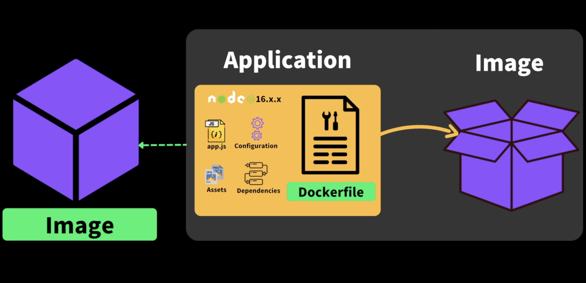

# 도커의 기본

## 도커의 이미지란,

> 리눅스 컴퓨터의 특정 상태를 캡쳐해서 박제해놓은 것 , 도커 환경은 무조건 리눅스 가상 환겨의 형태로 돌아가게 된다.

> 컨테이너 실행 후 cli 환경 실행

```bash
docker run-it node
# 우선 내컴퓨터에서 이미지를 찾는다. -> 없으면 docker hub로 이동한 뒤 해당이미지를 불러옴

# 이미지를 내컴퓨터에서 해동해서 컨테이너로 만듦
# 한번 이미지를 만들면 컨테이너는 여러개를 만들 수 있다.
run

# 컨테이너를 연 다음 그 컨테이너에서 CLI를 사용한다는 의미이다.
-it

# node이미지안에 hellow node라는 것이 바로 입력되게 만들어짐
node
```

<br />

> 실행 중인 cli 환경 실행 (2)

```bash

# [이미지] shell로 cli 환경 실행
# 이 컨테이너 내부를 통해 가상의 리눅스 환경으로 들어간 것
docker exec -it [이미지] sh
```

<br />

## docker 작업 목록

- 

```bash
# 현재 작업이 작업 중인 내부의 근무자가 일하고 있는 컨테이너만 표시
docker ps
# 현재 중지 되어 있는 작업중이 아닌 컨테이너도 표시되게 된다.
docker ps -a
```

## 모든 docker stop 후 종료하기

```bash
############################
docker stop $(docker ps -aq)
docker system prune -a
############################
```

## dodker images

> 현재 로컬 이미지들 확인

- 

<br />
<br />

# Docker file_Frontend

> 나만의 이미지를 만들기 위한 설계도

<br />

## FE_dockerfile (1)

> dockerfile

```Dockerfile
# NODE이 이미지를 튜닝, 개조 해서 만드는 것
FROM NODE:12.18.4

# 이미지 생성 과정에서 실행하는 명령어
# 컨테이너를 실행하는 시점에는 미리 깔려 있어야하는 것
RUN npm install -g http-server

# 컨테이너 실행 시 실행할 명령어의 pwd 위치
WORKDIR /home/node/app

# CMD에 있는 명령어가 WORKDIR 위치내에서 실행된다.
# 컨테이너가 가동될 때 기본적으로 실행되는 명령어
CMD ["http-server", "-p" , "8080", "./public"]
```

<br />

## Docker file로 이미지 만들고 실행\_FE (2)

> 터미널

```dockerfile
# 파일명이 dockerfile이면 따로 지정할 필요없다
# 도커 이미지 생성
docker build -t frontend-img .

#위에서 만든 이미지로 실행
# -name ::: (frontend-container라는 이름의 컨테이너)
# -v ::: volumn란 특정폴더를 공유하는 것 pwd가 지금위치 --> 지금 폴더들이 컨테이너의 home/node/app 폴더에 들어간다는 의미
# -p ::: 로칼 포트 - 컨테이너 포트를 연결한다.
# 마지막은 컨테이너로 실행할 이미지를 지정한다.
docker run --name frontend-container -v $(pwd):/home/node/app -p 8080:8080 frontend-img
```

<br />
<br />
<br />
<br />

# Database_dockerfile (1)

> dockerfile

```dockerfile
FROM mysql:5.7

# 이미지 환경 변수 세팅
ENV MYSQL_USER USER
ENV MYSQL_PASSWORD PASSWORD
ENV MYSQL_ROOT_PASSWORD USER2
ENV MYSQL_DATABASE USER1

# 도커 환경에서 컨테이너 생성 시 스크립트를 실행하는 폴더로
# 미리 작성된 스크립들을 이동
# mysql이 이미지는 컨테이너로 실행될 때 /docker-enterypoint-initdb.d/ 이 폴더안의 sql 파일들에 적인 쿼리 문을 실행한다.
# COPY도 Run 명령어 처럼 이미지를 생성하는 과정에서 미리 해당이미지안에 특정 파일을 미리 넣어두는 것
COPY ./script/ /docker-enterypoint-initdb.d/

```

<br />

## Docker file로 이미지 만들고 실행\_DB (2)

> 터미널

```docker
# 이미지 생성
docker build -t database-img

# 이미지 실행
# 로컬에서 실행 할 컨테이너 이름 --name ::: database-Container
# -it ::: CLI 환경 open
# 포트 연결 -p ::: 3306:3306
# 실행 할 이미지 ::: database-img
docker run --name database-Container -it -p 3306:3306 database-img
```

<br />

## BE_dockerfile (1)

> dockerfile

```dockerfile
FROM PYTHON:3.8.5

# 이미지 생성과정에서 실행 할 명령어
RUN pip install flask flask-cors flask-mysql

# 이미지내에서 명령어를 실행할 주소
# 컨테이너 실행 시 이폴더에서 시작
WORKDIR /usr/src/app

# 컨테이너 실행 시  실행될 명령어
# 백엔드 서버 시작
CMD ["python3", "backend.py"]

```

<br />

## Docker file로 이미지 만들고 실행\_BE (2)

> 터미널

```dockerfile
# 이미지 생성 명령어
docker file build -t [이미지 이름] .

# 컨테이너 생성 / 실행할 명령어
# --name {컨테이너 이름}
# : 를 기준 왼쪽 폴더를 컨테이너 /usr/src/app에 두겠다.
# -p 5000:5000 포트는 5000번을 연결하겠다.
docker run --name {컨테이너 이름} -v ${pwd):/usr/src/app -p 5000:5000 {이미지 명}
```

<br />
<br />
<br />

# docker-compose

```
FE , BE , DB 하나씩 다 이미지를 만들고 실행하기는 번거롭기 때문에 docker-compose를 이용해서 한번에 3개의 이미지를 만들고 실행할 수 있도록 만들 수 있다.

각각 네트워크는 분리되어있기 때문에 백엔드 - db는 데이터를 주고 받을 수 없다.
```

> docker-compose.yml 파일

```bash
version: "3"
    servises:
    ## 각각의 호스트명
        database:
            #Dockerfile이 있는 위치
            build: ./database
            # 내부 외부 포트 연결
            ports:
          - "3306:3306"
        backend:
            #dockerfile 위치
            build:./backend
            #연결할 외부 내부 디렉토리
            volumnes::
              # 내부 backend 파일을 컨테이너 usr/src/app에 공유한다.
              - ./backend:usr/src/app
            ports:
              - "5000:5000"
            # 환경 변수 설정
            environment:
              - DBHOST=database
        frontend:
            #dockerfile 위치
            build:./frontend
            volumnes::
              # 내부 frontend 파일을 컨테이너 usr/src/app에 공유한다.
              - ./frontend:usr/src/app
            ports:
          - "8080:8080"

#####################
docker-compose up
#####################
```

<br />
<br />
<br />
<br />
<br />
<br />
<br />
<br />
<br />
<br />
<br />
<br />

---

# 도커 3대 요소

- 
- 
- 

<br />

# 도커 이미지 배포 과정

- 

<br />

# 간단한 node.js express 도커이미지 만들기

> dockerfile

```docker
#base 이미지
FROM node:16-alpine

# 이미지 파일안에서 어떤 디렉토리에서 우리 어플리케이션 복사해 올지 명시
WORKDIR /app

# 현재 이미지내 app이라는 경로에 들어와 있는 상태
# 로컬에 있는 package.json package-lock.json를 (./) 이미지 내에 app폴더에 카피해서 넣어준다
COPY package.json package-lock.json ./

# package.json에 있는 모든 의존성을 이미지내에 설치한다.
# ci를 사용하면 개발했을때 사용했던 정확한 버전을 다운받게 된다.
RUN npm ci

# 로컬의 index.js 파일을 이미지 /app내에 카피한다.
COPY index.js .

# ENTRYPOINT 마지막 cmd
ENTRYPOINT [ "node", "index.js" ]
```

<br />

# docker 이미지 만들기

```bash
# build ::: 이미지 만듦
# -f ::: dockerfile 이름 명시
# . ::: 현재 폴더에서 dockerfile 찾음
# -t ::: 도커 이미지 이름을 부여
docker build -f dockerfile  -t fun-docker .
```

<br />

# docker 실행

```bash
# run 실행
# -d ::: background 실행
# -p ::: 로컬 , 컨테이너 포트 연결
# fun-docker ::: 도커 이미지
docker run -d -p 8080:8080 fun-docker
```

# docker image push / pull

```bash
# push
docker push [dockerID]/이름:latest
# pull
docker pull [dockerID]/이름:latest
```
