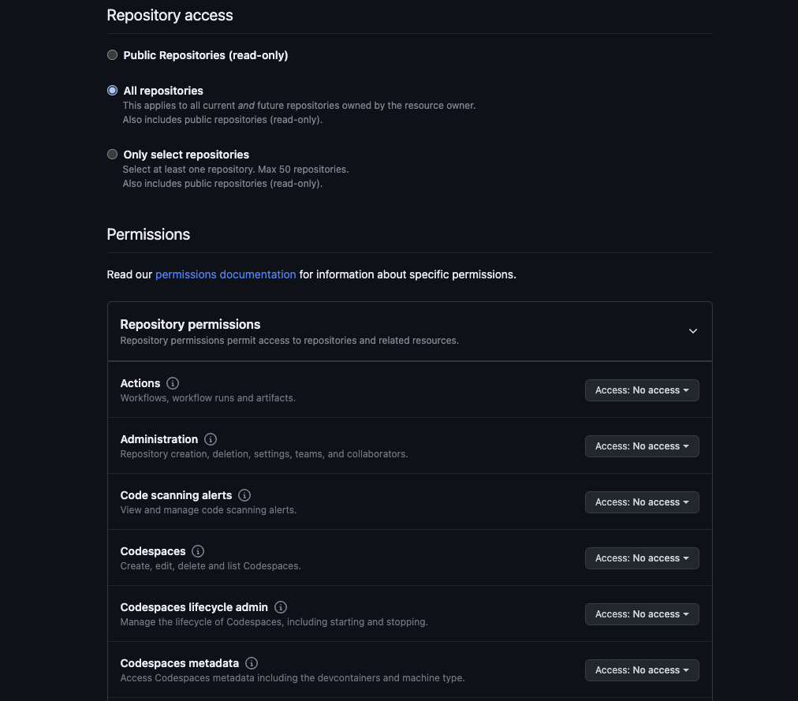
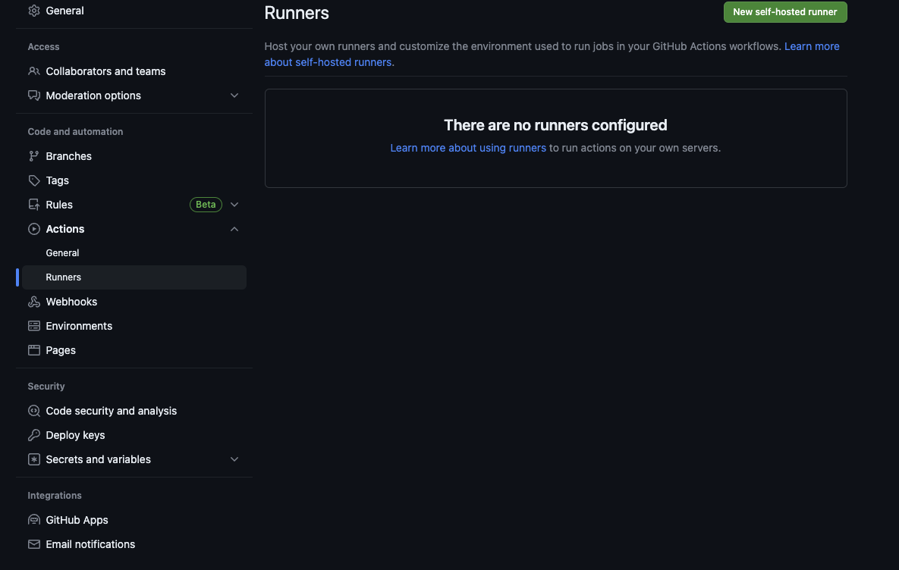

# 10. GitAction Nust Docker Deploy

<br />

## Nuxt 프로젝트 생성 1

```bash
## Nuxt 프로젝트 생성
npx create-nuxt-app nuxt-auto-deploy
```

<br />

## Dockerfile 생성 1 - (2)

> root 폴더에 dockerfile 생성 후 아래 파일 내용 기입

```docker
FROM node:14.19.0

# /app 파일을 생성 후 WORKDIR를 워크 디렉토리로 변경한다.
RUN mkdir -p /app
WORKDIR /app
# 현재 있는 파일들(.)를 /app/안에 복사한다.
ADD . /app/

# yarn.lock , package-lock.json 이 있으면 제거 || true<-- 없을때 에러 나지 않도록 하는 것
RUN rm yarn.lock || true
RUN rm package-lock.json || true
# 패키지 설치 및 빌드
RUN yarn
RUN yarn build

## 모든 ip 오픈
ENV HOST 0.0.0.0
## 3000포트 오픈
EXPOSE 3000

#프로젝트 실행
CMD [ "yarn", "start"]
```

<br />

## .dockerignore 이미지 생성시 필요없는 파일 제거 1 - (3)

```bash
# .dockerignore
node_modules/
dist/
## 제거
```

## 도커 이미지 빌드 후 이미지 실행 1 - (4)

```bash
# 이미지 생성 jjehyun/nuxt --> [이미지 이름]
docker build --tag jjehyun/nuxt:lastest .
# 이미지 생성 후 runningimage 이란 이미지로 실행  jjehyun/nuxt --> [이미지 이름]
docker run --name runningimage -d -p 3000:3000 jjehyun/nuxt:lastest
```

> localhost:3000 접속 시 웹 페이지 접근 가능

<br />
<br />

# git Action 연결 하기 2

- profile > Developer setting > Personal access token > Generate new token
- 
- 
- 
- gitAction-Token 발급 후 토큰 복사
- 
- 프로젝트 - Setting - Actions
  - Name : 이름
  - Secret : 발급 받은 gitAction-Token 값 삽입

<br />
<br />

# git Action workflow 작성 하기 2 - (1)

> 도커 이미지DOCKER_IMAGE만 변경 하면 됨

```yml
name: CI/CD Docker

# 트리거를 수행할 브랜치를 지정합니다.
on:
  push:
    branches: [main]

# 환경설정 --
env:
  ##DOCKER_IMAGE: ghcr.io/jjehyun/nuxt-auto-deploy
  ##DOCKER_IMAGE: ghcr.io/${{ github.actor }}/nuxt-auto-deploy 아래로 하면 대문자를 포함 하기 때문에 에러 남
  DOCKER_IMAGE: ghcr.io/${{ github.actor }}/[도커 이미지 이름]
  VERSION: ${{ github.sha }}
  NAME: go_cicd

jobs:
  # 빌드 Job
  build:
    name: Build
    runs-on: ubuntu-latest
    steps:
      # github repository에서 checkout
      - uses: actions/checkout@v2
      # docker build 수행
      - name: Set up docker buildx
        id: buildx
        uses: docker/setup-buildx-action@v1
      - name: Cache docker layers
        uses: actions/cache@v2
        with:
          path: /tmp/.buildx-cache
          key: ${{ runner.os }}-buildx-${{ env.VERSION }}
          restore-keys: |
            ${{ runner.os }}-buildx-
      # GitHub 컨테이너 레지스트리에 로그인 후 빌드 & 푸시
      - name: Login to ghcr
        uses: docker/login-action@v1
        with:
          registry: ghcr.io
          username: ${{ github.repository_owner }}
          password: ${{ secrets.GITHUB_TOKEN }}
      - name: Build and push
        id: docker_build
        uses: docker/build-push-action@v2
        with:
          builder: ${{ steps.buildx.outputs.name }}
          push: true
          tags: ${{ env.DOCKER_IMAGE }}:latest
  # 배포 Job
  deploy:
    needs: build # build 후에 실행되도록 정의
    name: Deploy
    runs-on: [self-hosted, label-go] # AWS ./configure에서 사용할 label명
    steps:
      - name: Login to ghcr
        uses: docker/login-action@v1
        with:
          registry: ghcr.io
          username: ${{ github.repository_owner }}
          password: ${{ secrets.GITHUB_TOKEN }}
      # 3000 -> 80 포트로 수행하도록 지정
      - name: Docker run
        run: |
          docker stop ${{ env.NAME }} && docker rm ${{ env.NAME }} && docker rmi ${{ env.DOCKER_IMAGE }}:latest
          docker run -d -p 80:3000 --name go_cicd --restart always ${{ env.DOCKER_IMAGE }}:latest
```

<br />
<br />

# EC2 생성 / 세팅

## docker 설치

```bash
# 도커 설치
sudo yum update -y
# 버전 확인
docker -v
# 도커 실행
sudo service docker start
# Docker 그룹에 sudo 추가
sudo usermod -aG docker ec2-user
# sudo 없이 docker 사용하기
sudo usermod -a -G docker ec2-user
```

> Docker Image를 생성해서 Docker Hub를 통해 EC2에 실행할 수 있는 환경이 만들어짐

<br />

## Git runner 등록

- 

- 

- 운영 체제에 따라 git-runner 설치

## EC2 환경에서 runner 설치

```bash
sudo yum update -y
sudo yum install -y libicu
sudo yum install -y libicu-devel
## amazon linux 2 기본 64비트
$ ./config.sh --url https://github.com/DeployProducts/NustDeploy --token AURR3QHQFUPY3KSVBFEYKDDEV65DO

$ curl -o actions-runner-linux-arm64-2.306.0.tar.gz -L https://github.com/actions/runner/releases/download/v2.306.0/actions-runner-linux-arm64-2.306.0.tar.gz

$ echo "842a9046af8439aa9bcabfe096aacd998fc3af82b9afe2434ddd77b96f872a83  actions-runner-linux-arm64-2.306.0.tar.gz" | shasum -a 256 -c

$ tar xzf ./actions-runner-linux-arm64-2.306.0.tar.gz
## git runner 설치 완료


## Configure 설치

./config.sh --url http[레파지토리 > action > runners] 참고
#################
#github runner 실행
nohup ./run.sh &
#################
```

<br />
<br />

- 
- 

```bash
./config.sh --url http[레파지토리 > action > runners참고 ]

- 나머지 설정은 다 enter로 Default 설정
- Enter any additinal labels (ex. label-1,label-2): [press Enter to skip]:
  - 이 부분만 workflow 부분의 runs-on 두번째 배열 이름과 동일 하게 수정
```


> git hub runner 완성
