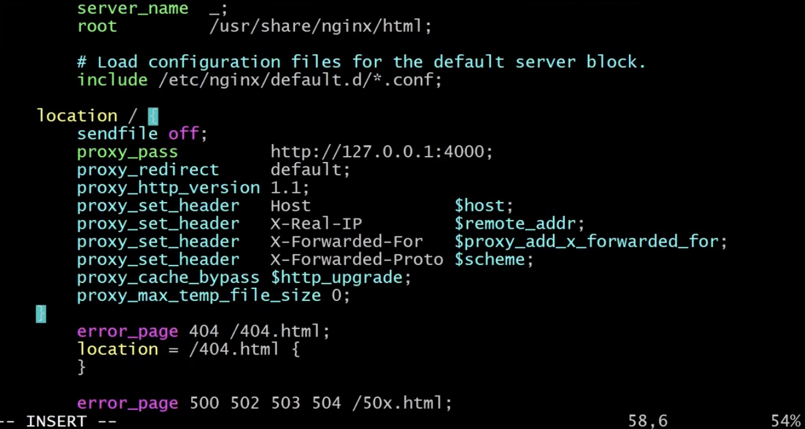

# REACT , EXPRESS , GITACTION

> EC2, REACT , EXPRESS 환경 세팅은 생략

# EC2 기본 설정 (1)

- Amazon Linux 2 AMI (HVM), 64-bit (x84)
- 
- 
  - node 환경 변수 설정

> node , htop 등 설치

```bash
## EC2 환경
sudo yum update -y
## git , htop 설치
sudo yum install git htop -y

## node 설치 및 환경 변수 등록
mkdir ~/local
cd ~/local
## node 다운
wget https://nodejs.org/dist/v16.14.0/node-v16.14.0-linux-x64.tar.xz tar xvf node-v16.14.0-linux-x64.tar.xz
## node/bin 경로 저장
cd node-v16.14.0-linux-x64/bin
## node/bin 경로 저장
pwd


##### node 환경 변수 등록
vi ~/.bash_profile

###########
PATH=$PATH:$HOME/.local/bin:$HOME/bin
PATH=$PATH:/home/ec2-user/local/node-v16.14.0-linux-x64/bin
############

## 현경 변수 변경 적용
source ~./bash_profile
## node 버전 출력
node -v
```

<br />

# node 와 nginx 연결 (2)

- 

> nginx 설치

```bash
## nginx 설치 후 nginx 설정 파일 열기

## * AL2023일 경우
sudo yum install nginx
sudo vi /etc/nginx/nginx.conf
## * Amazon Linux 2일 경우
sudo amazon-linux-extras install nginx1
sudo vi /etc/nginx/nginx.conf
```

<br />

> nginx 설정 파일

```bash
### server {}안에 아래 코드 삽입
...
root        /usr/share/nginx/html;
# Load configuration files for the default server
include /etc/nginx/default.d/*.conf;
#사이에 아래코드 삽입
##############################################################
# 현재 서비스가 4000포트에서 가동되니 4000번 , 3000번에서 가동되면 3000으로 변경
    location / {
        sendfile off;
        proxy_pass         http://127.0.0.1:4000;
        proxy_redirect     default;
        proxy_http_version 1.1;
        proxy_set_header   Host              $host;
        proxy_set_header   X-Real-IP         $remote_addr;
        proxy_set_header   X-Forwarded-For   $proxy_add_x_forwarded_for;
        proxy_set_header   X-Forwarded-Proto $scheme;
        proxy_cache_bypass $http_upgrade;
        proxy_max_temp_file_size 0;
    }


##############################################################
# 사이에 아래코드 삽입
error_page 404 /404.html;
location = /404.html{

}
...
```

<br />

## nginx 설정 확인

```bash
## 아래 명령어 쳤을 때 syntax ok라고 나오면 설정 적용완료
sudo nginx -t
## nginx 서버 실행
sudo systemctl start nginx
## 서버 재시작 시 nginx 자동 실행
sudo systemctl enable nginx
## nginx 재시작
sudo systemctl restart nginx
curl localhost
```

<br />
<br />

# pm2 설치 및 프로젝트 빌드 (3)

- 

> pm2 설치 및 프로젝트 빌드

```bash
# pm2 설치
npm install -g pm2

#######################################################
# 프론트엔드 라이브러리 다운 및 빌드
npm i
npm run build
# 프론트엔드 build 결과물 dist/* 전체를 backend/public폴더로 이동
cp -rf dist/* ../backend/public
cd ../backend/
# 백엔드 라이브러리 다운
npm i
# 백엔드에서 빌드된 프로젝트 시작
pm2 start bin/www --name web
pm2 list
```

> 퍼블릭 주소로 웹사이트 이동 시 프로젝트를 확인할 수 있다.

<br />

# 도메인 등록 및 https 인증서 설정 (4)

- 
- Route 53에서 도메인 구매 후 - Record type : A -> VALUE에 주소 기입

<br />

## https 인증서 발급

- sudo vi /etc/nginx/nginx.conf 이동
  - nginx 설정 파일
  - `server_name 도메인 이름으로 작성 후 저장`
  - 설정 후 niginx 재시작
  - `sudo systemctl restart nginx`

> /etc/nginx/nginx.conf

```bash
server {
    listen 80;
    listen [::]:80;
    ##################################
    #server_namer naver.com
    server_name _;
    #################################
    root    /usr/share/nginx/html

    #Road configuration files for the default server blocl
    include /etc/nginx/default.d/*.conf
}
```

<br />

## LetsEncrypt 인증서 설정

- 

```bash
## 인증서 발급을 위한 라이브러리 설치
## 운영체제에 따라서 둘중 하나 로 설치

######### AL2023일 경우 #########
sudo su -
dnf install python3 augeas-libs
dnf remove certbot
python3 -m venv /opt/certbot/
/opt/certbot/bin/pip install --upgrade pip
/opt/certbot/bin/pip install certbot certbot-nginx
ln -s /opt/certbot/bin/certbot3 /usr/bin/certbot
###############################


######## Amazon Linux 2일 경우 #########
sudo su -
yum -y install yum-utils
yum-config-manager --enable rhui-REGION-rhel-server-extras rhui-REGION-rhel-server-optional
yum install https://dl.fedoraproject.org/pub/epel/epel-release-latest-7.noarch.rpm
yum install certbot python2-certbot-nginx
######################################


### 설치 완료 시 아래 명령어로 인증서 발급
certbot --nginx

### 발급 완료 후 설정 확인 및 nginx재시작
nginx -t
systemctl restart nginx
```

<br />

## 인증서 자동 연장

- 

```bash
nginx -t
systemctl restart nginx
```

<br />
<br />
<br />

# CI/CD 자동 배포 적용

- 

> github root 저장소에 .github/workflows/deploy-main.yml 파일 생성

> gitAction 내용

```yml
name: remote ssh command for deploy
on:
  push:
    #main branch에서 push 이벤트가 일어났을 때
    branches: [main]
jobs:
  build:
    name: Build
    runs-on: ubuntu-latest
    steps:
      - name: executing remote ssh commands using key
        #githubmarketplace에서 ssh-action@master 실행됨
        uses: appleboy/ssh-action@master
        with:
          #EC2 도메인 주소 13.123.32.14
          host: ${{ secrets.HOST }}
          # ec2-user
          username: ${{ secrets.USERNAME }}
          # ec2 .pem파일
          key: ${{ secrets.KEY }}
          # 22번 port ssh 접속
          port: ${{ secrets.PORT }}
          # push event 일어났을 때 아래 명령어 실행 -> ./deploy.sh
          script: |
            ./deploy.sh
```

<br />
<br />

## push 자동 빌드 스크립트 만들기

> 서버에 접속하지 않고 Github Actions설정으로 저장소의 main 브랜치가 변경될 때 마다 서버에 최신 버전을 받아서 자동으로 빌드하고 재시작하는 스크립트이다.

<br />

```bash
vi ~/deploy.sh
```

<br />

> 스크립트

```bash
#!/bin/bash
# 환경 변수 저장
source ~/.bash_profile
cd ~/git/backfront/
# 최신 버전 pull 받기
git pull origin main
cd frontend/
npm i
npm run build
cp -rf dist/* ../backend/public
cd ../backend/
## FE , BE 라이브러리 받고 빌드
npm i

# pm2 멈춘 후 다시 재시작
pm2 stop web
pm2 start bin/www --name web --update-env
sleep 2
pm2 list
```

> 위에서 만든 스크립트 실행 권한 부여

```bash
chmod +x ~/deploy.sh
```
