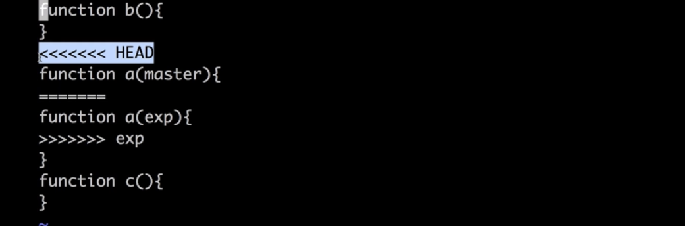
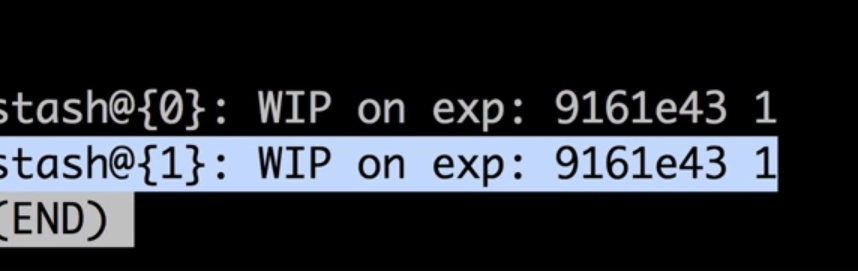
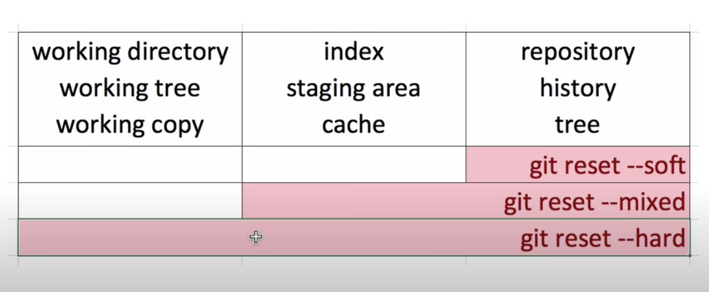

# git 기본🎯💡🔥📌✅

<br />

## git 버전 관리 하기

<br />

- `git 작업을 시작할 때 (init)`

  - `git clone` : 레파지토리를 폴더에 클론해서 저장한다는 의미
  - `git init` : 현재 디렉토리에 작업을 진행한다는 의미
  - 두 명령어 모두 `.git` 파일을 생성한다. (버전 관리에 활용되는 파일)

<br />

- `git add [관리할 파일 명]`

  - `git add .` : 모든 파일을 버전 관리 하겠다는 의미
    - `stage area`상태가 된다.
  - git 에게 관리 해야 할 파일이 무엇인지 알리는 명령어
  - add를 한 파일만이 commit 된다.

- `git commit -m "버전에 대한 메세지"`

  - 지금까지 작업한 내용을 버전으로 만들기
  - `git log`로 지금까지 만든 버전에 목록을 확인 할 수 있다.
  - `commit`하나당 하나의 작업을 가지고 있는 것이 가장 이상적이다.

- `git push origin main`
  - 원격저장소에 저장하기

<br />
<br />
<br />

## git 변경 사항 확인하기 (버전과 버전 사이의 소스코드 상의 차이점 확인)

<br />
<br />

- `git log` : 지금까지의 commit 버전을 확인 할 수 있다.
  - `git log -p` : 각각의 버전 들의 소스상의 차이점을 확인 할 수 있다.
  - 
    - commit 메세지 : 2 , commit id : 6838b....
- `git diff [commitID..commitID]` : 두개의 버전 소스 간의 차이점을 확인 할 수 있다.
  - 
  - `git diff` : 현재 작성한 코드와 이전 커밋과의 차이점을 알려준다.

<br />
<br />

## commit를 취소하는 명령어 (reset VS revert)

- `reset 명령어` : 위에 커밋을 삭제 후 과거의 커밋을 최신 버전으로 만드는 명령어(원격저장소에 올리지 않았을때만 사용)

  - `git reset 441c339cda... --hard`명령어를 실행 했을때
  - 
  - 

- `revert` : 커밋을 취소하면서 새로운 버전을 만드는 것

<br />
<br />

# git branch

- 하나의 코드를 버전 별로 관리할 수 있도록 도와주는 `branch`

> branch 목록을 확인 할 수 있는 명령어

```bash
# 현재 branch목록을 확인하는 명령어
git branch
# branch를 이동하는 명령어
git checkout [branch]
# branch를 생성한 후 이동하는 명령어
git checkout -b [branch]
```

<br />
<br />

## git branch 정보 확인

- 두 branch간의 차이점을 확인하는 명령어 (로그)
  - `git log --branches --decorate` : 현재 저장소에 있는 모든 `branch`를 보여준다.
  - 
    - master의 branch 최신 commit : 2
    - exp의 branch 최신 commit : 4

<br />

- 두 branch간의 차이점을 확인하는 명령어 (시각화)
  - `git log --branches --decorate --graph` : 시각화해서 보기
  - 
    - `exp`(branch) : 2 -> 3 -> 4
    - `master` (branch) : 2 -> 5
  - `git log --branches --decorate --graph -oneline` : 시각화해서 보기
    - 

<br />

## git branch 병합 (merge)

- 다른 버전의 branch를 현재 버전의 branch에 병합하는 방법(`merge`)
  - main branch로 이동
  - 다른 branch의 코드를 main branch로 merge
  - merge된 branch 삭제

```bash
# 깃 버전 체크 아웃
git checkout production
# 다른 버전 병합 하기
git merge issue#12
# 병합 했던 branch 삭제 하기
git branch -d exp
```

<br />
<br />

## branch merge 충돌해결

- 
  - `===`를 기준
    - `HEAD` : 현재 checkout한 branch에 수정 사항
    - `exp` : exp의 branch 내용

<br />
<br />

## git stash (checkout 시 유용)

- Working 디렉토리의 변경 사항을 감춘다.

- branch에서 작업했던 코드를 잠시 숨겨두는 기능
  - 현재 `branch`에서 작업이 끝나지 않았는데 다른 branch로 `checkout`해 `다른 작업을 해야할 때 사용`
  - 현재 `branch`의 상태를 깔끔하게 만들고 다른 `branch`로 이동이 가능
- `git stash`
  - 폴더의 작업 중인 변경 사항들을 저장하는 명령어
    - 
  - `git stash apply` : 숨겨놓았던 변경사항을 복구하는 명령어
    - 가장 상단의 `stash`를 적용
  - `git stash drop` : 가장 최신의 `stash`를 삭제하는 명령어
  - `git stash list` : stash 목록을 확인하는 명령어
  - stash를 적용하고 최신 stash를 삭제하는 명령어
    - git stash pop
    - git stash apply; git stash drop;

<br />
<br />

## git reset에 대해

- 
  - `git reset --hard` : working directory, index , repository
  - `git reset -- mixed` : index, repository만 반영
  - `git reset --soft` : repository만 반영
