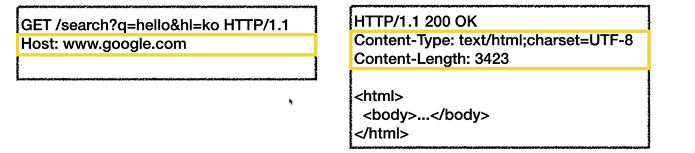
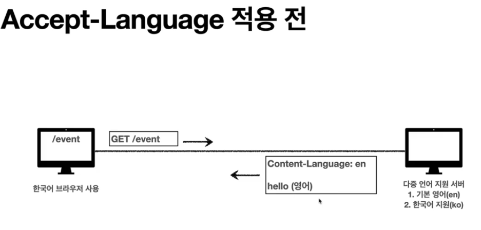

# HTTP 헤더 🎯💡🔥📌✅

<br />
<br />



```bash
#HTTP 헤더
header-field = field-name : (띄어쓰기) field-value (띄어쓰기)
header-field는 대소문자 구분 없음
```

<br />

## HTTP 헤더의 용도

```bash
HTTP/1.1 200 OK
## 해더 부분
Content-Type: text/html; charset=UTF-8
Content-Length:3424
## 해더 부분
```

- `HTTP 전송에 필요한 모든 부가정보`
  - ex) 메시지 바디의 내용, 메시지 바디의 크기, 압축, 인증, 요청 클라이언트, 서버 정보,...
- 표준 헤더가 많음`

<br />
<br />
<br />

## HTTP Body (`최신 스펙`) , RFC7230

<br />

> 예시

```bash
HTTP/1.1 200 OK
# 헤더 부분 (표현 헤더)
Content-Type: text/html; charset=UTF-8
Content-Length:3423
# 헤더 부분 (표현 헤더)

#메시지 본문 (표현 데이터) (Payload)
<html>
    <body></body>
</html>
```

- 메시지 본문을 통해 표현 데이터 전달
- 표현 헤더는 표현 데이터를 해석할 수 있는 정보 제공
  - `전송, 응답 모두 사용`
  - ex) 데이터 유형, 데이터 길이, 압축 정보 등등

<br />
<br />
<br />

## 표현 헤더에 대해서 (`Content-Type`)

<br />

- 표현 헤더 목록

  - `Content-Type` : 표현 데이터 형식
    - ex) html인지, json인지, xml인지,...
    - 
  - `Content-Encoding` : 표현 데이터의 압축 방식
    - 
    - 표현 데이터를 압축할 때 많이 사용된다.
    - 클리이언트에서 압축 후 인코딩 헤더 추가
    - 서버에서 인코딩 헤더의 정보로 압축을 헤제
  - `Content-Language` : 표현 데이터의 자연 언어
    - ex) 한국어 or 영어...
    - ex) 홈페이지 미국에서 접속 시 양어, 한국에서 접속 시 한국어
    - 
  - `Content-Lenguage` : 표현 데이터 길이
    - `바이트 단위`
    - `Transfer-Encoding`을 사용하면 Content-Length를 사용하면 안됨

<br />
<br />
<br />

## 협상 (콘텐츠 네고시에이션)

> 클라이언트가 선호하는 표현 요청 <br /> 클라이언트가 원하는 방식으로 표현데이터를 받을 수 있게 끔한다.

<br />

- Accept : 클라이언트가 선호하는 미디어 타입
- Accept-Charset: 클라이언트가 선호하는 문자 인코딩
- Accept-Encoding : 클라이언트가 선호하는 압축 인코딩
- Accept-Language : 클라이언트가 선호하는 자연언어
- `협상 헤더는 요청시 에만 사용한다.`

<br />
<br />

## Accept-Language 적용 전후

- 적용 전
  - 
- 적용 후
  - 
  - `Accept-Language`로 힌국어로된 페이지를 요청

<br />
<br />
<br />

## `Quality Value(q) 1`

- 0~1, `클수록 높은 우선 순위`
- 아래 예시 참고

> `Quality Value(q) 1` 예시

```bash
Get /event
Accept-Language: ko-KR; ko;q=0.9,en-US;q=0.8,en;1=0.7
# 1. ko-KR;q=1 (q생략)
# 2. ko;q=0.9
# 3. en-US;q=0.8
# 4. en:q=0.7
Accept-encoding: gzip, deflate, br
```

<br />

## `Quality Value(q) 2`

- `구체적인 것이 우선한다.`
  - Accept: text/\*, text/plain, text/plain; format=flowed, \*/\*
  - 1. text/plain;format=flowed
  - 2. text/plain
  - 3. text/\*
  - 4. \*/\*

> `Quality Value(q) 2` 예시

```bash
GET /event
Accept:Accept: text/*, text/plain, text/plain; format=flowed, */*
```

<br />

## `Quality Value(q) 3`

> 구체적인 것을 기준으로 미디어 타입을 맞춘다. `Quality Value(q) 3` 예시

```
Accept : text/*;q=0.3, text/html;q=0.7, text/html;level=1, text/html;level=2;q=0.4, */*;q=0.5
```

- 

<br />
<br />

# 헤더의 전송 방식 (4가지 전송 방식)

<br />

## 단순 전송 中 `전송 4가지 방식`

- `컨텐츠 길이를 알 수 있을때 사용한다.`
  - 한번에 다 전송하고 한번에 다 받는 방식
- 

<br />

## 압축 전송 中 `전송 4가지 방식`

- `컨텐츠를 압축 후 전송하는 방식`
  - Content-Encoding를 넣어줘야 함
- 

<br />

## 압축 전송 中 `전송 4가지 방식`

- `컨텐츠를 쪼개서 요청하는 방식`

- 

<br />

## 범위 전송 中 `전송 4가지 방식`

- `범위를 지정해서 컨텐츠를 요청하는 방식`

- 

<br />
<br />
<br />

# 헤더의 일반 정보 (5가지)

## From 中 헤더의 일반 정보 (5가지) `요청`

- 일반적으로 잘 사용되지 않음
- `검색 엔진 같은 곳에서, 주로 사용`
- `요청에서 사용`

<br />

## Referer 中 헤더의 일반 정보 (5가지) `요청`


> 현재 사이트 `전에 방문했던 페이지` : Referer에 들어가게 됨

- 현재 요청된 페이지의 이전 웹페이지 주소
- A -> B로 이동하는 경우 B를 요청할 때 Referer:A 를 포함해서 요청
- Referer를 사용해서 `유입 경로 분석` 가능
- `요청에서 사용`

<br />

## user-agent 中 헤더의 일반 정보 (5가지) `요청`


> 나의 웹브라우저 정보

- `클라이언트 애플리케이션 정보`
- 통계 정보
- 어떤 종류의 브라우저에서 장애가 발생하는지 파악 가능
- `요청에서 사용`

<br />

## server 中 헤더의 일반 정보 (5가지) `응답`

> 요청을 처리하는 origin 서버의 소프트웨어 정보

- ex) Server: Apache/2.2.22(Debian)
- server : nginx
- `응답에서 사용`

<br />

## Date 中 헤더의 일반 정보 (5가지) `응답`

- ex) Date: Tue, 15 Noc 1994 08:12:31 GMT
- `응답에서 사용`

<br />
<br />
<br />

# 헤더의 특별한 정보 (4가지, `Host`, `Location`, `Allow`, `Retry-After`)

<br />

## Host 中 헤더의 특별한 정보 (4가지) `요청/필수값`


> 요청한 호스트 정보 (`도메인`)

- 하나의 서버가 여러 도메인을 처리해야할 때
- 하나의 IP 주소에 여러 도메인이 적용되어 있을 때

<br />

## Location 中 헤더의 특별한 정보 (4가지) `응답`

> 페이지 리다이렉션 , 응답결과에 Location 헤더가 있다면, Location위치로 자동 이동(`리다이렉트`)

- `201 (Created)` : Location 값은 요청에 의해 생성된 리소스 URL
- `301 (Redirection)` : Location 값은 요청을 자동으로 리다렉션하기 위한 대상 리소스를 가리킴

<br />

## Allow 中 헤더의 특별한 정보 (4가지) `응답`

> 허용 가능한 HTTP 메서드

```
url경로는 존재하지만, 서버에서 GET,HEAD,PUT 메서드만 지원한다면,
응답으로 Allow: GET,HEAD,PUT를 에러와함께 보내준다.
```

- 405 (Method Not Allowed)에서 응답에 포함해야함
- Allow: GET,HEAD,PUT

<br />

## Retry-After 中 헤더의 특별한 정보 (4가지) `응답`

> 유저 에이전트가 다음 요청을 하기까지 기다려야 하는 시간

```bash
# 서버가 언제까지 불능인지 에러코드 503과 함께 헤더에 보내준다.
Retry-After: Fri,31 Dec 1999 23:59:59 GMT (날짜표기)
Retry-After: 120 (초단위 표기)
```

- 503 : 서비스가 언제까지 불능인지 알려줄 수 있음

<br />
<br />
<br />

# 쿠키 (Stateless 로그인 유지를 위함) 🎯💡🔥📌✅

```
✅ 주 사용처
`Cookie`는 `모든 요청`에 `자동`으로 `포함`됨
한번 세팅하면 모든 요청에 보내게 됨

📌 사용처
  - 사용자 로그인 세션관리
  - 광고 정보 트래킹

📌 쿠키 정보는 항상 서버에 전송됨
  - 네트워크 트래픽 추가 유발
  - 최소한의 정보만 사용

📌 주의
  - 보안에 민감한 데이터는 저장하면 안됨
```

<br />

- 
  - `set-Cookie` : 서버에서 클라이언트로 쿠기 전달(응답)
- 
  - `Cookie` : 클라이언트가 서버에서 받은 쿠키를 저장하고,HTTP 요청 시 서버로 전달
  - `Cookie`는 `모든 요청`에 `자동`으로 `포함`됨
  - 

<br />
<br />
<br />

```bash
# 쿠기 예시
# expires : 만료시간
# path : 허용해주는 경로
# domain : 허용되는 도메인
set-cookie: sessionId=abcdee1234; expires=Sat, 26-Dec-2020 00:00:00 GMT; path=/; domain=.google.com; Secure
```

<br />
<br />

## 쿠키의 생명주기

```
✅ 생명 주기


!set-Cookie: expires=Sat, 26-Dec-2020 04:39:21 GMT
  - 만료일되면 쿠기 삭제

!set-Cookie: max-age=3600
  - 유효기간 지나면 쿠키 삭제
  - 0이나 음수를 지정하면 쿠키 삭제
  - 초단위로 세팅 가능

!session-Cookie : 만료 날짜를 생략하면 브라우저 종료시 까지만 유지

!영속 Cookie : 만료 날짜를 입력하면 해당 날짜까지 유지
```

<br />
<br />

## 쿠키 - 도메인 지정하기

> 쿠키에 도메인을 지정할 수 있다. <br /> ex) domain=example.org

<br />

> 쿠기에 도메인을 적용하는 두가지 방식

```bash
📌 명시 : 명시한 문서 기준 도메인 + 서브 도메인 포함
ex) domain=example.org를 지정해서 쿠키 생성
  - example.org/dev.example.org에 접근했을때 쿠키도 함께 전송된다.

📌 생략 : 현재 문서 기준 도메인만 적용
ex) example.org 에서 쿠키를 생성하고 domain 지정을 생략
  - 오직 example.org에서 접근했을때만 쿠키도 함께 전송된다.

```

<br />
<br />

## 쿠키 - 경로 지정하기

> 쿠키에 경로를 지정할 수 있다. <br /> ex) path=/

<br />

> 경로를 지정하면, 경로를 포함한 하위 경로만 쿠키를 전송한다.

```bash
# 쿠기 경로 지정 예시
path=/home

/home --> 쿠기 전달 O
/home/level1 --> 쿠기 전달 O
/home/level1/level2 --> 쿠기 전달 O
/hello --> 쿠기 전달x
```

<br />
<br />

## 쿠키 - 보안 지정하기

- Secure

  - 쿠키는 원래 `HTTP/HTTPS` 둘 다 전송
  - `Secure를 적용하면 https인 경우에만 전송`

- HttpOnly

  - XSS 공격방지
  - 자바스크립트에서 접근 불가
  - HTTP 전송에만 사용

- SameSite
  - XSRF 공격 방지
  - 요청 도메인과 쿠키에 설정된 도메인이 같은 경우에만 쿠키 전송

<br />
<br />
<br />
<br />
<br />
<br />
<br />
<br />
