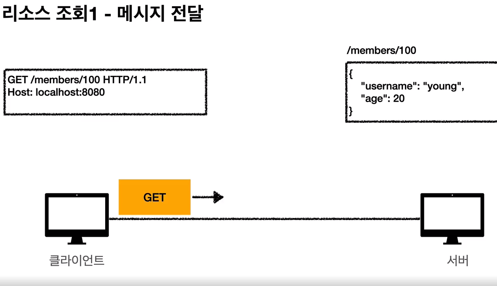
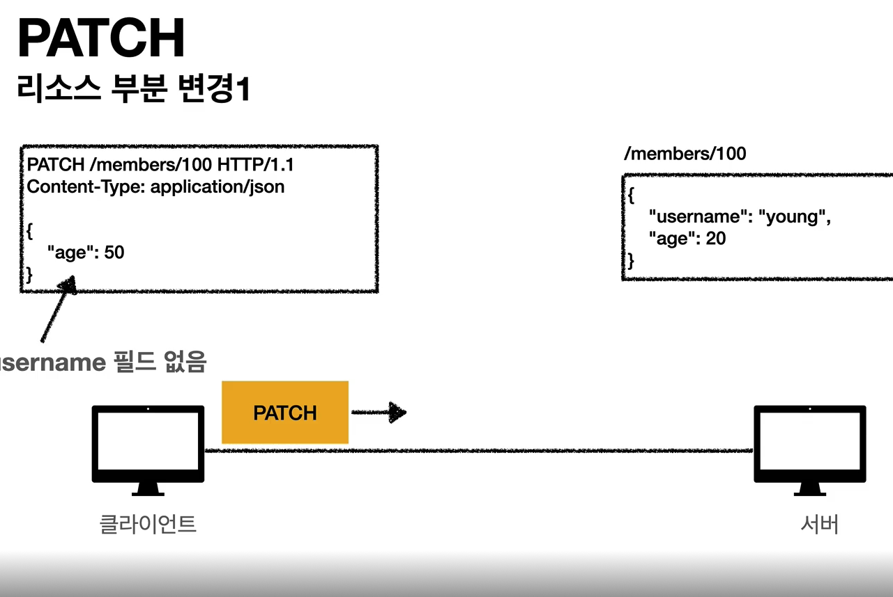
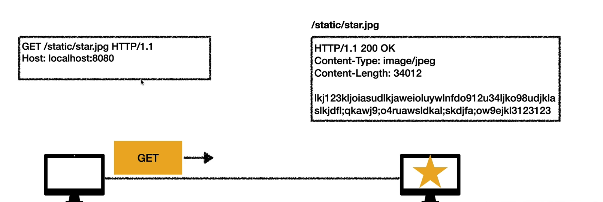
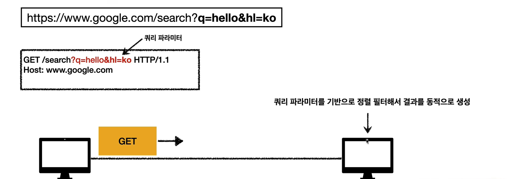
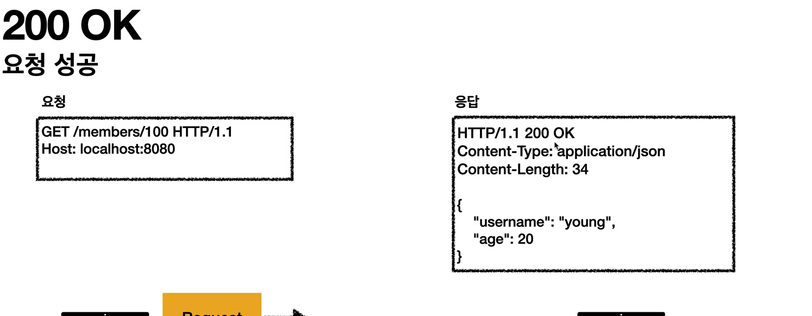
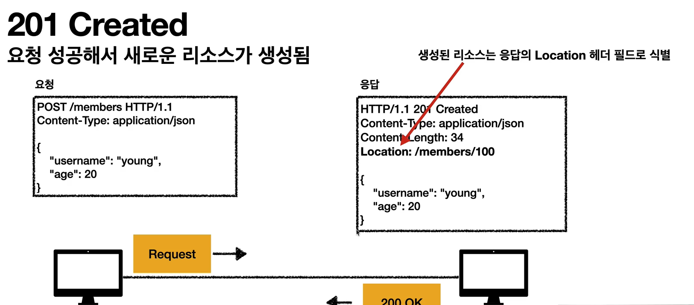
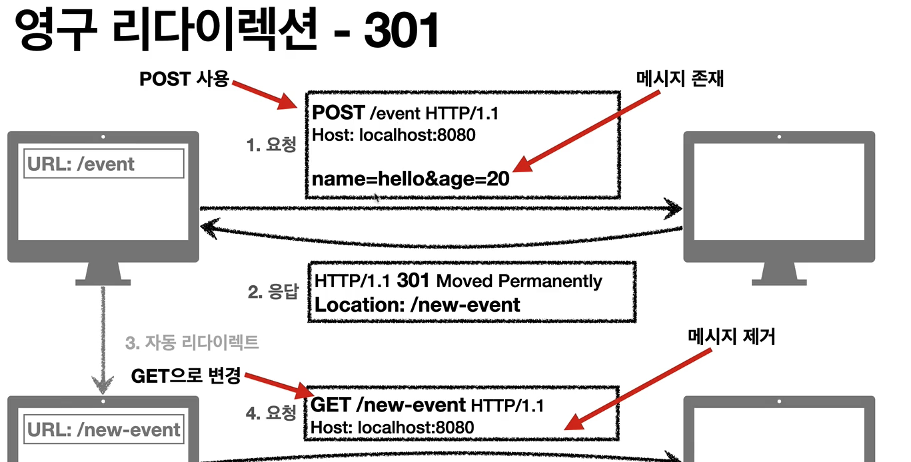
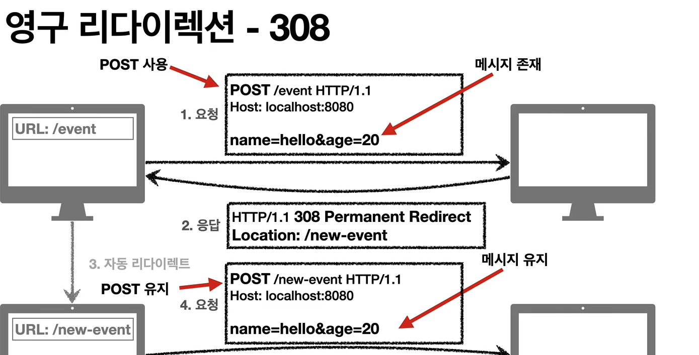
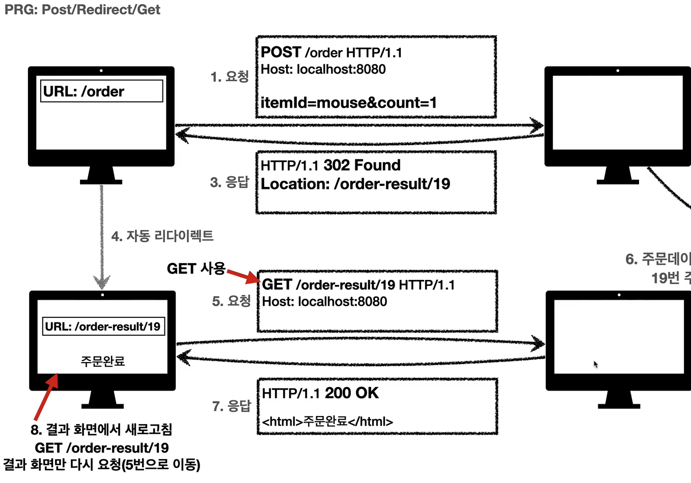

# HTTP 메서드 🎯💡🔥📌✅

<br />
<br />

## HTTP 메서드 종류 (4가지)

```
💡 리소스란?
예시) 미네랄을 캐라!
행위(동사)가 아닌 명사인 미네랄이 리소스
```

- `GET` : 리소스 조회
- `POST` : 요청 데이터 처리, 주로 등록에 사용
- `PUT` : 리소스를 대체, 리소스가 없으면 생성
- `PATCH` : 리소스 부분 변경
- `DELELT` : 리소스 삭세

<br />
<br />

## HTTP 메서드 中 GET

- `리소스를 조회`
- 서버에 전달하고 싶은 데이터는 `querystring`를 통해 전달
- 메세지바디를 통해 데이터 전달할 수 있지만, 관장하지 않는다. (지원하지 않는 서버가 많기 때문에)
- 

> GET 메서드 예시

```
GET /search?q=hello&hl=ko HTTP/1.1
Host: www.google.com
```

<br />
<br />

## HTTP 메서드 中 POST

- 요청 데이터 처리
- 메시지 바디를 통해 서버로 요청 데이터 전달
- 서버는 요청 데이터를 처리
  - 메시지 바디를 통해 들어온 데이터를 처리하는 모든 기능을 수행한다.
- 주로 전달된 데이터로 신규 리소스 등록, 프로세스 처리에 사용

> POST 예시

```bash
# POST 메서드는 대상 리소스가 리소스의 고유한 의미 체계에 따라 요청에 포함된 표현을 처리하도록 요청합니다.

POST /member HTTP/1.1
Content-Type: application/json
{
  "username":"young",
  "age": 20
}
```

<br />
<br />

## HTTP 메서드 中 PUT

- `PUT` :
  - 리소스 대체(덮어버림), `완전히 대체`
  - 리소스가 없으면 생성
- `post 와의 차이점`
  - 클라이언트가 리소스의 전체적인 위치를 알고 url를 지정한다.(`post와의 큰 차이점`)

> put 예제

```bash
# 클라이언트가 리소스의 전체적인 위치를 알고 url를 지정한다. (post와의 큰 차이점)
# 클라이언트가 리소스를 알고 있다.
PUT [/members/100] HTTP/1.1
Content-Type: application/json
{
  `username`:"hello"
  `age`:20
}
```

<br />
<br />

## HTTP 메서드 中 PATCH

- `PATCH` :
  - `리소스의 부분 변경`
  - `PUT`은 완전히 새로운 데이터로 대체하는 반면에 `PATCH`는 리소스의 부분 변경이 가능하다.

> PATCH 예제

```bash
PATCH /member/100/ HTTP/1.1
Content-Type: application/json
{
  "age":50
}
```



<br />
<br />

## HTTP 메서드 中 DELETE

- `DELETE` :
  - 리소스 제거하기

> DELETE 예제

```bash
# delete 예제
DELETE /members/100/ HTTP/1.1
host:localhost:8080
```

<br />
<br />
<br />

## HTTP 메서드의 속성

- `안전` : 해당 리소스가 변하지는지 변하지 않는지
  - `get 메서드 해당`
- `멱등` : `몇번을 호출하든 결과가 매번 같은지`
  - 자동 복구 메커니즘에 사용 (똑같은 요청 여러번 가능)
    - 멱등은 외부 요인으로 중간에 리소스가 변경되는 거 까지는 고려하지 않는다.
  - `get 메서드 해당` : 한번 조회하든 여러번 조회하든 같은 결과가 조회된다.
  - `put 메서드 해당` : 결과를 대체한다. (여러번 호출해도 최종결과는 같다)
  - `delete 메서드 해당` : 결과를 삭제한다. (같은 요청을 여러번 해도 삭제된 결과는 같다.)
- `캐시 가능` : 응답 결과를 캐시해서 사용해도 되는가?
  - `get, head, post , patch` 캐시 가능
  - 실제로는 `get`,`head` 정도만 캐시로 사용 가능
  - `post`,`patch`는 본문내용까지 고려해야하는데 구현이 쉽지 않다.

<br />
<br />

# HTTP 메서드 활용

## 클라이언트에서 서버로 데이터 전송 (2가지 방법)

| 쿼리파라미터를 통한 데이터 전송 | 메시지 바디를 통한 데이터 전송    |
| ------------------------------- | --------------------------------- |
| GET                             | POST,PUT,PATCH                    |
| 주로 정렬 필터                  | 회원가입, 상품주문,리소스 등록... |

<br />
<br />

## 클라이언트에서 서버로 데이터 전송 4가지 상황

- 정적 데이터 조회 : 이미지,정적 문서..
- 동적 데이터 조회 : 검색, 게시판 목록..
- HTML Form을 통한 데이터 전송 : 회원가입, 상품주문...
- HTTP API를 통한 데이터 전송 : 회원가입, 상품주문...

<br />
<br />

## 정적데이터 조회 (쿼리 파라미터 미사용)

- 이미지,정적 문서
- 조회는 Get 사용
- 정적 데이터는 일반적으로 `쿼리 파라미터 없이` `리소스 경로로 단순하게 조회 가능`

> 예시
> 

<br />

## 동적 데이터 조회 (쿼리 파라미터 사용)

- 주로 검색, 게시판 목록에서 정렬 필터
- 조회 조건을 줄여주는 필터
- `조회는 GET 사용`

> 예시
> 

<br />

## HTML Form 데이터 전송 (`application/x-www-form-urlencoded`) , `get,post만 지원`

- `form`테그로 서버에 요청하면 웹브라우저 HTTP 요청 메세지를 생성해서 서버에 보내주게 된다.

> 일반적인 html form 데이터 전송

```
<form action="/save" method="post">
  <input type="text" name="username" />
  <input type="text" name="age" />
</form>

--> 웹 브라우저가 생성한 http 요청 메세지
POST /save HTTP/1.1 Host:
localhost:8080 Content-Type:application/x-www-form-urlencoded
username=kim&age=20 <--- 이런형식이 application/x-www-form-urlencoded
```

<br />

> html 이미지 파일 전송 form (`multipart/form-data`) <br />
> 파일 업로드 같은 바이너리 데이터 전송 시 사용 <br />
> 다른 종류의 여러 파일과 폼의 내용 함께 전송 가능

```bash
<form action="/save" method="post" enctype="multipart/form-data">
  <input type="" name="username" />
  <input type="" name"age">
  <input name="file">
</form>

----------------------------------------------------------------------------
## 웹브라우저가 자동으로 생성해준 HTTP 요청 메시지
## boundary=----XXX 가 구분 시켜줌
POST /save HTTP/1.1
Host: localhost:8080
Content-Type: multipart/form-data; boundary=----XXX
Content-Length:10457

------XXX
Content-Disposition: form-data; usernam="username"

kim
------XXX
Content-Disposition: form-data; usernam="age"

20
------XXX
Content-Disposition: form-data; name="file1" filename="intro.png"
Content-Type:image/png
...
```

<br />
<br />

## HTTP API 데이터 전송

- HTML에서 Form 전송대신 자바스크립트를 통한 통신에 사용 (`AJAX`,`FETCH`,`AXIOS`)
- `Content-Type`은 `application/json`을 주로 사용한다. (사실 상 표준)

<br />
<br />
<br />

# HTTP 상태 코드 🎯💡🔥📌✅

> 상태 코드란 클라이언트가 보낸 요청의 처리 상태를 응답에서 알려주는 기능

<br />

```
💡 상태 코드의 종류

✅ 100번 대 : 요청이 수신되어 처리중

✅ 200번 대 : 요청 정상 처리

✅ 300번 대 : 요청을 완료하려면 추가 행동이 필요

✅ 400번 대 : 클라이언트 오류, 잘못된 문법등으로 서버가 요청을 수행 할 수 없음

✅ 500번 대 : 서버 오류, 서버가 정상 요청을 처리하지 못함
```

<br />
<br />

# 2XX (성공 상태코드)

- 200 : `Ok`
  - 요청 성공
  - 
- 201 : `Created`
  - 요청이 성공해서 새로운 리소스를 생성
  - 
- 202 : `Accepted`
  - 요청이 접수는 되었으나 아직 처리가 완료되지 않음
- 204 : `No Content`
  - 서버가 요청을 성공적으로 수행했지만, 응답 페이로드 분문에 보낼 데이터가 없음
  - ex) 웹 문서 편집기에서 save버튼을 눌러도 같은 화면을 유지할 때 사용

<br />
<br />

# 3XX (Redirection)

> 요청을 완료하기 위해 유저 에이전트의 추가 조치(클라이언트 프로그램)가 필요할 때

<br />

```
💡 리다이렉션의 이해
- 웹브라우저는 3XX 응답의 결과에 `Location헤더`가 있으면, `Location 위치로 자동 이동`한다.

💡 리다이렉션 이해
- 영구 리다이렉션
  - 특정 리소스의 url가 영구적으로 이동
- 일시 리다이렉션
  - 일시적인 변경
  - ex) 일시적으로 이동시키는 것 : 주문 완료 후 주문 내역 화면으로 일시적으로 이동
- 특수 리다이렉션
  - 결과 대신 캐시를 사용


```

<br />

- 3XX 상태 코드 목록
  - `300`(Multiple Choices)
  - `301`(Moved Permanently)
  - `302`(Found)
  - `303`(See Other)
  - `304`(Not Modified)
  - `307`(Temporary Redirction)
  - `308`(Permanent Redirect)

<br />
<br />

## 영구 리다이렉션 (301,308)

<br />

> 리소스의 url이 영구적으로 이동했다는 걸 알려줌<br />
> 원래의 url를 사용하지X, 검색 엔진등에서도 변경 인지

- `301` , `308` 두 상태 코드 모두 url 경로가 완전히 바뀌었다는 것을 알려줌
  - `일반적으로 301를 많이 사용한다.`
  - `301` : 리다이렉트시 요청 메서드가 GET으로 변하고, 본문이 제거될 수 있음
    - 
  - `308` : 리다이렉트시 요청 메서드와 본문유지
    - 

<br />
<br />
<br />

## 일시적 리다이렉션 (302,307,303)

```
💡 리소스의 URL가 일시적으로 변경
💡 검색 엔진 등에서 URL을 변경하면 안됨
```

<br />
<br />

- `302` : 리다이렉트시 요청 메서드가 GET으로 변하고, 본문이 제거될 수 있음 (`대부분의 실무에서 사용`)
- `307` :
  - `302`와 기능이 같다.
  - 리다이렉트시 요청 메서드와 본문 유지
- `303` : 리다이렉트시 요청 메서드가 GET으로 변경

  - 메서드가 `Get`으로 변경

- `304` : 캐시를 목적으로 사용
  - 클라이언트에게 리소스를 수정되지 않았음을 알려준다. 따라서 클라이언트는 `로컬pc`에 `저장된 캐시`를 `재사용`한다.
  - `로컬 캐시를 사용해야하니 바디를 포함하면 안된다.`

<br />

```
📌 RRG : Post/Redirect/Get (일시적 리다이렌션)

- post로 주문 후 웹 브라우저를 새로고침을 하면 주문이 중복될 수 있다.
  - post로 주문 후에 새로고침으로 인한 중복 주문 방지
  - post로 주문후에 주문 결과 화면을 GET메서드로 리다이렉트
  - 새로고침해도 결과 화면을 get으로 조회
```

> RRG <br /> > 

<br />
<br />
<br />

# 4XX (클라이언트 오류)

- `400 Error`
  > 클라이언트의 요청에 잘못된 문법들으로 서버가 요청을 수행할 수 없음 <br /> `오류의 원인이 클라이언트에게 있음` <br />
  > 클라이언트가 이미 잘못된 요청, 데이터를 보내고 있기 때문에, 똑같은 재시도가 실패한다. <br />

<br />

- `401 Error` (`클라이언트가 해당 리소스에 대한 인증이 필요함`)
  - `인증 되지 않음`
  - `참고`
    - `인증(Authentication)`: 로그인
    - `인가(Authorization)` : 권한 부여 (Admin 권한 처럼 특정 리소스에 접근할 수 있는 권한)
    - 오류 메시지가 `Unauthorized`이지만 인증되지 않음

<br />

- `403 Error` (`서버가 요청을 이해했지만 승인을 거부함`)
  - 주로 인증 자격증명은 있지만, 접근 권한이 불충분한 경우
  - ex) 일반사용자가 admin등급의 리소스에 접근하는 경우

<br />

- `404 Error` (`요청 리소스를 찾을 수 없음`)
  - `요청 리소스가 서버에 없음`
  - 또는 클라이언트가 권한이 부족한 리소스에 접근할 때 해당 리소스를 숨기고 싶을 때

<br />
<br />

# 5XX (서버 오류)

> 서버 문제로 오류 발생 <br /> 서버에 문제가 있기 때문에 재시도 하면 성공할 수도 있다.

<br />
<br />

- `503` (`서비스 이용불가`)
  - 서버가 일시적인 과부하 또는 예정된 작업으로 잠시 요청을 처리할 수 없음
  - `Retry-After` 헤더 필드로 얼마뒤에 복귀되는지 보낼 수도 있음
