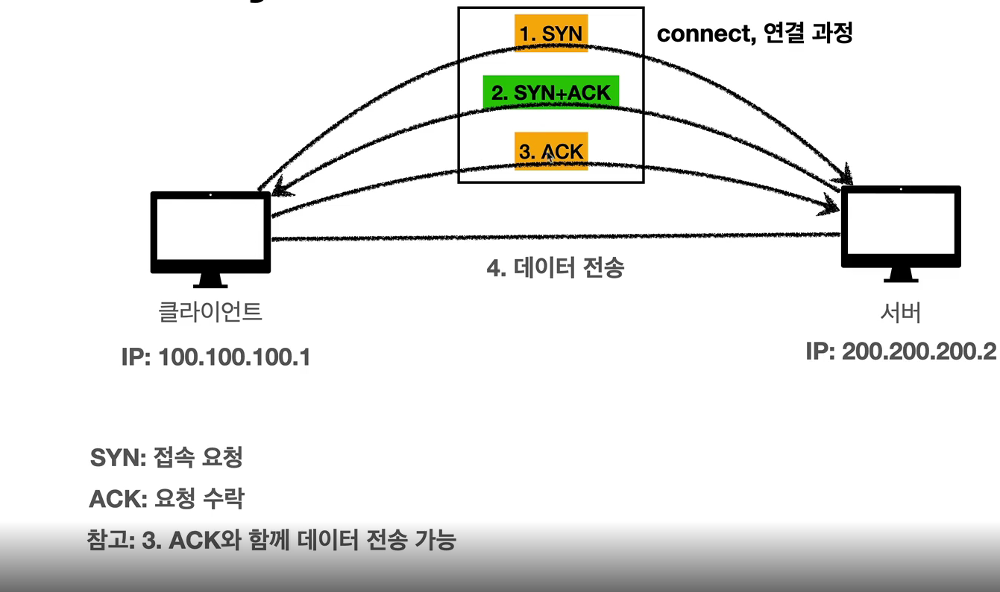
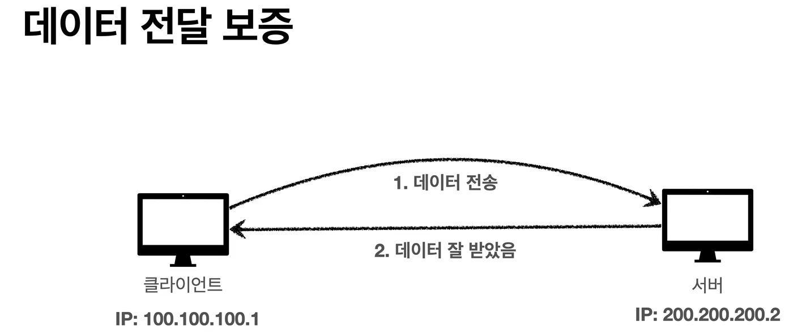
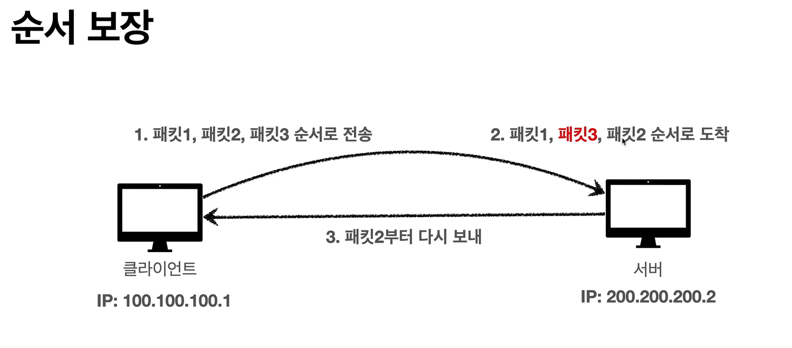
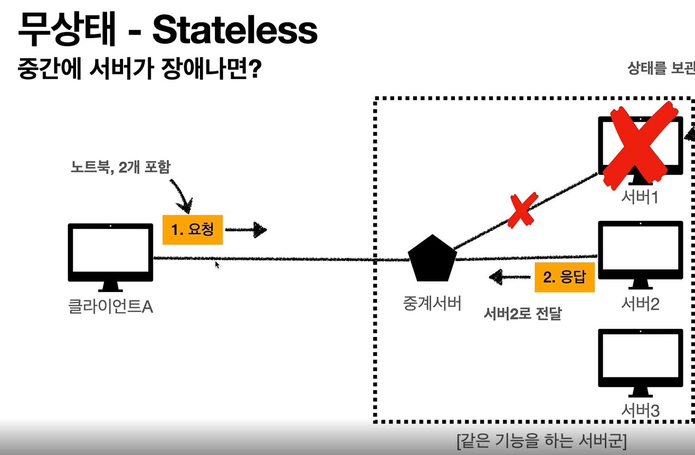
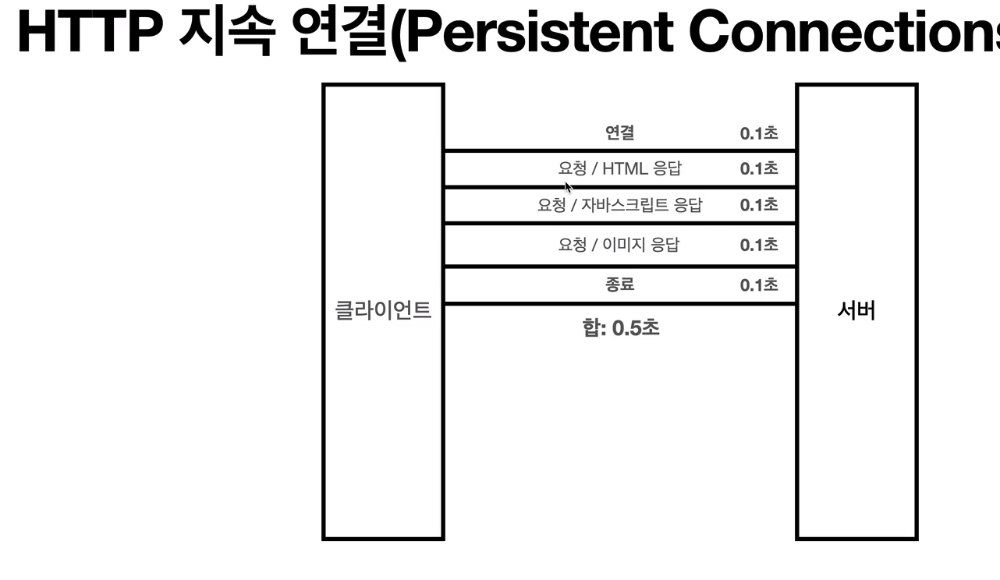

# 인터넷 네트워크 🎯💡🔥📌✅

```
✅ 패킷이란?

Pack + bucket의 합성어로 네트워크에서  출발지와 목적지간에 라우팅 되는 데이터 단위
```

- IP (인터넷 프로토콜 역할)
  - 지정한 `IP` 주소에 데이터 전달
  - `패킷`이라는 통신 단위로 `데이터 전달`
  - `IP 패킷의 정보`
    - 출발지 IP
    - 목적지 IP
    - 
      - 여러 노드들을 거치며, 메세지를 IP(200.200.200.2)주소로 전달한다.

<br />
<br />

```
📌 IP 프로토콜의 한계

💡 비연결성 : 패킷을 받을 대상이 없더라도, 패킷을 전송한다.

💡 비신뢰성 : 패킷이 중간에 사라질 수 있고, 패킷이 순서대로 전달이 안될 수 있다.

💡 프로그램 구분 : 같은 IP를 사용하는 서버에서 통신하는 애플리케이션이 두개 이상 일 수 있다.
```

<br />

- > 패킷의 전송 순서를 보장 할 수 없다.
- 
- > 패킷이 소설 될 수 있다.
- 

<br />
<br />

## TCP(신뢰성 높음) / UDP 특징(신뢰성 낮음)

- 위의 순서 제어 문제, 패킷 소실 문제를 `TCP/UDP`로 해결할 수 있다.
- TCP(`대분의 애플리케이션에서 사용한다.`)
  - 전송 제어 프로토콜(Transmission Control protocal)
  - 1. `연결 지향` : 연결 후 메세지 전달 (TCP 3way handshake)
  - 2. `데이터 전달 보증` : 패킷이 소실됐다면, 소실된 사실을 알 수 있다.
  - 3. `순서 보장` : 순서를 보장한다.
- TCP/IP 패킷 정보

  - `출발지 PORT`
  - `목적지 PORT`
  - `전송 제어`
  - `순서`
  - `검증 정보`
  - ...

  <br />

## 연결 지향 (TCP 3way handshake) 1 中 TCP / UDP



```
[클라인언트] --syn(연결 요청)--> [서버]
[클라이언트] <--syn(연결 요청)+ack(요청 수락)-- [서버]
[클라인언트] --ack(요청 수락),데이터--> [서버]

위 3단계를 거친 후 데이터를 주고 받는다.
```

<br />
<br />

## 데이터 전달 보증 1 中 TCP / UDP



- 서버에서 데이터를 전달 받았다면, 클라이언트에게 알려줌

<br />
<br />

## 순서 보장 1 中 TCP / UDP



<br />
<br />

```
📌 UDP 특징
- 보통 하얀 도화지에 비유됨
- 연결지향 X - (TCP 3 way handshake X)
- 데이터 전달 보증 X
- 순서 보장 - X
- 데이터 전달 및 순서가 보장되지 않지만 단순히 빠름

📌📌 정리
IP과 거의 같고, + PORT + CHECKSUM 만 추가 됨
어플리케이션에서 추가 작업이 필요하다.
```

---

## PORT

- IP : 목적지 서버를 찾는 것
- PORT : 서버안에서 돌아가는 애플리케이션을 구분 하는 것
  - 같은 ip내에서 port를 구분하는 것
  - 0 ~ 65535까지 할당 가능
    - 0 ~ 1023 : 잘 알려진 포트
    - FTP - 20,21
    - TELNET - 23
    - HTTP - 80
    - HTTPS - 443

<br />
<br />

## DNS (Domain Name System)

- 전화번호 부
- 도메인 명을 IP 주소로 변환하는 것
- 쉽게 도식화
  - 
  - 도메인 서버를 거쳐서 ip주소를 받은 후 서버로 접속

<br />
<br />
<br />

# URL와 웹 브라운저 요청 흐름

## URL

- URL(Uniform Resource Identifier)
  - 리소스를 관리하는 통합된 방법
- `Uniform` : 리소스 식별하는 통일된 방식
- `Resource` : 자원 ,URL로 식별할 수 있는 모든 것 (제한 없음)
- `Identifer` : 다른 항목과 구분하는데 필요한 정보

<br />

> URL Scheme

```bash
#url 예시
https://google.com443/search?q=1&hl=en

# HTTPS - 프로토콜
# www.google.com - 호스트명
# 443 - 포트번호
# /search - 패스
# 쿼리 파라미터  ?q=1&hl=en
```

<br />

```
💡 http, https 사용 시 port 생략가능

💡 https는 http에 보안 추가 (HTTP Secure)
```

<br />
<br />

# 웹 브라우저 요청 흐름

1. 웹 브라우저가 HTTP 메세지를 생성한다.

> HTTP 메세지 예시

```
GET /search?q=hello&hl=ko HTTP/1.1
HOST: www.google.com
```

2. SOCKET 라이브러리를 통해 전달한다.

- `TCP 3way handshake`

3. TCP/IP 패킷 생성, HTTP 메세지 포함

4. 인터넷을 통해 데이터 전달

5. 서버에서 데이터를 전달 받은 후 TCP/IP 패킷을 제거 후 HTTP 메세지 정보 해석

6. HTTP 응답 메세지를 생성 후 패킷을 쌓아 전송

> HTTP 응답 메세지 예시

```BASH
HTTP/1.1 200 OK
# 응답하는 데이터 형식 - html
Content-type: text/html;charset=UTF-8
# html의 길이가 3423
Content-Length: 3423
<html>
    <body>...</body>
</html>
```

7. 응답받은 HTTP 메세지를 해석 후 브라우저에 랜더링 한다.

<br />
<br />
<br />
<br />

# HTTP 프로토콜 특징 🎯💡🔥📌✅

- 거의 모든 형태의 데이터를 전송할 수 있음
- 1. 클라이언트 서버 구조
- 2. 무상태 프로토콜(스테이스리스), 비연결성
- 3. HTTP 메시지
- 4. 단순함, 확장 가능

<br />

## HTTP 프로토콜의 특징 中 1 (클라이언트 서버 구조)

- `클라이언트는 서버에 요청을 보내고 응답을 받을 때 까지 기다린다.`
- `응답을 받으면 클라이언트가 동작을 한다.`
- 
  - 비지니스 로직과 데이터를 `서버`에 몰아넣고 `클라이언트`는 UI와 사용성 집중할 수 있게 도와준다.
  - `클라이언트 - 서버 구조`를 만들게 되면, 양쪽이 독립적으로 진화 할 수 있다는 장점이 있음

<br />

## HTTP 프로토콜의 특징 中 1 (무상태 프로토콜)

```
HTTP는 무상태 프로토콜(stateless)을 지향한다.
```

- Stateless 프로토콜`이란?

  - 서버가 `클라이언트의 상태를 보존하지 않는다.`
  - 갑자기 클라이언트 요청이 증가해도 서버를 대거 투입할 수 있다.
  - 응답서버를 쉽게 바꿀 수 있어, 무한한 서버 증설이 가능하다.
  - 
    - `Scale-up`에 용의 하다.
    - 애플리케이션 설계에는 최대한 stateless를 사용하고, 로그인 같은 경우에만 statefull를 사용한다.

<br />

## HTTP 프로토콜의 특징 中 1 (비연결성)

- 클라이언트와 서버 연결은 유지X, 함으로써 최소한의 자원 유지 할 수 있다.
- HTTP는 기본적으로 `연결을 유지하지 않는 모델`
- 서버 자원을 효율적으로 사용 가능하다.

- `HTTP 비연결성의 단점`
  - 요청 마다 연결을 유지 하지 않기 때문에, `3-way-handshake`를 다시 맺어야 한다.
  - 위 단점은 HTTP 지속 연결로 해결 가능하다. (`Presistent-Connections`)
  - 
    - html 페이지를 받을 때 까진 지속연결을 유지한다.

<br />
<br />

## HTTP 프로토콜의 특징 中 1 (HTTP 메세지)

<br />

```
http 메세지 구조
-------------
| 시작라인   |
| 헤더       |
| 공백라인   |
|메세지 바디 |
-------------
```

 <br />

> HTTP 메세지

```bash
# 요청 메시지
GET /search?q=hello&hl=ko HTTP/1.1 # 시작 라인
Host: www.google.com               # 헤더
                                   # 공백 라인 (CRLF)

# 응답 메시지
HTTP/1.1 200 OK                    # 시작 라인
Content-Type: text/html; charset=UTF-8 # 헤더
Content-Length: 3423                   # 헤더
                                  # 공백 라인 (CRLF)
<html>                            # 메시지 바디
<body>...</body>
</html>
```

<br />
<br />

```bash
✅ HTTP

📌 요청 메세지 (시작라인)
- request-line : method (공백) request-target (공백) HTTP-version
- 예시 : GET /search?q=hello&hl=ko HTTP/1.1

📌 요청 메세지 (헤더)
- field-name: ows field-value OWS
- 예시 : Host: www.google.com
- 헤더의 용도
  - HTTP 전송에 필요한 모든 부가 정보가 담겨 있음

📌 응답 메세지 (메시지 바디)
- 실제 전송할 데이터
- HTML문서, 이미지, 영상 ,JSON... byte로 표현할 수 있는 모든 데이터 전송 가능
```
