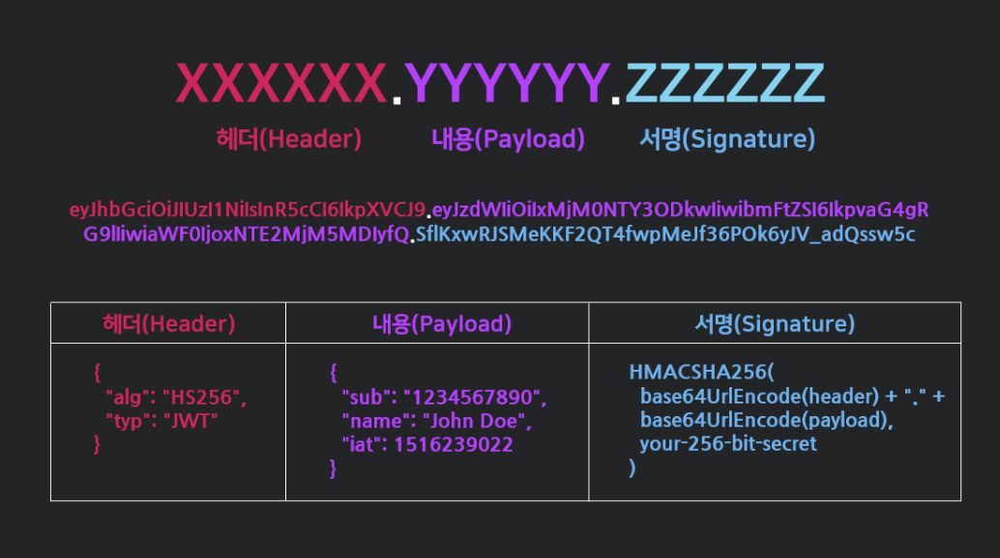

# JWT 인증 방식 🎯💡🔥📌✅

- `인증에 필요한 정보들을 암호화시킨 JSON토큰을 의미한다.`
- 하나의 인터넷 표준 인증 방식, (인증에 필요한 정보들을 Token에 담아 암호화시켜 사용하는 토큰)
- `JWT`는 서명된 토큰, `공개/개인` 키를 쌍으로 사용하여 토큰에 서명할 경우, 토큰은 개인 키를 보유한 서버가 이 서명된 토큰이 정상적인 토큰인지 인증 가능
- `토큰은 세션과는 달리 서버가 아닌 클라이언트에 저장되기 때문에 서버의 부담을 덜 주게 된다.`

```
✅ 토큰 자체에 사용자의 권한 정보나 서비스를 사용하기 위한 정보가 포함 된다는 것

✅ jwt를 사용하면 RESTful과 같은 무상태인 환경에서 사용자 데이터를 주고 받을 수 있다.
  - 클라이언트에 저장하고 요청시 단순히 HTTP 헤더에 토큰을 첨부하는 것만으로도 단순하게 데이터를 요청하고 응답 받아올 수 있다.
✅ jwt토큰을 HTTP 헤더에 실어 서버가 클라이언트를 식별하는 방식이다.

✅ JSON 데이터를 Base64 URL-safe Encode 를 통해 인코딩하여 직렬화한 것이며, 토큰 내부에는 위변조 방지를 위해 개인키를 통한 전자서명도 들어있다
```

<br />
<br />

## JWT는 .으로 구분이 되어 있으며, 구성요소는 3가지 이다.

- `Header`
  - 토큰의 타입, 서명 생성에 어떤 알고리즘이 사용되었는지 저장한다.
- `Payload`

  - payload에는 민감한 정보를 넣지 않는다.
  - Claim이라는 사용자에 대한 정보를 담는다. (key-value)값에 저장한다.
  - Claim의 표준 스펙 : `7가지` (사용자에 따라 선택사항)
    - `iss` : 토큰 발급자
    - `sub` : 토큰 제목 (`토큰에서 사용자에 대한 식별 값이 됨`)
    - `aud` : 토큰 대상자
    - `exp` : 만료시간
    - `nbf` : 토큰 활성 시간
    - `iat` : 토큰 발급 시간
    - `jti` : JWT 토큰 식별자

- `Signature` (서명)
  - Header와 Payload를 보여줄 때는 인코딩 되어있던 값들을 JWT에 담겨있는 것처럼 디코딩된 상태를 사용한다.
  - `Signature`는 서버에 있는 개인키로만 암호화를 풀 수 있으므로 다른 클라이언트는 임의로 `Signature`를 복호화할 수 없다.

<br />
<br />

## JWT 진행 방식

1. 클라이언트에서 로그인
2. 서버에서 서명된 jwt를 생성해서 클라이언트에 응답 돌려주기
3. 클라이언트에서 데이터를 요구할 때 jwt를 해더에 첨부해서 요청
4. 서버에서 jwt검증

<br />
<br />

## JWT 기본 구조



<br />
<br />

---

> Header

```json
{
  //서명 암호화 알고리즘
  "alg": "HS256",
  //토큰 유형
  "typ": "JWT"
}
```

<br />

> Payload

```json
// 토큰에서 사용할 정보의 조각들인 Claim이 담겨 있다.
// 서버와 클라이언트가 주고받는 시스템에서 실제로 사용될 정보에 대한 내용을 담고 있다.
{
  "sub": "123",
  "name": "je",
  "iat": 156239200,
  "exp": 165234200
}
```

<br />

> Signature

```json
// 시그니처에서 사용하는 알고리즘은 헤더에서 정의한 방식을 활용한다.
// 시그니처 구조는 (헤더 + 페이로드)와 서버가 갖고 있는 유일한 key값을 합친 것을 헤더에서 정희한 알고리즘으로 암호화한다.
HMACSHA256(
    base64UrlEncode(header) + "." +
    base64UrlEncode(payload),
    ...
)
```

<br />
<br />

# JWT.io에서 인코딩, 디코딩 가능

```
💡 JWT은 서명인증이 목적이다.
- jwt는 base64로 암호화하기 때문에 디버거를 통해 바로 복호화를 할 수 있다. 때문에 사용자 데이터를 담은 payload부분이 그대로 노출되어 버린다.

- playload에는 민감한 정보를 넣으면 안된다.

- jwt인증 방식은 정보 보호가 아닌위조 방지가 목적이다.
  - 시그니처에 사용된 비밀키가 노출되지 않는 이상 데이터를 위조해도 시그니처 부분에서 바로 걸러진다.
```
