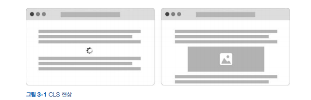
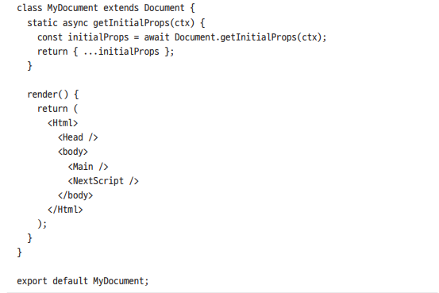

# nest.js🎯💡🔥📌✅

> `Nest.js`는 `파일시스템 기반 페이지`와 `라우팅`을 지원한다.

<br />

- 기본적으로 pages/ 디렉터리를 가지고 있으며, 이 디렉터리 안의 모든 파일은 곧 `애플리케이션의 페이지`와 `라우팅 규칙`을 `의미`한다.

<br />
<br />

> 정적,동적 라우팅 예제

```bash
pages/
  - index.js           라우팅--> [localhost:3000/index]
  - contact.js         라우팅--> [localhost:3000/contact]
  - post/
    - index.js         라우팅--> [localhost:3000/index/post]
    # []은 경로 매개변수로 사용자가 브라우저 주소창에 입력하는 값은 모두 가질 수 있다.
    - [slug.js].js        라우팅--> [localhost:3000/index/post/[경로 매개 변수]]
                          라우팅--> [localhost:3000/index/post/myFirstpost]
    ## 동적 라우팅 중첩 하기
    - [date]/
      - [slug].js      라우팅--> [localhost:3000/index/2021-03/myFirstpost]

```

<br />
<br />

## 페이지에서 경로 매개변수 사용하기

<br />

```bash
# 폴더 구조
pages/
  - greet/
    - [name].js
```

> 예시

```jsx
// localhost:3000/greet/[name].js
import { useRouter } from "next/router";

function Greet(props) {
  const { query } = useRouter();
  return <h1>{props.name}!!</h1>;
}
// localhost:3000/greet/Mitch?learning_nextjs=true라는 주소로 접근하게 되면,
// query는 {learning_nextjs: 'true',name:'Mitch'}를 반환한다
```

<br />
<br />

## `클라이언트에서의 내비게이션`

- nextjs에서 Link 컴포넌트를 통해 서로 다른 라우트 간의 이동을 최적화 할 수 있다.
  - Nest는 기본적으로 현재 화면에 표시되는 `페이지의 모든 Link에 대해 연결된 부분 또는 페이지를 미리 읽어온다.`
  - 다시말해, 페이지 링크를 클릭했을 때 `브라우저는 해당 페이지를 화면에 표시하기 위해 필요한 모든 데이터를 이미 불러온 상태이다.`

<br />

> 간단 예시

```jsx
import Link from "next/link";

function Navbar() {
  return(
      <Link href="/home">home</Link>
      <Link href="/about">about</Link>
  )
}
```

> 동적 경로 매개변수 라우팅 예시

```jsx
pages/
  - blog/
    - [data]/
      - [slug].js

// 첫번째 방법
<Link href='/blog/2021-01-01/happy-new-year'> Read Post</Link>

//두번째 방법 (복잡한 url 사용 시)
<Link
 ref={{
    pathname:'blog/[data]/[slug].js'
    query:{
        date: '2020-01-01',
        slug: 'happy-new-year',
        foo: 'bar'
    }
 }}> Read Post</Link>
```

<br />
<br />

## router.push를 이용한 페이지 이동

> useEffct 훅을 이용해 로그인하지 않는 상태라면, router.push를 이용해 로그인 페이지 이동 예제

```jsx
import { useRouter } from "next/link";

function Mypage() {
  const router = useRouter();
  const { loggedIn } = useAuth();
  useEffect(() => {
    if (!loggedIn) {
      router.push("/login");
    }
  }, [loggedIn]);

  return loggedIn ? <PrivateComponent /> : null;
}
```

<br />

```
🎯 router.push는 Link컴포넌트와 다르게 연결된 페이지를 미리 불러오지 못한다.

- 특정 상황이나 이벤트가 발생한 경우 클라이언트에서 사용자를 특정 페이지로 보낼 때는 router.push 메서드를 사용하는 것이 좋지만, `클라이언트에서의 내비게이션 구현에 router.push 메서드를 사용하는 것은 별로 좋은 생각이 아니다.`

```

<br />
<br />
<br />

# 정적 자원 제공

```
💡 정적 자원 (이미지,폰트,아이콘... 동적으로 변하지 않는 파일)
  - 정적 자원은 /public 디렉터리 안에 저장하는 방식으로 클라이언트에 쉽게 제공된다.

💡 CLS 현상
  - 이미지를 불러오는 데 시간이 오래 걸리고, 이미지를 불러온 후에도 이미지 주변의 레이아웃이 변경되는 현상

```

> CLS 현상 <br /> 

<br />
<br />

## 이미지 최적화 (Image)

- 브라우저가 이미지를 요청하면 이미지를 최적화하고, 크기를 조절하고, 렌더링을 한다.
  - Unplash,pexel과 같은 외부 이미지 서비스로 이미지를 제공할 수 있으며 빌드 시간도 길어지지 않는다.

<br />

> 외부 이미지 파일 이미지 최적화

```js
//next.config.js
module.exports = {
  images: {
    domains: ["images.unsplash.com"],
  },
};
//위 설정을 추가하면,images.unsplash.com 불러온 모든 이미지는 자동으로 이미지 최적화가 진행된다.

//IndexPage
import Image from "next/image";

function IndexPage() {
  return (
    <div>
      <Image src="images.unsplash.com" width={500} height={200} />
    </div>
  );
}
// 브라우저 접속 시 Image 컴포넌트의 width와 height 속성 값에 따라서 사진이 늘어난 형태로 표시된다.
```

- Image 속성
  - `fixed` : 이미지크기를 지정하면 크거나 작은 화면에서도 이미지크기를 조절하지 않는다.
  - `responsive` : 화면 크기를 조절하면 그에 따라 이미지를 최적화해서 제공한다.
  - `intrinsic` : 크기가 작은 화면에서는 이미지를 조절하지만, 이미지보다 큰 화면에서는 이미지크기를 조절하지 않는다.
  - `fill` : 부모의 가로와 세로의 크기에 따라 이미지를 늘린다.

> image 예시

```js
// layout 속성을 fill로 지정 -> 부모 요소인 div 크기에 따라 늘어남
// objectFit 속성을 cover로 지정 -> 부모 요소인 div의 크기에 따라 잘라낸다.
function Index() {
  return (
    <div style={{ width: 500, height: 200 }}>
      <Image src="" layout="fill" objectFit="cover" alt="이미지" />
    </div>
  );
}
```

<br />
<br />

## 외부 서비스를 이용한 자동 이미지 최적화

- Nest.js는 기본으로 실행되고 있는 서버에서 `자동 이미지 최적화 작업`을 처리한다.
  - 컴퓨팅 자원이 `충분하지 않은 작은 서버에서 실행된다면, 이미지 최적화로 인해 성능에 영향을 미칠 수 있다.`

<br />

> 외부 서비스르르 통해 자동 이미지 최적화 작업 next.config.js

```js
//  loader: "akamai" 웹앱을 Vercel로 배포하는 경우에는 loader속성을 지정할 필요 없다.
module.exports = {
  images: {
    loader: "akamai",
    domains: ["images.unsplash.com"],
  },
};

// loader 속성 적용
import Image from "next/image";

const loader = ({ src, width, quality }) => {
  return `https://example.com/${src}w=${width}$q=${quality}`;
};

function Index() {
  return (
    <div style={{ width: 500, height: 200 }}>
      <Image
        loader={loader}
        src="/myphoto"
        layout="fill"
        objectFit="cover"
        alt="이미지"
      />
    </div>
  );
}
```

<br />
<br />

# 메타 데이터

> 어떤 컴포넌트에서든 HTML 페이지의 `<HEAD>` 내부 데이터를 변경 할 수 있도록 할 수 있다.<br /> 즉 동적으로 메타데이터 , 링크, 스크립트 등의 정보를 변경하고, 추가하고, 삭제할 수 있다.

<br />
<br />

> `Head` 사용 예시

```js
// <title> 태그의 내용이 어떤 페이지를 방문하냐에 따라 바뀜
import Head from "next/head";

function IndexPage() {
  return (
    <>
      <Head>TITLE </Head>
      <div></div>
    </>
  );
}
```

<br />

```
💡 각 컴포넌트 마다 모든 메타 데이터와 관리 코드를 일일이 만들기는 힘들기 때문에 메타 데이터를 그룹화하여 특정 HTML 태그를 다루는 컴포넌트를 만들고 사용하는 것이 좋다.

💡 공통 메타데이터와 관련한 코드를 별도의 컴포넌트로 구현해서 다른 컴포넌트와 분리하면 코드를 더 잘 구조화할 수 있다.
```

> 위 예시 코드

```JS
//사용하는 메타데이터 중 공통인 데이터들을 묶어 처리하는 방법
//conpoennt/PostHead
import Head from 'next/head';

function PostMeta(props){
  return(
    <Head>
      <title>{props.title}</title>
      <meta property='descrption' context={props.subtitle} />
   </Head>
  )
}

//pages/blog/[slug].js
export function getServerSideProps({params}){
  const {slug} = params;
  const post = posts.find((p)=> p.slug === slug);
  return {
    prop: {
      post,
    }
  }
}

function Post ({post}){
  return (
    <div>
      <PostHead {...[post]}/>
      <div>{post.title}</div>
    </div>
  )
}
```

<br />
<br />
<br />

# `_app.js`와 `_document.js` 페이지 커스터 마이징

- 애플리케이션에 따라 초기화 과정을 조절해야하는 경우가 있다.
  - 이 경우 페이지를 랜더링할 때마다 랜더링한 HTML을 클라이언트에 보내기 전에 특정 작업을 처리 해야 한다.
  - Pages/ 안에
    - `_app.js`와 `_document.js`에서 이런 작업을 지정하고 처리한다.

<br />

```
💡 _app.js는 다른 페이지 처럼 getServerSideProps , getStaticProps와 같은 함수를 사용해서 데이터터를 불러오는 용도로 사용할 수 없다.

💡 _app.js의 주된 목적은 페이지 이동 시 서로 다른 페이지 간 상태 유지, 전역 스타일 추가, 페이지 레이아웃 관리, 페이지 속성에 데이터를 추가하는 것이다.

💡 모든 페이지에 렌더링할 때마다 서버에서 특정 데이터를 불러와야 한다면 getInitialProps 함수를 사용할 수 있다.
  - 이함수를 사용하면, Next.js는 모든 페이지에서 서버 렌더링을 하기 때문에 동적 페이지에 대한 정적 최적화를 하지 않는다.

```

<br />

> App.js에서 getInitialProps 사용

```js
// _app.js 파일을 커스터 마이징해서 페이지 컴포넌트 렌더링을 수정할 수 있지만, `<html>`이나 `<body>`와 같은 html 태그는 수정할 수 없다. 이경우에는 _document.js페이지를 대신 사용한다.
import App from "next/app";

function MyApp({Component, pageProps}){
  return <Component {pageProps }/>
}

MyApp.getInitialProps = async (appContext) => {
  const appProps = await App.getInitialProps(appContext);
  const additionalProps = await fetch(...);
  return {
    ...appProps,
    ...additionalProps
  }
}

export default Myapp;
```

<br />
<br />
<br />

## `document.js 페이지`

> Next.js페이지 컴포넌트에서 `<html>`,`<body>`,`<head>`와 같은 기본적인 html 태그를 정의할 필요없다. <br /> `<html>`,`<body>`이 두가지 핵심 태그를 렌더링 하기 위해 내장 클래스인 Document를 사용한다.

<br />



```
//_document.js 중.. 아래 4가지가 꼭 있어야 한다.

📌 HTML - <HTML>태그에 해당한다. 여기에 lang과 같은 HTML 속성들을 전달 할 수 있다.

📌 Head - 모든 페이지에 대한 공통 태그를 정의할 때 이 컴포넌트를 사용할 수 있다.
          - 웹 사이트 모든 페이지에서 공통으로 사용되는 코드가 있을 때만 사용할 수 있다.

📌 Main - <Main> 외부의 컴포넌트는 브라우저에서 초기화되지 않기 때문에 페이지간에 공통으로 사용되는 컴포넌트가 있다면 _app.js파일에서 해당 컴포넌트를 사용해야 한다.

📌 NextScript - 클라이언트에서 실행할 코드나 리액트 하이드레이션과 같은 작업을 처리할 수 있는 커스텀 스크립트는 넣는 곳
```
