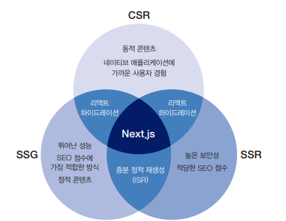

# 커스텀 서버 🎯💡🔥📌✅

> 검색 엔진 최적화와 성능 역시 웹 애플리케이션 개발 과정 내내 신경 써야하는 중요한 주제이다.

<BR />

## CSR

- 렌더링과 관련된 모든 연산이 클라이언트에서 이루어지므로 성능이 매우 훌륭하다.
- 웹 애플리케이션이 네이티브 앱처럼 작동하기 때문에 사용자 경험이 좋다.
- `검색 엔진 봇이 애플리케이션을 렌더링하고 분석하기 어려워 SEO 점수는 낮아진다.`

> 💡 성능이 뛰어나고 매우 동적인 콘텐츠를 만들 수 있으나 SEO 점수가 낮고 보안상의 문제가 있을 수 있다.

<BR />

## SSR

- SEO를 높이기 위해 유리한 콘텐츠는 서버에서 랜더링하고, 나머지는 클라이언트에서 렌더링하도록 만들 수 있다.
- 서버가 데이터를 불러오고 검사하기 때문에 민감한 API호출등을 숨길 수 있다.
- `서버에서 랜더링 할 때 서버를 준비하고 유지 및 보수해야하며, 필요하다가 확장도 해야한다.`

> 💡 SEO 점수가 높고 보안상 안전하지만 서버 관리에 많은 부감이 발생할 수 있다.

<BR />

## SSG

- 이 방법은 가장 뛰어난 성능을 보이며 SEO 점수 역시 가장 높다.
- SEO 점수에 큰 영향을 끼치는 콘텐츠가 자주 바뀐다면, 한 시간에도 몇 번씩 전체 웹 사이트를 다시 빌드해야한다.
- 모든 민감한 API 호출이다 연산등이 클라이언트에서 이루어지기 때문에 사용자 보안에 악영향을 끼칠 수 있다.

> 💡 SEO점수와 성능면에서 가장 뛰어날 수 있지만, 보안상의 문제가 있고 동적 콘텐츠 생성이 어렵다.

<br />



> 💡 Next는 각 페이지를 서버가 렌더링할지, 빌드 시점에 정적으로 만들지, 전적으로 클라이언트에서 렌더링할지를 정할 수 있다.

<br />

- Nest js는 자체 서버를 제공하기 때문에 웹 애플리케이션을 만들면서 별도의 서버를 준비하고 실행할 필요가 없다.
  - 하지만 어떠한 경우 express, Fastify와 같은 별도의 웹서버를 통해 Nest.js를 실행 해야 할 수 있다.
  - `대부분의 경우에서 커스텀 서버는 필요하지 않는다.`

<br />
<br />

```
💡 커스텀 서버가 필요한 경우


✅ Nest.js 웹 애플리케이션을 기존 서버에서 실행하는 경우
  - 기존 웹 애플리케이션을 리펙터링해서 Nest.js로 변경할 경우
  - 기존 서버에서 실행되던 로직이나 미들웨어등을 최대한 유지하고 싶을 경우

✅ 멀티테넌시 지원이 필요한 경우
  - Nest.js는 멀티 도메인을 지원하며 현재 호스트명에 따라 선택적으로 렌더링하는 기능을 제공한다.
  - 수천 개에 달하는 도메인을 관리하고, 워크플로를 단순화해야하는 상황이라면, Express나 Fastify의 멀티테넌트 미들웨어를 사용하는 것이 좋다.

[커스텀 서버의 단점]
📌 커스텀 서버는 Nest.js에 최적화된 Vercel에 배포할 수 없다.
  - 더 많은 코드를 작성하고 유지 보수 해야한다.
```

<br />
<br />

## Express.js 간단 서버 설명

<br />

> 서버 코드 예시

```js
// nextjs + 커스텀 서버
const { parse } = require("url");
const express = require("express");
const next = require("next");
//패키지

const dev = process.env.NODE_ENV !== "production";
const app = next({ dev });

async function main() {
  try {
    await app.prepare();

    //이 상수는 Nest.js를 대신해서 들어오는 요청을 처리한다.
    const handle = app.getRequestHandler();
    const server = express();

    server
      .get("/", (req, res) => {
        res.send("Hello World!");
      })
      .get("/about", (req, res) => {
        const { query } = parse(req.url, true);
        app.render(req, res, "/about", query);
      })
      .get("/api/greet", (req, res) => {
        res.json({ name: req.query?.name ?? "unknown" });
      })
      // Nest.js에서 사용할 정적 파일의 이름을 알 수 없기 때문에 정규 표현식을 사용하여 경로가 _next/로 시작하는 모든 파일에서 해당 함수가 호출되도록 한다.
      //아래 정규식 처럼 표현한다면, Nest.js가 정적 자원들을 처리할 수 있게 된다.
      .get(/_next\/.+/, (req, res) => {
        const parsedUrl = parse(req.url, true);
        handle(req, res, parsedUrl);
      })
      .listen(3000, () => console.log("server ready"));
  } catch (err) {
    console.log(err.stack);
  }
}

//이 함수는 서버 사이드 렌더링을 위해 들어오는 모든 GET 요청을 받아서 Nest.js에 넘겨준다.
main();
```

<br />

> next.js 예시 코드

```js
//http://localhost:3000/greet/Mitch 접속 시 --> Hello Mitch 출력
export function getServerSideProps(req) {
  return {
    props: {
      user: req.params.user,
    },
  };
}

export default function GreetUser({ user }) {
  return (
    <div>
      <h1>Hello {user}!</h1>
    </div>
  );
}
```

<br />
<br />
<br />

## Fastify 서버

> Fastify 설치

```bash
$ yarn add react react-dom fastfy fastify-nextjs next
```

<br />

> Fastify가 Express보다 더 직관적이다<br />

> Fastify 예시 코드

```js
// 최상위 디렉터리에 index.js (커스텀 서버 코드) 파일을 만들고 아래내용을 작성한다.
// 서버를 실행하면 명시한 모든 페이지가 제대로 렌더링된다는 것을 확인할 수 있다.
const fastify = require("fastify")();

fastify.register(require("fastify-nextjs")).after(() => {
  //fastify.next함수를 호출해서 Next.js 페이지를 핸더링하며 Nest.js의 정적자원을 걱정할 필요도 없다. (Fastify가 알아서 처리한다.)
  fastify.next("/");
  fastify.next("/about");
  fastify.next("/greet/:user");
  fastify.get("/contacts", (req, reply) => {
    reply.type("html").send(`<h1>Contacts page</h1>`);
  });
});

fastify.listen(3000, () => {
  console.log("Server listening on http://localhost:3000");
});
```

```
위 코드작성 후에 Nest.js 웹 애플리케이션 개발을 시작하면 된다.
ex)_app.js나 _document.js 파일을 수정해서 Nest.js 페이지 작동을 수정하거나 Ui 라이브러리를 적용하는 것 등등...
```

<br />
<br />

---

<br />
<br />

# 테스트

> 테스트는 개발에서 필수 과정이며, 세단계로 나눌 수 있다.

- `단위 테스트`
  - `코드의 각 함수가 제대로 작동`하는지 확인하는 테스트
  - 작동과정에서 예측하지 못한 오류가 발생하는지 확인하는 단계
- `엔드 우 엔트 테스트`
  - 애플리케이션에 대한 `사용자 상호 작용을 흉내`내서 특정 작동이 발생 했을 때 `적절한 응답`을 하는지 확인하기 위한 테스트
  - `웹 사이트를 윕 브라우저에서 직접 테스트하는 것과 비슷하다.`
    - ex) 폼을 만들었다면, 폼이 제대로 작동하는지 , 사용자가 입력한 값을 제대로 확인하는지 등등...
- `통합 테스트`
  - 애플리케이션에서 함수나 모듈과 같이 서로 구분되는 영역이 함께 잘 작동하는지 확인하기 위한 테스트
  - `두 개의 함수 조합이 원하는 결과값을 반환하는지 여부를 검사하는 것`
    - `서로 연관된 함수와 모듈을 한데 묶어서 주어진 입력에 맞는 적절한 출력을 만들어내는지 검사한다.`

<br />
<br />

# Jest를 이용한 테스트 🎯💡🔥📌✅

<br />
<br />
​

- `ESNext`의 기능을 사용해서 함수와 컴포넌트를 작성한다면 기본 `Nest.js바벨` 설정을 수정하여 이 모듈을 올바르게 변환할 수 있도록 만들어야 한다.

- 최상위 폴더에 `.babelrc`를 만들어서 다음 내용을 추가한다.

​

```cmd

// 기본적으로 .test.js나 .spec.js로 끝나는 모든 파일에 대해 작동하도록 설정된다.

// 기본적으로 테스트 파일은 test/안에 보관한다.

{

"presets" : ["next/babel"]

}

```

<br />
<br />

```

💡 Nest.js 페이지 테스트를 만들 때 주의할 점

​

- page/안에 모든 파일은 페이지로 간주하기 때문에

- 테스트 파일을 절대 pages/안에 위치 시키면 안된다.

​

- 테스트 파일을 pages/ 디렉터리에 위치 시킨다면 Next.js가 애플리케이션 페이지라고 간주해서 렌더링한다.

```

​

<br />

<br />

​

## Jest의 내장 함수

​

- `describe` : 테스트와 관련된 그룹을 만든다.
- ex) 동일한 함수에 대한 다른 테스트나 모듈은 해당 함수 내에 포함시킨다.

- `test` : 테스트를 선언하고 실행한다.

- `expect` : 함수의 출력과 예상한 결과를 비교할 때 이 함수를 사용한다.

​

```js

// utils/tests/index.test.js

// index의 모든 함수를 불러옴 (테스트할 함수들)

import {

cutTextToLength,

slugify,

composeArticleSlug,

extractArticleIdFromSlug,

} from '../index';

​

//describe 테스트와 관련된 그룹 생성

describe("cutTextToLength cuts a string when it's too long", () => {

// 테스트를 선언하고 실행

test('Should cut a string that exceeds 10 characters', () => {

const initialString = 'This is a 34 character long string';

//cutTextToLength --> 테스트할 함수

const cutResult = cutTextToLength(initialString, 10);

// 예상한 결과와 비교

expect(cutResult).toEqual('This is a ...');

});

​

test("Should not cut a string if it's shorter than 10 characters", () => {

const initialString = '7 chars';

//cutTextToLength --> 테스트할 함수

const cutResult = cutTextToLength(initialString, 10);

// 예상한 결과와 비교

expect(cutResult).toEqual('7 chars');

});

});

​

// package.json

// 쉽게 테스트를 진행하기 위해 package.json에 스크립트를 추가한다.

{

"script" : {

"dev" : "next dev",

"build" : "next build",

"start" : "next start",

"test" : "jest"

}

}

```

<br />
<br />

## react-test-library

<br />

> 리액트 컴포넌트 테스트 라이브러리 <br /> render 메서드를 사용해서 컴포넌트를 마운트하고 렌더링한다.

```
/**
* @jest-envirnoment jsdom
*/
```

- `react-testing-library`는 브라우저의 document 전역 변수를 사용한다.
  - Node.js는 이를 제공하지 않기 때문에 에러가 발생한다.
  - 테스트 파일 최상단에 위 코드를 작성해서 에러를 방지할 수 있다.

<br />
<br />

> react-test-library 테스트

```js
/**
 * @jest-environment jsdom
 */

import { render, screen } from "@testing-library/react";
import ArticleCard from "../index";
import { cutTextToLength } from "../../../utils";
import { article } from "../tests/mock";

describe("ArticleCard", () => {
  test("Generated link should be in the correct format", () => {
    const component = render(<ArticleCard {...article} />);
    const link = component.getByRole("link").getAttribute("href");
    expect(link).toBe("/articles/healthy-summer-meloncarrot-soup-u12w3o0d");
  });

  test("Generated summary should not exceed 100 characters", async () => {
    render(<ArticleCard {...article} />);
    const summary = screen.getByText(cutTextToLength(article.body, 100));

    expect(summary).toBeDefined();
  });

  test("Generated credits should contain author name", async () => {
    render(<ArticleCard {...article} />);
    const credits = screen.getByText(/John Doe/gm);

    expect(credits.textContent).toBe("Written by John Doe");
  });
});
```

# 배포 관련 🎯💡🔥📌✅

> Vercel은 오직 정적 사이트와 프런트 엔드 프레인 워크만을 위해 만들어 졌다.<BR />
> CLI 도구를 사용해 배포할 수 있고, GIT 브랜치에 코드를 푸시한 후 자동으로 배포하도록 만들 수 있다. <BR /> `별도의 NODE.js 서버를 이용할 수 없다.`

```
- Vercel에서는 서버리스 평선을 사용해 서버 사이드 렌더링 페이지를 지원한다.

💡 서버리스 평션이란?

- 프로그래밍 언어로 작성된 단일 함수로서 관리형 인프라에 호출할 수 있는 것을 의미한다.
- 서버리스란 서버가 없다는 의미는 아니며, 단지 함수를 만들 때 이를 어떤 서버가 실행할 것인지 고민할 필요없이 함수 자체만 만들고 실행하면됨
- 실제 사용한 만큼 비용을 지불하다는 점에서 전통적인 방식보다 더 매력적인 비용모델

📌 Nest.js 애플리케이션을 배포하면 Vercel이 서버리스 펑션 설정 작업을 알아서 작업해준다.
```

<br />
<br />

## Vercel 배포 두가지 방법

- Vercel에 Gihub,Bitbucket 연결
  - 메인 브랜치로 병합하거나 푸시하는 경우 Vercel이 자동으로 해당 애플리케이션을 사용 서비스로 배포한다.
  - 프론트엔드 성능을 측정하고 분석하는 훌륭한 도구를 제공한다.
- CMD
  - vercel --prod 명령으로 Vercel CLI 도구를 사용해 상용 서비스를 위한 애플리케이션을 바로 만들고 배포할 수 있다.

<br />
<br />
