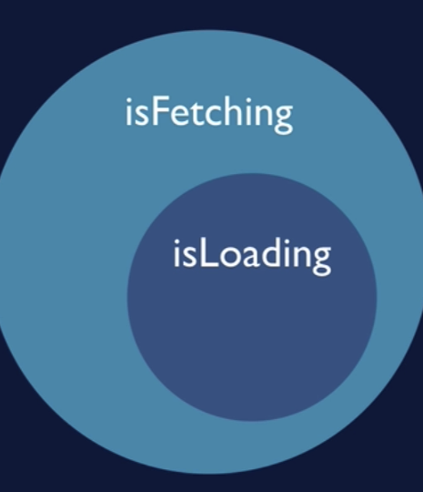

# 리액트쿼리 정리 (1)

<br />
<br />
<br />

## `data` , `isLoading`, `isError`



- `isFetching` vs `isLoading`
  - `isFetching` : 비동기 쿼리(`Axios` or `GraphQL`)가 해결되지 않았음을 의미한다.
  - `isLoading` : `isFetchign`의 하위 집합
    - isFetching이 참이면서, 쿼리에 대해 캐시된 데이터가 없는 상태를 의미한다.
    - `데이터를 가져오는 중이고, 표시할 캐시 데이터도 없다.`

<br />

> 기본 적 사용법

```js
// 통신 API
async function fetchPosts() {
  const response = await fetch(
    "https://jsonplaceholder.typicode.com/posts?_limit=10&_page=0"
  );
  return response.json();
}

//useQuery 훅
const { data, isLoading, isError, error } = useQuery("posts", fetchPosts);
if (isLoading) <div>로딩중</div>;
if (isError) <div>에러내용 : {error}</div>;

//return() 안에 출력
return (
  <>
    {data.map((post) => (
      <li key={post.id} className="post-title">
        {post.title}
      </li>
    ))}
  </>
);
```

<br />
<br />

## StaleTime vs cacheTime 🎯💡🔥📌✅

```
💡 데이터 리페칭은  만료된 데이터에서만 실행된다.
  - 컴포넌트가 다시 마운트, 윈도우가 다시 포커스 되었을때도 리페칭됨

💡 캐시는 나중에 다시 필요할 수도 있는 데이터용

💡 쿼리키를 통해 특정 쿼리의 캐시와 staleㅅTime를 식별한다.
```

<br />

- stale Time : 데이터를 허용하는 `최대 나이` (`리페칭할 때 고려사항`)
  - 데이터가 만료됐다고 판단하기 전까지 허용하는 시간
  - 기본값은 : `0`

<br />

- cacheTime : cacheTime 지나면 캐시의 데이터가 만료되며, 유효 시간의 기본값은 5분이다.
  - 특정 쿼리에 대한 useQuery가 활성화된 후 경과한 시간
  - 캐시가 만료되면, 가비지 컬렉션이 실행되고 클라이언트는 데이터를 사용할 수 없다.

<br />
<br />

## Query Key

- 쿼리 키를 쿼리에 대한 의존성 배열로 취급하게 된다.
- 쿼리 키가 변경되면, React Query가 새 쿼리를 생성해서 stale Time과 cache Time을 가지게 된다.
- 의존생 배열이 다르다면, 완전히 다른 것으로 간주된다.

```
🎯 ['comments' , post.id]
// 위 처럼 쿼리키를 작성해야 comments 쿼리가 같은 쿼리로 간주되는 상황을 막고, 각기 다른 쿼리로 다뤄진다.
```

<br />
<br />

# Pagination

```jsx
async function fetchPosts(pageNum) {
  const response = await fetch(
    `https://jsonplaceholder.typicode.com/posts?_limit=10&_page${pageNum}`
  );
}
export function Posts() {
  //현재 페이지
  const [currentPage, setCurrentPage] = useState(1);
  // currentPage 상태가 바뀌면, React Query가 바뀐 쿼리키를 감지해 새쿼리 키에 대한 데이터를 업데이트 한다.
  const [data, isError, error, isLoading] = useQuery(
    ["posts", currentPage],
    () => fetchPosts(currentPage),
    {
      staleTime: 2000,
    }
  );
  //data
}
```

<br />
<br />
<br />

# DATA Prefetching

- 데이터를 미리 가져와 캐시에 넣어 사용자 경험 좋게 만듦
- 기본값으로 `만료된 상태`
  - 데이터를 사용하고자 할때 만료 상태에서 데이터를 다시 가져온다.
  - `데이터를 다시 가져오는 중에는 캐시에 있는 데이터를 이용해 앱에 나타난다.`

<br />

> 예시 코드

```js
import { useQuery, useQueryClient } from "react-query";

const [currentPage, setCurrentPage] = useState(1);
const queryClient = useQueryClient();

//현재 페이지가 변경될 때마다 실행
useEffect(() => {
  const nextPage = currentPage + 1;
  //프리페칭할 쿼리키 입력
  queryClient.prefetchQuery(["posts", nextPage], fetchPosts(nextPage), {
    //지난 데이터를 유지해서 이전 페이지로 돌아갔을때 캐시에 해당 테이터가 있도록
    keepPreviousData: true,
  });
}, [currentPage, queryClient]);

const [data, isError, error, isLoading] = useQuery(["posts", currentPage], () =>
  fetchPosts(currentPage)
);
```

<br />
<br />
<br />
<br />

# Mutations

- `이벤트 추가하는 ReactQuery 호출 방식`

<br />

> 예시

```js
async function deletePost(postId) {
  const response = await fetch(
    `https://jsonplaceholder.typicode.com/posts.Id/${postId}`,
    { method: "DELETE" }
  );
  return response.json();
}

const deleteMutation = useMutation((postId) => deletePost(postId));

return (
  <button onClick={()=>{
    //props에서 받은 postId가 무엇이든 상관없이 실행하게 된다.
    //변이 함수를 호출할 때 인수가 여기 할당된다.
    //post.id를 deletePost로 전달하게 된다.
    deleteMutation.mutate(post.id);
  })>버튼</button>
)
```

<br />
<br />
<br />

# useInfiniteQuery

- 두개의 프로퍼티를 가진다.

  - 1. `pages` : 데이터 페이지 객체의 배열 (`하나의 useQuery에서 받는 데이터에 해당`)
  - 2. `pageParams` : 각 페이지의 매개변수 기록, 검색된 쿼리의 키를 추적한다.
    - pageParams은 많이 사용되지 않음

- `getNextPageParam`(lastPage,allPages) : `다음 페이지로 가는 방식을 정의하는 함수`

<br />

```
모든 쿼리는 페이지 배열에 고유한 요소를 가지고 있고, 그 요소는 해당 쿼리에 대한 데이터에 해당한다.
페이지가 진행되면서 쿼리도 변경된다.
```

# React InfiniteScroll 예시 (1)

<br />

```jsx
import { Species } from "./Species";

const initalUrl = "https://swapi/dev/api/species/";
const fetchUrl = async (url) => {
  const response = await fetch(url);
  return response.json();
};

export function InfiniteSpecies() {
  const { data, fetchNextPage, hasNextPage } = useInfiniteQuery(
    "sw-species",
    //initalUrl 시작 url
    ({ pageParams = initalUrl }) => fetchUrl(pageParams),
    {
      //lastPage(이전 페이지)의 다음 프로퍼티를 불러와 새 페이지 데이터가 있을 때 마다 pageParams를 지정한다.
      //다음 페이지가 없다면, undefined으로 hasNextPage가 false가 된다.
      fetchNextPage: () => lastPage.next || undefined,
    }
  );
}

return (
  //loadMore : 데이터 패칭
  //hasMore : 계속 데이터를 불러올지 결정
  <InfiniteScroll loadMore={fetchNextPage} hasMore={hasNextPage}>
    {data.pages...}
  </InfiniteScroll>
)
```

<br />
<br />
<br />

# React InfiniteScroll 예시 (2)

> 예시

```js
import InfiniteScroll from "react-infinite-scroller";
import { useInfiniteQuery } from "react-query";

const fetchUrl = async (url) => {
  const response = await fetch(url);
  return response.json();
};

const initialUrl = "https://swapi.dev/api/people/";

export function InfinitePeople() {
  //fetchNextPage 많은 데이터가 필요할 때 어느 함수를 실행할지
  //hasNextPage 수집할 데이터가 있는지 boolean
  const { data, fetchNextPage, hasNextPage } = useInfiniteQuery(
    //쿼리키
    "sw-people",
    //pageParams 맨 처음으로 지정될 기본 값
    ({ pageParams = initialUrl }) => fetchUrl(pageParams),
    {
      //lastPage : 쿼리 함수를 마지막으로 실행한 시점의 데이터
      // lastPage와 pages는 콜백함수에서 리턴한 값을 의미
      // lastPage: 직전에 반환된 리턴값, pages: 여태 받아온 전체 페이지
      getNextPageParam: (lastPage) => lastPage.next || undefined,
    }
  );

  //loadMore 데이터가 더 필요할 때
  //hasMore 데이터가 더 있는지 확인
  return (
    <InfiniteScroll loadMore={fetchNextPage} hasMore={hasNextPage}>
      {data.pages}
    </InfiniteScroll>
  );
}
```

<br />
<br />

---

<br />
<br />
<br />

# React InfiniteScroll 예시 (3)

```
fetch('/api/projects?cursor=0')
// { data: [...], nextCursor: 3}

fetch('/api/projects?cursor=3')
// { data: [...], nextCursor: 6}

fetch('/api/projects?cursor=6')
// { data: [...], nextCursor: 9}

fetch('/api/projects?cursor=9')
// { data: [...] }
```

> 예시

```js
import { useInfiniteQuery } from "@tanstack/react-query";

function Projects() {
  const fetchProjects = async ({ pageParam = 0 }) => {
    const res = await fetch("/api/projects?cursor=" + pageParam);
    return res.json();
  };

  const {
    data,
    error,
    fetchNextPage,
    hasNextPage,
    isFetching,
    isFetchingNextPage,
    status,
  } = useInfiniteQuery({
    queryKey: ["projects"],
    queryFn: fetchProjects,
    getNextPageParam: (lastPage, pages) => lastPage.nextCursor,
  });

  return status === "loading" ? (
    <p>Loading...</p>
  ) : status === "error" ? (
    <p>Error: {error.message}</p>
  ) : (
    <>
      {data.pages.map((group, i) => (
        <React.Fragment key={i}>
          {group.projects.map((project) => (
            <p key={project.id}>{project.name}</p>
          ))}
        </React.Fragment>
      ))}
      <div>
        <button
          onClick={() => fetchNextPage()}
          disabled={!hasNextPage || isFetchingNextPage}
        >
          {isFetchingNextPage
            ? "Loading more..."
            : hasNextPage
            ? "Load More"
            : "Nothing more to load"}
        </button>
      </div>
      <div>{isFetching && !isFetchingNextPage ? "Fetching..." : null}</div>
    </>
  );
}
```

- `useInfiniteQuery` : default 동작인 첫번째 데이터 그룹 요청을 기다리기
- `fetchNextPage` : 함수 호출

<br />

> 전체 페이지 중 일부만 직접 refetch하고 싶을 때

```js
const { refetch } = useInfiniteQuery({
  queryKey: ["projects"],
  queryFn: fetchProjects,
  getNextPageParam: (lastPage, pages) => lastPage.nextCursor,
});

// 첫번째 페이지만 refetch 합니다.
refetch({ refetchPage: (page, index) => index === 0 });
```

> 페이지를 역순으로 보여주기

```js
useInfiniteQuery({
  queryKey: ["projects"],
  queryFn: fetchProjects,
  select: (data) => ({
    pages: [...data.pages].reverse(),
    pageParams: [...data.pageParams].reverse(),
  }),
});
```

<br />
