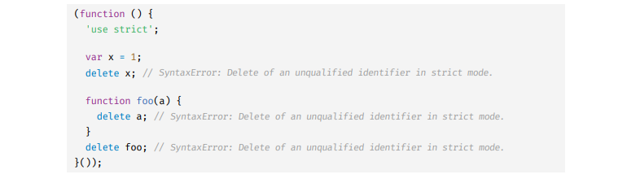
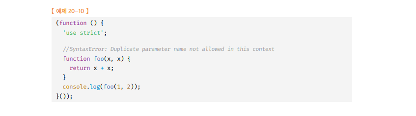
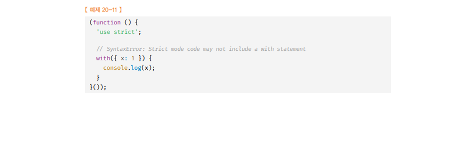

# strict mode 🎯💡🔥📌✅

- 스크립트 내 문법을 좀 더 엄격하게 검사해서 에러나게 해줌

```
💡자바스크립트 언어의 문법을 좀 더 엄격히 적용하여 오류를 발생시킬 가능성이 높거나, 자바스크립트 엔진의 최적화 작업에 문제를 일으킬 수 있는 코드에 대해 명시적인 에러를 발생시킨다.
```

- `암묵적 전역`은 개발자의 의도와는 상관없는 다양한 오류를 발생 시키는 원인이 될 가능성이 크다.
  - `const`, `let` 키워드를 사용하여 변수를 선언한 다음 사용하는 것이 일반적

```js
function foo() {
  x = 10;
}
foo();
console.log(x); // 10

/*
- foo 함수가 실행
- foo 함수 내부에서 x를 선언한 것은 없기 때문에, 스코프 체인에 의해 변수 x를 검색한다.
- 전역 스코프까지와 왔지만, x는 존재하지 않는다. -> 자바스크립트 엔진은 암묵적으로 전역 객체에 x 프로퍼티를 동적 생성한다.
- 생성된 전역 객체에 x 프로퍼티에 10을 할당한다.
- foo 함수의 실행이 끝나고, console 에 암묵적으로 생성된 x를 참조하여 10이 출력된다.
*/
```

<br />
<br />

---

# strict mode 적용

- `strict mode`를 적용하기 위해선 함수 몸체의 선두에 use strict를 선언한다.

> 사용 예시 strict mode

```
// 전역에 strict mode 선언
'use strict'
...
```

<br />
<br />

---

# strict mode 적용 시 유의할 점 2가지

- 즉시 실행 함수에서 사용 권장

## (1) 전역에 strict mode 는 피하자

- 여러 스크립트가 통합되어 사용되는 프로그램이 일반적이며, 그러한 프로그램 안에서 `strict mode` 는 `각 스크립트 단위`로 `적용`된다.
- 어떤 스크립트는 `non-strict mode` 인데, 이 둘을 `혼용`하는 것은 `오류를 발생시킬 수 있다`
- `strict mode 를 사용시`, 즉시 실행 함수 로 스크립트를 감싸서 `스코프를 구분`해서, `다른 스크립트 파일에 영향이 받질 않도록` 사용하는 것이 바람직하다.

> 예시 전역에 strict mode은 피하자

```js
// 즉시 실행함수 내부에서 use strict 적용
(function () {
  "use strict";
    ...
})();
```

<br />
<br />

---

## (2) 함수 단위로 strict mode를 적용하는것도 피하자 (즉시 실행함수 위주로 적용)

- 모든 함수에 `strict mode` 를 적용하는 것도 `번거로우며`, `어떤 함수는 strict mode`를 사용 , `어떤 함수는 strict mode`를 사용하지 않는 것 은 바람직하지 않다.
- `strict mode가 적용된 함수`가 참조할 함수 `외부의 컨텍스트`에 `strict mode`를 적용하지 않으면 문제가 발생할 수도 있음
- `strict mode` 는 `즉시 실행 함수` 로 감싼 `스크립트 단위`로 `적용`하는 것이 바람직하다.

<br />
<br />

---

# strict mode가 발생 시키는 에러

## (1) `선언하지 않은 변수`를 참조하면 `ReferenceError`

```js
(function () {
  ("use strict");

  x = 1;
  console.log(x); // ReferenceError: x is not defined
})();
```

## (2) 변수, 함수 , 매게 변수의 삭제 시 에러<br />

- delete 연산자로 변수,함수,매개변수를 삭제하면 `SyntaxError` 발생
  

## (3) 매개변수 이름의 중복<br />

- 중복된 매개변수 이름사용 시 `SyntaxError` 발생
  

## (4) with문 사용<br />

- with문 사용 시 `SyntaxError` 발생
  - with문은 `성능`과 `가독성`이 `나빠지는 문제`가 있어 사용하지 않는다.<br />
    

<br />
<br />

---

# strict mode 적용에 의한 변화 2가지

## (1) 일반 함수의 this (undefined)

- `strict mode` 에서 함수를 `일반 함수`로서 호출하면 `this에` `undefined가` 바인딩 됨
- 생성자 함수가 아닌 `일반 함수 내부에서는 this 를 사용할 필요가 없기 때문`

```js
(function () {
  ("use strict");

  function foo() {
    console.log(this); // undefined
  }
  foo();

  function Foo() {
    console.log(this); // Foo
  }
  new Foo();
})();
```

## (2) arguments 객체 함수 내 재할당 무시

- `strict mode` 에서 함수 내부에서 전달 받은 `인자값`을 `변경해도` `반영되지 않는다`.

```js
(function (a) {
  ("use strict");

  a = 2;

  console.log(arguments); // { 0: 1, length: 1 }
})(1);
```
